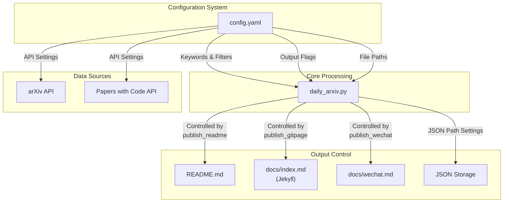
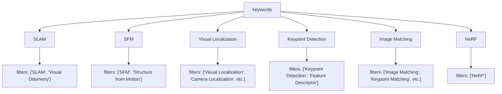
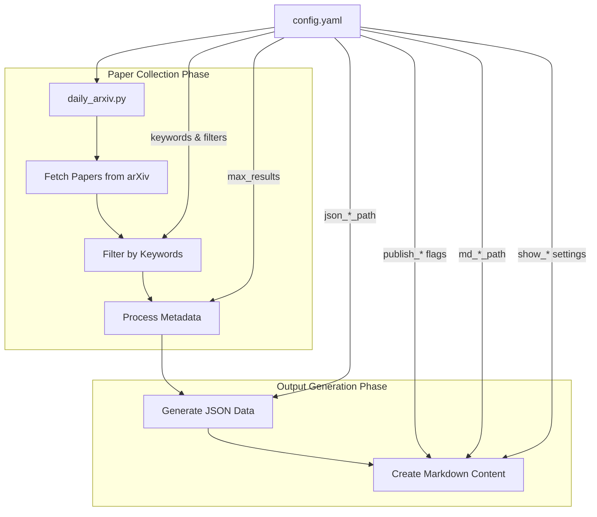
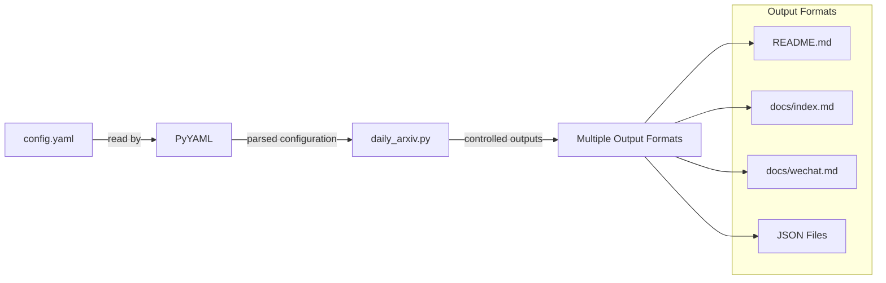

# Configuration System

<details>
<summary>Relevant source files</summary>

The following files were used as context for generating this wiki page:

- [config.yaml](config.yaml)
- [requirements.txt](requirements.txt)

</details>


This document details the configuration system of the CV-ArXiv-Daily repository, which controls all aspects of the paper collection, processing, and publishing pipeline. The configuration system is implemented through a single YAML file that provides a centralized way to customize the behavior of the entire application without modifying code. For information about how the configuration is used in the core processing engine, see [Core Processing Engine](#2.1).

## Overview

The configuration system is primarily based on the `config.yaml` file at the root of the repository. This file contains settings that control:

1. API endpoints and repository information
2. Display and formatting preferences
3. Output publishing targets
4. File paths for data storage
5. Research keywords and filters



**Diagram: Configuration System Relationships**

Sources: [config.yaml:1-40]()

## Configuration File Structure

The `config.yaml` file is organized into four logical sections:

```mermaid
classDiagram
    class "config.yaml" {
        +System Settings
        +Publishing Flags
        +File Paths
        +Research Keywords
    }
    
    class "System Settings" {
        +base_url: string
        +user_name: string
        +repo_name: string
        +show_authors: boolean
        +show_links: boolean
        +show_badge: boolean
        +max_results: integer
    }
    
    class "Publishing Flags" {
        +publish_readme: boolean
        +publish_gitpage: boolean
        +publish_wechat: boolean
    }
    
    class "File Paths" {
        +json_readme_path: string
        +json_gitpage_path: string
        +json_wechat_path: string
        +md_readme_path: string
        +md_gitpage_path: string
        +md_wechat_path: string
    }
    
    class "Research Keywords" {
        +keywords: map
        +SLAM: filters[]
        +SFM: filters[]
        +Visual Localization: filters[]
        +Keypoint Detection: filters[]
        +Image Matching: filters[]
        +NeRF: filters[]
    }
    
    "config.yaml" --> "System Settings"
    "config.yaml" --> "Publishing Flags"
    "config.yaml" --> "File Paths"
    "config.yaml" --> "Research Keywords"
```

**Diagram: Configuration File Structure**

Sources: [config.yaml:1-40]()

## Configuration Options

### System Settings

These settings control the basic operation of the paper collection system.

| Option | Type | Description |
|--------|------|-------------|
| `base_url` | String | Base URL for the Papers With Code API |
| `user_name` | String | GitHub username for repository identification |
| `repo_name` | String | Repository name for generating links |
| `show_authors` | Boolean | Whether to display paper authors in output |
| `show_links` | Boolean | Whether to display paper links in output |
| `show_badge` | Boolean | Whether to display badges in output |
| `max_results` | Integer | Maximum number of papers to include per category |

Sources: [config.yaml:2-8]()

### Publishing Flags

These flags control which output formats are generated when the script runs.

| Flag | Type | Description |
|------|------|-------------|
| `publish_readme` | Boolean | Whether to update the README.md file |
| `publish_gitpage` | Boolean | Whether to update the Jekyll website content |
| `publish_wechat` | Boolean | Whether to generate WeChat-formatted content |

Sources: [config.yaml:10-12]()

### File Paths

These settings specify the locations for JSON data storage and Markdown output files.

| Path | Type | Description |
|------|------|-------------|
| `json_readme_path` | String | Path to JSON file for README data |
| `json_gitpage_path` | String | Path to JSON file for GitHub Pages data |
| `json_wechat_path` | String | Path to JSON file for WeChat data |
| `md_readme_path` | String | Path to the README.md file |
| `md_gitpage_path` | String | Path to the Jekyll index.md file |
| `md_wechat_path` | String | Path to the WeChat markdown file |

Sources: [config.yaml:15-21]()

### Research Keywords

This section defines the computer vision research areas and specific keywords to search for within each area.



**Diagram: Keyword Configuration Structure**

Sources: [config.yaml:24-39]()

Each research area is configured with a list of filter terms:

| Research Area | Filter Terms |
|---------------|--------------|
| SLAM | "SLAM", "Visual Odometry" |
| SFM | "SFM", "Structure from Motion" |
| Visual Localization | "Visual Localization", "Camera Localization", "Camera Re-localisation", "Loop Closure Detection", "visual place recognition", "image retrieval" |
| Keypoint Detection | "Keypoint Detection", "Feature Descriptor" |
| Image Matching | "Image Matching", "Keypoint Matching", "Line Segment Detection", "Local Feature Matching" |
| NeRF | "NeRF" |

Sources: [config.yaml:24-39]()

## Configuration Flow and Impact

The following diagram illustrates how configuration options affect the paper collection and publication process:



**Diagram: Configuration Impact on System Flow**

Sources: [config.yaml:1-40]()

## Using the Configuration System

### Customizing Research Keywords

To focus on different research areas or adjust the search terms, modify the `keywords` section of the configuration file. For example, to add a new research area:

```yaml
keywords:
    "Existing Area": 
        filters: ["Term1", "Term2"]
    "New Research Area":
        filters: ["Search Term 1", "Search Term 2", "Search Term 3"]
```

### Controlling Output Formats

To enable or disable specific output formats, adjust the publishing flags:

```yaml
publish_readme: True   # Generate GitHub README
publish_gitpage: True  # Generate Jekyll website content
publish_wechat: False  # Skip WeChat content generation
```

### Adjusting Display Settings

To control how papers are displayed in the outputs:

```yaml
show_authors: True  # Include author names
show_links: True    # Include links to papers and code
show_badge: True    # Include badges
max_results: 10     # Show up to 10 papers per category
```

## Dependencies and Interactions

The configuration system relies on the following dependencies:

- PyYAML: Used to parse the YAML configuration file
- Core Processing Engine: Consumes configuration settings to control paper collection and processing

Sources: [requirements.txt:1-3]()



**Diagram: Configuration System Dependencies**

Sources: [config.yaml:1-40](), [requirements.txt:1-3]()

## Summary

The configuration system in CV-ArXiv-Daily provides a flexible, centralized way to control all aspects of the paper collection and publication process. By modifying a single YAML file, users can:

1. Focus on different computer vision research areas
2. Control which output formats are generated
3. Customize display settings and limits
4. Specify file paths for data storage and output

This design allows for easy customization without requiring code changes, making the system adaptable to different use cases and preferences.

---