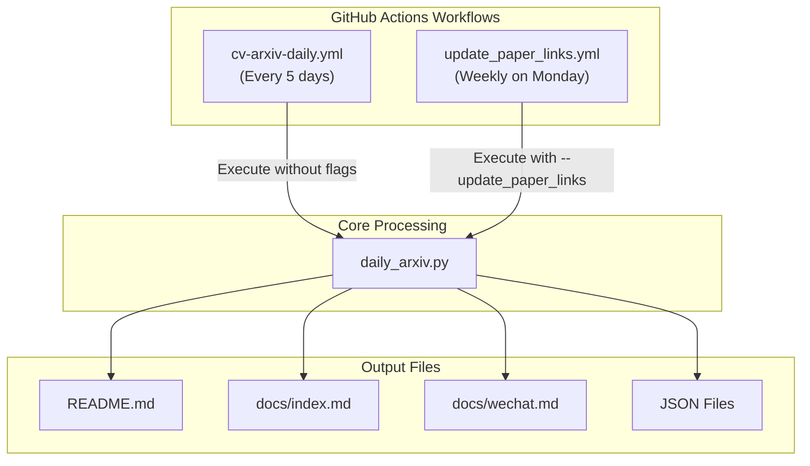
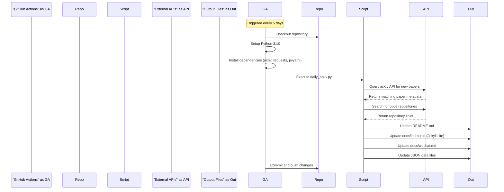
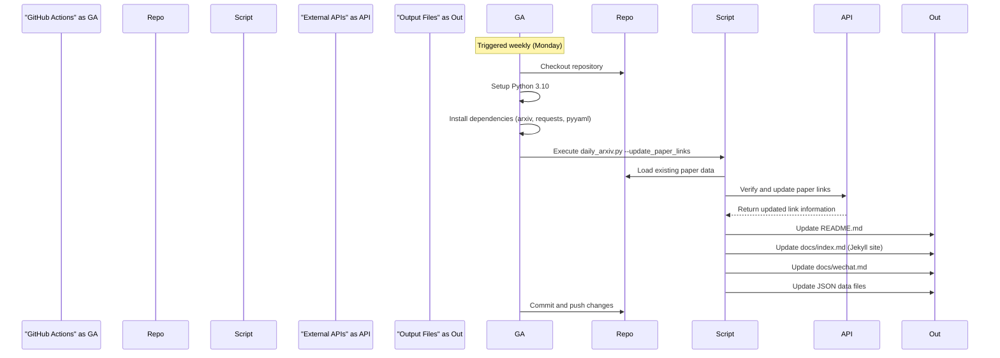
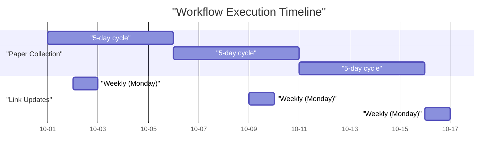
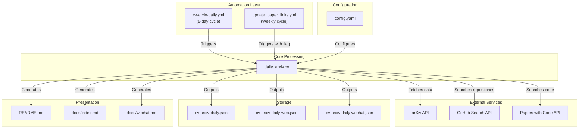
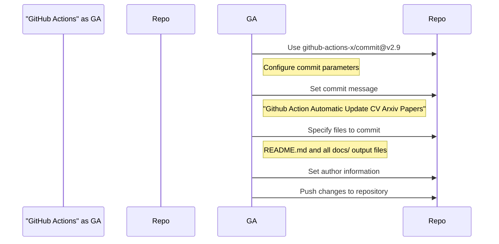

# Automation Workflows

<details>
<summary>Relevant source files</summary>

The following files were used as context for generating this wiki page:

- [.github/workflows/cv-arxiv-daily.yml](.github/workflows/cv-arxiv-daily.yml)
- [.github/workflows/update_paper_links.yml](.github/workflows/update_paper_links.yml)

</details>


This document describes the GitHub Actions workflows that automate the CV-ArXiv-Daily system's paper collection, processing, and publishing pipeline. These workflows enable periodic execution without manual intervention, ensuring the repository stays up-to-date with the latest computer vision research papers.

For information about the core processing engine that these workflows trigger, see [Core Processing Engine](#2.1). For details about how data flows through the system after being triggered, see [Data Flow](#2.4).

## Workflow Overview

The CV-ArXiv-Daily system implements two distinct automated workflows:

1. **Regular Paper Collection** - Runs every 5 days to fetch new papers from arXiv
2. **Paper Link Maintenance** - Runs weekly to update and verify existing paper links

These complementary workflows handle both the collection of new research and the maintenance of existing content, ensuring the system remains current and all references remain valid.



Sources: [.github/workflows/cv-arxiv-daily.yml](), [.github/workflows/update_paper_links.yml]()

## Primary Paper Collection Workflow

The main workflow (`cv-arxiv-daily.yml`) executes every 5 days to collect and process new papers from arXiv based on the configured research areas.

### Trigger Configuration

The primary collection workflow uses the following trigger configuration:

```yaml
name: Run Arxiv Papers Daily

on:
  workflow_dispatch:  # Manual trigger option
  schedule:
    - cron: "0 0 */5 * *"  # Every 5 days at midnight UTC
```

Sources: [.github/workflows/cv-arxiv-daily.yml:3-10]()

### Execution Sequence



Sources: [.github/workflows/cv-arxiv-daily.yml:32-59]()

### Implementation Details

The workflow follows these steps:

1. **Environment Setup**: Runs on Ubuntu with Python 3.10
2. **Dependency Installation**: Installs the required Python packages 
3. **Script Execution**: Runs `daily_arxiv.py` without parameters
4. **Automated Commit**: Commits and pushes changes to six specific files with a standard commit message

Key configuration details:
- **Dependencies**: arxiv, requests, pyyaml
- **Commit Files**: README.md, JSON files, and markdown output files
- **Commit Author**: Configured with repository owner information

Sources: [.github/workflows/cv-arxiv-daily.yml:28-59]()

## Paper Link Update Workflow

The secondary workflow (`update_paper_links.yml`) runs weekly to verify and update links for existing papers, ensuring all references remain current and functional.

### Trigger Configuration

The link update workflow uses the following trigger configuration:

```yaml
name: Run Update Paper Links Weekly

on:
  workflow_dispatch:  # Manual trigger option
  schedule:
    - cron: "0 8 * * 1"  # Every Monday at 08:00 UTC
```

Sources: [.github/workflows/update_paper_links.yml:3-10]()

### Execution Sequence



Sources: [.github/workflows/update_paper_links.yml:32-59]()

### Implementation Details

The link update workflow is nearly identical to the primary collection workflow, with one critical difference:

- It passes the `--update_paper_links` flag to `daily_arxiv.py`
- This flag causes the script to focus on updating existing links rather than collecting new papers

Otherwise, it follows the same environment setup, dependency installation, and commit process as the primary workflow.

Sources: [.github/workflows/update_paper_links.yml:47-49]()

## Workflow Schedule Coordination

The two workflows operate on different but complementary schedules:



This scheduling approach ensures:
- Regular collection of new papers (every 5 days)
- Weekly maintenance of paper links (every Monday)
- These processes occasionally coincide but generally run at different times

Sources: [.github/workflows/cv-arxiv-daily.yml:10](), [.github/workflows/update_paper_links.yml:10]()

## Integration with System Architecture

The automation workflows represent the top-level control mechanism for the CV-ArXiv-Daily system. They integrate with other system components as shown below:



Sources: [.github/workflows/cv-arxiv-daily.yml](), [.github/workflows/update_paper_links.yml]()

## Automated Commit Process

Both workflows use the same automated commit process to publish changes:



The commit process is configured to:
1. Use a specific commit message
2. Update only the necessary output files
3. Use consistent author information
4. Apply a rebase to ensure clean history

Sources: [.github/workflows/cv-arxiv-daily.yml:51-59](), [.github/workflows/update_paper_links.yml:51-59]()

## Customization Options

The automation workflows can be customized in several ways:

| Customization | Method | File Location |
|---------------|--------|---------------|
| Change collection frequency | Modify cron expression | [cv-arxiv-daily.yml:10]() |
| Change link update frequency | Modify cron expression | [update_paper_links.yml:10]() |
| Add workflow environment variables | Add to env section | Both workflow files |
| Modify commit message | Edit commit-message parameter | Both workflow files |
| Change Python version | Update python-version parameter | Both workflow files |

For modifying what papers are collected and how they're processed, see [Configuration System](#2.2).

Sources: [.github/workflows/cv-arxiv-daily.yml](), [.github/workflows/update_paper_links.yml]()

---