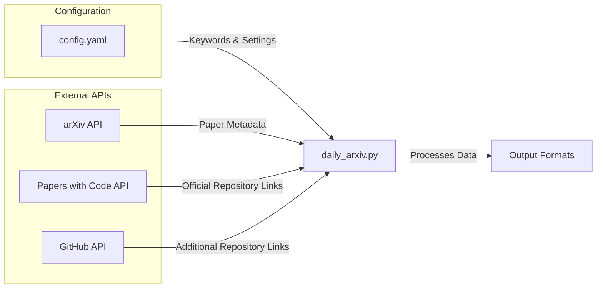
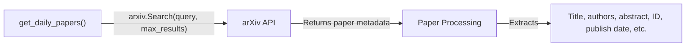
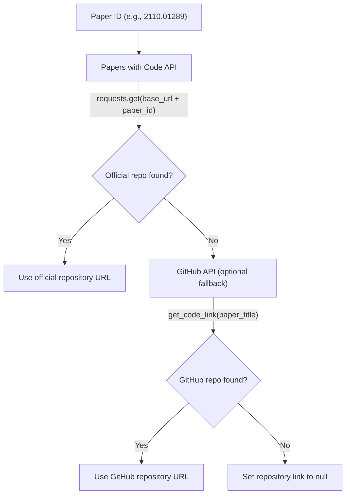
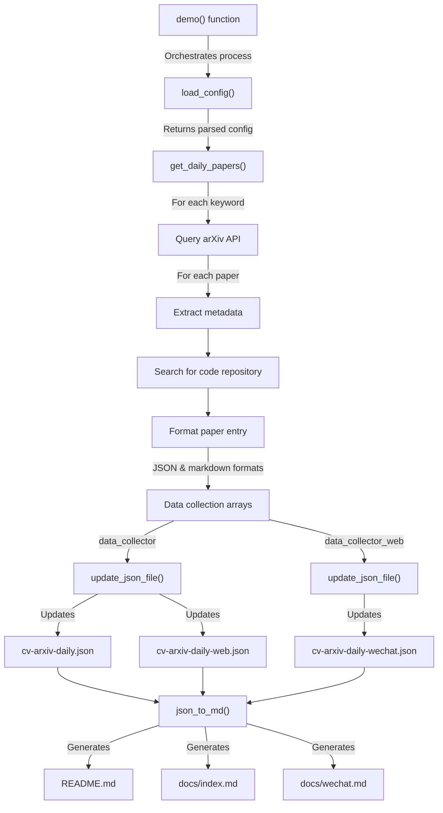
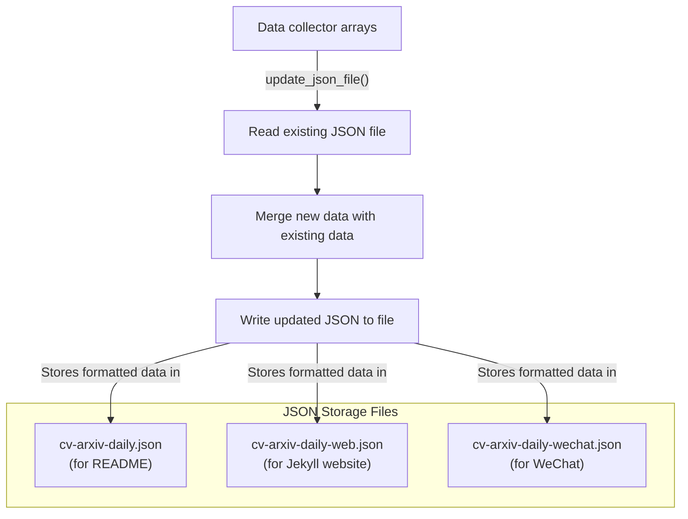
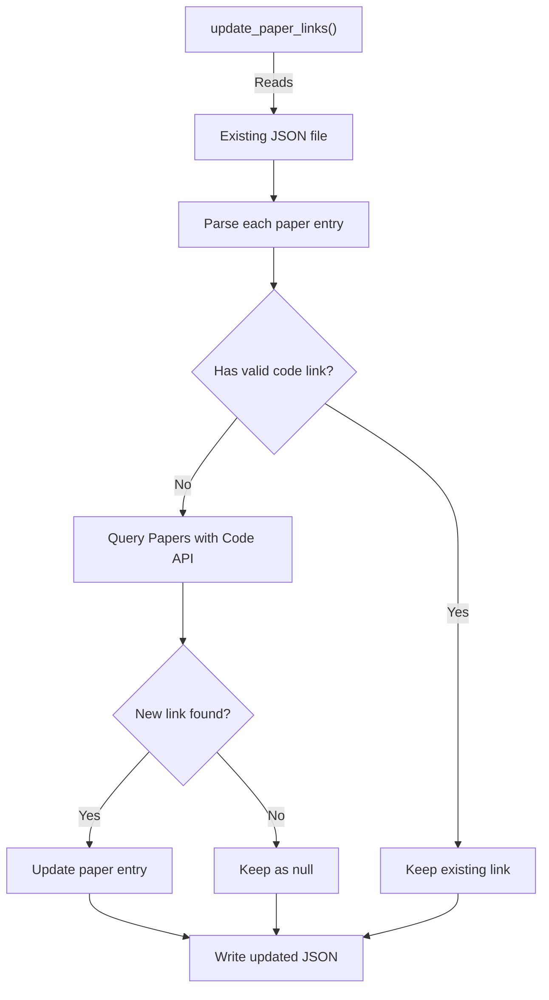
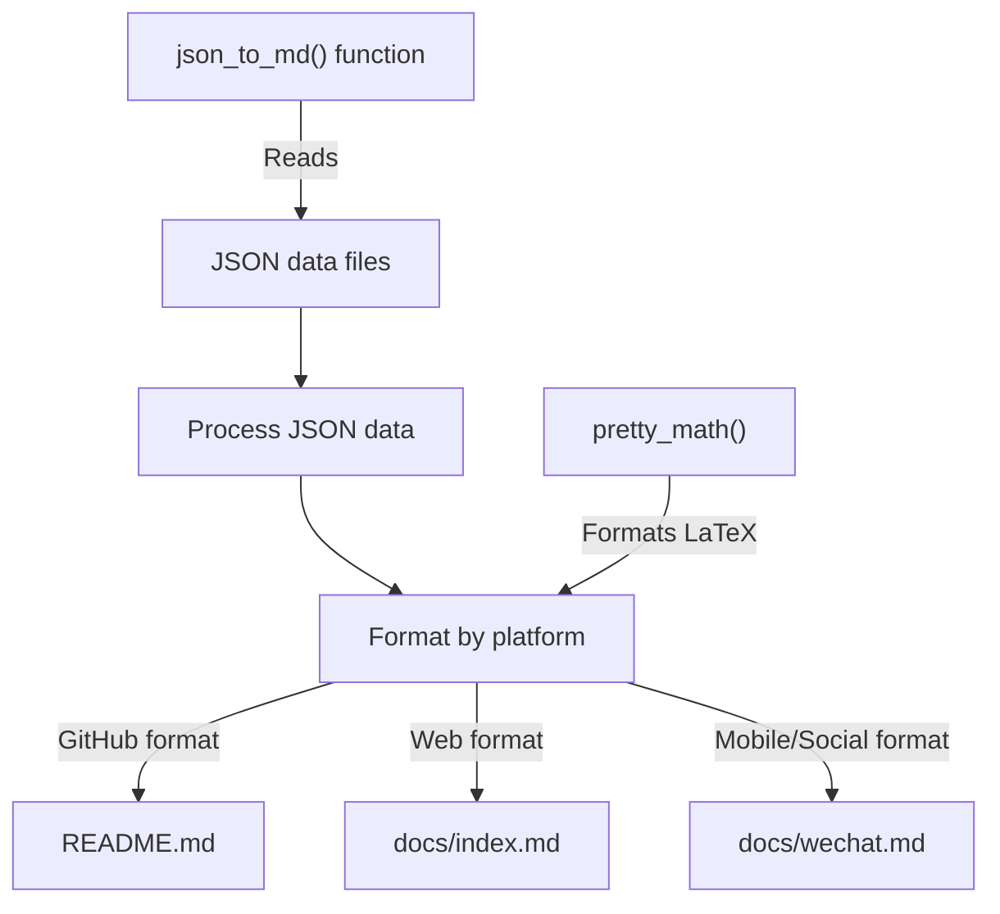
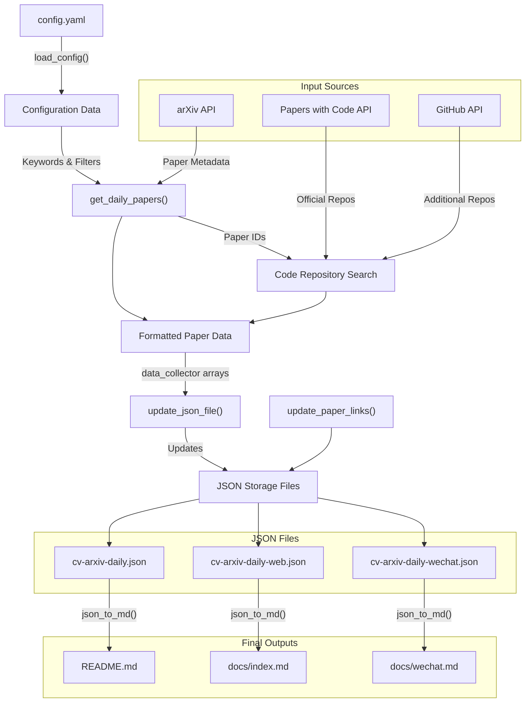
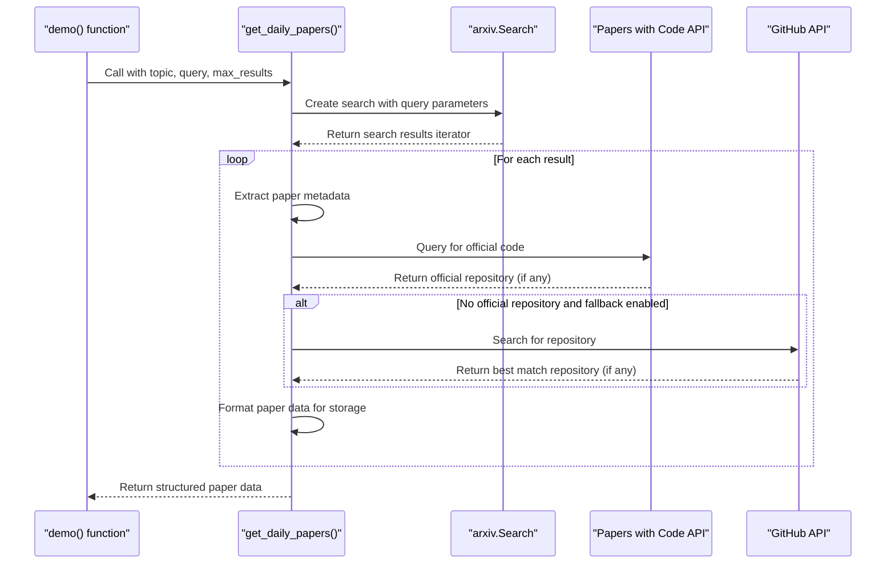

# Data Flow

<details>
<summary>Relevant source files</summary>

The following files were used as context for generating this wiki page:

- [daily_arxiv.py](daily_arxiv.py)
- [docs/cv-arxiv-daily-web.json](docs/cv-arxiv-daily-web.json)
- [docs/cv-arxiv-daily-wechat.json](docs/cv-arxiv-daily-wechat.json)
- [docs/cv-arxiv-daily.json](docs/cv-arxiv-daily.json)

</details>


This document describes the flow of data within the CV-ArXiv-Daily system, from input sources through processing stages to final output formats. It explains how computer vision research papers are collected from arXiv, processed, enriched with code repository information, and published in various formats for different platforms.

## 1. Data Sources and Inputs

The CV-ArXiv-Daily system collects data from several external APIs and configuration files:



### 1.1 Configuration

The system behavior is defined by the `config.yaml` file, which specifies:
- Keywords for searching papers by research area
- Maximum results to fetch
- Output formats to generate

The configuration is loaded using the `load_config()` function, which parses the YAML file and prepares the keyword filters for arXiv queries.

Sources: [daily_arxiv.py:19-48]()

### 1.2 arXiv API

The primary source of paper information is the arXiv API, accessed through the `arxiv` Python package. The system queries arXiv using search terms defined in the configuration file to retrieve recent computer vision papers.



Sources: [daily_arxiv.py:87-116]()

### 1.3 Code Repository APIs

For each paper fetched from arXiv, the system attempts to find associated code repositories:



The system first checks the Papers with Code API for an official repository. If none is found, it can optionally query the GitHub API using the paper title as a search term.

Sources: [daily_arxiv.py:65-85](), [daily_arxiv.py:126-144]()

## 2. Data Processing Pipeline

The data processing pipeline transforms raw paper information into structured data for publication:



The main data processing occurs in the `get_daily_papers()` function, which:
1. Creates an `arxiv.Search` instance with the configured query and parameters
2. Iterates through the results, extracting metadata for each paper
3. Searches for associated code repositories
4. Formats the paper information for both JSON storage and markdown display

Sources: [daily_arxiv.py:87-161]()

### 2.1 Paper Data Extraction

For each paper retrieved from arXiv, the system extracts the following metadata:
- Paper ID (e.g., "2110.07546")
- Title
- Authors (full list and first author)
- Publication and update dates
- Abstract
- arXiv URL
- Code repository URL (if available)

This metadata is structured into formatted strings for each output format.

Sources: [daily_arxiv.py:102-115]()

## 3. Data Storage and Persistence

The CV-ArXiv-Daily system uses JSON files as an intermediate data storage mechanism:



Each JSON file uses paper IDs (e.g., "2110.07546") as keys, with formatted strings as values. This allows for:
- Incremental updates without duplicating entries
- Platform-specific formatting
- Persistence between runs

Sources: [daily_arxiv.py:217-241]()

### 3.1 Data Update Mechanism

The system includes a mechanism to update repository links for existing papers:



This allows the system to retroactively add code repository links as they become available, without refetching the papers from arXiv.

Sources: [daily_arxiv.py:163-215]()

## 4. Output Generation

The CV-ArXiv-Daily system generates three different output formats from the stored JSON data:



The `json_to_md()` function converts JSON data to markdown, with specific formatting for each platform:

Sources: [daily_arxiv.py:243-368]()

### 4.1 Output Format Comparison

| Output Format | File | Purpose | Format Features |
|---------------|------|---------|----------------|
| GitHub README | README.md | Repository documentation | Full table with badges, TOC |
| Jekyll Website | docs/index.md | Web interface | Web-optimized table format |
| WeChat Content | docs/wechat.md | Mobile/social sharing | Simple list format |

Each format is optimized for its specific platform, ensuring the information is presented in the most suitable way for each context.

### 4.2 Custom Formatting

The system includes specialized formatting functions:
- `pretty_math()` - Properly formats LaTeX mathematics in paper titles
- `get_authors()` - Formats author lists with options for full list or first author only
- `sort_papers()` - Sorts papers by date for chronological display

These ensure consistent, readable output across all platforms.

Sources: [daily_arxiv.py:50-63](), [daily_arxiv.py:255-267]()

## 5. Complete Data Flow Diagram

The following diagram illustrates the complete data flow through the CV-ArXiv-Daily system:



This diagram shows how data flows from input sources through processing functions to storage and finally to the various output formats.

Sources: [daily_arxiv.py:370-443]()

## 6. Implementation Detail: Paper Collection

The `get_daily_papers()` function is the core of the data collection process:



The function processes each paper and produces two formats for each:
1. Table row format for GitHub and web display: `|date|title|authors|paper_link|code_link|`
2. List format for WeChat: `- date, title, authors, paper_link, code_link`

These different formats are collected in separate data structures (`content` and `content_to_web`) to be stored in different JSON files.

Sources: [daily_arxiv.py:87-161]()

## 7. JSON Data Structure

The JSON files serve as an intermediate representation between the raw data from arXiv and the formatted markdown outputs:

```json
{
  "SLAM": {
    "2110.07546": "|**2021-10-14**|**Active SLAM over Continuous Trajectory and Control: A Covariance-Feedback Approach**|Shumon Koga et.al.|[2110.07546](http://arxiv.org/abs/2110.07546)|null|\n",
    "2110.06541": "|**2021-10-13**|**Collaborative Radio SLAM for Multiple Robots based on WiFi Fingerprint Similarity**|Ran Liu et.al.|[2110.06541](http://arxiv.org/abs/2110.06541)|null|\n"
  },
  "Visual Localization": {
    "2201.03212": "|**2022-01-10**|**Why-So-Deep: Towards Boosting Previously Trained Models for Visual Place Recognition**|M. Usman Maqbool Bhutta et.al.|[2201.03212](http://arxiv.org/abs/2201.03212)|**[link](https://github.com/UsmanMaqbool/why-so-deep)**|\n"
  }
}
```

Each JSON file contains a dictionary where:
- Top-level keys are research topics ("SLAM", "Visual Localization", etc.)
- Second-level keys are arXiv paper IDs
- Values are formatted strings ready for insertion into markdown files

This structure allows for:
1. Easy updating of existing entries
2. Organization by research topic
3. Quick conversion to markdown

Sources: [docs/cv-arxiv-daily.json](), [docs/cv-arxiv-daily-web.json](), [docs/cv-arxiv-daily-wechat.json]()

## 8. Conclusion

The data flow in the CV-ArXiv-Daily system can be summarized as:

1. **Input Collection**: Fetch papers from arXiv based on configured keywords
2. **Data Enrichment**: Search for associated code repositories
3. **Structured Storage**: Store formatted data in JSON files
4. **Markdown Generation**: Convert JSON data to markdown for different platforms

This pipeline efficiently transforms raw research paper data into well-structured, platform-specific formats, making the latest computer vision research accessible across different platforms.

---