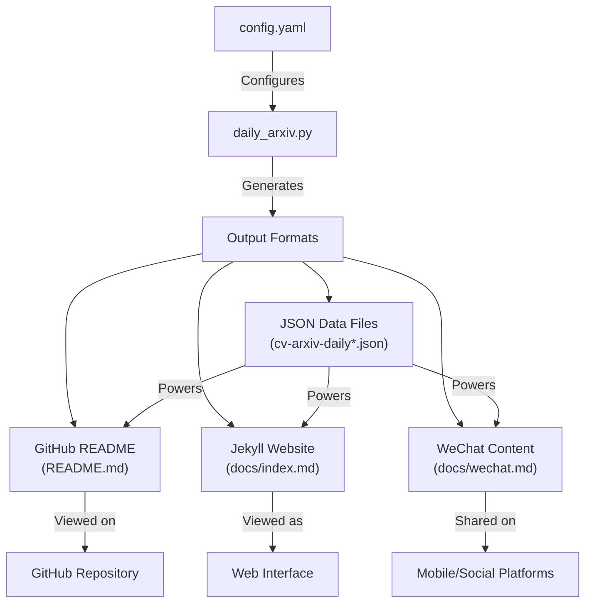
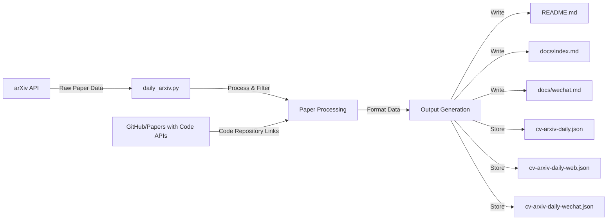
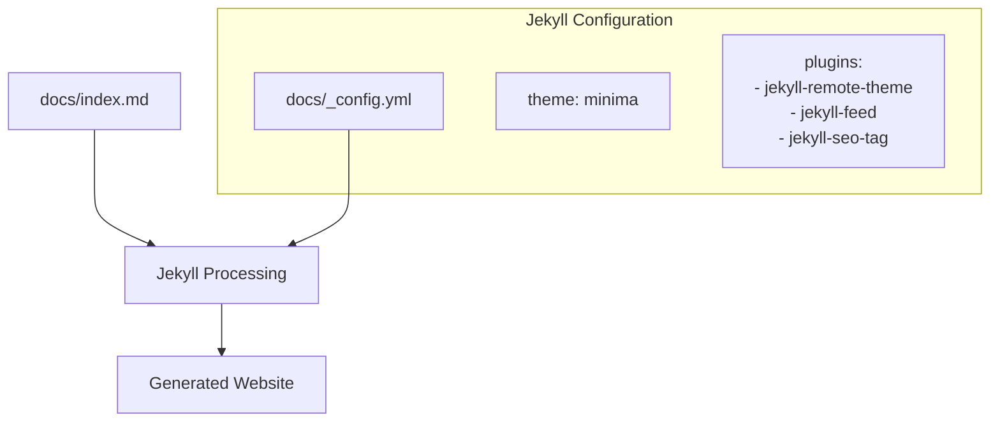
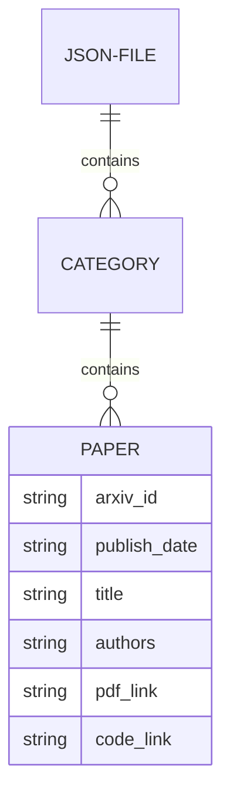
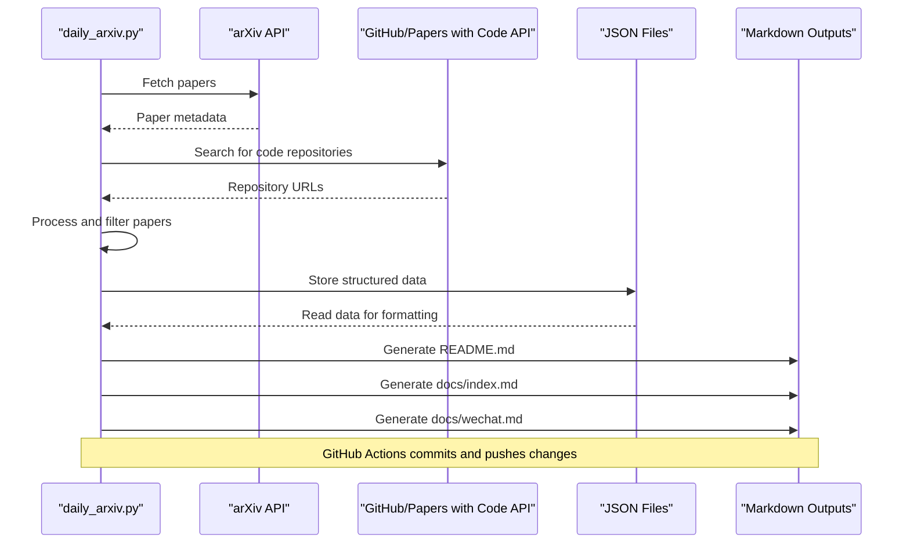

# Output Formats

<details>
<summary>Relevant source files</summary>

The following files were used as context for generating this wiki page:

- [README.md](README.md)
- [docs/_config.yml](docs/_config.yml)
- [docs/cv-arxiv-daily.json](docs/cv-arxiv-daily.json)
- [docs/index.md](docs/index.md)
- [docs/wechat.md](docs/wechat.md)

</details>


This page documents the different output formats generated by the CV-ArXiv-Daily system. The system processes computer vision research papers from arXiv and produces multiple output formats to make the information accessible across different platforms. For information about how the system collects and processes papers, see [Core Processing Engine](#2.1).

## Overview of Output Formats

CV-ArXiv-Daily generates four main types of outputs:

1. **GitHub README** - A markdown file displayed on the repository's main page
2. **Jekyll Website** - A web interface built with Jekyll using the files in the `docs/` directory
3. **WeChat Content** - A mobile-friendly format for sharing on platforms like WeChat
4. **JSON Data Files** - Structured data storage that powers the other formats

Each format is tailored to specific use cases and platforms, offering different viewing experiences for the same underlying paper data.



Sources: [README.md:1-14](). [docs/index.md:1-10](). [docs/wechat.md:1-19](). [docs/cv-arxiv-daily.json:1-5]().

## Data Flow Process

The following diagram illustrates how data flows from arXiv to the various output formats:



Sources: [README.md:16-40](). [docs/index.md:11-30](). [docs/cv-arxiv-daily.json:1-10]().

## GitHub README Format

The GitHub README is the primary display format for the repository, showing computer vision papers organized by research categories. It's designed to be read directly on GitHub's interface.

### Structure and Format

The README is a markdown file with the following key elements:

1. **Header** - Update timestamp and usage instructions
2. **Table of Contents** - Collapsible section linking to research categories
3. **Category Sections** - Papers organized by topics (SLAM, SFM, etc.)
4. **Paper Listings** - Tabular format with metadata for each paper

Example paper listing format:

| Publish Date | Title | Authors | PDF | Code |
|-------------|-------|---------|-----|------|
| **YYYY-MM-DD** | **Paper Title** | Author Names | [arXiv ID](link) | **[link](repository-url)** |

Sources: [README.md:1-40](). [README.md:16-95]().

## Jekyll Website Format

The Jekyll website provides a web interface for browsing the papers, using the same underlying data as the GitHub README but formatted for web display.

### Configuration and Structure

The Jekyll site is configured in `_config.yml` and uses the GitHub Pages infrastructure. The main content is in `docs/index.md`, which has a similar structure to the README:

1. **Front Matter** - Jekyll configuration (layout, etc.)
2. **Update Timestamp** - When the content was last updated
3. **Research Categories** - Papers organized by topic
4. **Paper Tables** - Same tabular format as README



Sources: [docs/index.md:1-10](). [docs/_config.yml:1-22]().

## WeChat Content Format

The WeChat format is optimized for mobile viewing and sharing on platforms like WeChat. It has a more compact structure suitable for social media sharing.

### Structure and Format

The WeChat content is stored in `docs/wechat.md` and features:

1. **Repository Stats** - Badges showing contributors, forks, stars, etc.
2. **Update Timestamp** - Last update date
3. **Table of Contents** - Collapsible section linking to categories
4. **Paper Listings** - Simplified format optimized for mobile viewing

Example paper format (note the simpler format compared to tables in README):
```
- YYYY-MM-DD, **Paper Title**, Author Names, Paper: [link], Code: **[link]**
```

Sources: [docs/wechat.md:1-30](). [docs/wechat.md:20-120]().

## JSON Data Storage

The JSON files serve as an intermediate data storage format, powering the other output formats. They store structured data about papers that can be easily processed by scripts.

### JSON File Structure

There are several JSON files used by the system:

1. **cv-arxiv-daily.json** - Primary data storage for all papers
2. **cv-arxiv-daily-web.json** - Data formatted for the web interface
3. **cv-arxiv-daily-wechat.json** - Data formatted for WeChat/mobile

The JSON structure organizes papers by research category and stores metadata for each paper:



Sample JSON structure:
```
{
  "CATEGORY_NAME": {
    "PAPER_ID_1": "|**DATE**|**TITLE**|AUTHORS|[PDF_LINK](URL)|CODE_LINK|",
    "PAPER_ID_2": "|**DATE**|**TITLE**|AUTHORS|[PDF_LINK](URL)|CODE_LINK|",
    ...
  },
  ...
}
```

Sources: [docs/cv-arxiv-daily.json:1-10]().

## Output Format Comparison

The following table compares the key characteristics of each output format:

| Format | File | Primary Audience | Structure | Update Method |
|--------|------|------------------|-----------|---------------|
| GitHub README | README.md | GitHub users | Markdown tables by category | Direct write by script |
| Jekyll Website | docs/index.md | Web visitors | Front-matter + markdown tables | Direct write by script |
| WeChat Content | docs/wechat.md | Mobile/social users | Compact list format | Direct write by script |
| JSON Data | cv-arxiv-daily*.json | System/scripts | Structured data by category | Direct write by script |

Sources: [README.md:1-14](). [docs/index.md:1-10](). [docs/wechat.md:1-19](). [docs/cv-arxiv-daily.json:1-5]().

## Format Generation Process

The system follows this general process to generate the various output formats:



Sources: [README.md:1-14](). [docs/index.md:1-10](). [docs/wechat.md:1-19]().

## Related Pages

- For details on how papers are collected and processed, see [Core Processing Engine](#2.1)
- For information on configuring the system, see [Configuration System](#2.2)
- For details on automation workflows, see [Automation Workflows](#2.3)
- For specific output format documentation, see:
  - [GitHub README Integration](#3.1)
  - [Jekyll Website](#3.2)
  - [WeChat Integration](#3.3)
  - [JSON Data Structures](#3.4)

---