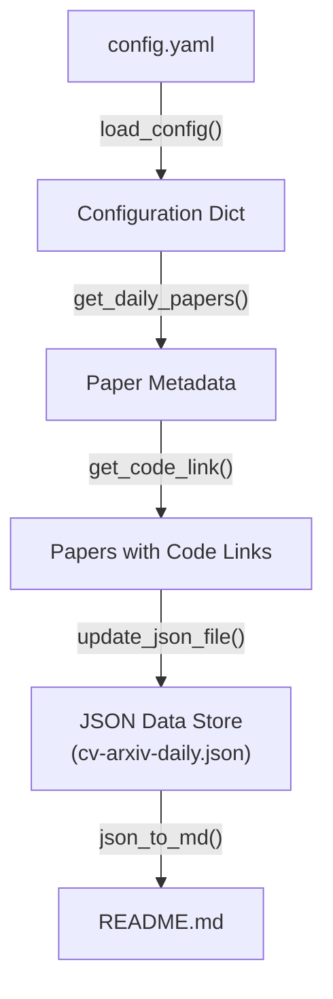
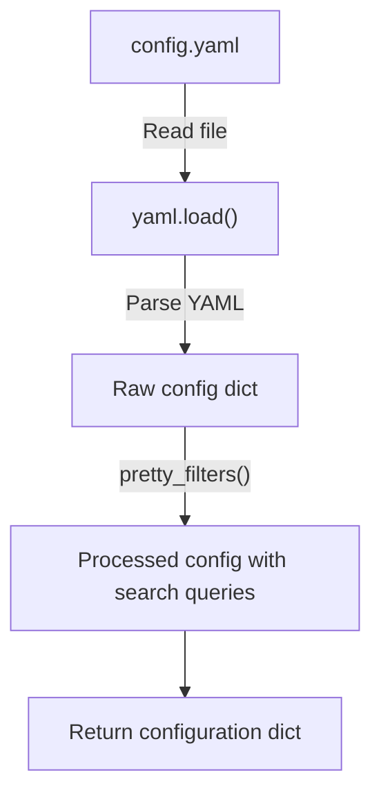
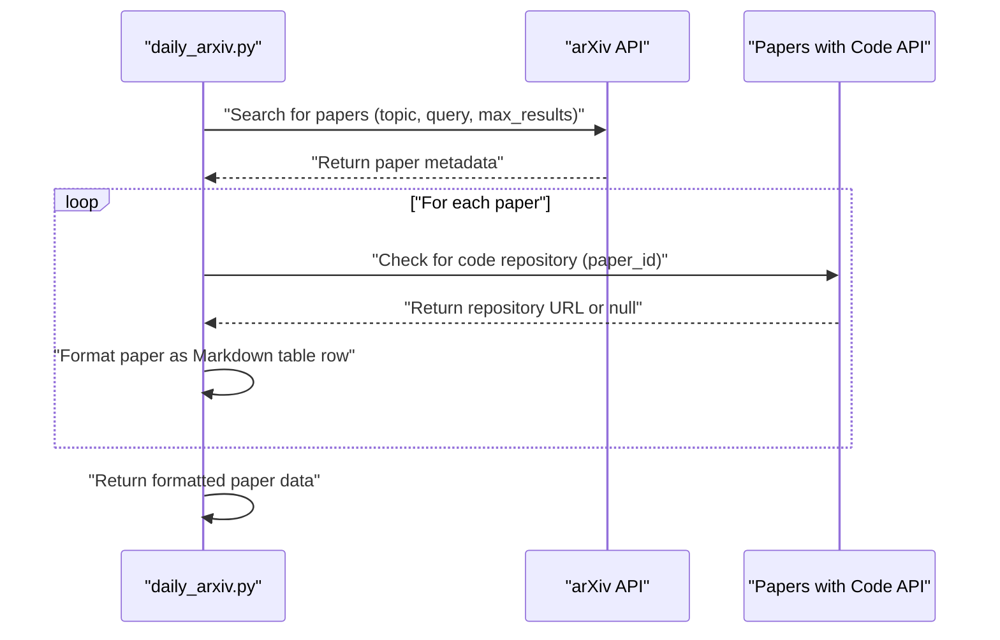
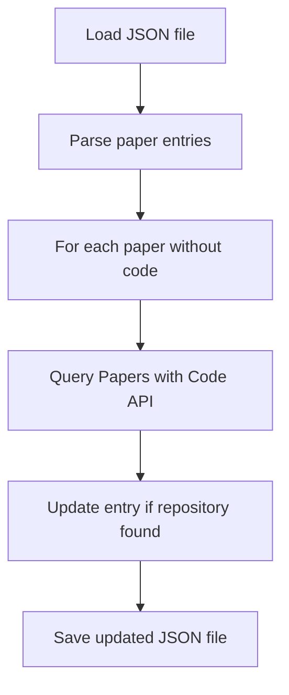
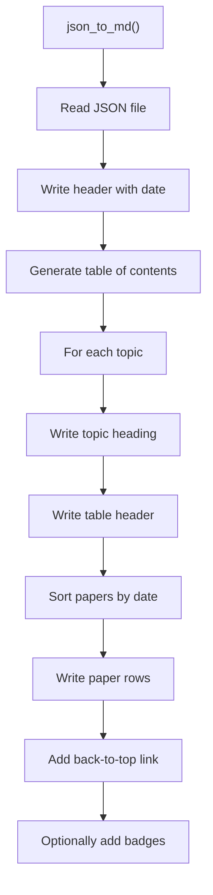
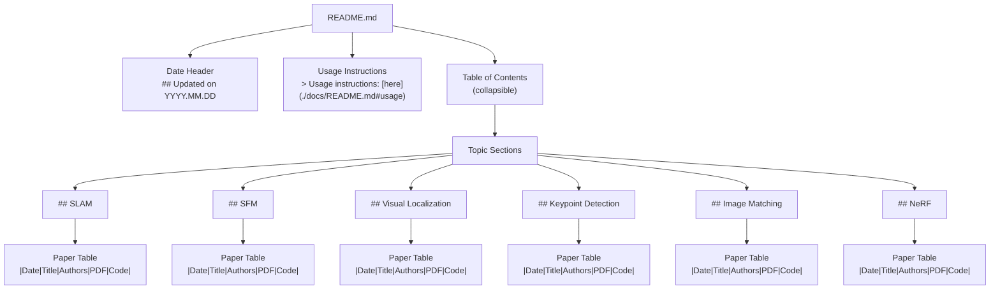
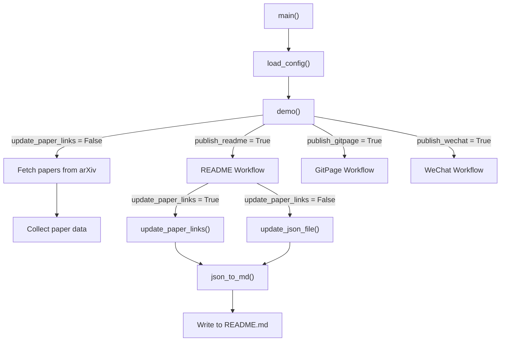

# GitHub README Integration

<details>
<summary>Relevant source files</summary>

The following files were used as context for generating this wiki page:

- [README.md](README.md)
- [daily_arxiv.py](daily_arxiv.py)
- [docs/cv-arxiv-daily.json](docs/cv-arxiv-daily.json)

</details>


This document details how the cv-arxiv-daily system updates the repository's main README.md file with the latest computer vision papers from arXiv. The GitHub README integration is specifically responsible for transforming paper data into a well-structured Markdown document that displays papers organized by research topics.

## Process Overview

The GitHub README Integration follows this high-level workflow:

1. Configuration data is loaded from `config.yaml` containing search parameters and output settings
2. Papers are fetched from arXiv based on configured keywords
3. Associated code repositories are identified for each paper 
4. Paper information is stored in a JSON intermediate file
5. JSON data is converted to Markdown format
6. README.md file is updated with the formatted content



Sources: [daily_arxiv.py:19-48](), [daily_arxiv.py:87-161](), [daily_arxiv.py:66-85](), [daily_arxiv.py:217-241](), [daily_arxiv.py:243-368]()

## Operation Modes

The GitHub README integration can operate in two distinct modes:

1. **Normal Mode**: Fetches new papers from arXiv and updates the README
2. **Update Links Mode**: Only updates code repository links for papers already in the JSON file

The mode is controlled by the `--update_paper_links` command line argument, which is processed in the main function and passed to the `demo()` function:

```bash
# Normal mode
python daily_arxiv.py --config_path config.yaml

# Update links mode
python daily_arxiv.py --config_path config.yaml --update_paper_links
```

Sources: [daily_arxiv.py:434-443](), [daily_arxiv.py:370-433]()

## Core Components

### 1. Configuration Loading

The `load_config()` function loads and processes the configuration from the YAML file:



The configuration contains:
- Topics and search keywords with filters
- Maximum number of results per topic
- Output file paths for different formats
- Formatting options (badges, table of contents, etc.)

Sources: [daily_arxiv.py:19-48]()

### 2. Paper Retrieval

The `get_daily_papers()` function retrieves papers from arXiv and checks for associated code repositories:



For each paper, the function:
1. Extracts metadata (title, authors, publication date, URL)
2. Queries the Papers with Code API to find associated code repositories
3. Formats the paper information as a Markdown table row
4. Organizes papers by topic in a dictionary structure

Sources: [daily_arxiv.py:87-161]()

### 3. JSON Data Management

Papers are stored in JSON files as an intermediate format before generating Markdown. The system maintains separate JSON files for different output formats:

- `cv-arxiv-daily.json`: For the GitHub README
- `cv-arxiv-daily-web.json`: For the Jekyll website
- `cv-arxiv-daily-wechat.json`: For WeChat content

The JSON structure is organized by topics and paper IDs:

```json
{
  "SLAM": {
    "2110.07546": "|**2021-10-14**|**Active SLAM...**|Author et.al.|[2110.07546](http://arxiv.org/abs/2110.07546)|null|",
    "2110.06541": "|**2021-10-13**|**Collaborative Radio SLAM...**|Author et.al.|[2110.06541](http://arxiv.org/abs/2110.06541)|null|"
  },
  "SFM": {
    "2110.09412": "|**2021-10-18**|**Structure from Motion...**|Author et.al.|[2110.09412](http://arxiv.org/abs/2110.09412)|**[link](https://github.com/user/repo)**|"
  }
}
```

Each value is a pre-formatted Markdown table row.

Sources: [daily_arxiv.py:217-241]()

### 4. Link Update Mechanism

The `update_paper_links()` function refreshes code repository links for existing papers without fetching new ones:



This function is useful when code repositories are published after the paper was initially added to the system.

Sources: [daily_arxiv.py:163-215]()

### 5. Markdown Generation

The `json_to_md()` function converts the JSON data to a full Markdown document:



The function has several parameters to control the output format:
- `to_web`: Format for web display (changes table format)
- `use_title`: Whether to include title heading
- `use_tc`: Whether to include table of contents
- `show_badge`: Whether to show GitHub badges
- `use_b2t`: Whether to include back-to-top links

Sources: [daily_arxiv.py:243-368]()

## README Structure and Format

The generated README.md follows this structure:



The README contains:
1. An update date header showing when the content was last refreshed
2. A link to usage instructions
3. A collapsible table of contents with links to each section
4. Sections for each research topic with tables listing papers
5. For each paper: publication date, title, authors, arXiv link, and code repository link (if available)

Sources: [README.md:1-350]()

## Integration with Main Workflow

The GitHub README integration is executed as part of the `demo()` function, which orchestrates the entire process:



The `demo()` function processes the configuration and command line arguments to determine:
1. Whether to fetch new papers or only update links
2. Which output formats to generate (README, GitPage, WeChat)
3. How to format each output

Sources: [daily_arxiv.py:370-433]()

## Example README Output

The generated README.md contains formatted paper information in tables:

| Publish Date | Title | Authors | PDF | Code |
|---|---|---|---|---|
| **2023-01-09** | **Active SLAM: A Review** | Julio A. Placed et.al. | [2301.03267](http://arxiv.org/abs/2301.03267) | **[link](https://github.com/julioplaced/active-slam-survey)** |
| **2023-01-08** | **Real-time Motion Planning for Autonomous Driving** | Wei Zhan et.al. | [2301.03134](http://arxiv.org/abs/2301.03134) | null |

The papers are sorted by date (newest first) and organized by research topic.

Sources: [README.md:16-350]()

## Relationship to Other Components

The GitHub README integration is one of three output formats generated by the system:

1. **GitHub README** (covered in this document): Main repository README.md file
2. **Jekyll Website** (see [Jekyll Website Integration](#3.2)): Formatted for web display in docs/index.md
3. **WeChat Integration** (see [WeChat Integration](#3.3)): Formatted for Chinese social media in docs/wechat.md

All three formats use the same paper data but with different formatting to suit each platform.

Sources: [daily_arxiv.py:370-433]()

---