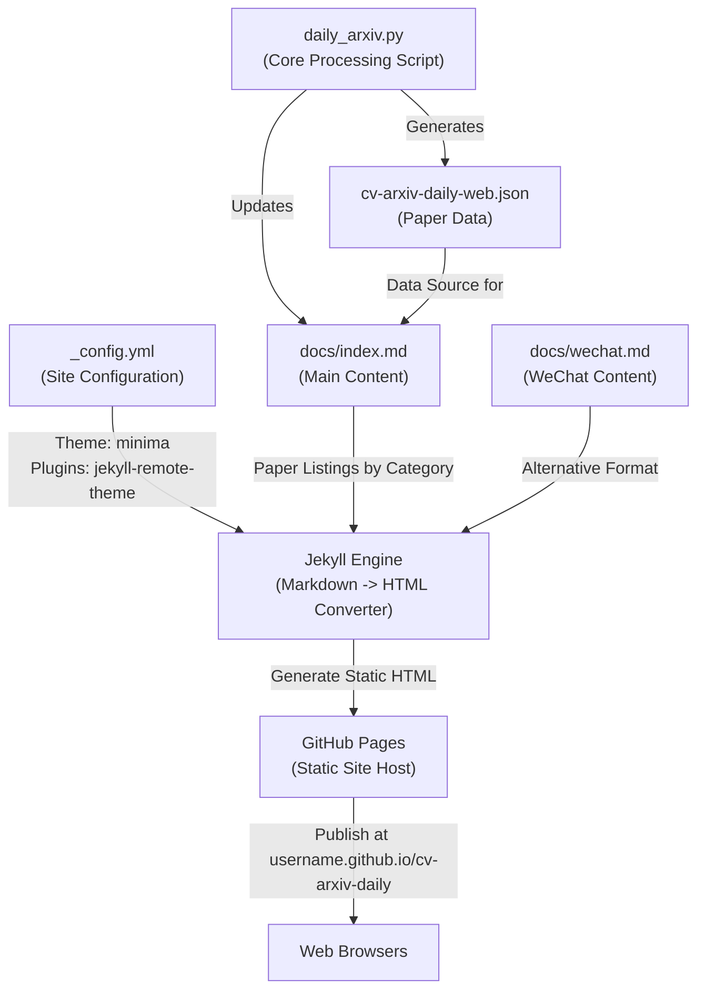
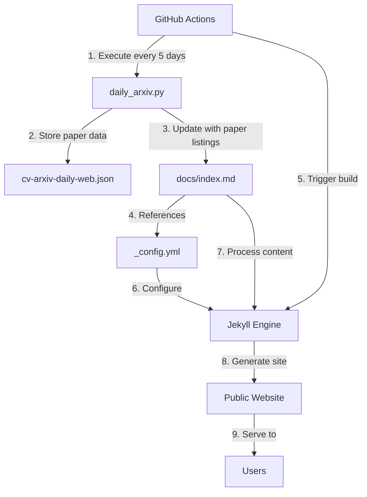
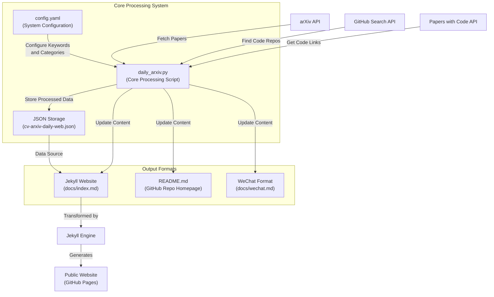

# Jekyll Website

<details>
<summary>Relevant source files</summary>

The following files were used as context for generating this wiki page:

- [docs/_config.yml](docs/_config.yml)
- [docs/cv-arxiv-daily-web.json](docs/cv-arxiv-daily-web.json)
- [docs/index.md](docs/index.md)

</details>


This document describes the Jekyll-powered website component of the CV-ArXiv-Daily system, which provides a web interface for browsing collected computer vision research papers. For information about the overall system architecture, see [System Architecture](#2), and for other output formats like GitHub README or WeChat content, see [Output Formats](#3).

## Purpose and Overview

The Jekyll website transforms markdown content in `docs/index.md` into a browsable static website hosted via GitHub Pages. It serves as the primary web interface for users to explore the latest computer vision papers collected by the system, organized by research categories.



Sources: [docs/index.md:1-381](), [docs/_config.yml:1-22]()

## Jekyll Configuration

The CV-ArXiv-Daily website is configured through the `_config.yml` file located in the `docs` directory. This file contains settings that control the site's appearance and behavior when processed by Jekyll.

| Configuration | Value | Description |
|---------------|-------|-------------|
| `title` | CV Arxiv Daily | The title displayed in the browser and site header |
| `description` | Automatically Update CV Papers Daily... | Brief site description |
| `remote_theme` | jekyll/minima@v2.5.1 | Specifies the Jekyll theme |
| `skin` | dark | Sets the color scheme |
| `plugins` | jekyll-remote-theme, jekyll-feed, jekyll-seo-tag | Enables additional Jekyll functionality |

The site uses the popular 'minima' theme with a dark skin variant and includes social links to the project owner's profiles.

Sources: [docs/_config.yml:1-22]()

## Content Structure

### Main Page Structure

The main content of the website is contained in `docs/index.md`, which serves as the homepage. The file begins with YAML front matter that specifies the Jekyll layout:

```yaml
---
layout: default
---
```

Following this front matter, the content is organized as follows:

1. **Update Timestamp**: Shows when the content was last refreshed
2. **Usage Instructions**: Link to setup and customization documentation
3. **Research Categories**: Section headers (## SLAM, ## SFM, etc.)
4. **Paper Tables**: For each category, a table of papers with metadata

Sources: [docs/index.md:1-5]()

### Paper Entry Format

Each paper is presented in a table row with the following columns:

| Column | Description |
|--------|-------------|
| Publish Date | Date the paper was published on arXiv |
| Title | Paper title, formatted in bold |
| Authors | List of author names |
| PDF | Link to the paper's PDF on arXiv |
| Code | Link to the paper's code repository (if available) |

Example paper entry from the SLAM section:

```markdown
|**2025-04-16**|**An Online Adaptation Method for Robust Depth Estimation and Visual Odometry in the Open World**|Xingwu Ji et.al.|[2504.11698](http://arxiv.org/abs/2504.11698)|**[link](https://github.com/jixingwu/sol-slam)**|
```

Sources: [docs/index.md:10-13]()

## Content Generation Process

The Jekyll website's content is automatically generated through a pipeline that collects, processes, and publishes paper data:



The process consists of these key steps:

1. **Scheduled Execution**: GitHub Actions triggers the `daily_arxiv.py` script every 5 days
2. **Data Collection**: The script queries the arXiv API for papers matching configured keywords
3. **Data Processing**: Papers are filtered, categorized, and enriched with repository links
4. **JSON Storage**: Processed data is stored in `cv-arxiv-daily-web.json`
5. **Markdown Generation**: The script updates `docs/index.md` with formatted paper listings
6. **Jekyll Build**: GitHub Pages runs Jekyll to transform the markdown into HTML
7. **Website Publication**: The resulting static site is served via GitHub Pages

This automated process ensures the website stays current with minimal manual intervention.

Sources: [docs/index.md:1-381](), [docs/cv-arxiv-daily-web.json:1]()

## Research Categories

The website organizes papers into distinct research categories based on the configuration in `config.yaml`. The main categories include:

| Category | Description |
|----------|-------------|
| SLAM | Simultaneous Localization and Mapping |
| Visual Localization | Camera relocalization and place recognition |
| SFM | Structure from Motion techniques |
| Keypoint Detection | Feature detection and descriptors |
| Image Matching | Feature and line segment matching |
| NeRF | Neural Radiance Fields and novel view synthesis |

Each category has its own section in the `docs/index.md` file with a dedicated table of papers related to that research area.

Sources: [docs/index.md:8-380]()

## Integration with CV-ArXiv-Daily System

The Jekyll website is one component in the larger CV-ArXiv-Daily ecosystem, serving as the web-based presentation layer for the collected research papers:



The Jekyll website works alongside other output formats:

- **GitHub README** (covered in [GitHub README Integration](#3.1)): Shows paper listings directly on the repository page
- **WeChat Integration** (covered in [WeChat Integration](#3.3)): Formatted content for sharing on WeChat
- **JSON Data** (covered in [JSON Data Structures](#3.4)): Structured data for programmatic access

Together, these components form a comprehensive system for collecting, processing, and publishing computer vision research papers across multiple platforms.

Sources: [docs/index.md:1-381](), [docs/_config.yml:1-22](), [docs/cv-arxiv-daily-web.json:1]()

## Website Customization

Users who fork the CV-ArXiv-Daily repository can customize the Jekyll website by modifying the following:

1. **Site Configuration**: Edit `_config.yml` to change the title, description, theme, etc.
2. **Paper Categories**: Modify `config.yaml` to adjust which research areas are included
3. **Search Keywords**: Update `config.yaml` to refine which papers are collected
4. **Layout and Appearance**: The site uses the 'minima' theme, which can be customized further

The Jekyll website provides a flexible framework that can be adapted to focus on different research areas or presentation styles while maintaining the automated collection and publication process.

Sources: [docs/_config.yml:1-22]()

---