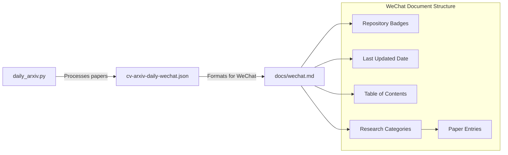
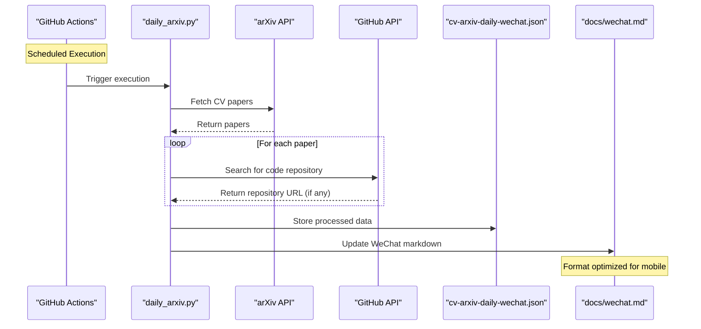
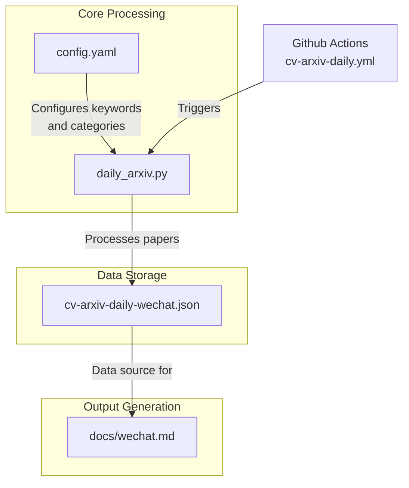

# WeChat Integration

<details>
<summary>Relevant source files</summary>

The following files were used as context for generating this wiki page:

- [docs/cv-arxiv-daily-wechat.json](docs/cv-arxiv-daily-wechat.json)
- [docs/wechat.md](docs/wechat.md)

</details>


## Overview

The WeChat Integration module provides functionality for formatting and sharing Computer Vision research papers in a style optimized for WeChat, a popular messaging and social media platform. This integration is one of the multiple output formats generated by the CV-ArXiv-Daily system, focused specifically on making research papers accessible in a mobile-friendly format.

For information about the overall system architecture, see [System Architecture](#2), and for other output formats, see [Output Formats](#3).

Sources: [docs/wechat.md:1-5]()

## WeChat Output Format

The WeChat integration generates a specially formatted markdown document located at `docs/wechat.md` that contains the latest computer vision papers organized by research categories. This file is designed to be easily shared on WeChat platforms and includes mobile-optimized formatting.



Sources: [docs/wechat.md:1-20]()

## Data Flow for WeChat Integration

The WeChat integration is part of the larger data pipeline in the CV-ArXiv-Daily system. Here's how data flows specifically for the WeChat output:



The system first collects papers from arXiv, processes them according to configured keywords, looks for associated code repositories, and then formats the data specifically for WeChat in both a JSON file and a markdown document.

Sources: [docs/wechat.md:1-294]()

## Document Structure

The WeChat markdown document follows a specific structure optimized for readability on mobile devices:

### 1. Document Header

The document begins with repository badges showing contributors, forks, stars, and issues, followed by a last updated date.

```
[![Contributors][contributors-shield]][contributors-url]
[![Forks][forks-shield]][forks-url]
[![Stargazers][stars-shield]][stars-url]
[![Issues][issues-shield]][issues-url]

> Updated on 2022.12.02
```

### 2. Table of Contents

A collapsible table of contents provides easy navigation to different research categories:

```
<details>
  <summary>Table of Contents</summary>
  <ol>
    <li><a href=#SLAM>SLAM</a></li>
    <li><a href=#SFM>SFM</a></li>
    <li><a href=#Visual-Localization>Visual Localization</a></li>
    <li><a href=#Keypoint-Detection>Keypoint Detection</a></li>
    <li><a href=#Image-Matching>Image Matching</a></li>
    <li><a href=#NeRF>NeRF</a></li>
  </ol>
</details>
```

### 3. Research Categories

The document organizes papers into distinct research categories, with each category containing a chronologically sorted list of papers.

### 4. Paper Entry Format

Each paper is presented in a consistent format:

```
- {DATE}, **{TITLE}**, {AUTHORS}, Paper: [{PAPER_URL}]({PAPER_URL}), Code: **[{CODE_URL}]({CODE_URL})**
```

The code repository link is only included if available and is emphasized with bold formatting.

Sources: [docs/wechat.md:1-294]()

## Technical Implementation

The WeChat integration is implemented as part of the core processing engine of the CV-ArXiv-Daily system.



The system generates the WeChat output through the following components:

1. **Configuration**: The `config.yaml` file defines which papers to include based on keywords and research categories

2. **Data Processing**: The `daily_arxiv.py` script processes the papers and stores the WeChat-specific data in `cv-arxiv-daily-wechat.json`

3. **Output Generation**: The script then uses this JSON data to generate the `docs/wechat.md` file with WeChat-optimized formatting

Sources: [docs/wechat.md:1-294]()

## Comparison with Other Output Formats

The WeChat integration differs from other output formats in several ways:

| Feature | WeChat Integration | GitHub README | Jekyll Website |
|---------|-------------------|---------------|----------------|
| Target Platform | Mobile (WeChat) | GitHub repository | Web browser |
| File Location | docs/wechat.md | README.md | docs/index.md |
| JSON Source | cv-arxiv-daily-wechat.json | cv-arxiv-daily.json | cv-arxiv-daily-web.json |
| Formatting | Mobile-optimized markdown | Standard GitHub markdown | Jekyll-compatible markdown |
| Navigation | Simple ToC with category links | More detailed navigation | Web navigation elements |
| Use Case | Sharing on social media/mobile | Repository documentation | Browsing on website |

The WeChat format is specifically designed to be shareable and readable on mobile devices, particularly within the WeChat ecosystem which is widely used for academic and professional communication in certain regions.

Sources: [docs/wechat.md:1-294]()

## Customization

Users can customize the WeChat integration in several ways:

1. **Keywords and Categories**: By modifying `config.yaml`, users can change which research areas and keywords are included in the WeChat output

2. **Output Format**: The formatting of the WeChat markdown file can be customized by modifying the template used in the core processing script

3. **Update Frequency**: The frequency at which the WeChat document is updated can be controlled by modifying the GitHub Actions workflow schedule

For more information on customization options, see [Setup and Configuration](#5.1) and [Customizing Research Keywords](#5.2).

Sources: [docs/wechat.md:1-20]()

## Usage Scenarios

The WeChat integration is particularly useful for:

1. **Sharing Research Updates**: Researchers can easily share the latest papers in their field on WeChat groups or moments

2. **Mobile Reading**: The format is optimized for reading on mobile devices, making it convenient for on-the-go browsing of research papers

3. **Chinese Academic Community**: Given WeChat's prevalence in China, this integration helps bridge international research with the Chinese academic community

4. **Research Groups**: Research groups can use this format to share relevant papers internally through WeChat channels

The mobile-friendly format makes it easier to access cutting-edge research in computer vision fields like SLAM, SFM, Visual Localization, and NeRF through the WeChat platform.

Sources: [docs/wechat.md:1-294]()

---