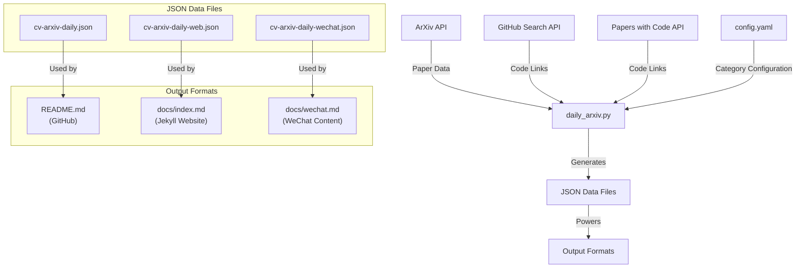
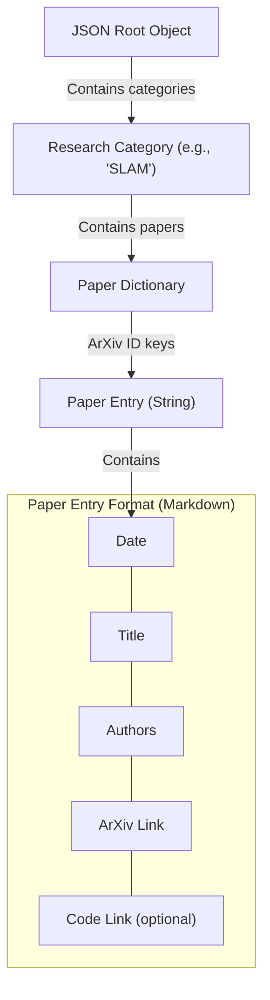
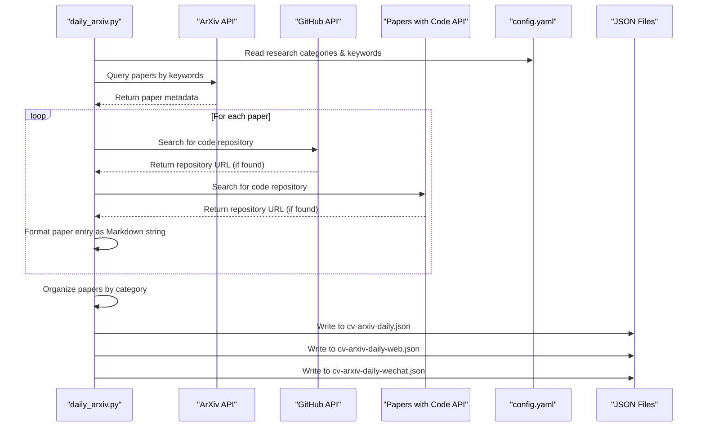
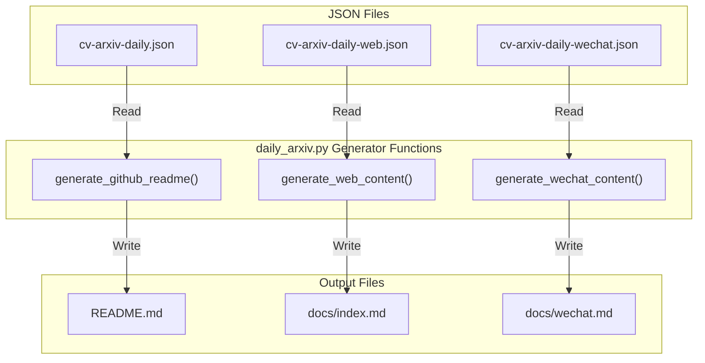

# JSON Data Structures

<details>
<summary>Relevant source files</summary>

The following files were used as context for generating this wiki page:

- [docs/cv-arxiv-daily-web.json](docs/cv-arxiv-daily-web.json)
- [docs/cv-arxiv-daily-wechat.json](docs/cv-arxiv-daily-wechat.json)
- [docs/cv-arxiv-daily.json](docs/cv-arxiv-daily.json)

</details>


## Purpose and Scope

This document provides detailed information about the JSON data structures used in the CV-ArXiv-Daily system for storing and transmitting paper data. These JSON files serve as intermediaries between the data collection process and the various output formats, providing a persistent and structured representation of the collected computer vision research papers.

For information about how this data is displayed in various formats, see [Output Formats](#3), and for details on the data collection process, see [Core Processing Engine](#2.1).

## Overview of JSON Files

The CV-ArXiv-Daily system uses three primary JSON files to store paper data in different formats optimized for specific publishing targets:

| JSON File | Purpose | Target |
|-----------|---------|--------|
| cv-arxiv-daily.json | Main repository data store | GitHub README |
| cv-arxiv-daily-web.json | Optimized for web display | Jekyll website |
| cv-arxiv-daily-wechat.json | Formatted for mobile sharing | WeChat content |

Sources: [docs/cv-arxiv-daily-web.json](), [docs/cv-arxiv-daily.json]()

## JSON File Relationships

The following diagram illustrates how the JSON files fit into the overall data flow of the system:



Sources: [docs/cv-arxiv-daily-web.json](), [docs/cv-arxiv-daily.json]()

## JSON Structure

The JSON files follow a hierarchical structure organized by research categories. Each file contains papers categorized by research area, with unique arXiv IDs as keys for individual paper entries.

```mermaid
classDiagram
    class "JSON Root Object" {
        +ResearchCategory categories
    }
    
    class "ResearchCategory" {
        +PaperEntry papers
    }
    
    class "PaperEntry" {
        +String arXivID
        +String formattedMarkdown
    }
    
    "JSON Root Object" --> "ResearchCategory" : contains
    "ResearchCategory" --> "PaperEntry" : contains
    
    note for "JSON Root Object" "Example: {\"SLAM\": {...}, \"NeRF\": {...}}"
    note for "ResearchCategory" "Example: \"SLAM\": {\"2110.07546\": \"...\", \"2110.06541\": \"...\"}"
    note for "PaperEntry" "Example: \"2110.07546\": \"|**2021-10-14**|**Title**|Authors|[link](url)|[code](url)|\""
```

Sources: [docs/cv-arxiv-daily-web.json](), [docs/cv-arxiv-daily.json]()

## Detailed JSON Schema

The actual content structure of the JSON files is as follows:



Sources: [docs/cv-arxiv-daily-web.json](), [docs/cv-arxiv-daily.json]()

## Example JSON Structure

Here's a simplified representation of the JSON structure:

```
{
  "SLAM": {
    "2110.07546": "|**2021-10-14**|**Active SLAM over Continuous Trajectory...**|Shumon Koga et.al.|[2110.07546](http://arxiv.org/abs/2110.07546)|null|",
    "2110.06541": "|**2021-10-13**|**Collaborative Radio SLAM for Multiple Robots...**|Ran Liu et.al.|[2110.06541](http://arxiv.org/abs/2110.06541)|null|",
    ...
  },
  "NeRF": {
    "2203.xxxxx": "|**2022-03-xx**|**Paper Title**|Authors|[ID](link)|[code](code-link)|",
    ...
  },
  ...
}
```

Sources: [docs/cv-arxiv-daily-web.json](), [docs/cv-arxiv-daily.json]()

## Paper Entry Format

Each paper entry in the JSON is stored as a string formatted as a Markdown table row. The format is:

```
|**YYYY-MM-DD**|**Paper Title**|Author Names|[arXiv ID](arXiv URL)|[link](code repository URL or null)|
```

This pre-formatted string allows for easy insertion into the Markdown outputs (README.md, index.md, wechat.md) without needing additional processing.

Sources: [docs/cv-arxiv-daily-web.json](), [docs/cv-arxiv-daily.json]()

## Differences Between JSON Files

While the three JSON files share the same basic structure, they contain slight differences optimized for their target platforms:

1. **cv-arxiv-daily.json**: The primary data store with complete paper information for the GitHub README.

2. **cv-arxiv-daily-web.json**: Optimized for the Jekyll website, may contain additional formatting or metadata suitable for web display.

3. **cv-arxiv-daily-wechat.json**: Formatted specifically for WeChat sharing, potentially with shorter entries or modified content to suit mobile display and Chinese platform requirements.

Sources: [docs/cv-arxiv-daily-web.json](), [docs/cv-arxiv-daily.json]()

## JSON File Generation Process

The JSON files are generated by the core processing script `daily_arxiv.py` as part of the paper collection and processing pipeline:



Sources: [docs/cv-arxiv-daily-web.json](), [docs/cv-arxiv-daily.json]()

## Using the JSON Data

The JSON files serve multiple purposes within the system:

1. **Data Persistence**: They store collected paper data between runs, allowing for incremental updates.

2. **Data Separation**: They decouple the data collection process from the publishing process, making the system more maintainable.

3. **Multi-format Publishing**: They provide a source of truth for generating various output formats.

To access and manipulate the JSON data programmatically:

```python
import json

# Load JSON data
with open('docs/cv-arxiv-daily.json', 'r') as f:
    data = json.load(f)

# Access papers in a specific category
slam_papers = data.get('SLAM', {})

# Iterate through papers
for arxiv_id, paper_info in slam_papers.items():
    print(f"Paper ID: {arxiv_id}")
    print(f"Paper Info: {paper_info}")
```

Sources: [docs/cv-arxiv-daily-web.json](), [docs/cv-arxiv-daily.json]()

## Considerations for JSON Modifications

When working with or modifying the JSON files:

1. **Maintain Structure**: Preserve the hierarchical organization by research categories and arXiv IDs.

2. **String Format**: Paper entries are stored as pre-formatted Markdown strings - changes must maintain this format for compatibility with output generators.

3. **Unique IDs**: ArXiv IDs serve as unique identifiers - avoid duplicates within a category.

4. **Manual Edits**: While possible to edit JSON files directly, it's recommended to use the system's update mechanisms to ensure consistency across all outputs.

Sources: [docs/cv-arxiv-daily-web.json](), [docs/cv-arxiv-daily.json]()

## Integration with Output Generators

The JSON files are read by various components of the system to generate the different output formats:



The generator functions read the appropriate JSON file, extract and organize the papers by category, and format them into the target output format.

Sources: [docs/cv-arxiv-daily-web.json](), [docs/cv-arxiv-daily.json]()

## Conclusion

The JSON data structures serve as a critical intermediate data storage mechanism in the CV-ArXiv-Daily system, bridging the gap between data collection and presentation. By maintaining a structured and consistent format, they enable the system to efficiently generate multiple output formats while providing a persistent record of collected paper information.

Sources: [docs/cv-arxiv-daily-web.json](), [docs/cv-arxiv-daily.json]()

---