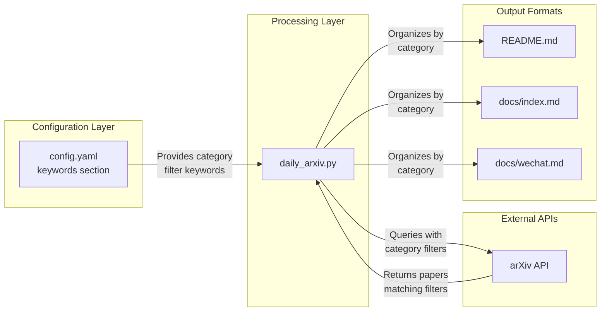
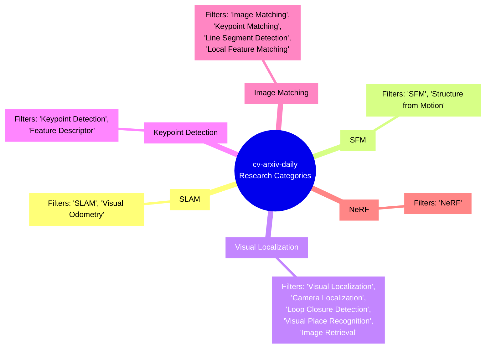
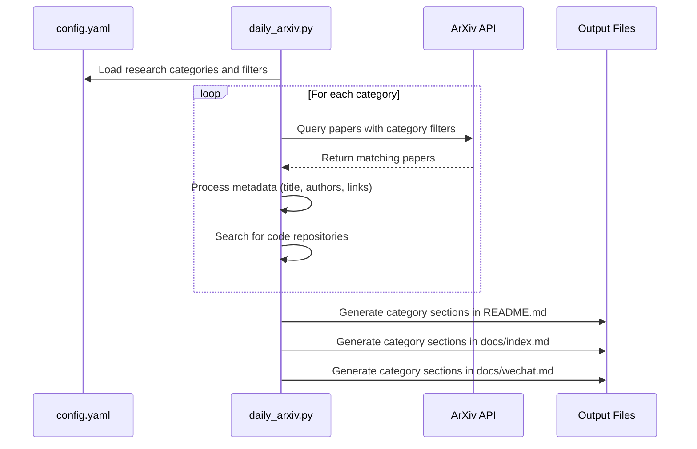
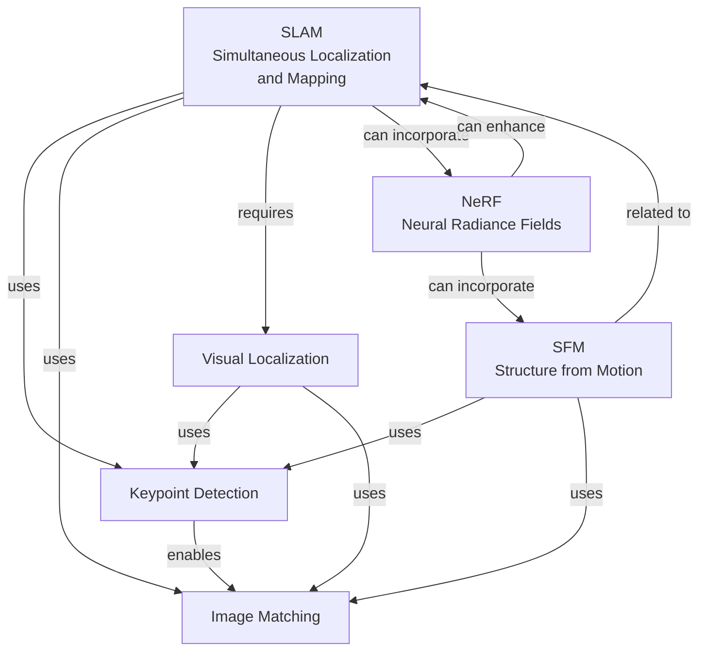

# Research Categories

<details>
<summary>Relevant source files</summary>

The following files were used as context for generating this wiki page:

- [config.yaml](config.yaml)
- [docs/_config.yml](docs/_config.yml)
- [docs/index.md](docs/index.md)
- [docs/wechat.md](docs/wechat.md)
- [requirements.txt](requirements.txt)

</details>


This page documents the primary computer vision research categories that the CV-ArXiv-Daily system tracks and organizes. These categories form the backbone of the paper collection and filtering system, determining which papers from arXiv are displayed in the daily updates. For information about the overall system architecture, see [System Architecture](#2).

## Category Configuration and Implementation

The CV-ArXiv-Daily system is configured to automatically track papers from specific research areas through a filter-based mechanism defined in the configuration file. Each research category is associated with specific keyword filters that identify relevant papers from the arXiv feed.



Sources: [config.yaml:23-39](), [docs/index.md:8-57]()

## Current Research Categories

The system currently tracks six primary research areas in computer vision, defined in the configuration file:



Sources: [config.yaml:23-39]()

### Category Details and Research Focus

Below is a detailed description of each research category along with its filter keywords and research focus:

| Category | Filter Keywords | Research Focus | Applications |
|----------|----------------|----------------|-------------|
| **SLAM** | SLAM, Visual Odometry | Simultaneous Localization and Mapping techniques | Robotics, Autonomous Vehicles, AR/VR |
| **SFM** | SFM, Structure from Motion | 3D reconstruction from 2D image sequences | 3D Modeling, Cultural Heritage, Drone Mapping |
| **Visual Localization** | Visual Localization, Camera Localization, Camera Re-localisation, Loop Closure Detection, Visual Place Recognition, Image Retrieval | Determining the position and orientation of a camera | Navigation Systems, AR/VR, Robotics |
| **Keypoint Detection** | Keypoint Detection, Feature Descriptor | Identifying distinctive points in images | Object Recognition, Image Matching |
| **Image Matching** | Image Matching, Keypoint Matching, Line Segment Detection, Local Feature Matching | Finding correspondences between different images | Panorama Stitching, Visual Odometry |
| **NeRF** | NeRF | Neural Radiance Fields for novel view synthesis | 3D Scene Reconstruction, Novel View Generation |

Sources: [config.yaml:23-39](), [docs/index.md:8-210](), [docs/wechat.md:20-127]()

## Category Implementation Details

### Configuration Structure

The research categories are defined in the `config.yaml` file as shown below:

```yaml
keywords:
    "SLAM": 
        filters: ["SLAM", "Visual Odometry"]
    "SFM":
        filters: ["SFM", "Structure from Motion"]
    "Visual Localization":
        filters: ["Visual Localization","Camera Localization",
                  "Camera Re-localisation","Loop Closure Detection",
                  "visual place recognition","image retrieval"]
    "Keypoint Detection":
        filters: ["Keypoint Detection", "Feature Descriptor"]
    "Image Matching":
        filters: ["Image Matching", "Keypoint Matching", 
                  "Line Segment Detection", "Local Feature Matching"]
    "NeRF":
        filters: ["NeRF"]
```

Sources: [config.yaml:23-39]()

### Paper Categorization Process

The `daily_arxiv.py` script uses the configured categories and their associated filters to query the arXiv API. Papers are then organized by category in the output files:



Sources: [docs/index.md:8-210](), [docs/wechat.md:10-18]()

## Output Format Examples

Each research category appears as a section in the output formats with papers listed chronologically. Below is an example of how SLAM papers are displayed in the output:

### README and Jekyll Website Format

```
## SLAM

| Publish Date | Title | Authors | PDF | Code |
|:---------|:-----------------------|:---------|:------|:------|
|**2025-04-16**|**An Online Adaptation Method for Robust Depth Estimation and Visual Odometry in the Open World**|Xingwu Ji et.al.|[2504.11698](http://arxiv.org/abs/2504.11698)|**[link](https://github.com/jixingwu/sol-slam)**|
|**2025-04-18**|**Doppler-SLAM: Doppler-Aided Radar-Inertial and LiDAR-Inertial Simultaneous Localization and Mapping**|Dong Wang et.al.|[2504.11634](http://arxiv.org/abs/2504.11634)|**[link](https://github.com/wayne-dwa/doppler-slam)**|
```

### WeChat Format

```
## SLAM

- 2022-11-30, **MVRackLay: Monocular Multi-View Layout Estimation for Warehouse Racks and Shelves**, Pranjali Pathre et.al., Paper: [http://arxiv.org/abs/2211.16882v1](http://arxiv.org/abs/2211.16882v1)
- 2022-11-29, **PatchMatch-Stereo-Panorama, a fast dense reconstruction from 360° video images**, Hartmut Surmann et.al., Paper: [http://arxiv.org/abs/2211.16266v1](http://arxiv.org/abs/2211.16266v1), Code: **[https://github.com/roblabwh/patchmatch](https://github.com/roblabwh/patchmatch)**
```

Sources: [docs/index.md:8-47](), [docs/wechat.md:20-27]()

## Extending Research Categories

The system can be extended to include additional research categories by modifying the `config.yaml` file. To add a new category:

1. Open the `config.yaml` file
2. Add a new entry to the `keywords` section
3. Define the category name and its associated filter keywords

Example for adding a "3D Reconstruction" category:

```yaml
keywords:
    # Existing categories...
    "3D Reconstruction":
        filters: ["3D Reconstruction", "Point Cloud", "Mesh Generation"]
```

After updating the configuration, the system will automatically include the new category when it next runs, fetching relevant papers that match the specified filter keywords.

Sources: [config.yaml:23-39]()

## Research Category Relationships

The research categories tracked by CV-ArXiv-Daily have significant overlap and relationships. The diagram below illustrates these connections:



Sources: [docs/index.md:8-210](), [docs/wechat.md:10-18]()

## Summary

The Research Categories configuration is a central component of the CV-ArXiv-Daily system, allowing it to systematically track and organize the latest research in key computer vision areas. By modifying the category filters in the `config.yaml` file, users can tailor the system to focus on specific research interests or expand to cover additional domains within computer vision.

---