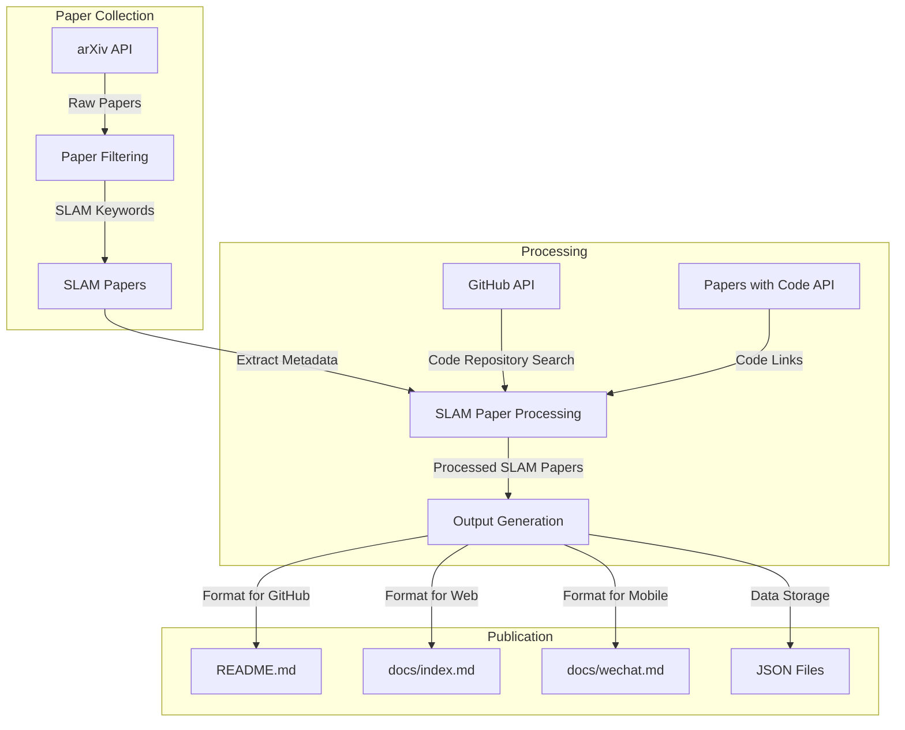
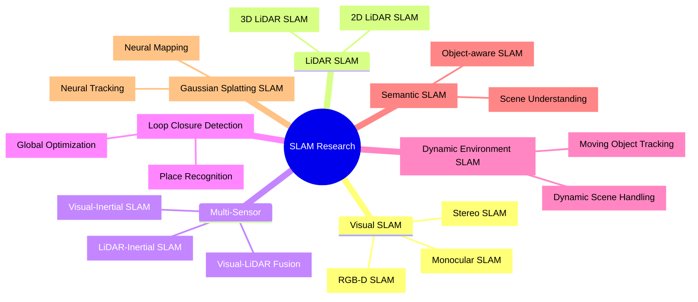
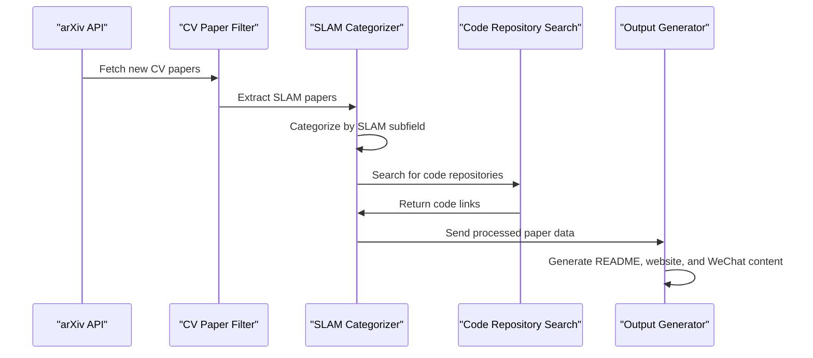
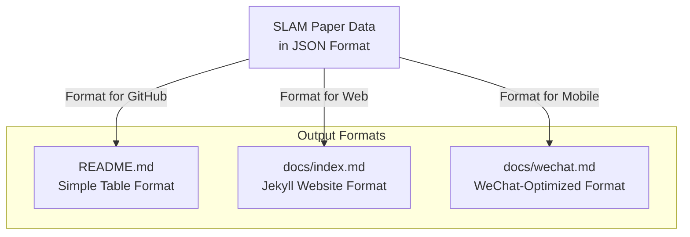
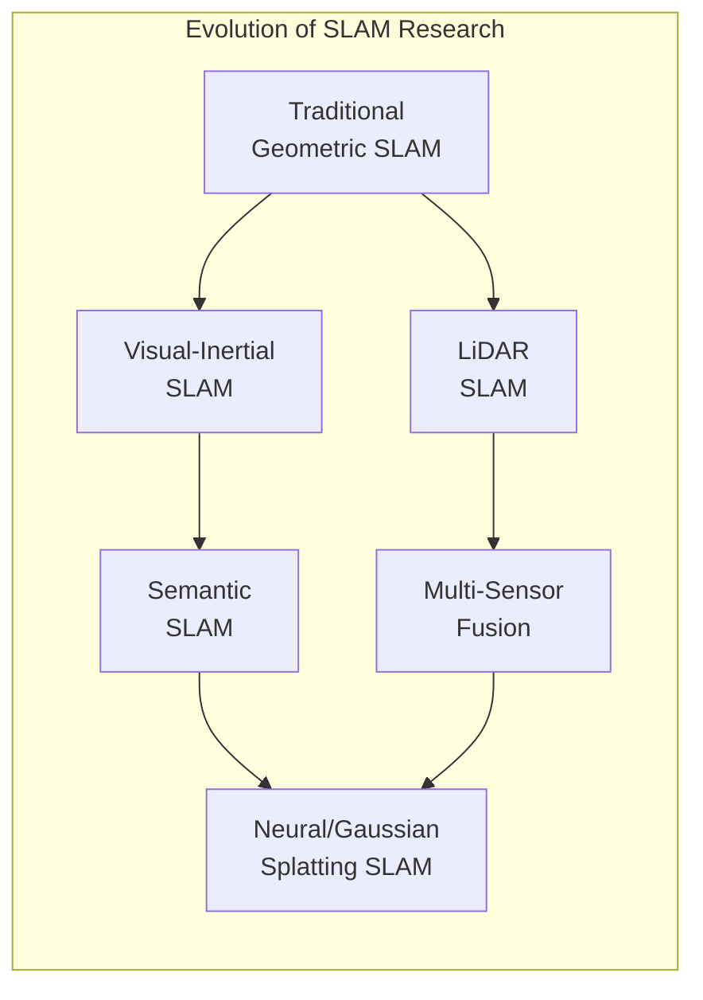
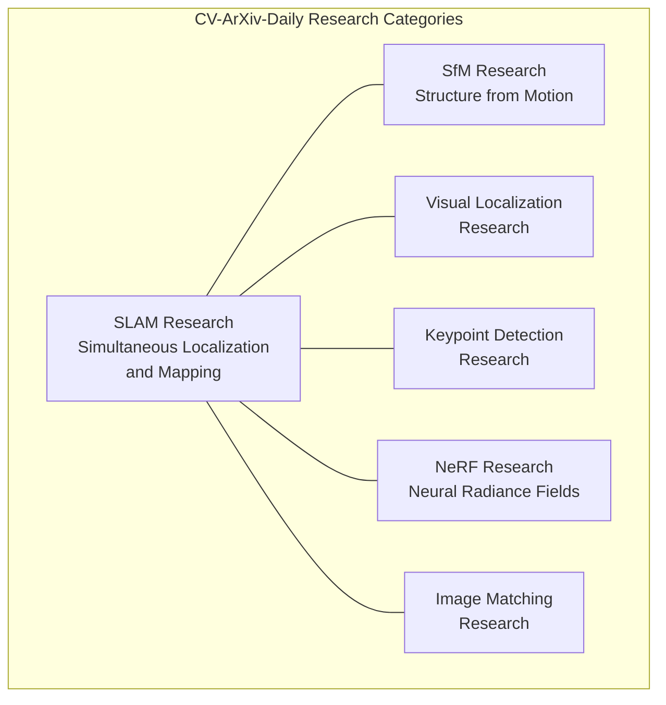

# SLAM Research

<details>
<summary>Relevant source files</summary>

The following files were used as context for generating this wiki page:

- [docs/_config.yml](docs/_config.yml)
- [docs/index.md](docs/index.md)
- [docs/wechat.md](docs/wechat.md)

</details>


## Purpose and Scope

This document provides a detailed overview of how the cv-arxiv-daily system collects, processes, and presents research papers related to Simultaneous Localization and Mapping (SLAM). SLAM is a critical computer vision research area that enables systems to build maps of unknown environments while simultaneously tracking their location within those maps. This page explains how SLAM research is categorized within the system, how papers are collected, and how they are presented across different output formats.

For information about related computer vision topics like Structure from Motion (SfM), please see [Other Computer Vision Topics](#4.2).

## Overview of SLAM in CV-ArXiv-Daily

The cv-arxiv-daily system identifies and categorizes SLAM research papers as part of its daily collection of computer vision papers from arXiv. SLAM represents one of the major research categories monitored by the system, alongside other areas like SFM, Visual Localization, Keypoint Detection, Image Matching, and NeRF.

### SLAM in the System Architecture



Sources: [daily_arxiv.py](), [docs/index.md:8-374]()

## SLAM Research Categories

The system collects SLAM papers across various sub-domains, reflecting the diversity of current research in this field. Based on the papers collected, the following categories represent the major research directions in SLAM.



Sources: [docs/index.md:8-374](), [docs/wechat.md:20-294]()

## SLAM Paper Collection Process

The cv-arxiv-daily system uses a set of predefined keywords to identify and filter SLAM-related papers from arXiv. This automated process runs on a scheduled basis via GitHub Actions.

### Keyword Filtering

Papers are identified as SLAM research if their titles, abstracts, or categories match specific SLAM-related keywords. Common keywords include:

- "SLAM"
- "Simultaneous Localization and Mapping"
- "Visual Odometry"
- "Loop Closure"
- "Mapping and Localization"

### Paper Processing Pipeline



Sources: [daily_arxiv.py]()

## SLAM Paper Presentation

SLAM papers are presented in three main formats within the cv-arxiv-daily system:

### 1. GitHub README

SLAM papers are listed in a table format in the main README.md file of the repository, providing a quick overview of recent SLAM research.

### 2. Jekyll Website

The Jekyll-powered website (docs/index.md) displays SLAM papers in a more detailed format, with the following structure:

| Field | Description |
|-------|-------------|
| Publish Date | Date the paper was published on arXiv |
| Title | Full title of the SLAM paper |
| Authors | List of paper authors |
| PDF | Link to the paper PDF on arXiv |
| Code | Link to associated code repository (if available) |

Example from the website:

```
## SLAM

| Publish Date | Title | Authors | PDF | Code |
|:---------|:-----------------------|:---------|:------|:------|
|**2025-04-16**|**An Online Adaptation Method for Robust Depth Estimation and Visual Odometry in the Open World**|Xingwu Ji et.al.|[2504.11698](http://arxiv.org/abs/2504.11698)|**[link](https://github.com/jixingwu/sol-slam)**|
|**2025-04-18**|**Doppler-SLAM: Doppler-Aided Radar-Inertial and LiDAR-Inertial Simultaneous Localization and Mapping**|Dong Wang et.al.|[2504.11634](http://arxiv.org/abs/2504.11634)|**[link](https://github.com/wayne-dwa/doppler-slam)**|
```

### 3. WeChat Format

The system also generates WeChat-optimized content (docs/wechat.md) for sharing SLAM papers on mobile platforms and social media.



Sources: [docs/index.md:8-374](), [docs/wechat.md:20-294]()

## Recent Trends in SLAM Research

Based on the papers collected by the system, several trends in SLAM research can be identified:

### Current Research Focus Areas

1. **Neural SLAM and Gaussian Splatting SLAM**: Integration of neural networks and Gaussian splatting techniques for more accurate and dense mapping
   - Examples: "VINGS-Mono: Visual-Inertial Gaussian Splatting Monocular SLAM", "MonoGS++: Fast and Accurate Monocular RGB Gaussian SLAM"

2. **Dynamic Environment Handling**: Techniques for SLAM in environments with moving objects
   - Examples: "GARAD-SLAM: 3D GAussian splatting for Real-time Anti Dynamic SLAM", "DGS-SLAM: Gaussian Splatting SLAM in Dynamic Environment"

3. **Multi-Sensor Fusion**: Combining data from different sensors for more robust SLAM
   - Examples: "LiV-GS: LiDAR-Vision Integration for 3D Gaussian Splatting SLAM in Outdoor Environments", "FAST-LIVO2: Fast, Direct LiDAR-Inertial-Visual Odometry"

4. **Semantic Integration**: Incorporating semantic understanding into SLAM systems
   - Examples: "OpenGS-SLAM: Open-Set Dense Semantic SLAM with 3D Gaussian Splatting for Object-Level Scene Understanding", "Hi-SLAM: Scaling-up Semantics in SLAM with a Hierarchically Categorical Gaussian Splatting"



Sources: [docs/index.md:8-50]()

## Integration with Other System Components

SLAM research is one of several research categories within the cv-arxiv-daily system. It interacts with other components as follows:

### Relationship to Other Research Categories

SLAM has close connections to other computer vision topics monitored by the system:

1. **Structure from Motion (SfM)**: Many techniques overlap between SLAM and SfM, particularly in the areas of feature matching and pose estimation.

2. **Visual Localization**: Visual place recognition and camera relocalization are important components of SLAM systems, especially for loop closure.

3. **Keypoint Detection**: Feature extraction and matching are fundamental to many SLAM approaches.

4. **NeRF (Neural Radiance Fields)**: Recent research explores the integration of NeRF with SLAM for dense scene reconstruction.



Sources: [docs/index.md:8-10](), [docs/wechat.md:10-16]()

## Conclusion

SLAM research represents a significant portion of the papers collected by the cv-arxiv-daily system. Through automated filtering and processing, the system provides up-to-date information on SLAM advances across multiple output formats. The collected papers reflect the diverse and evolving nature of SLAM research, from traditional geometric approaches to emerging neural-based and Gaussian splatting techniques.

The system's ability to identify and categorize SLAM papers, along with linking to their associated code repositories, makes it a valuable resource for researchers and practitioners in the field of visual SLAM and robotics.

---