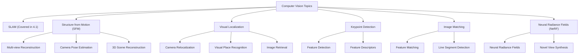
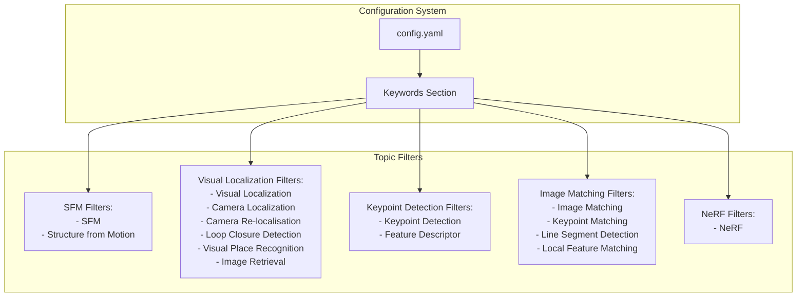
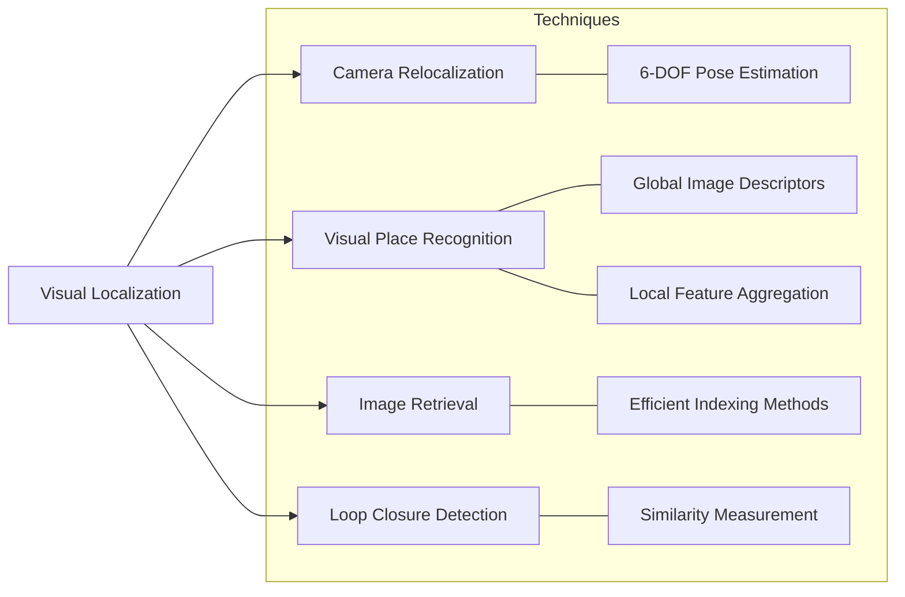
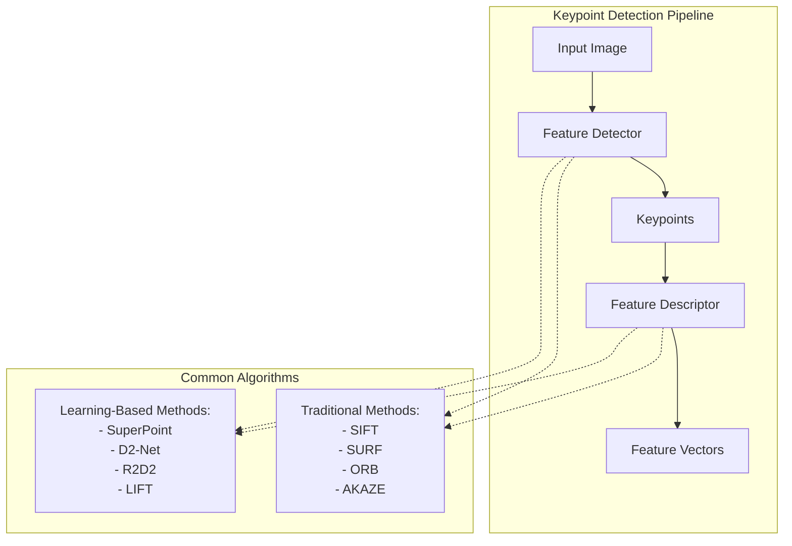
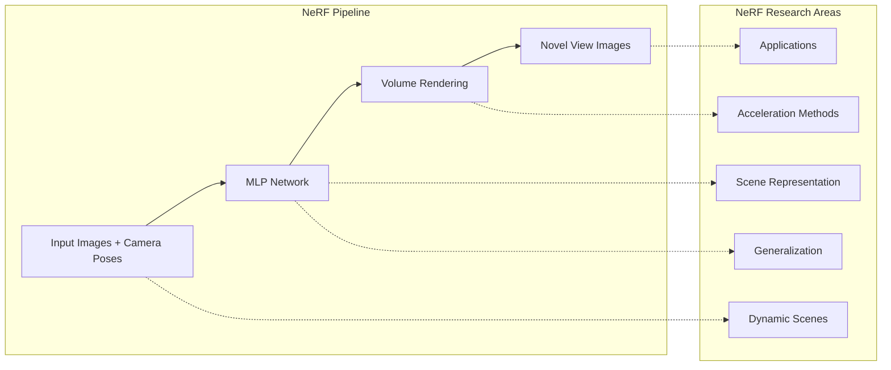
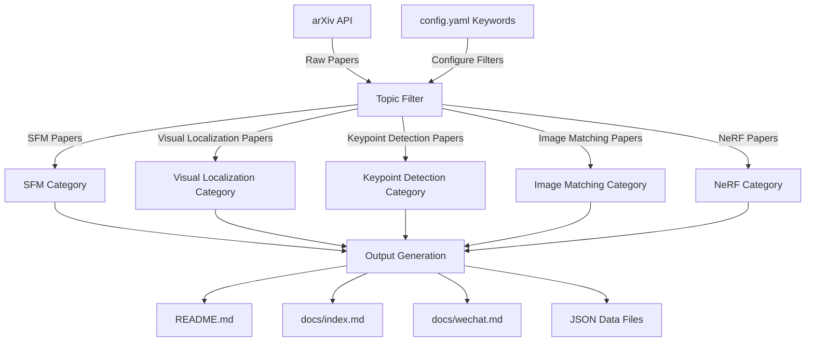
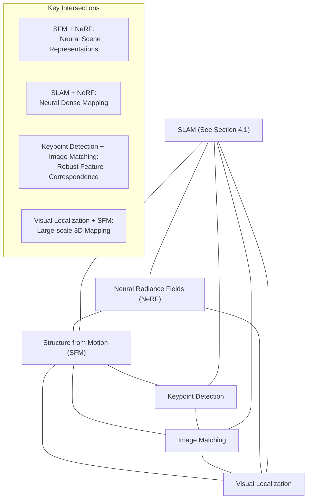

# Other Computer Vision Topics

Relevant source files

The following files were used as context for generating this wiki page:

- [config.yaml](config.yaml)
- [docs/wechat.md](docs/wechat.md)
- [requirements.txt](requirements.txt)

This page documents the computer vision research areas tracked by the cv-arxiv-daily system beyond SLAM (which is covered in [SLAM Research](#4.1)). These include Structure from Motion (SFM), Visual Localization, Keypoint Detection, Image Matching, and Neural Radiance Fields (NeRF). We explain how each topic is configured and processed within the system architecture.

## Computer Vision Topics Overview

The cv-arxiv-daily system is configured to track several important computer vision research areas through keyword-based filtering of arXiv papers. While SLAM is a major focus, the system also monitors papers in several other significant computer vision domains.

Sources: [config.yaml:24-39](), [docs/wechat.md:10-16]()

## Topic Configuration in the System

Each computer vision topic is configured in the system's `config.yaml` file with specific keyword filters that determine which papers will be collected from arXiv.

Sources: [config.yaml:24-39]()

## Structure from Motion (SFM)

Structure from Motion (SFM) is a technique for estimating three-dimensional structures from two-dimensional image sequences. It simultaneously recovers camera motion and 3D scene structure from a sequence of images.

### Key Aspects of SFM Research

| Aspect | Description |
|--------|-------------|
| Multi-view Reconstruction | Reconstructing 3D scenes from multiple camera viewpoints |
| Camera Pose Estimation | Determining camera positions and orientations in 3D space |
| Feature Matching | Identifying corresponding points between images |
| Bundle Adjustment | Refining camera and structure parameters jointly |
| Dense Reconstruction | Creating detailed 3D models from sparse point clouds |

### SFM in the System Architecture

SFM papers are identified using the filters "SFM" and "Structure from Motion" as configured in the `config.yaml` file. The system collects papers matching these keywords and organizes them in the various output formats (GitHub README, Jekyll website, and WeChat content).

Sources: [config.yaml:27-28](), [docs/wechat.md:297-335]()

## Visual Localization

Visual Localization refers to the problem of determining the position and orientation of a camera within a known environment using visual information. It's a fundamental capability for many applications including augmented reality, autonomous navigation, and robotics.

### Visual Localization Components

Sources: [config.yaml:29-32](), [docs/wechat.md:12]()

### Visual Localization Research Focus

| Component | Research Areas |
|-----------|---------------|
| Camera Relocalization | Absolute pose regression, scene coordinate regression, feature-based localization |
| Visual Place Recognition | Learning-based descriptors, sequence-based matching, invariant representations |
| Image Retrieval | Efficient search algorithms, embedding spaces, hierarchical methods |
| Loop Closure Detection | Real-time recognition, invariance to viewpoint and appearance changes |

Sources: [config.yaml:29-32](), [docs/wechat.md:12]()

## Keypoint Detection

Keypoint detection focuses on identifying distinctive points in images that are invariant to changes in scale, rotation, and illumination. These keypoints serve as the foundation for many computer vision tasks, including image matching, object recognition, and tracking.

### Keypoint Detection Process

Sources: [config.yaml:33-34](), [docs/wechat.md:14]()

## Image Matching

Image matching is the process of finding corresponding points or regions between different images of the same scene. It's a crucial component in many computer vision applications including panorama stitching, 3D reconstruction, and object tracking.

### Image Matching Techniques

| Technique | Description |
|-----------|-------------|
| Feature-based Matching | Uses keypoints and descriptors to find correspondences between images |
| Direct Methods | Works directly with pixel intensities without extracting features |
| Line Segment Detection | Identifies and matches linear structures in images |
| Semantic Matching | Incorporates semantic understanding for more robust matching |
| Deep Learning Approaches | Uses neural networks to learn correspondences end-to-end |

### Image Matching in the System

The system tracks research in image matching using filters including "Image Matching," "Keypoint Matching," "Line Segment Detection," and "Local Feature Matching" as defined in the configuration file.

Sources: [config.yaml:35-37](), [docs/wechat.md:15]()

## Neural Radiance Fields (NeRF)

Neural Radiance Fields (NeRF) is a relatively recent but rapidly evolving technique for view synthesis and scene representation. NeRF represents a scene as a continuous volumetric function using a neural network that maps from spatial coordinates to color and density values.

### NeRF Architecture and Components

Sources: [config.yaml:38-39](), [docs/wechat.md:16]()

### NeRF Research Directions

| Research Direction | Description |
|--------------------|-------------|
| Efficiency Improvements | Faster training and rendering through various acceleration techniques |
| Dynamic Scene Modeling | Extending NeRF to handle non-static scenes and objects |
| Generalization | Enabling NeRF to work on new scenes without per-scene optimization |
| Compositional Approaches | Representing scenes as compositions of separate NeRF models |
| Integration with Other Methods | Combining NeRF with SLAM, SFM, and other vision techniques |

Sources: [config.yaml:38-39](), [docs/wechat.md:16]()

## Data Flow for Other CV Topics

This diagram illustrates how papers related to these computer vision topics flow through the cv-arxiv-daily system.

Sources: [config.yaml:14-21](), [config.yaml:24-39]()

## Topic Relationships and Research Intersections

The computer vision topics tracked by the system are not isolated but highly interconnected. This diagram shows the key relationships and dependencies between them.

Sources: [docs/wechat.md:10-16](), [config.yaml:24-39]()

## Conclusion

The cv-arxiv-daily system provides comprehensive coverage of important computer vision topics beyond SLAM. By tracking papers in Structure from Motion, Visual Localization, Keypoint Detection, Image Matching, and NeRF, the system offers researchers and practitioners a valuable resource for staying updated on the latest developments in these interconnected fields. The modular configuration system allows for easy adjustment of the filters used for each topic, ensuring that the most relevant papers are captured and organized in the various output formats.

---