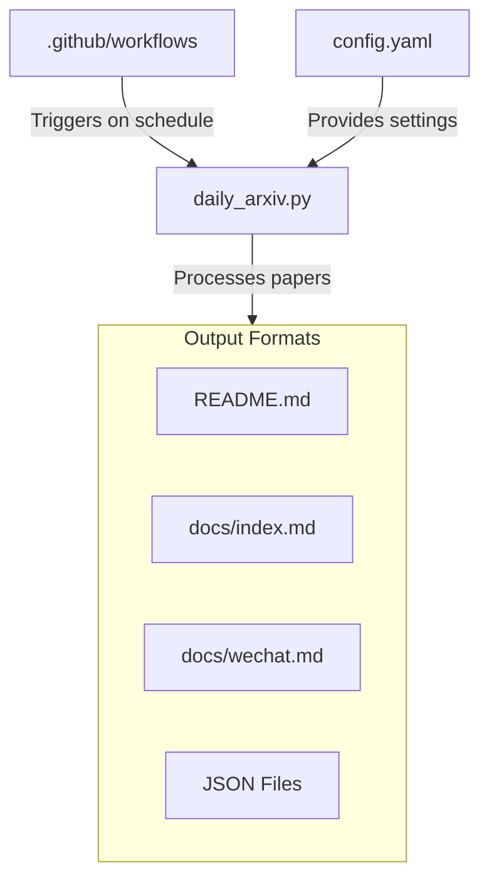
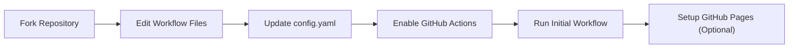
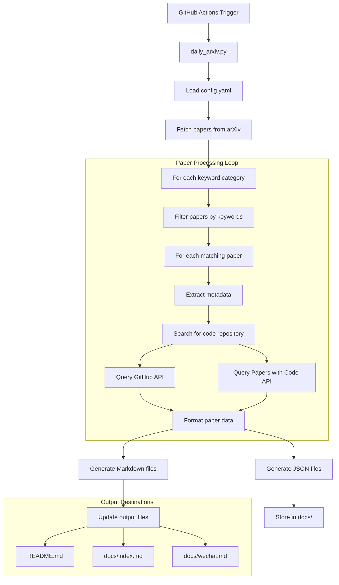
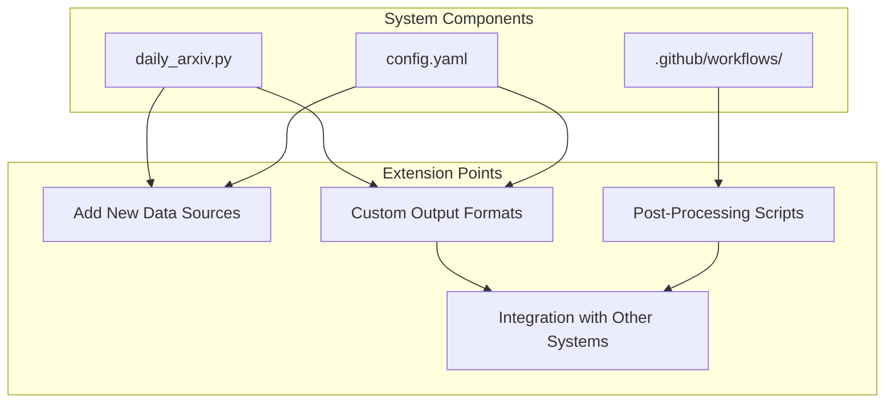

# Usage Guide

<details>
<summary>Relevant source files</summary>

The following files were used as context for generating this wiki page:

- [README.md](README.md)
- [config.yaml](config.yaml)
- [docs/README.md](docs/README.md)
- [requirements.txt](requirements.txt)

</details>


This document provides comprehensive instructions for using, customizing, and extending the CV-ArXiv-Daily system. This guide covers the setup process, configuration options, and typical workflows for managing your own automated computer vision paper collection. For information on the system architecture, see [System Architecture](#2).

## 1. System Overview

CV-ArXiv-Daily is a tool that automatically collects, processes, and publishes computer vision research papers from arXiv based on user-defined keywords. It runs on GitHub Actions and generates outputs in multiple formats:

1. GitHub README.md - For repository viewers
2. Jekyll website - Through GitHub Pages
3. WeChat content - For sharing on social platforms

The system features automatic code repository detection for papers and customizable filtering by research area.



Sources: [docs/README.md:10-18](), [config.yaml:1-13]()

## 2. Setup Process

Setting up your own instance of CV-ArXiv-Daily requires a few simple steps.

### 2.1 Fork and Configure the Repository

1. Fork the [original repository](https://github.com/Vincentqyw/cv-arxiv-daily)
2. Update GitHub configuration files:
   - Edit `GITHUB_USER_NAME` and `GITHUB_USER_EMAIL` in the GitHub Actions workflow files
   - Change `user_name` in `config.yaml` to your GitHub username



Sources: [docs/README.md:19-38]()

### 2.2 Configure GitHub Actions

1. In your forked repository, go to **Settings** → **Actions** → **Workflow permissions**
2. Select **Read and write permissions** and save
3. Navigate to the **Actions** tab
4. Click **"I understand my workflows, go ahead and enable them"**
5. Enable both workflow files:
   - **Run Arxiv Papers Daily**
   - **Run Update Paper Links Weekly**
6. Run both workflows manually to initialize your paper collection

Sources: [docs/README.md:29-37]()

### 2.3 Setup GitHub Pages (Optional)

For a web interface to your paper collection:

1. Go to **Settings** → **Pages**
2. For **Source**, select **Deploy from a branch**
3. Select **main** branch and **/docs** folder
4. Click **Save**
5. Your site will be available at `https://[your-username].github.io/cv-arxiv-daily`

Sources: [docs/README.md:38-41]()

## 3. Configuration Options

The system behavior is controlled through the `config.yaml` file, which allows you to customize various aspects of the paper collection process.

### 3.1 Basic Settings

| Setting | Description | Default |
|---------|-------------|---------|
| `base_url` | API endpoint for ArXiv papers with code | "https://arxiv.paperswithcode.com/api/v0/papers/" |
| `user_name` | Your GitHub username | "Vincentqyw" |
| `repo_name` | Repository name | "cv-arxiv-daily" |
| `show_authors` | Display paper authors | True |
| `show_links` | Display paper links | True |
| `show_badge` | Display badges | True |
| `max_results` | Maximum papers per keyword | 10 |

Sources: [config.yaml:1-8]()

### 3.2 Output Configuration

| Setting | Description | Default |
|---------|-------------|---------|
| `publish_readme` | Generate GitHub README | True |
| `publish_gitpage` | Generate Jekyll website | True |
| `publish_wechat` | Generate WeChat content | False |

Sources: [config.yaml:10-12]()

### 3.3 File Paths

The system uses several file paths for storing and displaying data:

| File Type | GitHub README | Jekyll Website | WeChat Content |
|-----------|---------------|----------------|----------------|
| JSON Data | `./docs/cv-arxiv-daily.json` | `./docs/cv-arxiv-daily-web.json` | `./docs/cv-arxiv-daily-wechat.json` |
| Markdown | `README.md` | `./docs/index.md` | `./docs/wechat.md` |

Sources: [config.yaml:14-21]()

### 3.4 Keywords and Filters

The most important configuration section is `keywords`, which defines what papers to collect and how to categorize them:

```yaml
keywords:
    "SLAM": 
        filters: ["SLAM", "Visual Odometry"]
    "SFM":
        filters: ["SFM", "Structure from Motion"]
    "Visual Localization":
        filters: ["Visual Localization","Camera Localization",
                  "Camera Re-localisation","Loop Closure Detection",
                  "visual place recognition","image retrieval"]
    # More categories...
```

Each category (e.g., "SLAM") becomes a section in the output, and the `filters` array specifies keywords to search for when collecting papers.

Sources: [config.yaml:23-39]()

## 4. Data Processing Workflow

The `daily_arxiv.py` script is the core component that processes papers according to your configuration.



Sources: [docs/README.md:16-17](), [config.yaml:1-39]()

## 5. Customizing Paper Collection

### 5.1 Modifying Research Keywords

To customize the papers collected, edit the `keywords` section in `config.yaml`:

1. Add new research areas by adding new top-level keys
2. Add or modify filters under each research area
3. Commit and push your changes
4. Manually run the GitHub Actions workflow to update your collection

Example: Adding a new research area for "3D Reconstruction":

```yaml
keywords:
    # Existing categories...
    "3D Reconstruction":
        filters: ["3D Reconstruction", "Multi-View Stereo", "Photogrammetry"]
```

Sources: [config.yaml:23-39](), [docs/README.md:42-44]()

### 5.2 Adjusting Output Settings

To modify how papers are displayed and where:

1. Change `max_results` to control how many papers are shown per category
2. Toggle `publish_readme`, `publish_gitpage`, and `publish_wechat` to enable/disable different output formats
3. Modify the display options with `show_authors`, `show_links`, and `show_badge`

Sources: [config.yaml:5-12]()

### 5.3 Customizing Update Frequency

The system is configured to run every 5 days by default. To modify this:

1. Edit the GitHub Actions workflow file at `.github/workflows/cv-arxiv-daily.yml`
2. Modify the `schedule` section with a different cron expression
3. Commit and push your changes

Sources: [docs/README.md:29-30]()

## 6. Running and Maintaining the System

### 6.1 Manual Updates

To manually trigger paper collection:

1. Go to the **Actions** tab in your repository
2. Select the **Run Arxiv Papers Daily** workflow
3. Click **Run workflow** and select your branch (usually main)
4. Wait for the workflow to complete (typically 1-2 minutes)

Sources: [docs/README.md:32-37]()

### 6.2 Troubleshooting Common Issues

| Issue | Solution |
|-------|----------|
| Workflow not running | Ensure GitHub Actions is enabled and has proper permissions |
| No papers collected | Check your keywords and filters, ensure they match current arXiv terminology |
| Missing code links | The system tries to find code repositories automatically but may not find all of them |
| GitHub Pages not working | Verify your GitHub Pages settings in the repository settings |

Sources: [docs/README.md:29-37]()

### 6.3 Extending the System

For advanced users, the system can be extended by:

1. Modifying `daily_arxiv.py` to add new functionality
2. Creating custom post-processing scripts that work with the JSON output files
3. Integrating with other systems or databases
4. Adding support for additional paper sources



Sources: [docs/README.md:48-59]()

## 7. Advanced Usage

### 7.1 Working with JSON Data

The system stores all paper data in JSON files, which can be used for custom processing:

- `./docs/cv-arxiv-daily.json` - Data for the GitHub README
- `./docs/cv-arxiv-daily-web.json` - Data for the Jekyll website
- `./docs/cv-arxiv-daily-wechat.json` - Data for WeChat content

These files can be processed by custom scripts to generate additional visualizations, analyses, or integrations.

Sources: [config.yaml:14-16]()

### 7.2 Multi-Platform Publishing

By default, the system publishes to GitHub README and a Jekyll website. To enable WeChat publishing:

1. Set `publish_wechat: True` in `config.yaml`
2. Run the workflow to generate WeChat content
3. Access the formatted content in `docs/wechat.md`

Sources: [config.yaml:10-12](), [config.yaml:17-21]()

## Summary

The CV-ArXiv-Daily system provides an efficient way to automatically collect and publish computer vision research papers based on your interests. By following this guide, you can:

1. Set up your own instance of the system
2. Configure it to collect papers on specific research topics
3. Customize the output formats and display options
4. Extend the system with custom functionality

The automated workflow ensures your paper collection stays up-to-date with minimal maintenance, while the flexible configuration allows you to tailor it to your specific needs.

Sources: [docs/README.md:1-60](), [config.yaml:1-40]()

---