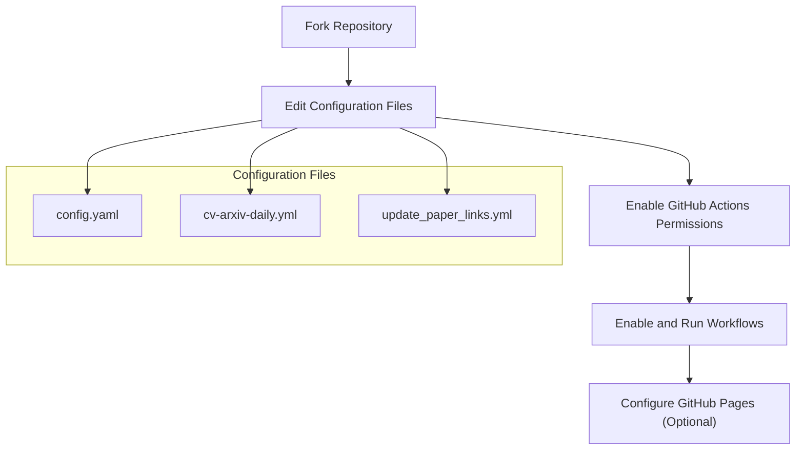
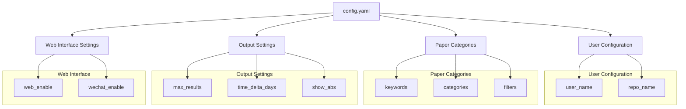
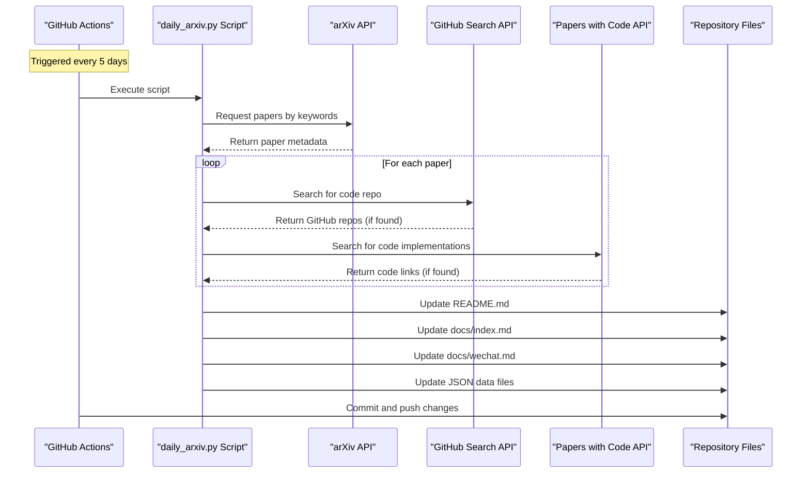
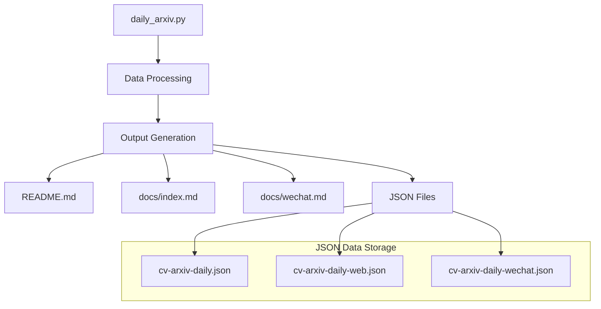

# Setup and Configuration

<details>
<summary>Relevant source files</summary>

The following files were used as context for generating this wiki page:

- [.github/workflows/cv-arxiv-daily.yml](.github/workflows/cv-arxiv-daily.yml)
- [README.md](README.md)
- [docs/README.md](docs/README.md)

</details>


This document provides step-by-step instructions for setting up your own instance of the CV-ArXiv-Daily system. You'll learn how to install, configure, and run the automated pipeline that collects computer vision papers from arXiv based on your research interests. For information about customizing specific research keywords, see [Customizing Research Keywords](#5.2).

## System Requirements

Before getting started, ensure your environment meets these requirements:

- GitHub account with repository creation permissions
- Basic understanding of GitHub Actions
- Internet access for GitHub Actions to fetch papers from arXiv API

No local setup is required as the system runs entirely on GitHub's infrastructure.

Sources: [.github/workflows/cv-arxiv-daily.yml:28-39]()

## Installation Process

Setting up CV-ArXiv-Daily involves forking the repository and configuring GitHub Actions. The following diagram illustrates the installation flow:



### Step 1: Fork the Repository

1. Navigate to the [CV-ArXiv-Daily repository](https://github.com/Vincentqyw/cv-arxiv-daily)
2. Click the "Fork" button in the top-right corner
3. Wait for GitHub to create a copy in your account

Sources: [docs/README.md:24]()

### Step 2: Edit Configuration Files

You need to modify several configuration files to personalize your instance:

1. Update GitHub Actions workflow files:
   - Edit `.github/workflows/cv-arxiv-daily.yml`:
     - Change `GITHUB_USER_NAME` and `GITHUB_USER_EMAIL` to your information
   - Edit `.github/workflows/update_paper_links.yml` (if present):
     - Change `GITHUB_USER_NAME` and `GITHUB_USER_EMAIL` to your information

2. Edit `config.yaml`:
   - Change `user_name` to your GitHub username

3. Commit and push your changes to your repository

Sources: [docs/README.md:25-28](), [.github/workflows/cv-arxiv-daily.yml:16-20]()

### Step 3: Configure GitHub Actions Permissions

1. Go to your repository's "Settings" tab
2. Navigate to "Actions" > "Workflow permissions"
3. Select "Read and write permissions"
4. Click "Save"

Sources: [docs/README.md:30-31]()

### Step 4: Enable and Run Workflows

1. Navigate to the "Actions" tab in your repository
2. Click "I understand my workflows, go ahead and enable them"
3. From the workflow list, select "Run Arxiv Papers Daily"
4. Click "Enable workflow" 
5. Click "Run workflow" and wait until the job completes (typically takes about 1 minute)
6. Repeat the same process for the "Run Update Paper Links Weekly" workflow if available

Sources: [docs/README.md:32-37]()

### Step 5: Configure GitHub Pages (Optional)

To enable the web interface for your paper collection:

1. Go to your repository's "Settings" tab
2. Navigate to "Pages"
3. Under "Build and deployment," select "Deploy from a branch"
4. Select "main" as your branch and "/docs" as the folder
5. Click "Save"
6. Once deployment is complete, your site will be available at `https://[your-github-username].github.io/cv-arxiv-daily`

Sources: [docs/README.md:38-41]()

## Configuration Options

The core configuration of the CV-ArXiv-Daily system is managed through the `config.yaml` file. This section details the available configuration options.



### Main Configuration Parameters

| Parameter | Description | Example |
|-----------|-------------|---------|
| `user_name` | Your GitHub username | `"Vincentqyw"` |
| `repo_name` | Repository name | `"cv-arxiv-daily"` |
| `max_results` | Maximum number of papers to fetch per category | `30` |
| `time_delta_days` | Number of days to look back for papers | `5` |
| `show_abs` | Whether to display paper abstracts | `false` |
| `web_enable` | Enable web interface output | `true` |
| `wechat_enable` | Enable WeChat format output | `true` |

### Research Categories and Keywords

The `keywords` section defines what papers to fetch, organized by research area:

```yaml
keywords:
  SLAM:
    - SLAM
    - Visual Localization
    - Visual Odometry
  SFM:
    - SFM
    - Structure from Motion
  # Additional categories...
```

Each category can have multiple keywords, and papers matching any of these keywords will be included in the corresponding section.

Sources: [docs/README.md:42-44]()

## GitHub Actions Automation

The CV-ArXiv-Daily system uses GitHub Actions to automate the paper collection process. The following diagram illustrates the workflow:



### Automation Schedule

The system is configured to run automatically every 5 days. This schedule is defined in the GitHub Actions workflow file:

```yaml
schedule:
  - cron: "0 0 */5 * *"
```

You can modify this schedule by editing the cron expression in the workflow file.

Sources: [.github/workflows/cv-arxiv-daily.yml:7-10]()

### Workflow Steps

The GitHub Actions workflow performs the following steps:

1. Check out the repository
2. Set up Python environment (Python 3.10)
3. Install dependencies:
   - arxiv
   - requests
   - pyyaml
4. Run the `daily_arxiv.py` script
5. Commit and push changes to:
   - README.md
   - docs/cv-arxiv-daily.json
   - docs/cv-arxiv-daily-web.json
   - docs/index.md
   - docs/cv-arxiv-daily-wechat.json
   - docs/wechat.md

Sources: [.github/workflows/cv-arxiv-daily.yml:32-59]()

## Manual Execution

In addition to the automated schedule, you can manually trigger the workflow:

1. Navigate to the "Actions" tab in your repository
2. Select the "Run Arxiv Papers Daily" workflow
3. Click "Run workflow"
4. Click the "Run workflow" button in the dialog

This is useful when you've made configuration changes and want to see the results immediately.

Sources: [.github/workflows/cv-arxiv-daily.yml:6-8]()

## Output Formats

The CV-ArXiv-Daily system generates multiple output formats:

1. **GitHub README** - The primary display of papers in your repository's README file
2. **Jekyll Website** - A web interface accessible via GitHub Pages
3. **WeChat Format** - A format optimized for sharing on WeChat
4. **JSON Data Files** - Raw data files for programmatic access

The output generation process is illustrated in the following diagram:



You can enable or disable specific output formats by modifying the `web_enable` and `wechat_enable` parameters in `config.yaml`.

Sources: [.github/workflows/cv-arxiv-daily.yml:56]()

## Troubleshooting

### Common Issues

1. **Workflow Failures**
   - Check if your repository has the correct permissions set
   - Verify that you've updated all configuration files with your information

2. **No Papers Being Collected**
   - Ensure your keywords are relevant and match papers on arXiv
   - Check the arXiv categories in your configuration

3. **GitHub Pages Not Showing**
   - Verify that GitHub Pages is configured correctly in your repository settings
   - Check if the workflow has successfully updated the files in the docs folder

### Getting Help

If you encounter issues not covered here, you can:
- Check the GitHub Actions logs for error messages
- Open an issue in the original CV-ArXiv-Daily repository
- Review the source code of `daily_arxiv.py` to better understand how the system works

## Next Steps

After completing the basic setup, you might want to:
- [Customize the research keywords](#5.2) to focus on your specific interests
- [Extend the system](#5.3) with new output formats or additional functionality
- Set up notifications for new papers using GitHub's notification settings

Sources: [docs/README.md:48-59]()

---