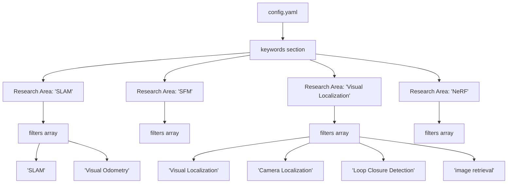
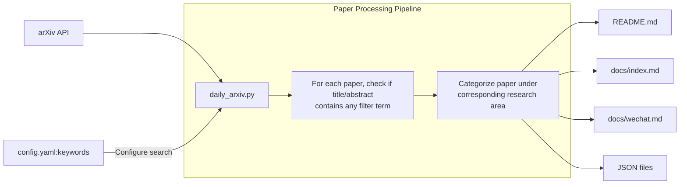
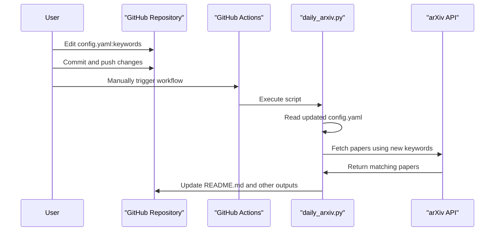

# Customizing Research Keywords

<details>
<summary>Relevant source files</summary>

The following files were used as context for generating this wiki page:

- [config.yaml](config.yaml)
- [docs/README.md](docs/README.md)
- [requirements.txt](requirements.txt)

</details>


This document provides detailed instructions on how to customize the research keywords in the CV-ArXiv-Daily system to focus on different computer vision research areas. By modifying the keywords configuration, you can tailor the system to collect and organize papers that match your specific research interests.

For information about the overall system setup, see [Setup and Configuration](#5.1). For guidance on extending the system with new features, see [Extending the System](#5.3).

## Keyword Configuration Structure

The CV-ArXiv-Daily system uses the `keywords` section in the `config.yaml` file to define which research areas to track and what specific terms to search for. This configuration directly controls which papers are fetched from arXiv and how they are categorized in the output formats.



Sources: [config.yaml:23-39]()

Each research area in the configuration consists of:
- A **key** (e.g., "SLAM", "NeRF") that defines the category name
- A **filters** array containing specific search terms related to that research area

The current configuration includes the following research areas and filter terms:

| Research Area | Filter Terms |
|--------------|-------------|
| SLAM | "SLAM", "Visual Odometry" |
| SFM | "SFM", "Structure from Motion" |
| Visual Localization | "Visual Localization", "Camera Localization", "Camera Re-localisation", "Loop Closure Detection", "visual place recognition", "image retrieval" |
| Keypoint Detection | "Keypoint Detection", "Feature Descriptor" |
| Image Matching | "Image Matching", "Keypoint Matching", "Line Segment Detection", "Local Feature Matching" |
| NeRF | "NeRF" |

Sources: [config.yaml:23-39]()

## How Keywords Affect Paper Collection

When the system runs, it uses the configured keywords to search for papers on arXiv. This diagram illustrates how the keyword system processes papers:



Sources: [config.yaml:23-39](), [docs/README.md:42-44]()

## Adding New Research Keywords

To customize the research areas and keywords, follow these steps:

1. Open the `config.yaml` file in your repository
2. Locate the `keywords` section toward the bottom of the file
3. Add, modify, or remove research areas as needed

### Example: Adding a New Research Area

To add a new research area, add a new key-value pair to the `keywords` section. For example, to add a research area for "Object Detection":

```yaml
keywords:
    # Existing research areas...
    "Object Detection":
        filters: ["Object Detection", "YOLO", "R-CNN", "SSD", "Object Recognition"]
```

### Example: Modifying Existing Filters

To expand an existing research area, you can add more filter terms. For example, to expand the "NeRF" category:

```yaml
"NeRF":
    filters: ["NeRF", "Neural Radiance Fields", "Novel View Synthesis", 
              "Implicit Neural Representation", "Neural Rendering"]
```

Sources: [config.yaml:23-39]()

## Best Practices for Keyword Selection

For effective keyword customization, consider these best practices:

1. **Be specific**: Choose terms that precisely target your research interests
2. **Include variations**: Add common variations of terms (e.g., both "SFM" and "Structure from Motion")
3. **Avoid ambiguity**: Be cautious with terms that might have multiple meanings across different contexts
4. **Balance breadth and precision**: Too many broad terms might fetch irrelevant papers, while overly specific terms might miss relevant papers

## Applying and Testing Changes

After modifying the keywords section, you need to:

1. Commit and push your changes to your repository
2. Trigger the GitHub Actions workflow to apply the changes:
   - Go to the "Actions" tab in your repository
   - Select "Run Arxiv Papers Daily" 
   - Click "Run workflow"
   - Wait for the workflow to complete



Sources: [docs/README.md:42-44]()

## Troubleshooting

If you encounter issues with your keyword customization:

- **Too many papers**: Your filters might be too broad. Try using more specific terms.
- **Too few papers**: Your filters might be too restrictive. Add more variations or related terms.
- **Irrelevant papers**: Check for ambiguity in your filter terms and refine them.
- **No updates after changes**: Ensure you've committed the changes and triggered the GitHub Actions workflow manually.

## Summary

Customizing research keywords in the CV-ArXiv-Daily system allows you to tailor the paper collection to your specific research interests. By modifying the `keywords` section in the `config.yaml` file, you can control which papers are fetched and how they are categorized across all output formats.

Remember to trigger a workflow update after modifying the keywords to see the changes take effect in your repository.

Sources: [config.yaml:23-39](), [docs/README.md:42-44]()

---