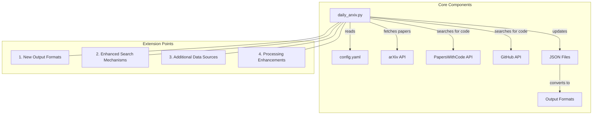
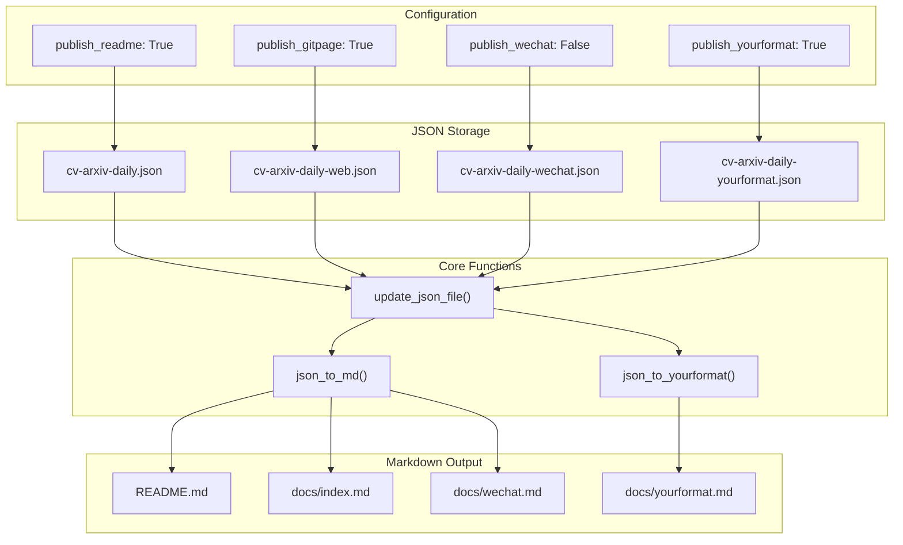
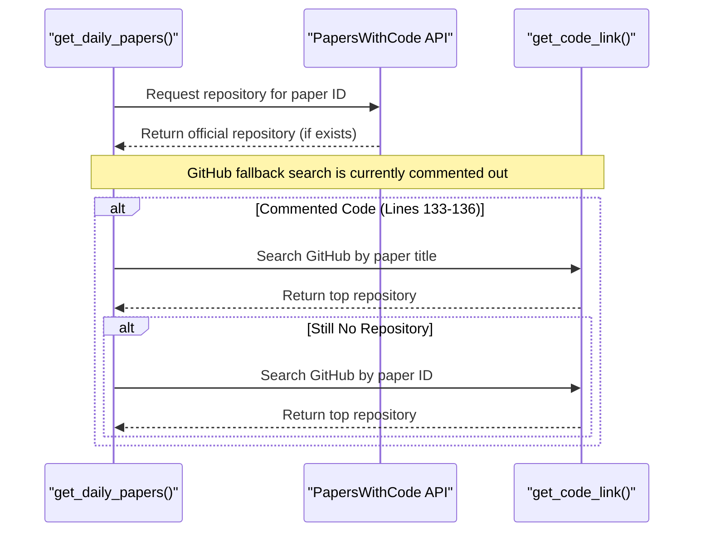
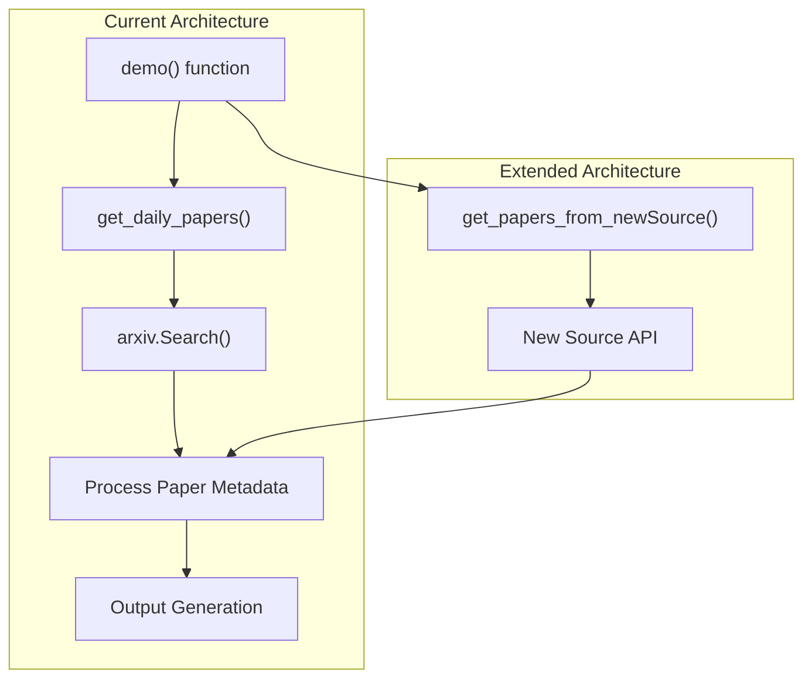
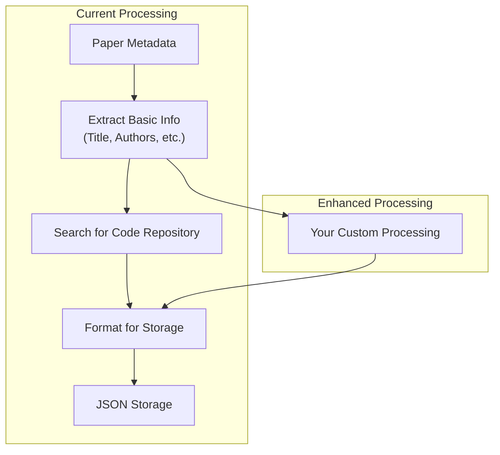

# Extending the System

<details>
<summary>Relevant source files</summary>

The following files were used as context for generating this wiki page:

- [config.yaml](config.yaml)
- [daily_arxiv.py](daily_arxiv.py)
- [requirements.txt](requirements.txt)

</details>


This document provides guidelines for extending the CV-ArXiv-Daily system with new functionality. It focuses on the most common extension points and implementation approaches. For basic setup information, see [Setup and Configuration](#5.1). For modifying research keywords, see [Customizing Research Keywords](#5.2).

## Extension Architecture Overview

The CV-ArXiv-Daily system is designed with modularity in mind, allowing for several extension points. Understanding the system architecture is essential before implementing extensions.



Sources: [daily_arxiv.py:1-444](), [config.yaml:1-40]()

## Adding New Output Formats

The system currently outputs to three formats: GitHub README, Jekyll website, and WeChat content. Each has dedicated configuration settings, storage files, and output formats.

### Output Format Implementation Map



Sources: [daily_arxiv.py:217-241](), [daily_arxiv.py:243-368](), [config.yaml:10-21]()

### Implementation Steps

1. **Add configuration options** in `config.yaml`:

   ```yaml
   # Enable your new output format
   publish_yourformat: True
   
   # Define file paths
   json_yourformat_path: './docs/cv-arxiv-daily-yourformat.json'
   md_yourformat_path: './docs/yourformat.md'
   ```

2. **Update the `demo` function** in `daily_arxiv.py` to handle your new format:

   You'll need to add a new condition block similar to the existing ones for README, GitPage, and WeChat, which:
   - Reads configuration paths
   - Updates the JSON file
   - Converts JSON to your output format

3. **Create your conversion function** (if needed):

   If `json_to_md` doesn't meet your requirements, create a custom conversion function that reads from your JSON file and produces your desired output format.

Sources: [daily_arxiv.py:370-433](), [config.yaml:10-21]()

### Example: Adding CSV Output

To add a CSV output format, you would:

1. Add to `config.yaml`:
   ```yaml
   publish_csv: True
   json_csv_path: './docs/cv-arxiv-daily.json'  # Reuse existing JSON
   csv_output_path: './docs/papers.csv'
   ```

2. Create a CSV conversion function in `daily_arxiv.py`:
   ```python
   def json_to_csv(json_file, csv_file, task=''):
       # Load JSON data and convert to CSV format
       # Write to csv_file
       logging.info(f"{task} finished")
   ```

3. Add to the `demo` function:
   ```python
   if publish_csv:
       json_file = config['json_csv_path']
       csv_file = config['csv_output_path']
       # Call your conversion function
       json_to_csv(json_file, csv_file, task='Update CSV')
   ```

## Enhancing Search Mechanisms

The system currently finds code repositories using the Papers with Code API and has a partially implemented GitHub search. You can enhance repository discovery.

### Current Search Architecture



Sources: [daily_arxiv.py:66-85](), [daily_arxiv.py:87-161]()

### Implementation Steps

1. **Enable the commented-out GitHub search fallback**:

   Uncomment and enhance lines 133-136 in `daily_arxiv.py`:
   ```python
   else:
       repo_url = get_code_link(paper_title)
       if repo_url is None:
           repo_url = get_code_link(paper_key)
   ```

2. **Enhance the GitHub search function**:

   Improve the `get_code_link` function to use better search parameters or query construction:
   ```python
   def get_code_link(qword:str) -> str:
       # Enhance search query
       query = f"{qword} language:python language:c++"
       # Rest of function
   ```

3. **Add additional search sources**:

   Create functions to search other code repositories like GitLab, Bitbucket, or specialized repositories.

Sources: [daily_arxiv.py:66-85](), [daily_arxiv.py:126-137]()

## Adding New Data Sources

Currently, the system only fetches papers from arXiv. You can extend it to pull from other academic sources.

### Data Collection Architecture



Sources: [daily_arxiv.py:87-161](), [daily_arxiv.py:370-433]()

### Implementation Steps

1. **Create a new paper collection function**:

   Create a function similar to `get_daily_papers` that:
   - Connects to your new data source
   - Fetches papers based on search criteria
   - Formats the paper data to match the expected structure
   - Returns a dictionary in the same format as `get_daily_papers`

2. **Update the `demo` function**:

   Add code to call your new function:
   ```python
   # Add to demo function
   data_from_new_source = []
   for topic, keyword in keywords.items():
       data, data_web = get_papers_from_new_source(
           topic, keyword, max_results=max_results
       )
       data_collector.append(data)
       data_collector_web.append(data_web)
   ```

3. **Add configuration options**:

   Add parameters to `config.yaml` to control your new data source:
   ```yaml
   new_source_enabled: True
   new_source_max_results: 5
   ```

Sources: [daily_arxiv.py:87-161](), [daily_arxiv.py:370-433]()

## Processing Enhancements

You can add new processing steps to analyze or enhance the paper data before it's stored and output.

### Processing Pipeline



Sources: [daily_arxiv.py:87-161]()

### Implementation Options

1. **Enhance `get_daily_papers`**:

   Add your custom processing directly within the existing function where papers are processed.

2. **Create processing middleware**:

   Create a separate function that processes the paper data before it's stored:
   ```python
   def enhance_paper_data(paper_data):
       # Add your custom processing
       return enhanced_data
   ```

3. **Post-process stored data**:

   Create a function that reads from JSON storage, enhances the data, and writes it back:
   ```python
   def post_process_papers(json_file):
       # Read, enhance, and write back
   ```

### Example Enhancements

- **Paper Categorization**: Classify papers into sub-categories based on content
- **Citation Tracking**: Add citation counts from Google Scholar or Semantic Scholar
- **Related Papers**: Find and link related papers
- **Content Summarization**: Generate abstracts or key points using NLP

Sources: [daily_arxiv.py:87-161](), [daily_arxiv.py:217-241]()

## Advanced Output Customization

The `json_to_md` function contains multiple parameters for customizing output. You can extend these for more flexibility.

### Current Customization Parameters

| Parameter | Type | Description |
|-----------|------|-------------|
| `to_web` | Boolean | Format for web display |
| `use_title` | Boolean | Include title in output |
| `use_tc` | Boolean | Include table of contents |
| `show_badge` | Boolean | Show GitHub badges |
| `use_b2t` | Boolean | Include back-to-top links |

### Implementation Options

1. **Add new parameters** to `json_to_md`:

   Extend the function with additional parameters for your custom formatting needs.

2. **Create output filters**:

   Implement functions that post-process the generated Markdown:
   ```python
   def apply_output_filter(markdown_content):
       # Transform content
       return filtered_content
   ```

3. **Implement custom templates**:

   Create a template system for more flexible output formatting:
   ```python
   def render_template(template_file, data):
       # Load template and render with data
       return rendered_content
   ```

Sources: [daily_arxiv.py:243-368]()

## Integration with External Systems

You can extend the system to integrate with external platforms like social media, notification systems, or analytics tools.

### Implementation Approaches

1. **Add webhook support**:

   Implement functions to call external APIs when new papers are found:
   ```python
   def send_webhook(paper_data, webhook_url):
       # Format and send data
   ```

2. **Create notification functions**:

   Send emails or push notifications with new papers:
   ```python
   def send_email_notification(recipients, paper_data):
       # Send email
   ```

3. **Generate specialized exports**:

   Create functions to export data in formats required by external tools.

## Final Considerations

When extending the CV-ArXiv-Daily system, keep these best practices in mind:

1. **Maintain modularity**: Create clearly separated functions for new functionality
2. **Use configuration**: Make extensions configurable through `config.yaml`
3. **Error handling**: Implement proper error handling to ensure the core system continues working
4. **Documentation**: Document your extensions for other users
5. **Testing**: Test your extensions thoroughly to ensure compatibility

By following the guidelines in this document, you can extend the CV-ArXiv-Daily system to better suit your needs while maintaining compatibility with the core functionality.

Sources: [daily_arxiv.py:1-444](), [config.yaml:1-40]()