**Awesome AI for Science (AI4Science)** is a curated, community-driven collection of AI tools, libraries, papers, datasets, and frameworks that accelerate scientific discovery across all disciplines. From drug discovery and materials design to climate modeling and astrophysics, this repository serves as a single entry point for researchers seeking to leverage AI in their work — whether you are a computational scientist exploring LLM-based research agents, a physicist investigating physics-informed neural networks, or a biologist looking for protein structure prediction tools.


Sources: [README.md](/README.md#L1-L31)

## What This Repository Covers

The repository organizes over **500+ resources** across a layered taxonomy that mirrors how AI actually intersects with the scientific research lifecycle. Rather than a flat list of links, the collection is structured around three fundamental questions: **What tools help me do research?**, **How can AI agents automate research?**, and **What scientific ML methods and domain applications exist?** This layered design allows you to navigate from high-level workflow tools down to domain-specific models and benchmarks with clarity.

| Layer | Focus | Example Resources | Catalog Section |
|-------|-------|-------------------|-----------------|
| **Research Workflow Tools** | Day-to-day research productivity | Semantic Scholar, MinerU, Paper2Code | *Research Workflow Tools* |
| **Autonomous Research Agents** | End-to-end AI-driven discovery | AI Scientist v2, FunSearch, EvoMaster | *Autonomous Research Agents* |
| **Scientific Machine Learning** | Physics-aware ML methods | DeepXDE, PySR, torchdiffeq | *Scientific Machine Learning* |
| **Domain-Specific Applications** | Discipline-tailored tools & models | AlphaFold3, GNoME, GraphCast | *Domain-Specific Applications* |
| **Foundation Models & Infrastructure** | Base models, frameworks, data | ESM3, SciML ecosystem, TDC | *Foundation Models & Infrastructure* |

Sources: [README.md](/README.md#L33-L59), [README.md](/README.md#L62-L57)

## Architecture at a Glance

The diagram below illustrates the repository's architectural topology — how resources flow from foundational infrastructure up through domain applications, and how the research workflow and autonomous agent layers form a parallel track that spans the entire stack.

```mermaid
graph TD
    subgraph Infrastructure["Foundation Models & Infrastructure"]
        FM["Foundation Models<br/>for Science"]
        CF["Computing Frameworks"]
        DB["Datasets & Benchmarks"]
    end

    subgraph SciML["Scientific Machine Learning"]
        PINN["Physics-Informed<br/>Neural Networks"]
        NO["Neural Operators &<br/>Model Discovery"]
        NDE["Neural Differential<br/>Equations"]
    end

    subgraph Domain["Domain-Specific Applications"]
        BM["Biology & Medicine"]
        CM["Chemistry & Materials"]
        PA["Physics & Astronomy"]
        EC["Earth & Climate Science"]
        AES["Agriculture, Ecology<br/>& Social Sciences"]
    end

    subgraph Workflow["Research Workflow Tools"]
        LK["Literature & Knowledge<br/>Management"]
        PP["Paper-to-Poster,<br/>Slides & Media"]
        CG["Chart Understanding<br/>& Generation"]
        PC["Paper-to-Code &<br/>Reproducibility"]
        SD["Scientific Document<br/>Parsing"]
    end

    subgraph Agents["Autonomous Research Agents"]
        ARS["Autonomous Research<br/>Systems"]
        DRA["Domain-Specific<br/>Research Agents"]
        EB["Evaluation &<br/>Benchmarking"]
    end

    Infrastructure --> SciML
    SciML --> Domain
    Infrastructure --> Domain
    Workflow --> Agents
    Domain --> Agents
    Agents -.->|feedback loop| Workflow

    style Infrastructure fill:#e8f4fd,stroke:#1a73e8
    style SciML fill:#fef3e0,stroke:#e8a317
    style Domain fill:#e8f5e9,stroke:#2e7d32
    style Workflow fill:#f3e5f5,stroke:#7b1fa2
    style Agents fill:#fce4ec,stroke:#c62828
```



Sources: [README.md](/README.md#L33-L59)

## Repository Structure

The project follows a minimal, content-focused structure — a single comprehensive README.md acts as the primary artifact, with supporting files for contribution guidelines and licensing.

```
awesome-ai-for-science/
├── README.md          # Main curated collection (1000+ lines of resources)
├── CONTRIBUTING.md    # Contribution guidelines, quality standards, and review process
├── LICENSE            # MIT License (open and permissive)
└── assets/
    └── banner.jpg     # Project banner image
```

The entire resource catalog lives in **README.md**, organized by thematic sections with emoji-prefixed headers. Each entry follows a consistent format: `[Resource Name](URL) - Brief description`. This flat-file approach prioritizes discoverability and ease of contribution — anyone can fork, edit, and submit a pull request without navigating a complex multi-file documentation system.

Sources: [README.md](/README.md#L1-L31), [CONTRIBUTING.md](/CONTRIBUTING.md#L1-L15), [LICENSE](/LICENSE#L1-L21)

## Key Principles

The repository is governed by a set of quality standards that ensure every listed resource provides genuine value to the scientific community. Understanding these principles helps you evaluate whether a resource fits the collection and guides your own contributions.

| Principle | What It Means | Example |
|-----------|--------------|---------|
| **Relevance** | Directly related to AI applications in scientific research | ✅ DeepXDE (solving PDEs with deep learning) |
| **Quality** | Well-documented, actively maintained, or highly cited | ✅ AlphaFold (Nature publication, 50K+ stars) |
| **Accessibility** | Publicly available — open source, free, or with free tier | ✅ HuggingFace models; ❌ paywalled-only tools |
| **Uniqueness** | Not already listed elsewhere in the repository | Duplicates are rejected during review |
| **Functionality** | Actually works and provides value to researchers | Broken links are removed promptly |

> [!TIP]
> When evaluating whether to add a resource, ask: "Would a researcher in this domain find this tool directly useful for their scientific work?" If the answer isn't a clear yes, the resource likely belongs in a more general awesome list rather than this science-focused one.

Sources: [CONTRIBUTING.md](/CONTRIBUTING.md#L70-L87)

## How to Contribute

Contributions are the lifeblood of this repository — the collection stays current and comprehensive because the community actively maintains it. The contribution workflow is intentionally lightweight: fork the repository, add your resource to the appropriate section in README.md following the existing format, and submit a pull request. Reviews are typically completed within 7 days, with a final decision within 14 days.

The entry format is strictly enforced for consistency: `- [Resource Name](URL) - Brief description of what it does and why it's useful`. Descriptions should be 5–15 words, clear and objective, and focused on what the tool does and its scientific domain. For larger structural changes (new sections, reorganizations), it is recommended to open an issue first to gather community feedback.

> [!TIP]
> Before submitting, verify that your resource is placed in the most specific relevant section — not just the first one that seems related. Resources within each subsection should maintain alphabetical order.

Sources: [CONTRIBUTING.md](/CONTRIBUTING.md#L16-L46), [CONTRIBUTING.md](/CONTRIBUTING.md#L88-L118)

## Licensing & Community

The repository is released under the **MIT License**, one of the most permissive open-source licenses. This means you are free to use, copy, modify, merge, publish, distribute, sublicense, and even sell copies of the collection — provided you include the original copyright notice and license text. The project maintains a Code of Conduct emphasizing respect, constructive feedback, and collaborative improvement.

Sources: [LICENSE](/LICENSE#L1-L21), [CONTRIBUTING.md](/CONTRIBUTING.md#L149-L162)

## Where to Go Next

The documentation is organized into a guided reading path that follows the natural progression from getting started to deep exploration. Based on the catalog structure, here is a recommended reading order:

1. **Start here** → [Quick Start](2-quick-start) — Practical steps to begin using the resources in this collection
2. **What's new** → [Latest Updates](3-latest-updates) — Recent additions and breakthroughs in the field
3. **Who builds this** → [About Contributors](4-about-contributors) — The community behind the collection
4. **Then explore by your interest**:
   - *Research productivity*: [Literature & Knowledge Management](5-literature-and-knowledge-management) → [Paper-to-Poster, Slides & Media](6-paper-to-poster-slides-and-media) → [Scientific Document Parsing](9-scientific-document-parsing)
   - *Autonomous discovery*: [Autonomous Research Systems](10-autonomous-research-systems) → [Domain-Specific Research Agents](11-domain-specific-research-agents) → [Evaluation & Benchmarking](12-evaluation-and-benchmarking)
   - *Scientific ML methods*: [Physics-Informed Neural Networks](13-physics-informed-neural-networks) → [Neural Operators & Model Discovery](14-neural-operators-and-model-discovery) → [Neural Differential Equations](15-neural-differential-equations)
   - *Domain deep-dives*: [Biology & Medicine](16-biology-and-medicine) · [Chemistry & Materials](17-chemistry-and-materials) · [Physics & Astronomy](18-physics-and-astronomy) · [Earth & Climate Science](19-earth-and-climate-science)
   - *Foundations*: [Foundation Models for Science](21-foundation-models-for-science) → [Computing Frameworks](22-computing-frameworks) → [Datasets & Benchmarks](23-datasets-and-benchmarks)
