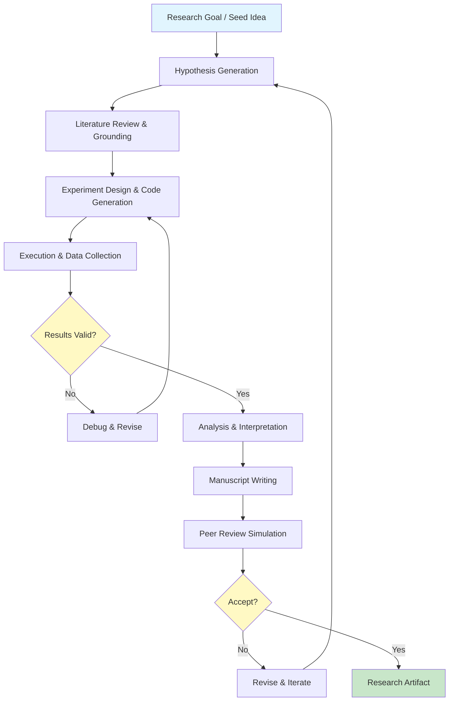
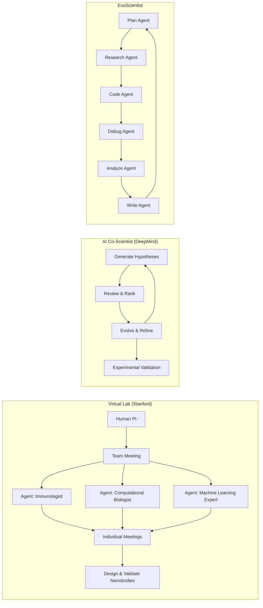
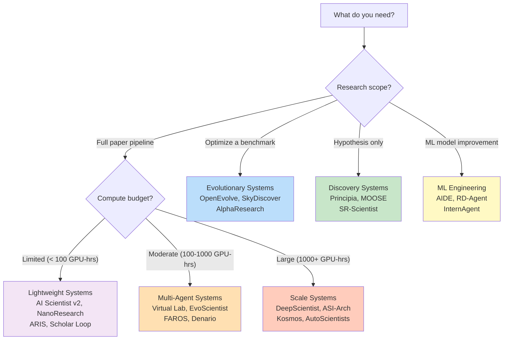

Autonomous research systems represent the frontier of AI-for-science: software agents that **independently traverse the full scientific lifecycle** — from hypothesis generation and literature review through experiment execution, data analysis, and manuscript writing — with minimal human intervention. This page maps the rapidly evolving landscape of these systems as cataloged in the Awesome AI for Science repository, providing an architectural taxonomy, comparison framework, and selection guidance for intermediate developers seeking to understand, adopt, or contribute to autonomous research infrastructure.

Sources: [README.md](/README.md#L1-L31)

---

## The Autonomous Research Paradigm

The core insight driving autonomous research systems is that **scientific discovery itself can be decomposed into a computational loop**. Traditional research involves a human researcher iterating through hypothesis → experiment → analysis → revision. Autonomous systems operationalize this loop by replacing (or augmenting) the human decision-maker with LLM-powered agents that invoke tools, read papers, write code, run experiments, and evaluate results — all within a structured execution environment. The repository traces this evolution from early tool-assisted workflows to today's fully autonomous systems that can produce workshop-accepted papers without human co-authorship.

Sources: [README.md](/README.md#L237-L257)

### Architecture Overview

Before examining individual systems, it is essential to understand the **shared architectural skeleton** that most autonomous research systems instantiate. The following diagram illustrates the canonical research loop and the key decision points where systems diverge in their design choices:

**Key architectural differentiators** across systems include: (1) the **granularity of autonomy** — whether humans are in the loop, on the loop, or out of the loop; (2) the **agent topology** — single monolithic agent vs. multi-agent collaboration vs. evolutionary population; (3) the **verification strategy** — self-evaluation, peer-agent review, or external benchmark scoring; and (4) the **persistence model** — stateless per-run vs. cross-session memory vs. self-evolving skill libraries.

Sources: [README.md](/README.md#L239-L286)

---

## System Taxonomy

The 40+ systems cataloged in the repository can be classified along **three orthogonal axes**: autonomy level, architectural pattern, and research scope. This taxonomy is not rigid — many systems straddle categories — but it provides a practical framework for comparing and selecting tools.

| **Category** | **Defining Characteristic** | **Representative Systems** | **Human Role** |
|---|---|---|---|
| **Evolutionary Discovery** | LLM proposes candidates; evaluator selects; iterates across generations | FunSearch, OpenEvolve, SkyDiscover, AlphaResearch | Problem definition only |
| **Full-Cycle Autonomous** | End-to-end pipeline: idea → paper with minimal human input | AI Scientist v1/v2, FAROS, DeepScientist, NanoResearch | Initiation & oversight |
| **Multi-Agent Collaborative** | Specialized agents assume research roles (reviewer, coder, writer) | Virtual Lab, AI Co-Scientist, EvoScientist, CORAL | Team lead / meeting convener |
| **ML Engineering Focused** | Automates model development, hyperparameter tuning, code debugging | AIDE, RD-Agent, InternAgent, CodeScientist | Task specification |
| **Self-Evolving Infrastructure** | Agents write new skills, persist memory, improve across sessions | ScienceClaw, ARIS, EvoMaster, ai4s-skills | Periodic audit |
| **Research Operating Systems** | Blueprint-driven runtimes orchestrating the full research lifecycle | FAROS, AutoR, ARA, ResearchStudio | Research director |

Sources: [README.md](/README.md#L239-L286), [README.md](/README.md#L196-L206)

---

## Evolutionary Discovery Systems

Evolutionary discovery systems pair **LLM-driven proposal generation** with **automated evaluation and selection**, creating a Darwinian loop where the fittest solutions survive and breed. This pattern was pioneered by DeepMind's FunSearch, which became the first system to make **novel, verifiable scientific discoveries** by evolving programs that solved open combinatorics problems and discovered faster matrix multiplication algorithms.

**FunSearch** (DeepMind, Nature 2023) established the foundational pattern: an LLM generates candidate programs, an evaluator scores them against the objective, and the best performers seed the next generation. [OpenEvolve](https://github.com/algorithmicsuperintelligence/openevolve) open-sources this paradigm, enabling LLMs to autonomously discover and optimize algorithms through iterative evolution matching the approach behind DeepMind's AlphaEvolve breakthrough. [SkyDiscover](https://github.com/skydiscover-ai/skydiscover) extends this with a modular framework supporting 200+ optimization tasks and introduces AdaEvolve and EvoX adaptive strategies. [AlphaResearch](https://github.com/answers111/alpha-research) combines evolutionary search with peer-review reward models, achieving best-known performance on circle packing problems. [EvoMaster](https://github.com/sjtu-sai-agents/EvoMaster) (SJTU SAI) elevates this to a foundational auto-research agent framework with run-level self-evolution and multiple SciMaster domain agents (ML-Master, X-Master, Browse-Master).

> [!TIP]
> Evolutionary discovery is most effective when the objective function is **clearly quantifiable and cheap to evaluate** — combinatorics, algorithm optimization, and benchmark maximization are ideal. For open-ended scientific questions where "better" is subjective, multi-agent collaborative systems (below) are more appropriate.

Sources: [README.md](/README.md#L239-L243)

---

## Full-Cycle Autonomous Research Systems

Full-cycle systems aim to **automate the entire research pipeline** from idea to publication. This is the most ambitious and rapidly advancing category, with systems progressing from proof-of-concept to workshop-accepted papers in under two years.

### The AI Scientist Lineage

**The AI Scientist** (SakanaAI, 13.8K+ stars) represents the most influential lineage. Version 1 (2024) was the first fully autonomous open-ended scientific discovery system implementing the complete hypothesis → experiment → writing → review simulation loop. **Version 2** extended this with **agentic tree search** and reduced template dependency, achieving the milestone of a **workshop-level accepted paper** — the first AI-generated paper to pass peer review at a venue. This progression from template-heavy to template-light architecture is a critical design lesson: early systems rely on rigid scaffolding, while mature systems generate structure dynamically.

### Systems at Scale

Several systems push the boundaries of **compute-scale autonomy**. [DeepScientist](https://github.com/ResearAI/DeepScientist) ran 20,000+ GPU hours of month-long autonomous discovery, progressively surpassing human SOTA on frontier AI tasks (183.7%, 1.9%, 7.9% improvements). [ASI-Arch](https://github.com/GAIR-NLP/ASI-Arch) (GAIR-NLP) ran 1,773 experiments over 20,000 GPU hours, producing 106 state-of-the-art linear-attention architectures surpassing human-designed baselines. [Kosmos](https://github.com/jimmc414/Kosmos) deployed 200 parallel agent rollouts analyzing 1,500 papers per run, achieving 79.4% accuracy and 7 scientific discoveries.

### Research Operating Systems

A distinct sub-pattern treats autonomous research as an **operating system problem**. [FAROS](https://github.com/OpenNSWM-Lab/FAROS) (Foundation AutoResearch Operating System, 2.4K+ stars) provides a blueprint-driven runtime orchestrating AI research workflows from idea generation through peer review. [ARA](https://github.com/ARA-Labs/Agent-Native-Research-Artifact) defines a protocol and skill bundle making autonomous research verifiable, crystallized, and observable through structured machine-executable artifacts. [ResearchStudio](https://github.com/microsoft/ResearchStudio) (Microsoft) covers the entire research lifecycle from under-specified research direction to published paper, with ResearchStudio-Idea for evidence-grounded ideation and ResearchStudio-Reel for turn-by-turn execution.

Sources: [README.md](/README.md#L246-L258), [README.md](/README.md#L269-L286)

---

## Multi-Agent Collaborative Systems

Multi-agent systems decompose the research process into **specialized roles** — mirroring how real research teams operate. The key architectural question is how agents communicate, coordinate, and resolve conflicts.

**Virtual Lab** (Stanford Zou Group, Nature 2025) pioneered the AI-human collaborative model where a human researcher works with a team of LLM agents via **team and individual meetings** — directly mimicking the structure of an academic lab. This system demonstrated its capability by designing new SARS-CoV-2 nanobodies. **AI Co-Scientist** (Google DeepMind, Nature Medicine 2026) takes a different approach: a multi-agent system that **generates, reviews, ranks, and evolves research hypotheses** alongside scientists, with experimental validation demonstrating its capacity to accelerate real discoveries.

[EvoScientist](https://github.com/EvoScientist/EvoScientist) implements a self-evolving architecture with 6 specialized sub-agents (plan/research/code/debug/analyze/write) and persistent memory, achieving #1 on DeepResearch Bench II and AstaBench. [CORAL](https://github.com/Human-Agent-Society/CORAL) provides robust, lightweight infrastructure for multi-agent autonomous self-evolution where agents run in isolated git worktrees and share knowledge through a common state directory. [AutoScientists](https://github.com/mims-harvard/AutoScientists) (Harvard MIMS) introduces **decentralized self-organizing teams** where agents critique each other's proposals before spending compute and share successes/failures to avoid redundant work.

> [!TIP]
> Multi-agent systems face a fundamental **coordination overhead** tradeoff. More agents can decompose tasks more finely, but inter-agent communication costs grow quadratically. The most effective systems (Virtual Lab, AI Co-Scientist) use **hierarchical coordination** — a lead agent or human PI synthesizes inputs from specialized sub-agents rather than allowing all-to-all communication.

Sources: [README.md](/README.md#L244-L246), [README.md](/README.md#L269-L280)

---

## ML Engineering & R&D Agents

A pragmatic subclass of autonomous research systems focuses on **automating the machine learning development cycle** — not writing papers, but producing competitive ML solutions. These systems are the most immediately useful for practitioners who need to improve model performance on concrete benchmarks.

| **System** | **Architecture** | **Key Achievement** | **Benchmark** |
|---|---|---|---|
| [AIDE](https://github.com/WecoAI/aideml) | Agentic tree search | 4× more medals than best linear agent on 75 Kaggle competitions | MLE-Bench |
| [RD-Agent](https://github.com/microsoft/rd-agent) | Dual Researcher-Developer agents | Top open-source on MLE-Bench | MLE-Bench |
| [InternAgent](https://github.com/Alpha-Innovator/InternAgent) | Closed-loop multi-agent | #1 on MLE-Bench (36.44%) | MLE-Bench |
| [CodeScientist](https://github.com/allenai/codescientist) | LLM-as-mutator over articles & code | Auto-creates, runs, debugs experiment code | Domain-specific |
| [Arbor](https://github.com/RUC-NLPIR/Arbor) | Hypothesis tree optimization | 2.5× better than Claude Code/Codex on same compute | BrowseComp, MLE-Bench Lite |

**AIDE** (WecoAI) uses agentic tree search to autonomously draft, debug, and benchmark ML code, winning 4× more medals than the best linear agent on OpenAI's MLE-Bench across 75 Kaggle competitions. **RD-Agent** (Microsoft) automates data-driven AI solution building through a dual Researcher-Developer architecture with an evolutionary loop. **InternAgent** achieves the highest reported MLE-Bench score (36.44%) through a closed-loop multi-agent system spanning hypothesis to verification across 12 scientific tasks.

Sources: [README.md](/README.md#L264-L268), [README.md](/README.md#L257-L258)

---

## Self-Evolving & Skill-Based Systems

A distinctive architectural pattern emerges in systems that **persist knowledge across sessions** and **autonomously generate new capabilities**. Rather than starting from scratch each run, these systems accumulate skills, memory, and refinement strategies — making them more like research colleagues than one-shot tools.

**ScienceClaw** (285+ runtime-adaptive skills across 28+ disciplines) autonomously writes new SKILL.md files at runtime, adapting its capabilities to the task at hand. **ARIS** (Auto-Research-In-Sleep) provides lightweight Markdown-only skills for autonomous ML research with cross-model review loops, intentionally avoiding framework lock-in to work with Claude Code, Codex, OpenClaw, and others. **ai4s-skills** (by the repository maintainers) delivers agent skills for the complete AI4S workflow — topic exploration, literature survey, runnable experiments, publication-grade papers, and integrity audit — with every citation and number traceable to its source. [LabClaw](https://github.com/wu-yc/LabClaw) provides 211 production-ready SKILL.md files across 7 biomedical domains for modular dry-lab reasoning and protocol composition. [ToolUniverse](https://github.com/mims-harvard/ToolUniverse) (Harvard MIMS) democratizes AI scientists by transforming any LLM into a research system with 600+ scientific tools.

Sources: [README.md](/README.md#L259-L272), [README.md](/README.md#L260-L261)

---

## Discovery & Hypothesis Systems

Some systems specialize in the **upstream phase of research** — generating novel, grounded hypotheses and discovering scientific equations. This is where the "creativity" of autonomous research is most visible.

**Principia** takes a principle-first approach: it extracts reusable principles from public literature and private research materials, composes them into traceable **Idea Cards** with prior-art comparisons, and exports validation-ready research proposals. **SR-Scientist** (ICLR 2026) elevates LLMs from equation proposers to autonomous scientists that write code, analyze data, implement equations, and optimize based on experimental feedback — significantly outperforming baselines on symbolic regression benchmarks. **POPPER** (Stanford SNAP) implements **agentic sequential falsifications** for automated hypothesis testing, inspired by Karl Popper's falsification principle. [MOOSE](https://github.com/ZonglinY/MOOSE) (ACL 2024, ICML Best Poster) demonstrated that LLMs can generate novel and valid scientific hypotheses in open-domain settings. [UniScientist](https://github.com/UniPat-AI/UniScientist) covers 50+ disciplines with a 30B model outperforming Claude Opus and GPT on 5 research benchmarks.

Sources: [README.md](/README.md#L282-L286), [README.md](/README.md#L275-L278)

---

## Lab Automation & End-to-End Discovery

The most mature autonomous research systems bridge the gap between **computational reasoning and physical experimentation**. These systems are not just writing papers — they are designing experiments, analyzing real data, and in some cases, controlling robotic lab equipment.

**Robin** (FutureHouse) is an end-to-end scientific discovery multi-agent system orchestrating literature search (Crow/Falcon) and data analysis (Finch) agents — it was the first AI-generated drug discovery, identifying **ripasudil as a novel dry AMD therapeutic**. **Curie** provides automated and rigorous experiments using AI agents for scientific discovery. [Aviary](https://github.com/Future-House/aviary) (also FutureHouse) serves as a language agent gymnasium for challenging scientific tasks including DNA manipulation, literature search, and protein engineering — providing the training infrastructure for research agents. [Denario](https://github.com/AstroPilot-AI/Denario) (AstroPilot-AI) automates the full pipeline from idea generation through Docker-based code execution, visualization, LaTeX writing, and peer-review simulation. [AutoResearchClaw](https://github.com/aiming-lab/AutoResearchClaw) (11K+ stars) implements fully autonomous research with multi-agent debate, citation verification, and OpenClaw integration.

Sources: [README.md](/README.md#L272-L274), [README.md](/README.md#L255-L262)

---

## Selection Guide: Choosing the Right System

With 40+ systems available, selecting the right tool requires matching your **research objective, compute budget, and desired autonomy level** to system capabilities. The following decision framework maps common scenarios to recommended systems:

| **If You Need...** | **Start With** | **Why** | **Stars** |
|---|---|---|---|
| A proven full-cycle pipeline | AI Scientist v2 | First workshop-accepted AI paper; 13.8K+ stars; active community | 13.8K+ |
| Open-source evolutionary discovery | OpenEvolve | Reproduces AlphaEvolve paradigm; modular | — |
| ML competition automation | AIDE | Best MLE-Bench performance per dollar; tree search | 1.3K+ |
| Research OS with blueprints | FAROS | Blueprint-driven runtime; full lifecycle orchestration | 2.4K+ |
| Cross-session skill accumulation | ScienceClaw | 285+ adaptive skills; self-evolving | — |
| Drug discovery with real validation | Robin | First AI-discovered drug (ripasudil for dry AMD) | — |
| Lightweight, no-framework-lock-in | ARIS | Markdown-only skills; multi-provider | — |
| Maximum scale autonomy | DeepScientist | 20K+ GPU-hours; surpassed human SOTA | — |

Sources: [README.md](/README.md#L239-L286)

---

## Key Architectural Patterns & Tradeoffs

Analyzing the landscape reveals several **recurring design patterns** and their inherent tradeoffs that any developer building or extending autonomous research systems must understand:

**Single-Agent vs. Multi-Agent**: Single-agent systems (AI Scientist, ARIS, NanoResearch) are simpler to deploy and debug but limited by the context window and reasoning capacity of one LLM. Multi-agent systems (Virtual Lab, CORAL, EvoScientist) distribute cognitive load but introduce coordination overhead, communication failures, and the risk of agents converging on the same wrong answer. The most effective multi-agent systems use **hierarchical coordination** rather than flat peer-to-peer communication.

**Template-Driven vs. Template-Free**: Early systems (AI Scientist v1) relied heavily on templates that constrained the research space to specific domains (ML papers on language modeling). Template-free systems (AI Scientist v2, FAROS) use agentic search to dynamically determine research structure, enabling broader applicability at the cost of reduced reliability in narrow domains.

**Stateless vs. Persistent**: Stateless systems treat each research run independently, ensuring reproducibility but losing accumulated knowledge. Persistent systems (ScienceClaw, ARIS, EvoMaster) carry forward skills, memory, and refined strategies across sessions — dramatically improving efficiency over time but introducing state management complexity and potential for accumulated biases.

**Verified vs. Unverified Output**: The most trustworthy systems (FunSearch, AIDE, RD-Agent) implement **external verification** — automated test suites, benchmark scoring, or formal proof checkers — rather than relying solely on LLM self-evaluation. Systems that verify their own outputs through LLM review alone are vulnerable to self-consistent hallucination.

Sources: [README.md](/README.md#L239-L286), [README.md](/README.md#L432-L441)

---

## Where to Go Next

The autonomous research systems landscape connects deeply to several adjacent topics in this catalog. If you're exploring domain-specific instantiations of these patterns, see [Domain-Specific Research Agents](11-domain-specific-research-agents) for systems like AlphaGeometry, ChemCrow, and BioAgents that apply autonomous research to specific scientific disciplines. For understanding how these systems are evaluated, see [Evaluation & Benchmarking](12-evaluation-and-benchmarking) for benchmarks like MLE-Bench, PaperBench, and ScienceAgentBench. For the foundational model infrastructure that powers these agents, see [Foundation Models for Science](21-foundation-models-for-science). For the broader research workflow tools that autonomous systems integrate (literature search, paper parsing, code generation), see [Literature & Knowledge Management](5-literature-and-knowledge-management), [Scientific Document Parsing](9-scientific-document-parsing), and [Paper-to-Code & Reproducibility](8-paper-to-code-and-reproducibility).
