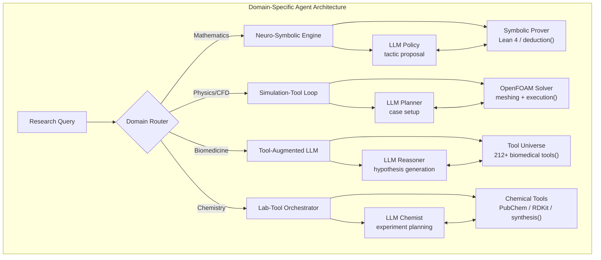

Unlike general-purpose autonomous research systems that attempt the full scientific lifecycle, **domain-specific research agents** embed deep disciplinary knowledge—formal languages, domain ontologies, curated tool ecosystems, and specialized verification protocols—directly into their agentic architectures. This page maps the landscape of these specialized agents across mathematics, physics, biology, chemistry, and medicine, analyzing their architectural patterns, tool integration strategies, and the critical design decisions that separate domain-competent agents from generic LLM wrappers.

Sources: [README.md](README.md#L307-L331)

## Architectural Taxonomy: How Domain Expertise Enters the Agent

The fundamental question for any domain-specific research agent is *where* domain knowledge lives in the system. Three architectural patterns emerge across the agents cataloged here:

| Pattern | Domain Knowledge Location | Verification Strategy | Representative Agents |
|---|---|---|---|
| **Neuro-Symbolic** | Symbolic engine (theorem prover, simulator) + neural language model as policy | Formal proof checking / simulation convergence | AlphaGeometry, LeanDojo, Foam-Agent |
| **Tool-Augmented LLM** | Curated tool ecosystem (APIs, databases, calculators) + LLM as orchestrator | Tool output validation, cross-reference checks | TxAgent, Biomni, ChemCrow, Zephyrus |
| **End-to-End Neural** | Domain-pretrained weights + task-specific fine-tuning | Benchmark evaluation, human expert review | Camyla, MOOSE, BioAgents |

These patterns are not mutually exclusive—many agents blend them. The key insight is that **the pattern determines where the agent's ceiling lies**: neuro-symbolic systems achieve provable guarantees but are constrained by the expressiveness of their symbolic backend; tool-augmented agents achieve broad coverage but inherit the reliability of their tool chain; end-to-end neural agents are flexible but require domain-specific training data at scale.

Sources: [README.md](README.md#L307-L331)

## Mathematics & Formal Reasoning Agents

Mathematical research agents represent the most mature intersection of LLMs and formal methods. The defining constraint is that **mathematics admits machine-checkable verification**—a proof is either accepted by a formal system or it isn't. This creates a tight, objective feedback loop that is unavailable in most other scientific domains.

### Theorem Proving in Lean 4

The Lean 4 ecosystem has become the dominant platform for LLM-based theorem proving, with four agents forming a clear progression:

**[Aletheia](https://arxiv.org/abs/2602.10177)** (Google DeepMind, February 2026) represents the frontier—powered by Gemini Deep Think, it autonomously solved 4 open problems from 700 Erdős conjectures and generated complete research papers without human intervention. This is the first documented case of an AI agent producing publishable mathematical research entirely autonomously.

**[DeepSeek-Prover-V2](https://github.com/deepseek-ai/DeepSeek-Prover-V2)** and **[Goedel-Prover-V2](https://github.com/Goedel-LM/Goedel-Prover-V2)** represent the open-source counterweight. DeepSeek-Prover-V2 integrates informal and formal mathematical reasoning through recursive subgoal decomposition and reinforcement learning, while Goedel-Prover-V2's 8B model matches DeepSeek-Prover-V2-671B at 84.6% MiniF2F—a remarkable compression result suggesting that **specialized small models can rival generalist large models in formal domains** when the task distribution is sufficiently narrow.

**[LeanDojo](https://github.com/lean-dojo/LeanDojo)** and **[Lean Copilot](https://github.com/lean-dojo/LeanCopilot)** provide the infrastructure layer. LeanDojo offers programmatic Lean interaction, a 98K+ theorem dataset, and ReProver (the first retrieval-augmented LLM-based theorem prover). Lean Copilot embeds language model inference directly inside the Lean proof environment as native tactics (`suggest_tactics`, `search_proof`, `select_premises`). The architectural insight here is that **tightly coupling the LLM to the proof state**—rather than treating the prover as a black-box evaluator—enables richer feedback and more efficient search.

**[MathCode](https://github.com/math-ai-org/mathcode)** bridges the gap between informal and formal reasoning with a built-in math formalization engine that converts plain-language math problems into Lean 4 theorems and attempts formal proofs, bundling a local Lean toolchain and WebUI for interactive mathematical reasoning.

### Geometry Theorem Proving

**[AlphaGeometry](https://github.com/google-deepmind/alphageometry)** (DeepMind, Nature 2024) operates in a different formal regime—synthetic geometry rather than dependent type theory. Its architecture pairs a neural language model (for auxiliary construction proposals) with a symbolic deduction engine (for logical derivation). AlphaGeometry2 solves 84% of IMO geometry problems (42/50) at gold-medalist level. The key architectural lesson is that **the neural component's role is to propose constructions that expand the proof search space**, while the symbolic engine handles the rigorous logical chain—each component does what it does best.

> [!TIP]
> When building a domain-specific agent for formal domains, the most critical design decision is the interface contract between the neural and symbolic components. In LeanDojo, this is the tactic proposal API; in AlphaGeometry, it's the auxiliary construction proposal. The contract should be narrow enough to enforce verification but expressive enough to allow creative exploration.

Sources: [README.md](README.md#L308-L314)

## Physics & Simulation Agents

Physics agents face a fundamentally different challenge from mathematics: **the ground truth is not a formal proof but a simulation result**. The verification loop is computational rather than logical, and the cost of each iteration can range from seconds (analytical calculations) to days (high-fidelity CFD).

### Computational Fluid Dynamics

**[Foam-Agent](https://github.com/csml-rpi/Foam-Agent)** (NeurIPS 2025) is the first end-to-end composable multi-agent framework for automating OpenFOAM-based CFD simulations. Its architecture manages the full pipeline from natural language prompts through meshing, case setup, execution, error correction, and post-processing. The critical achievement is a **100% success rate** on standard CFD benchmarks, which is remarkable given the notorious fragility of CFD case setup. The agent's error correction loop—detecting solver divergence, mesh quality issues, and boundary condition inconsistencies—demonstrates that domain-specific agents can achieve reliability that general-purpose coding agents cannot match in specialized simulation workflows.

### Agentic Physics Reasoning

**[Get Physics Done (PSI)](https://github.com/psi-oss/get-physics-done)** is the first open-source agentic AI physicist that turns research questions into structured workflows with rigorous verification and multi-step analytical work for long-horizon physics projects. It integrates with Claude Code, Codex, and Gemini, reflecting a design philosophy of **agent-agnosticism**—the domain knowledge lives in the skill definitions and verification protocols, not in the LLM choice.

### Weather Science

**[Zephyrus](https://github.com/Rose-STL-Lab/Zephyrus)** (ICLR 2026) is the first agentic framework for weather science, pairing an LLM with ZephyrusWorld (a code-execution environment exposing WeatherBench 2 data, geolocation, forecasting, simulation, and climatology tools) and ZephyrusBench (2,230 Q&A pairs). This architecture exemplifies the **environment-agent co-design** pattern: the benchmark and the tool environment are designed together, ensuring that the agent's capabilities are evaluated against tasks that actually exercise the tools provided.

Sources: [README.md](README.md#L315-L317)

## Biology & Biomedical Agents

Biomedical agents represent the largest and most diverse category of domain-specific research agents. The key challenge is **biological complexity at scale**: the sheer number of entities (genes, proteins, pathways, diseases), the multi-scale nature of biological systems (molecular → cellular → tissue → organism), and the inherent noisiness of biological data.

### Multi-Tool Biomedical Reasoning

**[TxAgent](https://github.com/mims-harvard/TxAgent)** (Harvard MIMS, 2025) and **[ATHENA-R1](https://github.com/mims-harvard/ATHENA)** represent the cutting edge of tool-augmented biomedical reasoning. TxAgent achieves 92.1% accuracy in drug reasoning and outperforms GPT-4o by 25.8% by operating across a "universe of tools." ATHENA-R1 extends this with reinforcement learning training over 212 biomedical tools, performing multi-step evidence gathering and spawning parallel reasoning branches to reach evidence-grounded clinical decisions. The architectural innovation in ATHENA-R1 is the **parallel reasoning branch** pattern: rather than a single chain-of-thought, the agent spawns multiple evidence-gathering paths that converge on a clinical decision, mirroring how expert clinicians consider differential diagnoses simultaneously.

**[Biomni](https://github.com/snap-stanford/Biomni)** (Stanford SNAP, bioRxiv 2025) takes a different approach as a general-purpose biomedical AI agent integrating LLM reasoning with retrieval-augmented planning and code-based execution. The key distinction is **retrieval-augmented planning**: the agent doesn't just retrieve information, it retrieves and adapts execution plans from prior successful tasks, enabling more efficient navigation of the biomedical tool landscape.

### Bioinformatics & Genomics Agents

**[SRAgent](https://github.com/ArcInstitute/SRAgent)** (Arc Institute) provides LLM agents for working with the SRA (Sequence Read Archive) and associated bioinformatics databases, enabling natural language querying of high-throughput sequencing data and metadata across genomic repositories. The critical insight is that **database interface design** is the primary bottleneck for bioinformatics agents—the SRA's complex query syntax and metadata schema are the real barrier, not the analytical methods.

**[STAgent](https://github.com/LiuLab-Bioelectronics-Harvard/STAgent)** (Harvard LiuLab, bioRxiv 2025) is a multimodal LLM-based AI agent enabling deep research in spatial transcriptomics, automating analysis and interpretation of spatial gene expression data. Spatial transcriptomics is a particularly demanding domain because it requires **joint reasoning over spatial coordinates and gene expression matrices**, combining visual and tabular reasoning in a way that standard LLMs struggle with.

**[ClawBio](https://github.com/ClawBio/ClawBio)** (871+ stars, MIT License, 2026) is the first bioinformatics-native AI agent skill library enabling local-first, reproducible genomic and population-genetics research workflows built on OpenClaw. Its design philosophy prioritizes **reproducibility as a first-class constraint**: every workflow is defined as a skill file that can be versioned, audited, and re-executed.

### Autonomous Biological Discovery

**[BioDiscoveryAgent](https://github.com/snap-stanford/BioDiscoveryAgent)** (Stanford SNAP) and **[BioAgents](https://github.com/bio-xyz/BioAgents)** represent the goal of autonomous biological discovery. BioAgents combines literature analysis agents with data scientist agents to enable iterative scientific discovery through user feedback integration, achieving state-of-the-art performance on biological benchmarks. The **multi-agent decomposition** here—literature agent + data scientist agent—reflects the natural division of labor in biological research: one agent surveys what is known, the other analyzes what is observed.

**[Camyla](https://github.com/yifangao112/Camyla)** is a fully autonomous medical image segmentation research system that generates complete manuscripts end-to-end from datasets with zero human intervention, beating strongest baselines on 24 of 31 datasets and achieving T1-T2 tier manuscript quality in double-blind review. This is notable as one of the few agents that has demonstrated **publication-quality output in a clinical domain** without human editing.

> [!TIP]
> The most common failure mode for biomedical agents is hallucinated entity relationships—confidently stating protein-protein interactions or gene-disease associations that don't exist in the literature. Agents that ground their reasoning in tool outputs (TxAgent, ATHENA-R1) rather than relying on parametric knowledge are significantly more reliable. Always verify that the agent's tool chain includes a citation verification step.

Sources: [README.md](README.md#L318-L331)

## Chemistry & Materials Discovery Agents

Chemistry agents uniquely bridge the digital-physical divide: they must reason about molecular structures and reactions in silico while potentially orchestrating physical experiments in self-driving laboratories.

### Chemistry Tool Agents

**[ChemCrow](https://arxiv.org/abs/2304.05376)** is the foundational LLM agent for chemistry research with tool integration. Its architecture treats the LLM as an orchestrator that invokes specialized chemistry tools (molecular property prediction, synthesis planning, safety assessment) in sequence. The key design principle is that **the LLM should never reason about chemistry directly**—it should always delegate to tools that enforce chemical validity.

**[Coscientist](https://www.nature.com/articles/s41586-023-06792-1)** (Nature 2023) extends this to autonomous chemical experiment planning and execution, representing the first demonstration of an AI agent designing, planning, and executing a chemical experiment in a physical laboratory. This agent operates at the frontier of the **digital-physical boundary**, where the verification loop includes real-world measurement.

### Materials Discovery Agents

**[SciAgents](https://github.com/lamm-mit/SciAgentsDiscovery)** (MIT, bio-inspired materials) is a multi-agent intelligent graph reasoning system that autonomously traverses ontological knowledge graphs to generate, critique, and refine novel research hypotheses. Its architecture is distinctive because it uses **knowledge graph traversal as the primary reasoning mechanism** rather than chain-of-thought prompting—the LLM proposes paths through the ontology, and the graph structure constrains the reasoning to scientifically plausible connections.

Sources: [README.md](README.md#L325-L327)

## Cross-Domain Hypothesis Discovery

**[MOOSE](https://github.com/ZonglinY/MOOSE)** (ACL 2024, ICML Best Poster) operates at a different abstraction level from the domain-specific agents above—it uses LLMs for automated open-domain scientific hypotheses discovery across domains. Rather than embedding domain knowledge, MOOSE leverages the breadth of LLM knowledge to identify **cross-domain analogies and transfer opportunities** that domain specialists might miss. Its ICML Best Poster award suggests that the research community values this cross-pollination capability as a complement to deep domain expertise.

Sources: [README.md](README.md#L324)

## Comparative Analysis: Choosing the Right Agent Architecture

| Dimension | Neuro-Symbolic (Math) | Simulation-Tool (Physics) | Tool-Augmented (Biomed) | End-to-End (Chemistry) |
|---|---|---|---|---|
| **Verification** | Formal proof checking | Simulation convergence | Tool output validation | Benchmark + expert review |
| **Typical Iteration Cost** | Seconds | Minutes to days | Seconds to minutes | Seconds to hours |
| **Hallucination Risk** | Low (prover rejects) | Medium (solver diverges) | High (no formal check) | Medium (benchmark gap) |
| **Scalability Bottleneck** | Proof search space | Compute budget | Tool coverage | Training data |
| **Domain Transfer Difficulty** | Very high | High | Medium | Medium |
| **Key Example** | Aletheia, AlphaGeometry | Foam-Agent, Zephyrus | TxAgent, Biomni | Camyla, MOOSE |

The choice of architecture should be driven by the **verification affordances of the domain**: if the domain admits formal verification (mathematics), use neuro-symbolic; if it admits simulation (physics), use simulation-in-the-loop; if it only admits empirical validation (biology), invest heavily in tool coverage and citation grounding.

Sources: [README.md](README.md#L307-L331)

## What Comes Next

Domain-specific research agents are evolving rapidly along three axes: (1) **deeper tool integration**—agents like ATHENA-R1 with 212+ tools are pushing the boundary of what a single agent can orchestrate; (2) **tighter formal verification**—the Lean 4 ecosystem is making mathematical discovery increasingly autonomous; and (3) **digital-physical bridging**—agents like Coscientist are closing the loop between computational reasoning and physical experimentation.

To understand the broader autonomous research systems that these domain-specific agents slot into, see [Autonomous Research Systems](10-autonomous-research-systems). For the benchmarks used to evaluate these agents, see [Evaluation & Benchmarking](12-evaluation-and-benchmarking). For the domain-specific applications (models, datasets, tools) that these agents build upon, explore the domain pages: [Biology & Medicine](16-biology-and-medicine), [Chemistry & Materials](17-chemistry-and-materials), [Physics & Astronomy](18-physics-and-astronomy), and [Earth & Climate Science](19-earth-and-climate-science).
