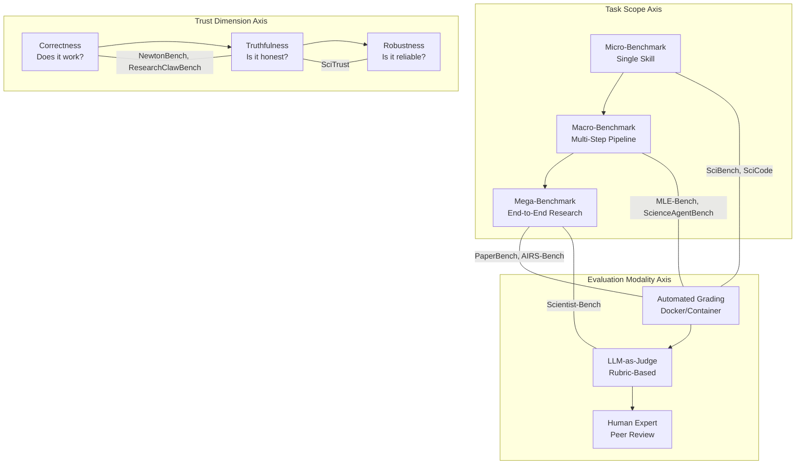

Evaluating autonomous research agents and scientific AI systems demands fundamentally different paradigms than traditional software testing. Where conventional benchmarks measure accuracy on static inputs, scientific evaluation must grapple with **open-ended discovery**, **multi-step reasoning under uncertainty**, and **verifiable novelty** — qualities that resist simple metric capture. This page maps the emerging landscape of benchmarks, evaluation frameworks, and trustworthiness assessments designed specifically for AI-driven scientific research, from end-to-end paper replication to interactive law discovery and trust auditing.

Sources: [README.md](README.md#L288-L306), [README.md](README.md#L461-L467)

## The Evaluation Landscape: A Conceptual Architecture

Before diving into individual benchmarks, it is essential to understand the **structural taxonomy** of what is being measured. Scientific AI evaluation decomposes along three orthogonal axes: **task scope** (isolated skill vs. full research lifecycle), **evaluation modality** (automated grading vs. human judgment vs. real-world execution), and **trust dimension** (correctness, honesty, robustness). The following diagram captures this architecture and positions the major benchmarks within it.

> [!TIP]
> When selecting a benchmark for your system, match the evaluation axis to your research question: use **macro-benchmarks** (MLE-Bench, ScienceAgentBench) for engineering capability, and **mega-benchmarks** (PaperBench, AIRS-Bench) only when your agent can sustain multi-hour autonomous workflows — premature mega-benchmarking yields uninformative failure modes.

Sources: [README.md](README.md#L288-L306), [README.md](README.md#L461-L467)

## End-to-End Research Replication Benchmarks

The most demanding class of benchmarks evaluates whether an AI agent can **replicate a complete scientific paper** from scratch — reading the paper, understanding the methodology, writing code, running experiments, and producing results that match the original findings. These benchmarks represent the gold standard for measuring autonomous research capability.

| Benchmark | Source Papers | Tasks | Evaluation Method | Key Innovation |
|-----------|--------------|-------|-------------------|----------------|
| **PaperBench** (OpenAI, 2025) | 20 ICML 2024 Spotlight/Oral | 8,316 gradable subtasks | Author-co-developed rubrics, hierarchical decomposition | Finest-grained replication scoring |
| **AIRS-Bench** (Meta, 2026) | 20 SOTA ML papers | 20 tasks (NLP, code, math, biochem, time series) | Normalized scoring across domains | Cross-domain normalization |
| **PaperGuru** (AutoTrustAI, 2026) | PaperBench + SurveyBench | 65.95% mean reproduction on PaperBench | Capital Chunk Memory (CCM) with versioned checkpoints | Lifecycle-Aware Memory primitive |
| **ResearchClawBench** (InternScience, 2026) | 40 real-science tasks | 10 disciplines, curated datasets | Re-discovery to new-discovery spectrum | Bridges known→novel discovery |

**PaperBench** stands out as the most granular replication benchmark: it decomposes 20 ICML 2024 Spotlight/Oral papers into 8,316 individually gradable tasks, with rubrics co-developed alongside the original paper authors. This hierarchical decomposition allows pinpointing exactly where an agent's replication pipeline fails — whether in understanding the method, implementing the algorithm, or matching experimental results. [README.md](README.md#L291-L292)

**AIRS-Bench** addresses a critical gap in cross-domain comparability. By normalizing scores across NLP, code, math, biochemical modeling, and time series forecasting, it enables meaningful comparison of an agent's research capability across scientific disciplines rather than conflating domain-specific difficulty with general research ability. [README.md](README.md#L290-L291)

**PaperGuru** introduces the **Lifecycle-Aware Memory (LAM)** primitive — a structured memory architecture that maintains versioned checkpoints of intermediate research artifacts. This achieves 65.95% mean reproduction on PaperBench and 94.66% on SurveyBench, demonstrating that long-horizon research agents require not just better reasoning but better memory management. [README.md](README.md#L292-L293)

**ResearchClawBench** uniquely spans the **re-discovery to new-discovery spectrum**. Its 40 tasks across 10 disciplines are curated from published papers with provided datasets, but the evaluation rubric distinguishes between agents that merely reproduce known results and those that can extend findings into genuinely novel territory. [README.md](README.md#L300-L301)

Sources: [README.md](README.md#L289-L301)

## ML Engineering & Scientific Agent Benchmarks

Beyond full paper replication, a second tier of benchmarks evaluates **intermediate research capabilities** — the ability to execute ML engineering tasks, work within scientific software environments, and solve domain-specific coding problems. These benchmarks are more tractable, faster to run, and increasingly serve as the primary evaluation harness for autonomous ML research agents.

| Benchmark | Tasks | Domain | Evaluation | Notable Results |
|-----------|-------|--------|------------|-----------------|
| **MLE-Bench** (OpenAI, 2024) | 75 Kaggle competitions | ML Engineering | Docker-based grading, human baselines | Primary benchmark for autonomous ML agents |
| **ScienceAgentBench** (ICLR 2025) | 102 tasks from 44 papers | 4 disciplines | Containerized evaluation | First science-specific agent benchmark |
| **ScienceBoard** (ICLR 2026) | Multimodal workflows | Real scientific software (KAlgebra, Celestia, Grass GIS, Lean 4) | VM-based infrastructure | Evaluates GUI-level agent interaction |
| **SciCode** (NeurIPS 2024) | 338 subproblems | 16 subdomains (physics, math, materials, bio, chem) | Gold-standard solutions | Scientist-curated coding benchmark |
| **BuildArena** | Physics-aligned tasks | Engineering construction (rockets, cars, bridges) | 3D physics simulator | First physics-interactive LLM agent benchmark |
| **Terminal-Bench Science** (Harbor, 2026) | Complex real-world workflows | Life, physical, earth, mathematical sciences | Terminal environment execution | Featured on model cards (Claude, Gemini) |

**MLE-Bench** has become the de facto standard for evaluating autonomous ML research agents. Its 75 curated Kaggle-style competitions with reproducible Docker-based grading provide a controlled yet realistic environment where agents must navigate the full ML lifecycle — data exploration, feature engineering, model selection, training, and submission. The inclusion of human baselines enables calibrated performance assessment. [README.md](README.md#L293-L294)

**ScienceAgentBench** represents the first science-specific agent benchmark, deriving 102 executable tasks from 44 peer-reviewed papers across four disciplines. Its containerized evaluation ensures reproducibility and isolates the agent's capability from infrastructure variability. [README.md](README.md#L289-L290)

**ScienceBoard** pushes evaluation into **real scientific software environments** — agents must interact with KAlgebra, Celestia, Grass GIS, and Lean 4 through graphical interfaces, testing not just code generation but multimodal interaction with professional scientific tools. This represents a significant shift toward evaluating agents in ecologically valid research settings. [README.md](README.md#L294-L295)

**SciCode** fills a critical gap with its **scientist-curated** approach: 338 subproblems across 16 subdomains with gold-standard solutions verified by domain experts. Unlike auto-generated benchmarks, these tasks reflect the actual coding challenges scientists face in their daily work. [README.md](README.md#L297-L298)

> [!TIP]
> **Terminal-Bench Science** is increasingly cited on frontier model cards (Claude, Gemini) as a primary evaluation metric. If you are benchmarking a new agent, including Terminal-Bench Science results alongside MLE-Bench provides both the community-standard and the emerging-standard evaluation signal.

Sources: [README.md](README.md#L289-L301)

## Scientific Reasoning & Law Discovery Benchmarks

A distinct category of evaluation focuses not on engineering execution but on **scientific reasoning itself** — the ability to discover laws, solve problems, and reason about physical systems. These benchmarks test the cognitive core of scientific AI rather than its operational execution.

**SciBench** evaluates college-level scientific problem-solving across multiple domains, establishing a baseline for whether AI systems can match human undergraduate-level scientific reasoning. [README.md](README.md#L298-L299)

**NewtonBench** (ICLR 2026) introduces a fundamentally novel evaluation paradigm: rather than testing whether an agent can *apply* known laws, it evaluates whether an agent can **rediscover** scientific laws through interactive experimentation. Its 324 tasks across 12 physics domains feature **memorization-resistant metaphysical shifts** of canonical laws — deliberately altering the mathematical form of known physical laws to ensure that agents must engage in genuine discovery rather than recalling trained knowledge. [README.md](README.md#L299-L300)

This memorization resistance is a critical design innovation. As LLMs increasingly memorize scientific knowledge from training data, benchmarks that test rote application become less informative. NewtonBench's metaphysical shifts force agents to demonstrate **experimental design** and **inductive reasoning** capabilities that cannot be shortcut through memorization.

Sources: [README.md](README.md#L298-L300)

## Trustworthiness & Academic Review Evaluation

Beyond capability, the scientific community demands that AI systems be **trustworthy** — producing truthful outputs, avoiding hallucination, and resisting sycophancy. The **SciTrust** framework (2024) provides a structured evaluation across three dimensions: truthfulness (does the model generate factually correct scientific claims?), hallucination (does the model fabricate citations, data, or results?), and sycophancy (does the model agree with incorrect premises to please the user?). [README.md](README.md#L296-L297)

Complementing trustworthiness evaluation, the **Academic Review & Evaluation** tools assess AI systems in the peer review context:

- **AgentReview** simulates entire academic peer review ecosystems using LLM agents, enabling study of how AI-generated reviews interact with human review processes. [README.md](README.md#L304-L305)
- **LLM-Peer-Review** provides a web application for LLM-assisted manuscript review and annotation, offering a practical tool for integrating AI into existing review workflows. [README.md](README.md#L305-L306)

The interplay between these two evaluation tracks — trustworthiness of scientific outputs and quality of AI-assisted peer review — represents one of the most consequential areas for the scientific community. As AI systems increasingly participate in both research production and research evaluation, ensuring their reliability across both roles becomes a civilizational imperative.

Sources: [README.md](README.md#L296-L306)

## Comparative Benchmark Selection Guide

Selecting the right benchmark requires understanding the **evaluation gap** you are trying to fill. The following decision matrix maps common evaluation goals to appropriate benchmarks:

| Evaluation Goal | Recommended Benchmark | Rationale |
|----------------|----------------------|-----------|
| Full research autonomy | PaperBench, AIRS-Bench | Tests end-to-end paper replication |
| ML engineering skill | MLE-Bench | 75 competitions with human baselines |
| Scientific coding | SciCode | 338 scientist-curated subproblems |
| Scientific reasoning | SciBench, NewtonBench | College-level to law discovery |
| Agent trustworthiness | SciTrust | Truthfulness, hallucination, sycophancy |
| GUI/software interaction | ScienceBoard | Real scientific software environments |
| Physics-interactive reasoning | BuildArena | 3D physics simulator with engineering tasks |
| Terminal-based workflows | Terminal-Bench Science | Real-world scientific terminal tasks |
| Novel discovery capability | ResearchClawBench | Re-discovery to new-discovery spectrum |
| Long-horizon memory | PaperGuru | Lifecycle-Aware Memory evaluation |

Sources: [README.md](README.md#L288-L306), [README.md](README.md#L461-L467)

## The Emerging Evaluation Frontier

The field is rapidly converging on several unresolved challenges that will shape the next generation of evaluation frameworks:

**Memorization resistance** — As benchmarks become part of training data, their signal degrades. NewtonBench's metaphysical shifts represent one approach; another is **dynamic benchmark generation** where tasks are synthesized on-the-fly from novel combinations of scientific principles. [README.md](README.md#L299-L300)

**Multi-modal evaluation** — ScienceBoard's VM-based evaluation of agents interacting with real scientific software points toward a future where benchmarks must evaluate not just text generation but **multimodal interaction** with graphical interfaces, physical instruments, and robotic systems. [README.md](README.md#L294-L295)

**Novelty assessment** — ResearchClawBench's spectrum from re-discovery to new-discovery highlights the fundamental challenge: how do you evaluate whether an AI system has made a genuinely novel scientific contribution? Current benchmarks can verify replication, but **assessing novelty** remains an open problem requiring integration with human expert judgment. [README.md](README.md#L300-L301)

**Trust at scale** — SciTrust's evaluation of truthfulness, hallucination, and sycophancy must scale from individual claims to entire research outputs. As AI systems generate complete papers, the trust evaluation must evolve from point-checking to **systemic audit** of entire research artifacts. [README.md](README.md#L296-L297)

For developers building evaluation pipelines, the practical path forward is to **layer benchmarks**: start with MLE-Bench or SciCode for engineering capability, add SciTrust for trustworthiness, and graduate to PaperBench or ResearchClawBench only when the system demonstrates sufficient reliability on lower-tier evaluations. The [Autonomous Research Systems](10-autonomous-research-systems) page provides the agent architectures these benchmarks are designed to evaluate; the [Datasets & Benchmarks](23-datasets-and-benchmarks) page covers the broader data infrastructure supporting evaluation across all scientific domains.
