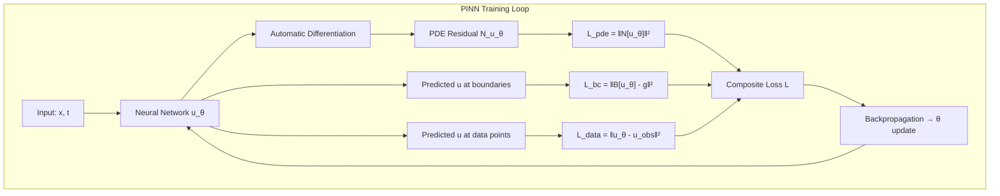

Physics-Informed Neural Networks (PINNs) represent a paradigm shift in scientific computing: instead of relying solely on data to train a neural network, PINNs embed the governing physical laws—typically partial differential equations (PDEs)—directly into the loss function. This convergence of deep learning and classical physics enables solutions to forward problems (solving PDEs), inverse problems (parameter estimation), and data assimilation even in **data-scarce regimes** where traditional ML fails. This page maps the PINN ecosystem curated in the Awesome AI for Science repository, covering frameworks, key papers, and the architectural principles that make PINNs work.

Sources: [README.md](/README.md#L355-L363), [README.md](/README.md#L389-L391)

## Core Architecture: How PINNs Work

The fundamental insight behind PINNs is elegant: a neural network *u(x, t; θ)* approximates the solution to a PDE, and the PDE residual—computed via automatic differentiation—becomes part of the training loss. The network is thus "informed" by physics rather than merely fitting data. Consider a general PDE: *N[u] = 0* with boundary/initial conditions *B[u] = 0*. The PINN composite loss is:

**L = L_data + λ_pde · L_pde + λ_bc · L_bc + λ_ic · L_ic**

where *L_pde* penalizes PDE residual violations at collocation points, *L_bc* and *L_ic* enforce boundary and initial conditions, and *L_data* fits any available measurements. The weighting coefficients λ are critical hyperparameters that govern the balance between data fidelity and physics compliance.

> [!TIP]
> The collocation points where PDE residuals are evaluated are *not* training data—they are sampled throughout the domain (often via Latin Hypercube or Sobol sequences). More collocation points in regions of high solution complexity (e.g., boundary layers, shock fronts) dramatically improves convergence.

Sources: [README.md](/README.md#L355-L363), [README.md](/README.md#L389-L391)

## Framework Landscape

The PINN ecosystem spans multiple programming languages and design philosophies, from lightweight Python libraries to full-scale industrial platforms. The following table compares the key frameworks catalogued in this repository:

| Framework | Language | Backend | Key Strength | Stars/Scale |
|---|---|---|---|---|
| **DeepXDE** | Python | TensorFlow/PyTorch/JAX | Broad PDE support, multi-backend flexibility | Community standard |
| **PINNs** (Raissi) | Python | TensorFlow | Original reference implementation | Foundational |
| **NVIDIA PhysicsNeMo** | Python | PyTorch | Industrial-scale physics-ML, GPU optimization | Enterprise-grade |
| **PINA** | Python | PyTorch | Advanced PINN modeling, modular design | Research-focused |
| **NeuroMANCER** | Python | PyTorch | System ID + constrained optimization + MPC | PNNL (DOE lab) |
| **SciANN** | Python | Keras | Keras simplicity for scientific computing | Beginner-friendly |
| **NeuralPDE.jl** | Julia | Flux.jl/Zygote | High-performance Julia ecosystem, 1.1K+ stars | SciML ecosystem |

> [!TIP]
> Choosing between DeepXDE and NeuralPDE.jl is often the most consequential architectural decision. DeepXDE offers the lowest barrier to entry with Python and multi-backend support. NeuralPDE.jl unlocks the Julia SciML ecosystem (DifferentialEquations.jl, DiffEqFlux.jl, ModelingToolkit.jl) for hybrid neural-ODE/PINN workflows at the cost of learning a new language stack.

Sources: [README.md](/README.md#L355-L363), [README.md](/README.md#L862-L867)

### DeepXDE — The General-Purpose Workhorse

**DeepXDE** is the most widely adopted PINN library, supporting complex geometries, multiple PDE types (ODE, PDE, integro-differential equations), and five backend engines (TensorFlow, PyTorch, JAX, PaddlePaddle, and mindspore). Its architecture supports multi-domain problems, time-dependent PDEs, and inverse problems natively. The library's design philosophy prioritizes API simplicity—a typical forward problem can be specified in under 30 lines of code, while the library handles collocation point generation, residual computation, and adaptive training internally.

Sources: [README.md](/README.md#L356-L356)

### NVIDIA PhysicsNeMo — Industrial Scale

Renamed from Modulus in 2025, **NVIDIA PhysicsNeMo** targets production-grade physics-ML at scale. It provides GPU-optimized implementations, multi-GPU training, and integration with NVIDIA's hardware stack. PhysicsNeMo is particularly suited for engineering applications—CFD, structural mechanics, and electromagnetic simulation—where inference speed and model deployment matter as much as training accuracy. The framework supports both PINN and neural operator approaches, making it a bridge between the two paradigms covered in this catalog.

Sources: [README.md](/README.md#L359-L359)

### NeuroMANCER — Beyond PDEs to Control

**NeuroMANCER** from Pacific Northwest National Laboratory extends the PINN paradigm into system identification and model predictive control (MPC). It integrates neural operators, neural ODEs, KANs, SINDy, and differentiable physics into a unified differentiable programming framework. This makes it uniquely positioned for applications where PINNs are not just solving PDEs but are embedded within closed-loop control systems—chemical process control, energy systems optimization, and autonomous vehicle trajectory planning.

Sources: [README.md](/README.md#L361-L361)

### The Julia SciML Ecosystem

**NeuralPDE.jl** is the Julia entry point for PINNs, but its real power emerges when combined with the broader SciML ecosystem: **DifferentialEquations.jl** (3K+ stars) for high-performance ODE/PDE solvers, **DiffEqFlux.jl** for neural differential equations, **ModelingToolkit.jl** for acausal modeling, and **Optimization.jl** for unified optimization interfaces. This ecosystem enables hybrid approaches where a neural network approximates part of a PDE while a classical solver handles the rest—something that is far more difficult in Python-only frameworks.

Sources: [README.md](/README.md#L862-L869), [README.md](/README.md#L346-L351)

## Emerging Frontiers

### LLM-Driven PINN Construction

**Lang-PINN** (ICLR 2026) represents a paradigm shift: instead of manually coding PDEs and boundary conditions, an LLM-driven multi-agent system interprets natural language task descriptions and automatically constructs trainable PINNs. This achieves 3–5 orders of magnitude MSE reduction and 50%+ execution success improvement over manual specification. The implication is profound—domain experts in physics or engineering can describe their problem in plain language and obtain a working PINN without writing a single line of neural network code.

Sources: [README.md](/README.md#L357-L357)

### Integration with Neural Operators

PINNs solve a *specific instance* of a PDE; neural operators (like DeepONet, Fourier Neural Operator) learn the *mapping* from parameter space to solution space. The two approaches are complementary: PINNs provide physics-constrained accuracy for individual problems, while neural operators provide amortized speed across parameter families. Frameworks like **NVIDIA PhysicsNeMo** and **NeuroMANCER** already support both, and the [Neural Operators & Model Discovery](14-neural-operators-and-model-discovery) page explores this synergy in depth.

Sources: [README.md](/README.md#L365-L376), [README.md](/README.md#L359-L359)

### Uncertainty Quantification

A critical challenge for PINNs in scientific applications is quantifying uncertainty—knowing not just the prediction but the confidence interval. The survey by Psaros et al. (J. Comput. Phys. 2023) provides a comprehensive framework for UQ in PINNs and neural operators, covering Bayesian PINNs, dropout-based uncertainty, and ensemble methods. For production scientific applications, UQ is not optional; it is the difference between a research prototype and a trustworthy computational tool.

Sources: [README.md](/README.md#L420-L420)

## Foundational Literature

The PINN field rests on a small set of foundational papers that every practitioner should know:

| Paper | Year | Significance |
|---|---|---|
| [Physics-Informed Neural Networks](https://arxiv.org/abs/1711.10561) (Raissi et al.) | 2017 | **The original paper** defining the PINN paradigm |
| [Scientific Machine Learning through PINNs: Where we are and What's next](https://arxiv.org/abs/2201.05624) | 2022 | Comprehensive review of the field's progress |
| [Physics-Informed Neural Networks and Extensions](https://arxiv.org/abs/2408.16806) | 2024 | Recent advances and variant architectures |
| [Uncertainty quantification in scientific ML](https://www.sciencedirect.com/science/article/abs/pii/S0021999122009652) | 2023 | UQ framework for PINNs and neural operators |

For deeper exploration, the [PINNpapers](https://github.com/idrl-lab/PINNpapers) repository maintains a curated collection of PINN research papers, and the [SciML Papers](https://sciml.ai/papers/) repository covers the broader scientific computing with ML landscape.

Sources: [README.md](/README.md#L389-L391), [README.md](/README.md#L410-L411), [README.md](/README.md#L420-L420), [README.md](/README.md#L911-L912)

## Learning Path & Community

For developers entering the PINN space, the recommended progression is:

1. **Understand the math** — Review the original Raissi et al. (2017) paper and the 2022 comprehensive review
2. **Start with DeepXDE** — The lowest barrier to entry with excellent documentation and multi-backend support
3. **Explore Julia SciML** — For hybrid neural-PDE workflows requiring classical solver integration
4. **Scale with PhysicsNeMo** — For production deployments requiring GPU optimization and neural operator support
5. **Watch the community** — The [Physics Informed Machine Learning YouTube channel](https://www.youtube.com/c/PIML) provides ongoing tutorials, and the [SciML Book](https://github.com/SciML/SciMLBook) (MIT 18.337J/6.338J) offers rigorous course materials

Sources: [README.md](/README.md#L922-L923), [README.md](/README.md#L902-L902)

## Next Steps in Scientific Machine Learning

PINNs are one pillar of the broader Scientific Machine Learning ecosystem. To continue your exploration:

- **[Neural Operators & Model Discovery](14-neural-operators-and-model-discovery)** — Learn how operators learn entire solution families, and how symbolic regression discovers governing equations from data
- **[Neural Differential Equations](15-neural-differential-equations)** — The companion paradigm where neural networks parameterize ODE right-hand sides, enabling continuous-depth models
- **[Computing Frameworks](22-computing-frameworks)** — The infrastructure layer (SciML ecosystem, PaddleScience, JAX-CFD) that powers all of these approaches
- **[Datasets & Benchmarks](23-datasets-and-benchmarks)** — Standardized evaluation for comparing PINN variants and neural operators
- **[Key Papers & Reviews](24-key-papers-and-reviews)** — The full literature landscape across all AI for Science topics
