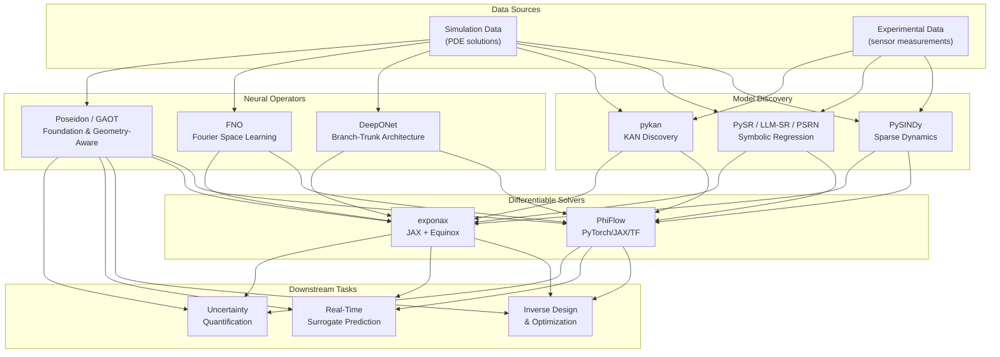

Neural operators and model discovery represent two complementary pillars of scientific machine learning: **neural operators** learn infinite-dimensional mappings between function spaces—replacing costly PDE solvers with fast, differentiable surrogates—while **model discovery** extracts closed-form, interpretable governing equations from data. Together, they close the loop from observation to prediction: discovery yields the *structure* of a physical law, and neural operators provide the *computational machinery* to evaluate it at scale. This page catalogs the tools, frameworks, and foundational resources that enable both paradigms, drawn from the Awesome AI for Science collection.

Sources: [README.md](/README.md#L365-L377)

---

## Conceptual Architecture

Understanding how neural operators and model discovery relate requires seeing their positions within the broader scientific machine learning pipeline. The diagram below traces the data flow from raw observations through equation discovery and operator learning to downstream scientific tasks.

The pipeline splits into two parallel tracks that converge at differentiable solvers: **model discovery** extracts symbolic equations from data, while **neural operators** learn continuous operator mappings. Both tracks depend on differentiable PDE solvers for training and evaluation, and both feed into downstream scientific tasks like inverse design, real-time prediction, and uncertainty quantification.

Sources: [README.md](/README.md#L365-L377)

---

## Neural Operators — Learning Maps Between Function Spaces

Traditional neural networks learn mappings between finite-dimensional vectors. **Neural operators** generalize this: they learn mappings between infinite-dimensional function spaces, enabling a single trained model to generalize across different discretizations, geometries, and boundary conditions without retraining. This is the core capability that makes them transformative for PDE-constrained scientific computing.

### Core Neural Operator Architectures

The field has converged on several foundational architectures, each with distinct inductive biases for learning operator mappings.

| Tool | Architecture | Key Innovation | Ideal Use Case |
|------|-------------|----------------|----------------|
| **DeepONet** | Branch-trunk decomposition | Universal Approximation Theorem for operators; branch net encodes input functions, trunk net encodes query locations | General operator learning; well-established theoretical guarantees |
| **Fourier Neural Operator (FNO)** | Spectral convolution in Fourier space | Global receptive field via FFT; resolution-invariant; O(N log N) complexity | Periodic or large-domain PDEs; fast inference across resolutions |
| **Poseidon** | Pretrained transformer-based operator | Foundation model paradigm: pretrain on diverse PDEs, finetune downstream; HuggingFace integration | Multi-task PDE solving; transfer learning across equation families |
| **GAOT** | Geometry-aware transformer | Handles arbitrary domains with geometric priors; invariant to mesh structure | Complex geometries; irregular domains where standard FNO struggles |

**DeepONet** pioneered the branch-trunk architecture grounded in the Universal Approximation Theorem for operators, providing rigorous theoretical foundations. The **Fourier Neural Operator** shifted the paradigm to spectral space, achieving global information flow through FFT-based convolutions and enabling resolution-invariant inference. More recently, **Poseidon** and **GAOT** from ETH Zurich's CAMLab introduce foundation-model thinking—pretraining on diverse PDE families and finetuning for specific tasks—and geometric awareness for arbitrary domain shapes, respectively.

Sources: [README.md](/README.md#L366-L374)

### Differentiable PDE Solvers — The Training Infrastructure

Neural operators cannot be trained in isolation; they require differentiable PDE solvers as the computational backbone for physics-based loss computation, data generation, and end-to-end training loops. Two frameworks in this collection stand out for their maturity and framework support.

| Framework | Backend(s) | Built-in Physics | Key Differentiator |
|-----------|-----------|-----------------|-------------------|
| **PhiFlow** | PyTorch, JAX, TensorFlow | Fluid simulation (Navier-Stokes) | Multi-backend flexibility; built-in fluid simulation; mature API |
| **exponax** | JAX + Equinox | 46+ built-in PDEs | Fourier spectral methods; exponential time differencing; full auto-differentiation |

**PhiFlow** provides the broadest backend compatibility—supporting PyTorch, JAX, and TensorFlow—making it the natural choice for teams with existing ML infrastructure. Its built-in fluid simulation capabilities allow direct integration of physics constraints into neural operator training. **exponax** takes a different approach: built on JAX and Equinox, it ships 46+ pre-implemented PDE solvers using Fourier spectral methods and exponential time differencing, providing a turnkey solution for researchers who need rapid prototyping of physics-based deep learning workflows with full automatic differentiation.

> [!TIP]
> When choosing between PhiFlow and exponax, consider your team's framework investment: PhiFlow for multi-backend flexibility and existing PyTorch/TF pipelines, exponax for JAX-native workflows with maximal PDE variety out of the box.

Sources: [README.md](/README.md#L375-L376)

---

## Model Discovery — Extracting Equations from Data

While neural operators provide fast surrogates, they remain black boxes. **Model discovery** inverts the problem: given observational data, discover the underlying governing equations in closed, interpretable form. This is the path from data to understanding, producing equations that scientists can inspect, validate, and extend.

### Symbolic Regression — Searching Equation Space

Symbolic regression searches the space of mathematical expressions to find the best-fitting equation, balancing accuracy with complexity. The tools in this collection span three generations of sophistication.

| Tool | Approach | Speed | Key Strength | Venue |
|------|---------|-------|-------------|-------|
| **PySR** | Multi-population evolutionary search (Python/Julia) | High | Battle-tested; widely adopted in physics & astronomy; interpretable | NeurIPS 2023 |
| **LLM-SR** | LLM code generation + evolutionary search | Medium | Leverages LLM reasoning for structured search; better equation priors | ICLR 2025 Oral |
| **PSRN** | GPU-parallel evaluation of millions of expressions | Very High | Automated subtree reuse; scales to massive expression search | Nature Comp. Sci. 2026 |

**PySR** is the established workhorse—its multi-population evolutionary search with a Python frontend and Julia backend has made it the go-to symbolic regression tool in physics and astronomy. **LLM-SR** represents a paradigm shift: by combining LLM code generation with evolutionary search, it leverages the structured reasoning of language models to propose more physically meaningful equation forms, earning an ICLR 2025 Oral designation. **PSRN** pushes the frontier of raw speed: by evaluating millions of expressions in parallel on GPU with automated subtree reuse, it makes exhaustive symbolic search tractable at scales previously impossible, earning a Nature Computational Science cover feature.

### Sparse Dynamics Identification

**PySINDy** takes a complementary approach to symbolic regression. Rather than searching the full space of mathematical expressions, it assumes the governing dynamics are *sparse* in a given library of candidate functions—meaning only a few terms are active. It uses sparse regression (typically Sequentially Thresholded Least Squares) to identify which terms matter, yielding parsimonious dynamical systems models directly from time-series data. This sparsity prior makes it particularly effective for systems where the true dynamics are known to be low-complexity, such as fluid flows, oscillators, and reaction networks.

Sources: [README.md](/README.md#L367-L370)

### Kolmogorov-Arnold Networks — Architecture-Level Discovery

**pykan** (Kolmogorov-Arnold Networks) introduces a fundamentally different approach to model discovery. Instead of discovering equations post-hoc, KANs embed interpretability at the architecture level: learnable activation functions reside on *edges* (rather than fixed activations on *nodes* as in MLPs). This means the network itself can be decomposed into interpretable symbolic expressions after training, effectively performing model discovery as a byproduct of learning. KANs have demonstrated strong performance in function fitting, PDE solving, and scientific discovery tasks, offering an alternative to traditional MLPs when interpretability is paramount.

> [!TIP]
> KANs are not a drop-in replacement for MLPs in all settings—they excel when the underlying function has compositional structure that can be captured by the Kolmogorov-Arnold representation. For purely predictive tasks without interpretability needs, standard architectures may remain more efficient.

Sources: [README.md](/README.md#L371-L371)

---

## Tool Selection Guide

Choosing the right tool depends on your scientific objective, data characteristics, and interpretability requirements. The following decision framework maps common scenarios to recommended tools.

| Scenario | Recommended Tool(s) | Rationale |
|----------|-------------------|-----------|
| Need fast PDE surrogate across varying geometries | GAOT + PhiFlow | Geometry-aware operators handle irregular domains; PhiFlow provides training infrastructure |
| Transfer learning across PDE families | Poseidon | Foundation model pretrained on diverse PDEs; HuggingFace finetuning pipeline |
| Discover interpretable equations from experimental data | PySR or PySINDy | PySR for general expression search; PySINDy when sparsity assumption holds |
| Need both speed and interpretability | PSRN + pykan | PSRN for exhaustive GPU-accelerated search; KANs for architecture-level interpretability |
| LLM-assisted equation discovery with domain knowledge | LLM-SR | LLM reasoning incorporates physical priors into the search process |
| General operator learning with theoretical guarantees | DeepONet | Branch-trunk architecture with proven universal approximation |
| Resolution-invariant PDE solving on periodic domains | FNO | Spectral convolutions provide global receptive field; resolution-invariant by design |
| JAX-native prototyping with many PDE types | exponax | 46+ built-in equations; Fourier spectral methods; full auto-differentiation |

Sources: [README.md](/README.md#L365-L377)

---

## Key Papers & Surveys

The following curated papers from the collection provide the theoretical foundations and comparative analyses needed to go deeper into neural operators and model discovery.

- **From Theory to Application: A Practical Introduction to Neural Operators in Scientific Computing** (2025) — Implementation-focused guide covering DeepONet, FNO, and PCANet with hands-on guidance. [arXiv:2503.05598](https://arxiv.org/abs/2503.05598)
- **Architectures, Variants, and Performance of Neural Operators: A Comparative Review** (2025) — Systematic analysis of DeepONets, integral kernel operators, and transformer-based neural operators. [ScienceDirect](https://www.sciencedirect.com/science/article/abs/pii/S0925231225011907)
- **Uncertainty Quantification in Scientific Machine Learning: Methods, Metrics, and Comparisons** (J. Comput. Phys. 2023) — Comprehensive UQ framework for PINNs and neural operators. [ScienceDirect](https://www.sciencedirect.com/science/article/abs/pii/S0021999122009652)

Sources: [README.md](/README.md#L413-L421)

---

## Adjacent Topics & Next Steps

Neural operators and model discovery sit at the intersection of several related scientific machine learning areas. The following pages in this catalog provide deeper coverage of adjacent topics:

- **[Physics-Informed Neural Networks](13-physics-informed-neural-networks)** — Neural operators often incorporate physics constraints via PINN-style loss terms; understanding PINNs is essential for hybrid approaches.
- **[Neural Differential Equations](15-neural-differential-equations)** — Neural ODEs and SDEs provide the continuous-time formulation that neural operators discretize; these are the theoretical bedrock.
- **[Computing Frameworks](22-computing-frameworks)** — Production deployment of neural operators requires GPU-accelerated solvers and simulation frameworks covered in this section.
- **[Datasets & Benchmarks](23-datasets-and-benchmarks)** — Standardized PDE benchmarks are essential for fair comparison of neural operator architectures.
- **[Key Papers & Reviews](24-key-papers-and-reviews)** — Broader survey papers on scientific machine learning that contextualize neural operators within the field.
