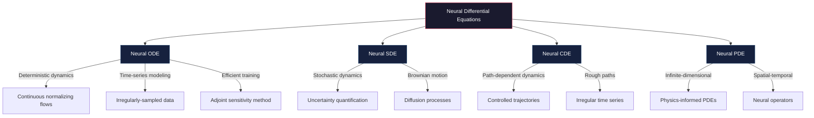
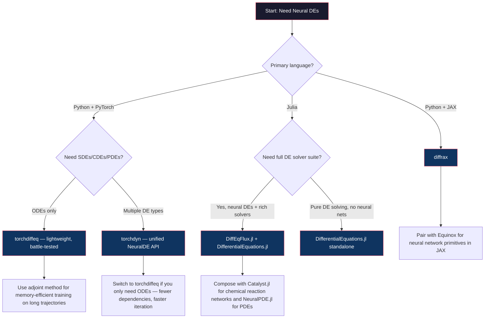
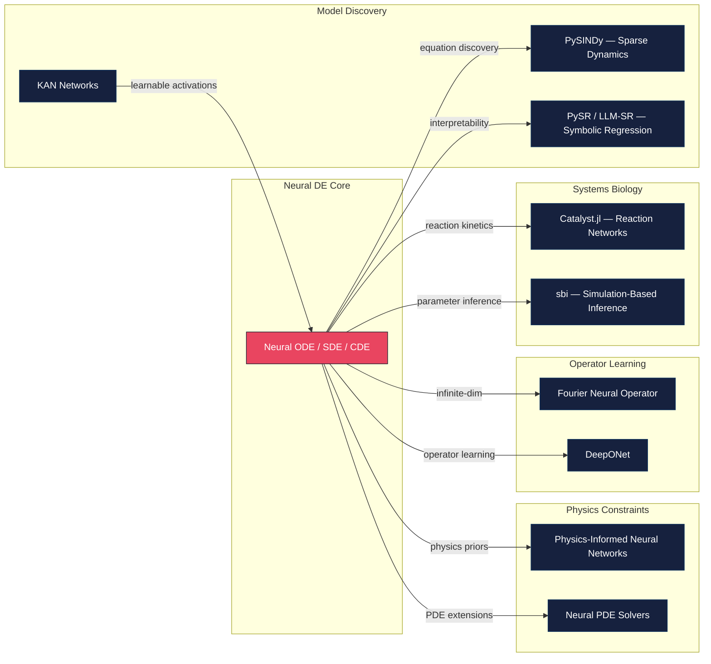

Neural Differential Equations (Neural DEs) represent a paradigm shift in how we model continuous dynamical systems — replacing hand-crafted differential equations with **learned vector fields parameterized by neural networks**. Rather than discretizing time and stacking layers, a Neural DE defines a continuous transformation governed by an ODE, SDE, or PDE whose dynamics are discovered from data. This approach unifies deep learning with the centuries-old mathematical framework of differential equations, enabling models that are **memory-efficient during backpropagation**, **adaptive in computational depth**, and **naturally suited to irregularly-sampled time series**. This page surveys the core libraries and foundational ideas cataloged in the Awesome AI for Science repository, providing the conceptual scaffolding an intermediate developer needs to select the right tool and understand the architectural landscape.

Sources: [README.md](README.md#L345-L351), [README.md](README.md#L388-L390)

## The Core Idea: From Discrete Layers to Continuous Dynamics

A standard residual network computes `h_{t+1} = h_t + f(h_t, θ)`, which is an Euler discretization of an ordinary differential equation. A **Neural ODE** takes this observation to its logical conclusion: instead of a fixed number of discrete steps, it defines the hidden state evolution as a continuous trajectory `dz/dt = f(z(t), t, θ)` and solves it with an adaptive numerical integrator. The key insight is that the **same neural network f** parameterizes the velocity field at every point in time, and the integrator decides how many function evaluations are needed — trading precision for compute at inference time. Gradients are computed via the **adjoint sensitivity method**, which reconstructs the backward pass by solving a companion ODE in reverse time, yielding O(1) memory cost regardless of the number of forward evaluations.

Sources: [README.md](README.md#L388-L390)

## Architectural Taxonomy

Neural DEs are not a single architecture but a family, each member extending the continuous-depth paradigm to a different class of differential equations. The following diagram maps the primary variants and their relationships:

| Variant | Governing Equation | Strengths | Typical Use Cases |
|---|---|---|---|
| **Neural ODE** | `dz/dt = f(z(t), t, θ)` | Deterministic, memory-efficient, adaptive computation | Continuous normalizing flows, time-series interpolation, generative modeling |
| **Neural SDE** | `dz = f(z,t)dt + g(z,t)dW` | Stochastic dynamics, built-in uncertainty quantification | Financial modeling, stochastic physics, diffusion-based generation |
| **Neural CDE** | `dz = f(z,t)dX(t)` | Path-dependent, handles irregular observations | Clinical time series, event-driven data, signature methods |
| **Neural PDE** | `∂u/∂t = F(u, ∇u, ∇²u, ...)` | Spatial-temporal, infinite-dimensional | Fluid dynamics, climate modeling, wave propagation |

Sources: [README.md](README.md#L345-L351)

## Library Landscape: Choosing the Right Framework

The Awesome AI for Science repository catalogs five libraries spanning two ecosystems — **PyTorch** and **JAX** on the Python side, and **Julia's SciML** ecosystem on the other. The choice between them is not merely a language preference; it determines the **solver depth**, **GPU acceleration strategy**, and **composability** with the rest of your scientific computing stack.

### PyTorch Ecosystem

| Library | Core Focus | Key Differentiator | Solver Coverage |
|---|---|---|---|
| **[torchdiffeq](https://github.com/rtqichen/torchdiffeq)** | Neural ODEs in PyTorch | Reference implementation by Chen et al. (NeurIPS 2018); adjoint method for O(1) memory backprop | `odeint` with dopri5, dopri8, adaptive_heun, rk4, euler |
| **[torchdyn](https://github.com/DiffEqML/torchdyn)** | Broad neural DE family in PyTorch | Extends beyond ODEs to SDEs, CDEs, and PDEs; includes continuous normalizing flows and energy-based models | Unified `NeuralDE` interface across ODE/SDE/CDE variants |

### JAX Ecosystem

| Library | Core Focus | Key Differentiator | Solver Coverage |
|---|---|---|---|
| **[diffrax](https://github.com/patrick-kidger/diffrax)** | Differential equation solvers in JAX | First-class JAX integration; `jax.jit`-compatible; supports SDEs, CDEs, and stiff ODEs; `diffrax.experimental` for cutting-edge solvers | Tsit5, Kvaerno, Dopri8, implicit Euler, and custom solvers via `Solver` protocol |

### Julia SciML Ecosystem

| Library | Core Focus | Key Differentiator | Solver Coverage |
|---|---|---|---|
| **[DifferentialEquations.jl](https://github.com/SciML/DifferentialEquations.jl)** | Comprehensive DE solving suite | 300+ solvers; best-in-class stiff/non-stiff handling; event handling; automatic stiffness detection and solver switching | ODE/SDE/DAE/DDE/PDE with 1000+ algorithm combinations |
| **[DiffEqFlux.jl](https://github.com/SciML/DiffEqFlux.jl)** | Neural DEs in Julia | O(1) backprop via adjoint; GPU support; composable with entire SciML ecosystem (Catalyst.jl, NeuralPDE.jl, etc.) | Wraps all DifferentialEquations.jl solvers with neural network parameterization |

Sources: [README.md](README.md#L345-L351), [README.md](README.md#L861-L868)

## Decision Framework: Which Library Fits Your Project?

The following flowchart guides you through the key architectural decisions when selecting a Neural DE library:

> [!TIP]
> When choosing between **torchdiffeq** and **torchdyn**, start with torchdiffeq if your problem is strictly ODE-based — it has fewer moving parts and a larger community of reproducible experiments. Switch to torchdyn only when you need the broader DE type coverage (SDEs, CDEs) or its built-in continuous normalizing flow modules.

> [!TIP]
> If your work involves stiff equations or requires automatic stiffness detection (common in chemical kinetics and systems biology), the **Julia SciML ecosystem** is substantially more capable — its 300+ solvers and automatic algorithm switching handle edge cases that PyTorch/JAX libraries cannot yet address.

Sources: [README.md](README.md#L345-L351), [README.md](README.md#L861-L868)

## The Adjoint Method: Why Memory is O(1)

The defining engineering challenge of Neural DEs is **backpropagation through an ODE solver**. Naively, you would unroll the solver's internal steps and store every intermediate state — costing O(N) memory where N is the number of solver evaluations. The **adjoint sensitivity method** avoids this entirely. Instead of storing the forward trajectory, it solves a *reverse-time* ODE (the adjoint equation) that reconstructs the gradients on-the-fly. The memory cost becomes O(1) with respect to the number of solver steps, at the cost of a modest constant-factor increase in compute. All five cataloged libraries implement this method, though the exact formulation differs: **torchdiffeq** uses the original Chen et al. algorithm, **diffrax** implements a more numerically stable version with implicit checkpointing, and **DiffEqFlux.jl** offers both the standard adjoint and a checkpointed adjoint for long-time integration.

Sources: [README.md](README.md#L345-L351), [README.md](README.md#L867)

## Composability with the Broader SciML Stack

Neural DEs rarely exist in isolation. The following diagram illustrates how they compose with adjacent tools in the scientific machine learning ecosystem:

A particularly powerful workflow combines **Neural DEs with symbolic regression** (e.g., PySINDy or PySR): train a Neural ODE to learn the dynamics from data, then use symbolic regression to extract an interpretable, closed-form equation from the learned vector field. This **neural-to-symbolic pipeline** bridges the gap between black-box prediction and scientific understanding. Similarly, the Julia ecosystem's **Catalyst.jl** provides a chemical reaction network interface that composes directly with DiffEqFlux.jl, enabling neural-augmented reaction kinetics where part of the mechanism is known and part is learned.

Sources: [README.md](README.md#L352-L353), [README.md](README.md#L365-L376), [README.md](README.md#L861-L868)

## Foundational Reference

The field was inaugurated by the landmark paper **"Neural Ordinary Differential Equations"** (Chen et al., NeurIPS 2018, Best Paper Award), which introduced the adjoint method for training Neural ODEs and demonstrated continuous normalizing flows with O(1) memory cost. This paper is cataloged in the repository's Foundational Papers section alongside the Physics-Informed Neural Networks paper (Raissi et al., 2017) — together, these two works define the dual pillars of modern scientific machine learning: **learning dynamics from data** (Neural DEs) and **encoding physics into networks** (PINNs).

Sources: [README.md](README.md#L388-L390)

## Recommended Reading Path

Neural Differential Equations sit at the intersection of several scientific ML topics. To deepen your understanding:

1. **[Physics-Informed Neural Networks](13-physics-informed-neural-networks)** — the complementary paradigm where physics constraints are encoded as loss terms rather than learned dynamics
2. **[Neural Operators & Model Discovery](14-neural-operators-and-model-discovery)** — extends Neural DEs to infinite-dimensional operator learning and symbolic equation discovery
3. **[Computing Frameworks](22-computing-frameworks)** — the broader SciML ecosystem including DifferentialEquations.jl, ModelingToolkit.jl, and the educational SciML Book
4. **[Key Papers & Reviews](24-key-papers-and-reviews)** — comprehensive surveys on scientific machine learning and uncertainty quantification
