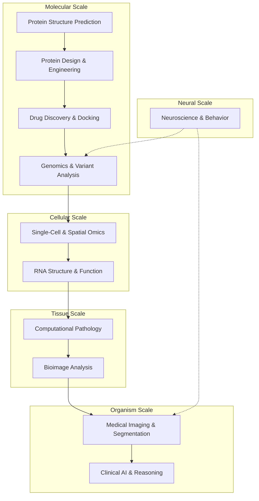

AI is reshaping the life sciences at every scale — from atomic-level protein folding to population-level clinical reasoning. This page maps the landscape of AI tools, models, and frameworks that accelerate **biological discovery and medical practice**, organized by domain and computational paradigm. Whether you are designing a novel protein binder, annotating single-cell transcriptomes, or deploying a pathology foundation model in a clinical pipeline, this guide provides the architectural context to navigate the ecosystem.

Sources: [README.md](/README.md#L472-L669)

## Architecture Overview

The Biology & Medicine AI ecosystem operates across five interconnected layers, each targeting a distinct biological scale and set of computational challenges. Understanding this layering is critical for selecting the right tool and for designing pipelines that span multiple scales.

The diagram above illustrates the **multi-scale dependency chain**: genomics informs transcriptomics, which feeds into tissue-level pathology, which underpins clinical decision-making. Tools at each layer increasingly consume outputs from adjacent layers — for instance, a pathology foundation model may leverage spatial transcriptomics embeddings, while a clinical reasoning agent may call a docking tool internally.

Sources: [README.md](/README.md#L472-L669)

## Protein & Drug Discovery

Protein structure prediction and drug discovery represent the most mature and impactful applications of AI in biology. The field has undergone a paradigm shift since AlphaFold2's breakthrough in 2020, moving from prediction-only to **end-to-end design** of novel biomolecules.

### Structure Prediction: The AlphaFold Ecosystem

The AlphaFold family has become the backbone of structural biology. The ecosystem now spans multiple implementations, each optimized for different use cases:

| Tool | What It Does | Key Differentiator | License |
|------|-------------|-------------------|---------|
| **AlphaFold3** | Unified biomolecular structure prediction (proteins, nucleic acids, small molecules, ions, PTMs) | Predicts complexes beyond just proteins | Apache 2.0 |
| **OpenFold3** | Fully open-source reproduction of AlphaFold3 | Apache 2.0 for commercial use | Apache 2.0 |
| **Boltz** | First open-source model matching AlphaFold3 accuracy | 1000× faster binding affinity prediction | MIT |
| **Boltz-2** | Joint structure + binding affinity prediction | FEP-level accuracy (~0.62 Pearson on FEP+) | MIT |
| **Chai-1** | Multi-modal foundation model for biomolecular prediction | Optional MSA/template support | BSD-3 |
| **ColabFold** | Accessible AlphaFold/ESMFold via cloud | AF3 JSON export, database updates | MIT |
| **Protenix** | Trainable PyTorch reproduction of AlphaFold3 | ByteDance's reimplementation | MIT |
| **SimpleFold** | Flow-matching protein folding, 3B params | Apple's general-purpose transformer approach | Apache 2.0 |

> [!TIP]
> When choosing a structure prediction tool, consider your *output type*: if you need only protein monomers, **ESMFold** or **ColabFold** suffice. For protein-ligand complexes, **Boltz-2** or **AlphaFold3** are required. For commercial deployment, **OpenFold3** is the safest choice due to its Apache 2.0 license.

Beyond prediction, the **cryo-EM** subfield has its own AI stack: **CryoDRGN** models continuous 3D structure distributions from single-particle images, while **ModelAngelo** performs automatic atomic model building directly from cryo-EM density maps.

Sources: [README.md](/README.md#L474-L503)

### Protein Design: From Sequence to Function

The design frontier has moved from backbone hallucination to **all-atom, programmable, state-switching protein engineering**. The major design paradigms are:

**Flow-based generative models** dominate the current landscape. **Proteina** (NVIDIA, ICLR 2025 Oral) uses hierarchical fold class labels for controllable de novo backbone generation. **La-Proteina** extends this to jointly generate sequence and full atomistic structure including side chains. **Proteina-Complexa** targets atomistic binder design with test-time optimization. **RFdiffusion3** (RosettaCommons) delivers 10× speedup with atom-level precision for general protein structure design.

**Diffusion-based models** include **Chroma** (GenerateBio) for programmable protein design with composable conditioners, **EvoDiff** (Microsoft) for evolutionary-scale discrete diffusion over protein sequences, **Genie 2/3** (AlQuraishi Lab) for SE(3)-equivariant all-atom design, and **DISCO** for multimodal enzyme design via DNA-encoding of chemistry.

**Specialized design tools** fill critical niches: **ProteinMPNN** and **LigandMPNN** (Baker Lab) handle inverse folding — designing sequences from backbone structures with 52.4% sequence recovery. **BindCraft** provides automated binder discovery via AlphaFold2 backpropagation. **RFantibody** targets de novo antibody design. **IgGM** (Tencent AI4S) is a generative foundation model for functional antibody and nanobody design. **SwitchCraft** enables allosteric regulator design through compositional backpropagation constraints.

Sources: [README.md](/README.md#L500-L555)

### Drug Discovery & Molecular Docking

The drug discovery pipeline is served by tools spanning molecular docking, target-aware molecule generation, and end-to-end optimization:

| Category | Tool | Core Method | Notable Achievement |
|----------|------|-------------|-------------------|
| **Molecular Docking** | DiffDock | Diffusion over SE(3) | SOTA blind docking (ICLR 2023) |
| **Molecular Docking** | GNINA | CNN scoring + AutoDock Vina | Superior virtual screening enrichment |
| **Molecular Docking** | DynamicBind | Equivariant generative model | Dynamic receptor conformational flexibility |
| **Molecular Docking** | PLACER | Atomic-level GNN | Conformational ensemble prediction |
| **Target-Aware Generation** | targetdiff | 3D equivariant diffusion | Target-aware molecule generation |
| **Target-Aware Generation** | SeFMol | Semi-flexible diffusion + RL | 20× faster sampling, no-code web platform |
| **Molecule Optimization** | REINVENT | RL-based generative platform | Multi-objective optimization (AstraZeneca) |
| **Molecule Optimization** | GenMol | Masked discrete diffusion | Fragment-based generation (NVIDIA) |
| **Molecule Property Prediction** | Chemprop | Message passing neural networks | SOTA on MoleculeNet (MIT) |
| **Protein Conformation** | BioEmu | Generative model | 100,000× faster than MD (Microsoft, Science 2025) |
| **Protein Conformation** | AlphaFlow | Flow matching on AlphaFold | Conformational ensembles at physiological temps |

> [!TIP]
> For a complete drug discovery workflow, combine **Boltz-2** (structure + affinity prediction) with **DiffDock** (molecular docking) and **REINVENT** (molecule optimization). The **TDC** (Therapeutics Data Commons) provides 66 AI-ready datasets and 29 leaderboards for benchmarking your pipeline end-to-end.

Sources: [README.md](/README.md#L505-L555)

## Genomics & Bioinformatics

Genomics AI has evolved from task-specific classifiers to **genome-scale foundation models** that reason across DNA, RNA, and protein sequences within a single framework. This section covers the three major subdomains: genome-level modeling, transcriptomics, and RNA structure.

### Genome Foundation Models

The race to model entire genomes has produced models with increasingly long context windows and multi-species coverage:

| Model | Parameters | Context Length | Training Data | Key Capability |
|-------|-----------|---------------|---------------|----------------|
| **Evo 2** | 40B | 1M bp | 9T nucleotides, all domains of life | Generalist DNA/RNA/protein prediction |
| **Carbon** | Multi-scale | 12k tokens | 1T tokens (~6T DNA bp) | Hybrid text/6-mer tokenizer |
| **Nucleotide Transformer** | Multi-scale | Variable | 3,000+ human genomes, 850+ species | Chromatin accessibility, splice site detection |
| **HyenaDNA** | Variable | 1M nucleotides | Long-range genomic sequences | Subquadratic Hyena operators |
| **Caduceus** | Variable | Long-range | Bi-directional DNA sequences | Mamba SSM + reverse-complement equivariance |
| **DNABERT-2** | Variable | Multi-species | Context-aware nucleotide representations | Multi-species genome understanding |
| **AlphaGenome** | N/A | 1 megabase | Regulatory tracks | Variant effect prediction (DeepMind) |
| **GPN-Star** | N/A | Whole-genome | Multi-species alignments | Phylogeny-aware variant effects |

**Variant calling and annotation** are critical downstream applications: **DeepVariant** (Google) achieves human expert-level accuracy for SNP/indel calling from NGS data, while **AlphaMissense** classifies all ~71M possible human missense variants with 90% precision. **OpenCRISPR** represents the frontier of AI-generated gene editing systems for programmable CRISPR-Cas nucleases.

Sources: [README.md](/README.md#L556-L609)

### Single-Cell & Spatial Transcriptomics

Single-cell foundation models have emerged as one of the most active areas in biology AI, with models pretrained on tens to hundreds of millions of cells:

**Foundation models** provide transfer learning for cell type classification, gene network analysis, and in silico perturbation: **Geneformer** (104M human transcriptomes), **scFoundation** (100M params, 50M+ cells), **scPRINT** (50M cells, gene network inference), **Tahoe-x1** (3B params, 266M cells with perturbation data), **Stack** (Arc Institute, 150M cells with in-context learning), and **State** (Arc Institute, perturbation response prediction).

**Analysis frameworks** wrap these models into usable pipelines: **scvi-tools** provides deep probabilistic models (scVI, scANVI, totalVI) for batch correction and multi-omics integration. **CellRank** infers cell fate decisions from multi-view data. **OmicVerse** unifies bulk, single-cell, and spatial RNA-seq analysis. **Helical** offers standardized interfaces across DNA, RNA, and single-cell foundation models.

**Cell annotation** is a particularly high-impact application: **CellTypist** (Wellcome Sanger) provides automated cell type annotation with reference atlases, **mLLMCelltype** uses multi-LLM consensus for robust annotation, and **Cell2Sentence** (ICML 2024) teaches LLMs the language of single-cell biology. **ChatSpatial** enables spatial transcriptomics analysis via natural language through an MCP server.

Sources: [README.md](/README.md#L571-L601)

### RNA Structure & Function

RNA structure prediction has followed protein structure prediction's trajectory with a delay of ~2 years:

- **RhoFold+** (Nature Methods 2024): End-to-end RNA 3D structure prediction using RNA language model pretrained on 23.7M sequences, outperforming human expert groups on RNA-Puzzles.
- **NuFold** (Nature Communications 2025): Deep learning with flexible nucleobase center representation, predicting ~545,000 structures covering 2,200+ RNA families.
- **RNA-FM** (Nature Methods 2024): RNA foundation model trained on millions of sequences for generalist RNA understanding.
- **RiNALMo** (Nature Communications 2025): 650M-parameter RNA language model pretrained on 36M non-coding RNA sequences.
- **RNAPro** (NVIDIA, 2026): 488M-parameter AF3-like architecture for RNA 3D folding with MSA and template-based modeling.
- **gRNAde**: Generative AI for inverse design of 3D RNA structure and function using geometric deep learning.

Sources: [README.md](/README.md#L557-L563)

## Neuroscience & Behavioral Analysis

Neuroscience AI spans from **behavioral tracking** (what an animal does) to **neural decoding** (what the brain computes), with foundation models beginning to bridge the two:

| Category | Tool | Core Capability | Scale |
|----------|------|----------------|-------|
| **Pose Estimation** | DeepLabCut | Markerless pose estimation for all animals | 5.6K+ stars, Nature Neuroscience |
| **Pose Estimation** | SLEAP | Multi-animal pose tracking & behavior classification | 2.2K+ stars, Nature Methods |
| **Neural-Behavioral Mapping** | CEBRA | Latent embeddings for joint behavioral + neural analysis | 1K+ stars, Nature 2023 |
| **Spike Sorting** | Kilosort | Fast spike sorting with drift correction | Nature Methods 2024 |
| **Spike Sorting** | SpikeInterface | Unified framework for 10+ spike sorting algorithms | 792+ stars |
| **Calcium Imaging** | CaImAn | Large-scale calcium imaging analysis | Flatiron Institute |
| **Brain Foundation** | TRIBE v2 | Foundation model of vision, audition, language for fMRI | Meta FAIR |
| **EEG/MEG Decoding** | braindecode | Deep learning for EEG, ECG, MEG | 1.2K+ stars |
| **Neuroimaging** | nilearn | ML for fMRI and MRI analysis | 1.4K+ stars |
| **Neuroimaging** | BrainIAC | Self-supervised foundation model for structural brain MRI | Nature Neuroscience 2026 |
| **Spiking Neural Nets** | snntorch | Gradient-based SNN training in PyTorch | Brain-inspired computing |

Sources: [README.md](/README.md#L610-L622)

## Computational Pathology & Digital Pathology

Pathology AI has rapidly converged on a **foundation model paradigm**, where massive pretrained vision and vision-language models serve as universal feature extractors for downstream clinical tasks:

| Model | Parameters | Pretraining Data | Key Feature | License |
|-------|-----------|-----------------|-------------|---------|
| **UNI** | ViT-Large | 100K+ WSIs, 20 tissue types | 30+ clinical tasks SOTA | Custom |
| **Prov-GigaPath** | LongNet | 1.3B tiles, 171K slides | Gigapixel-scale encoding | MIT |
| **CONCH** | ViT-Large | Histopathology image-text pairs | Zero-shot classification | Custom |
| **TITAN** | Multi-modal | H&E + diagnostic text reports | Multimodal whole-slide reasoning | Custom |
| **Virchow** | ViT-Huge (632M) | 1.5M WSIs, 17 cancer types | Self-supervised via DINOv2 | Custom |
| **H-Optimus** | 1.1B ViT | 500M+ diagnostic tiles | Open-weights | Open |
| **PathChat** | Mistral-7B | Vision-language conversations | Interactive diagnostic reasoning | Custom |
| **SlideChat** | CVPR 2025 | Gigapixel WSI understanding | First large VLM assistant | Apache 2.0 |

**Infrastructure tools** are equally critical: **TRIDENT** provides a unified toolkit supporting 22+ patch encoders and multiple slide encoders for large-scale WSI processing. **HEST** (NeurIPS 2024) integrates histology and spatial transcriptomics for multimodal tissue analysis. **GigaTIME** (Cell 2025) generates virtual populations for tumor microenvironment modeling from H&E and multiplex immunofluorescence images.

Sources: [README.md](/README.md#L624-L638)

## Medical AI & Clinical Applications

Medical AI spans microscopy segmentation, volumetric medical imaging, clinical reasoning agents, and end-to-end healthcare toolkits. The field is characterized by a tension between **foundation model generality** and **clinical-grade reliability**.

### Medical Image Segmentation

The segmentation landscape is dominated by SAM-derived foundation models adapted for medical imaging:

| Tool | Modality Coverage | Key Innovation | Clinical Use |
|------|------------------|----------------|-------------|
| **MedSAM** | 10 modalities, 30+ cancer types | 1.57M image-mask pairs | Universal medical segmentation |
| **MedSAM2** | 3D CT, MRI, surgical video | SAM2 extended to volumetric/temporal | Zero-shot 3D segmentation |
| **Medical SAM3** | 2D + 3D, text/box prompts | Prompt-driven clinical segmentation | Foundation model for clinical imaging |
| **MedSegX** | Open-world | Zero-shot generalization to unseen tasks | Universal anatomical pathology |
| **VoxTell** | 3D CT, MRI | Free-text promptable 3D segmentation | Natural language 3D queries |
| **BiomedParse** | 9 imaging modalities | Joint segmentation + detection + recognition | End-to-end 3D inference |
| **nnU-Net** | Self-configuring across modalities | No manual hyperparameter tuning | SOTA across 50+ benchmarks |
| **TotalSegmentator** | >100 anatomical structures | Built on nnU-Net | Clinical radiology/surgical planning |

**Microscopy and cell segmentation** tools form a parallel ecosystem: **Cellpose** (70K+ training objects, Nature Methods 2021/2022/2025), **StarDist** (star-convex shapes), **InstanSeg** (Nature Methods 2025), **cellSAM** (foundation model for universal cell segmentation), and **micro-sam** (SAM for microscopy in 2D/3D).

**Platforms** that integrate these tools are essential for practical workflows: **napari** (2.6K+ stars) provides an interactive multi-dimensional image viewer with a rich plugin ecosystem. **MONAI** (NVIDIA/King's College London) offers end-to-end healthcare imaging AI from annotation to deployment. **ZeroCostDL4Mic** democratizes deep learning for biologists via Google Colab notebooks. **BiaPy** provides a configuration-driven framework spanning 2D/3D segmentation, classification, denoising, and super-resolution.

Sources: [README.md](/README.md#L639-L668)

### Clinical AI & Reasoning Agents

The clinical AI frontier is moving beyond classification to **agentic reasoning** — systems that can chain multiple tools, interpret multimodal data, and provide evidence-grounded clinical decisions:

- **HealthGPT** (ICML 2025 Spotlight): Medical large vision-language model unifying comprehension and generation via heterogeneous knowledge adaptation.
- **Merlin** (Stanford MIMI, Nature 2026): 3D vision-language model for CT that leverages both structured EHR and unstructured radiology reports.
- **MedRAX** (ICML 2025): First versatile medical reasoning agent for chest X-ray interpretation, dynamically integrating CXR analysis tools and multimodal LLMs.
- **MedAgents** (ACL 2024): Multi-disciplinary collaboration framework for zero-shot medical reasoning using role-playing LLM agents.
- **MedRAG** (ACL Findings 2024): Systematic medical RAG toolkit for question answering over PubMed, StatPearls, textbooks, and Wikipedia.
- **MIRA** (NeurIPS 2025): Medical time series foundation model pretrained on 454B time points from heterogeneous clinical corpora.
- **OpenMed** (2025-2026): Local-first, open-source healthcare AI toolkit with 1,000+ specialized medical models running on-device.
- **NVIDIA Biomedical AI-Q Research Agent**: Deployable biomedical deep-research agent blueprint combining on-prem multimodal RAG, report generation, and virtual screening.

Sources: [README.md](/README.md#L639-L668)

## Key Datasets & Benchmarks

Rigorous evaluation requires standardized datasets. The most important benchmarks for biology and medicine AI are:

| Dataset/Benchmark | Scope | Scale | Key Use Case |
|-------------------|-------|-------|-------------|
| **TDC** | Drug discovery | 66 datasets, 22 tasks, 29 leaderboards | End-to-end drug discovery benchmarking |
| **ProteinGym** | Protein fitness | 200+ deep mutational scanning assays | Protein design evaluation |
| **ProteinWorkshop** | Protein representation | Standardized downstream tasks | Representation learning benchmarking |
| **Protein Data Bank** | Protein structures | 200K+ structures | Structure prediction training |
| **ChEMBL** | Chemical bioactivity | 2M+ compounds | Drug discovery data |
| **Arc Virtual Cell Atlas** | Single-cell | 602M+ cell profiles | Virtual cell model training |
| **Human Protein Atlas** | Protein expression | Tissue-level expression | Expression prediction |

Sources: [README.md](/README.md#L825-L833)

## Recommended Reading Path

The Biology & Medicine AI landscape intersects with several other domains in this catalog. For a comprehensive understanding, we recommend the following progression:

1. **Start here** → [Protein & Drug Discovery](#protein--drug-discovery) to understand the most mature and well-resourced subfield.
2. **Then explore** → [Genomics & Bioinformatics](#genomics--bioinformatics) to see how genome-scale models provide the data foundation for downstream applications.
3. **Bridge to clinical** → [Computational Pathology](#computational-pathology--digital-pathology) and [Medical AI](#medical-ai--clinical-applications) to see how molecular insights translate to patient-level impact.
4. **Deepen your toolkit** → [Foundation Models for Science](21-foundation-models-for-science) for the underlying model architectures (ESM, BioGPT, BioNeMo).
5. **Scale your pipeline** → [Computing Frameworks](22-computing-frameworks) for the infrastructure needed to train and deploy these models.
6. **Stay current** → [Key Papers & Reviews](24-key-papers-and-reviews) for the latest breakthroughs and survey papers.
