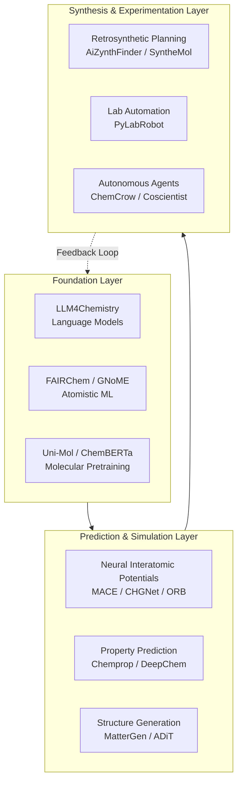

AI is reshaping chemistry and materials science at every scale — from atomistic simulation and molecular property prediction to retrosynthetic planning and autonomous laboratory execution. This page maps the **tools, frameworks, models, and datasets** that enable AI-driven discovery across the chemical and materials sciences, organized by functional layer: language models for chemistry, materials discovery pipelines, chemical synthesis planning, lab automation, and the supporting infrastructure that binds them together.

Sources: [README.md](/README.md#L670-L706)

## The AI-for-Chemistry-and-Materials Stack

The ecosystem can be understood as a layered architecture where each layer builds on the capabilities of the one below. **Foundation models** learn representations of molecules and crystals; **property prediction and simulation** layers turn those representations into actionable scientific insights; **synthesis and experimentation** layers close the loop by planning and executing real-world chemistry.

> [!TIP]
> When evaluating tools for a chemistry or materials AI workflow, start from the **top layer** (what you need to accomplish) and trace downward. A retrosynthetic planning task, for instance, requires both a molecular representation model and a property prediction backbone — choosing these first avoids compatibility issues later.

Sources: [README.md](/README.md#L670-L706), [README.md](/README.md#L325-L327)

## LLM for Chemistry

Large language models are increasingly being adapted for chemistry-specific tasks — from understanding molecular notation to reasoning about reaction mechanisms. This is not simply a matter of prompting general-purpose LLMs; it requires **domain-adapted representations, chemistry-aware tooling, and specialized molecular languages**.

| Tool | Focus | Key Capability | License |
|---|---|---|---|
| **LLM4Chemistry** | Curated paper list | Covers fine-tuning, reasoning, multi-modal models, agents, and benchmarks for LLMs in chemistry | Open |
| **ChemMCP** | MCP-enabled AI assistant toolkit | Exposes molecule analysis, property prediction, and reaction synthesis tools through unified Python/MCP interfaces | Apache 2.0 |
| **MoleCode** | LLM-native molecular language | Represents molecules as explicit graph-based code with 5× lower token cost and ~76-80% accuracy on novel molecules vs ~20% for SMILES | Open |

**MoleCode** is particularly notable: it rethinks the fundamental representation problem. Traditional SMILES strings are brittle — a single character change can produce a completely different molecule. By encoding molecular graphs as code, MoleCode lets LLMs reason about chemistry in a way that is both token-efficient and structurally faithful, enabling operations like substructure editing that are essentially impossible with linear string representations.

> [!TIP]
> For integrating chemistry tools into an LLM agent workflow, **ChemMCP** provides the most direct path — it exposes chemistry functionality through the Model Context Protocol, making it compatible with any MCP-enabled agent (Claude Code, Codex, etc.) without custom glue code.

Sources: [README.md](/README.md#L672-L676)

## Materials Discovery

Materials discovery is where AI has delivered some of its most dramatic scientific results. The core challenge is navigating an astronomically large search space — the space of stable crystalline materials is estimated to contain millions of viable candidates, most of which have never been synthesized. AI methods compress this search by learning structure-property relationships from existing databases and then exploring beyond the training distribution.

### Materials Discovery Platforms

| Platform | Key Metric | Architecture | Notable Achievement |
|---|---|---|---|
| **GNoME** | 2.2M new crystal structures (380K stable) | Graph neural network | Equivalent to 800 years of traditional research (Nature 2023) |
| **FAIRChem (OMat24)** | 118M+ DFT calculations | EquiformerV2 models | Top Matbench Discovery performance |
| **ADiT** | SOTA on QM9, MP20, GEOM-DRUGS | Latent diffusion transformer (500M params) | Jointly generates periodic crystals and non-periodic molecules |
| **JARVIS** | Comprehensive DFT datasets | Multiple ML models | NIST's open-source atomistic materials design platform |
| **MatterGen** | 2× more likely to produce stable novel structures | Diffusion-based generative model | Steerable generation by property constraints (band gap, magnetism, etc.) |
| **MatterSim** | Across elements, temperatures, pressures | Deep learning atomistic model | Generalizes across thermodynamic conditions |

**GNoME** (Google DeepMind) and **FAIRChem** (Meta) represent the two dominant paradigms: GNoME demonstrated that large-scale graph neural networks can discover new stable crystals at unprecedented scale, while FAIRChem provides the **ecosystem** — the datasets, models, and benchmarks — that enable the community to build on and improve these results. **MatterGen** (Microsoft) takes a different approach through generative diffusion, allowing researchers to *steer* materials generation toward specific target properties rather than merely screening candidates.

Sources: [README.md](/README.md#L677-L697)

### Neural Interatomic Potentials

Neural interatomic potentials (NIPs) are perhaps the most impactful AI contribution to materials science at the simulation level. They replace expensive DFT calculations with machine-learned surrogate models that achieve near-quantum accuracy at classical MD speeds, enabling molecular dynamics simulations that were previously computationally infeasible.

| Potential | Key Innovation | Training Data | Scale |
|---|---|---|---|
| **NequIP** | E(3)-equivariant architecture | DFT | Up to 1000× less training data than invariant models |
| **Allegro** | Scalable equivariant potentials | DFT | Million-atom MD simulations |
| **MACE** | ACE-based equivariant potentials | DFT | Widely adopted, production-ready |
| **CHGNet** | Charge & magnetic moment awareness | 1.5M+ Materials Project structures | Charge-informed MD, phase diagram prediction |
| **ORB** | Universal across periodic table | Broad | Open-source pretrained models |
| **SevenNet** | Multi-GPU parallel MD | DFT | Efficient large-scale atomistic modeling |
| **SchNetPack** | SchNet, DimeNet++, PaiNN, GemNet | DFT | PyTorch toolkit, 900+ stars |

The progression from **NequIP** → **Allegro** → **MACE** illustrates a key architectural evolution: NequIP proved that equivariant representations dramatically reduce data requirements, Allegro scaled those representations to million-atom systems, and MACE refined the approach into a practical, widely-adopted tool. **CHGNet** adds a critical physical dimension — charge awareness — that enables simulations of redox reactions and phase transitions that charge-agnostic potentials cannot capture.

Sources: [README.md](/README.md#L684-L697)

### Materials Analysis & Benchmarking

| Tool | Purpose | Stars |
|---|---|---|
| **pymatgen** | Python Materials Genomics — foundational analysis library for structures and molecules | 1.8K+ |
| **Crystal Graph CNNs** | Crystal property prediction via graph representations | — |
| **MatBench** | Standardized materials informatics benchmark suite | — |
| **Best of Atomistic ML** | Curated list of atomistic ML projects for materials science | — |
| **LLaMat** | LLaMA-2/3 continued pretraining on ~30B materials science tokens | — |
| **NVIDIA ALCHEMI Toolkit** | GPU-accelerated workflows for molecular and materials ML | — |
| **CatGo** | Interactive desktop workbench with 3D editor, natural-language assistant, and HPC job submission | — |

**pymatgen** is the foundational infrastructure layer — nearly every materials AI tool in this ecosystem depends on it for structure I/O, symmetry analysis, and phase diagram construction. **LLaMat** (Nature Machine Intelligence 2026) represents the emerging approach of adapting general LLMs to materials science through continued pretraining, while identifying the "adaptation gap" between general LLM capabilities and domain-specific requirements.

Sources: [README.md](/README.md#L687-L697)

## Chemical Synthesis

AI-driven synthesis planning addresses the inverse problem: given a target molecule, find a viable synthetic route. This is fundamentally a search problem over the space of known reactions and purchasable precursors.

| Tool | Approach | Key Feature | Origin |
|---|---|---|---|
| **AiZynthFinder** | Monte Carlo Tree Search (MCTS) | Recursively decomposes molecules into purchasable precursors with multi-step route scoring | AstraZeneca, v4.0 |
| **Molecular Transformers** | Transformer-based prediction | Chemical reaction prediction and synthesis planning | Research |
| **SyntheMol** | Generative AI + combinatorial search | Searches billions of synthesizable molecules through real chemical reactions; experimentally validated novel antibiotics | Stanford, Nature Machine Intelligence 2024 |

**AiZynthFinder** is the industrial workhorse — battle-tested at AstraZeneca and now in its fourth major version. **SyntheMol** represents a different philosophy: rather than planning routes to known molecules, it generates novel molecular candidates that are *guaranteed synthesizable* because they are constructed from real building blocks through real reactions. This design principle — constraining generative search to chemically feasible space — was validated experimentally with novel antibiotic compounds.

Sources: [README.md](/README.md#L699-L702)

## Lab Automation & Robotics

The final frontier is closing the loop between computational prediction and physical experimentation. **Self-driving laboratories** (SDLs) use AI to plan experiments, robotic systems to execute them, and automated analysis to feed results back into the planning loop.

**PyLabRobot** is the foundational infrastructure for this vision — a hardware-agnostic SDK that provides programmatic control of liquid handlers, plate readers, and other lab instruments across multiple vendors. It serves as the "operating system" for self-driving laboratories, enabling the kind of standardized, reproducible automation that AI agents require.

Sources: [README.md](/README.md#L704-L705)

## Autonomous Chemistry Agents

Beyond tool-level integration, several autonomous agent systems have been designed specifically for chemistry and materials research:

| Agent | Key Capability | Notable Result |
|---|---|---|
| **ChemCrow** | LLM agents for chemistry with tool integration | Augments LLMs with chemistry-specific tools for reasoning about reactions and synthesis |
| **Coscientist** | Autonomous chemical experiment planning and execution | First system to autonomously plan and execute scientific experiments in a real lab (Nature 2023) |
| **SciAgents** | Bioinspired multi-agent graph reasoning | Autonomously traverses ontological knowledge graphs to generate novel research hypotheses for bio-inspired materials |

**Coscientist** represents a landmark achievement: it demonstrated that an AI system could not only plan chemical experiments but also *execute them* through robotic lab hardware, completing the full discovery loop from hypothesis to experimental verification. This is the paradigm that self-driving laboratories are building toward.

Sources: [README.md](/README.md#L325-L327), [README.md](/README.md#L438-L440)

## Molecular Modeling & Drug Design Tools

Several tools that bridge chemistry and biology are essential for molecular modeling workflows:

| Tool | Capability | Domain | Stars |
|---|---|---|---|
| **Uni-Mol** | Universal 3D molecular pretraining (209M conformations, 1.1B params) | Property prediction, docking, quantum chemistry | — |
| **ChemBERTa** | Chemical language model | Molecular property prediction | — |
| **DeepChem** | ML for chemistry | General-purpose chemistry ML library | — |
| **TorchDrug** | ML platform for drug discovery | Property prediction, generative models, knowledge graphs | 1.5K+ |
| **Chemprop** | Message passing neural networks | Molecule property prediction, ADMET modeling | 2.3K+ |
| **RDKit** | Cheminformatics toolkit | Standard chemistry informatics infrastructure | — |
| **nvMolKit** | GPU-accelerated molecular similarity, conformer generation | Drug discovery acceleration (NVIDIA) | — |
| **Graphormer** | General-purpose deep learning for molecular modeling | Graph-based molecular representations | — |

**Chemprop** and **RDKit** form the backbone of most molecular AI workflows: Chemprop provides state-of-the-art property prediction (especially ADMET modeling critical for drug discovery), while RDKit provides the cheminformatics primitives — SMILES parsing, molecular fingerprints, substructure search — that every other tool depends on. **Uni-Mol** scales 3D molecular pretraining to 1.1B parameters (Uni-Mol2), demonstrating that pretraining on large conformational datasets yields strong transfer learning across diverse molecular tasks.

Sources: [README.md](/README.md#L534-L541), [README.md](/README.md#L504)

## Datasets & Benchmarks

Reliable evaluation requires standardized datasets. The chemistry and materials community has built several key benchmarks:

| Resource | Content | Use Case |
|---|---|---|
| **Materials Project** | Computational materials database with DFT-calculated properties | Materials screening, property prediction training |
| **QM9** | Small molecule quantum chemical properties | Molecular property prediction benchmark |
| **Open Catalyst Project** | Catalyst discovery datasets (OC20, OC22) | Adsorption energy prediction, catalyst screening |
| **MatBench** | Standardized materials informatics benchmark suite | Fair comparison of ML methods for materials |
| **ChEMBL** | Chemical bioactivity data | Drug discovery, bioactivity prediction |

Sources: [README.md](/README.md#L835-L839)

## Key Surveys & Reviews

Several landmark surveys provide the conceptual framework for understanding the field:

- **Foundation Models for Materials Discovery** (Nature 2025) — Perspective on how foundation model paradigms apply to materials AI
- **Large Language Models in Chemistry** (arXiv 2024.02) — Systematic survey of LLM applications across chemistry
- **Self-Driving Laboratories for Chemistry and Materials Science** (Chem. Rev. 2024) — Comprehensive 100-page review on SDL technology, applications, and infrastructure
- **From AI for Science to Agentic Science** (arXiv 2025.08) — Comprehensive survey on agentic science across life sciences, chemistry, materials, and physics

Sources: [README.md](/README.md#L417), [README.md](/README.md#L424-L425), [README.md](/README.md#L400), [README.md](/README.md#L446)

## Where to Go Next

The Chemistry & Materials ecosystem connects deeply with adjacent domains in this catalog:

- **Molecular docking and drug design tools** like DiffDock, Boltz, and GNINA are covered in detail under [Biology & Medicine](16-biology-and-medicine), since they sit at the chemistry-biology interface
- **Physics-informed neural networks and neural operators** that underpin many simulation methods are documented in [Physics-Informed Neural Networks](13-physics-informed-neural-networks) and [Neural Operators & Model Discovery](14-neural-operators-and-model-discovery)
- **Foundation models** like IBM FM4M, ChemGPT, and Intern-S1 that serve chemistry and materials are cataloged in [Foundation Models for Science](21-foundation-models-for-science)
- **Computing frameworks** including DeePMD-kit, TorchMD, ASE, and e3nn that power atomistic simulations are detailed in [Computing Frameworks](22-computing-frameworks)
- **Datasets & Benchmarks** for comprehensive evaluation are in [Datasets & Benchmarks](23-datasets-and-benchmarks)
- **Autonomous research agents** like ChemCrow and Coscientist are part of the broader ecosystem in [Autonomous Research Systems](10-autonomous-research-systems) and [Domain-Specific Research Agents](11-domain-specific-research-agents)
