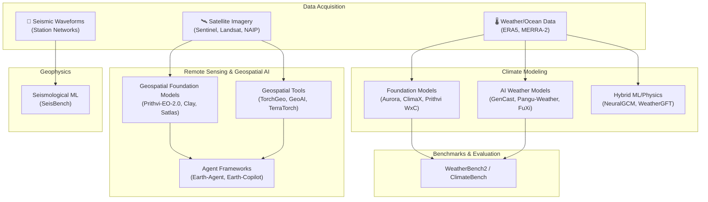

AI is rapidly transforming how we observe, model, and predict the Earth system — from global weather forecasting at 0.25° resolution to real-time earthquake detection and satellite imagery analysis across continents. This page documents the tools, models, benchmarks, and agent frameworks that define the current frontier of **AI for Earth & Climate Science**, organized into three primary domains: climate modeling, remote sensing & geospatial AI, and geophysics & seismology. Whether you are building a weather forecasting pipeline, fine-tuning a geospatial foundation model on satellite imagery, or deploying a seismological ML system, this page provides the architectural map and the concrete tooling to move from concept to production.

Sources: [README.md](/README.md#L729-L765), [README.md](/README.md#L415-L416), [README.md](/README.md#L451-L451)

## Architecture Overview

The Earth & Climate AI ecosystem is layered across three interacting planes: **data acquisition** (satellites, weather stations, seismographic networks), **modeling & inference** (weather/climate models, geospatial foundation models, seismological ML), and **downstream application** (forecasting, environmental monitoring, disaster response). The following diagram illustrates how these components connect, and where the tools documented on this page fit within the broader pipeline.

Sources: [README.md](/README.md#L729-L765)

## Climate Modeling

Climate modeling is the most mature and rapidly evolving sub-domain of AI for Earth science. The field has undergone a paradigm shift in the past three years: **AI-based weather forecasting models now consistently outperform traditional numerical weather prediction (NWP)** across multiple variables and lead times. This shift is driven by three architectural trends — pure data-driven models (transformers trained on reanalysis data), foundation models that unify weather and climate tasks, and hybrid ML/physics approaches that embed physical constraints into learned dynamics.

### AI Weather Forecasting Models

The current generation of AI weather models operates at **0.25° global resolution** (~25 km grid spacing) and produces forecasts out to 15 days. The table below compares the key models by architecture, training data, and distinguishing capability.

| Model | Organization | Architecture | Key Innovation | Resolution | Publication |
|---|---|---|---|---|---|
| **GenCast** | Google DeepMind | Diffusion-based ensemble | 97.2% target improvement over ECMWF ENS | 0.25° | Nature 2024 |
| **Pangu-Weather** | Huawei | 3D Earth-specific transformer | First AI to comprehensively outperform NWP | 0.25° | Nature 2023 |
| **FuXi** | Fudan University | Cascade 3D transformer | Hard-constraint techniques for SOTA accuracy | 0.25° | Nature 2023 |
| **Aurora** | Microsoft | Foundation model | Multi-domain (weather, air pollution, ocean waves) | Multi-resolution | Nature 2025 |
| **FengWu** | Shanghai AI Lab | Deep learning weather model | Pushes skillful forecasts beyond 10 days | 0.25° | arXiv 2023 |
| **NeuralGCM** | Google Research | Hybrid ML/physics | Combines learned dynamics with physical constraints | Variable | Nature 2024 |

> [!TIP]
> When choosing between models, consider your use case: **GenCast** excels at ensemble probabilistic forecasting, **Pangu-Weather** provides deterministic single-trajectory predictions, **Aurora** uniquely supports multi-domain forecasting (air pollution, ocean waves), and **NeuralGCM** is the only option if you need strict physical consistency for long-term climate simulation.

For operational deployment, ECMWF's **ai-models** framework provides a unified command-line interface to run any of the supported AI weather models (GraphCast, Aurora, Pangu, NeuralGCM, FourCastNet) with standardized ECMWF data infrastructure, eliminating the need to build custom data pipelines for each model. NVIDIA's **Earth-2** stack offers the world's first fully open, GPU-accelerated weather AI software with both medium-range and nowcasting models using generative AI.

Sources: [README.md](/README.md#L732-L741), [README.md](/README.md#L746-L747)

### Climate Foundation Models

Beyond weather forecasting, **foundation models for climate** aim to learn general representations of the Earth system that transfer across tasks. Microsoft's **ClimaX** was the first such model — a Vision Transformer trained on heterogeneous climate datasets that can be fine-tuned for downstream tasks (ICML 2023). IBM-NASA's **Prithvi WxC** extends this paradigm with a 2.3B parameter model trained on 160 MERRA-2 variables, uniquely capable of running on a desktop GPU with fine-tuned variants for climate downscaling and gravity wave parameterization. **TerraTorch** complements these models by providing a Python toolkit specifically for fine-tuning geospatial foundation models on domain-specific tasks.

Sources: [README.md](/README.md#L735-L736), [README.md](/README.md#L742-L750)

### Benchmarks & Evaluation

Rigorous evaluation is critical for distinguishing genuine progress from headline claims. The community has converged on two primary benchmarks:

| Benchmark | Focus | Key Feature |
|---|---|---|
| **WeatherBench2** | Data-driven global weather models | Standardized evaluation framework with curated datasets (Google Research, 2024) |
| **ClimateBench** | Climate projection & ML models | Climate data benchmark for long-term climate modeling |
| **WeatherGFT** | Physics-AI hybrid models | Evaluates fine-grained weather forecasting with physics constraints (NeurIPS 2024) |

> [!TIP]
> Use **WeatherBench2** for evaluating short-to-medium range (1–15 day) weather forecasts, and **ClimateBench** for evaluating long-term climate projections. The **Awesome Large Weather Models** curated list provides a comprehensive tracking of the rapidly evolving landscape of large weather models and their benchmark results.

Sources: [README.md](/README.md#L743-L745), [README.md](/README.md#L746-L749)

## Remote Sensing & Geospatial AI

Remote sensing is the data backbone of Earth observation — satellite imagery from Sentinel-1/2, Landsat, and NAIP provides the raw material for everything from land cover mapping to disaster response. The field has been transformed by **geospatial foundation models** that learn general visual representations from massive satellite imagery corpora, enabling zero-shot and few-shot transfer to downstream tasks without task-specific training.

### Geospatial Foundation Models

The following table compares the leading geospatial foundation models by their training data, architecture, and distinctive capabilities.

| Model | Organization | Training Data | Architecture | Key Innovation |
|---|---|---|---|---|
| **Prithvi-EO-2.0** | IBM & NASA | Multi-temporal satellite imagery | ViT Masked Autoencoder | 3D spatiotemporal patch embeddings + geolocation encoding |
| **Clay** | Clay Foundation | Multi-sensor (Sentinel-1/2, Landsat, NAIP, MODIS, DEM) | Masked Autoencoder ViT | Cross-sensor self-supervised learning |
| **Satlas** | Allen AI | Global Sentinel-2 imagery | Geospatial foundation model | Large-scale mapping (buildings, turbines, trees) |
| **SkySensePlusPlus** | — | Multi-modal satellite imagery | Semantic-enhanced multi-modal | Universal interpretation across modalities |
| **TESSERA** | Cambridge | Time-series satellite imagery | Foundation model | Efficient temporal pattern extraction |
| **TerraMind** | IBM & ESA | Diverse satellite sensors | Any-to-any generative model | Unified multimodal understanding + generation |

Sources: [README.md](/README.md#L757-L765)

### Geospatial Tools & Libraries

Building on foundation models, the ecosystem provides a rich set of tools for the full geospatial ML lifecycle:

- **TorchGeo** (Microsoft, 4K+ stars) — PyTorch domain library providing standardized datasets, samplers, transforms, and pre-trained models for geospatial deep learning. This is the go-to starting point for any geospatial ML project in PyTorch.
- **GeoAI** (MIT, 2026) — High-level geospatial AI package for satellite/aerial imagery analysis, model training, inference, interactive visualization, and QGIS integration.
- **segment-geospatial** (MIT, 4K+ stars) — Zero-shot object segmentation in satellite/aerial imagery using the Segment Anything Model (SAM), enabling rapid prototyping without training data.
- **TerraTorch** (IBM) — Python toolkit specifically for fine-tuning geospatial foundation models, bridging the gap between pretrained weights and domain-specific applications.

Sources: [README.md](/README.md#L747-L750), [README.md](/README.md#L758)

### Agent Frameworks for Earth Observation

The newest frontier is **agentic AI for Earth observation** — LLM-powered agent frameworks that orchestrate multiple tools for complex geospatial analysis workflows. **Earth-Agent** (OpenDataLab) provides an LLM agent framework with 104 specialized tools across 5 functional kits, enabling multi-modal Earth observation analysis through natural language instructions. **Earth-Copilot** (Microsoft) takes a different approach — it's an AI-powered geospatial application for natural-language exploration, visualization, and analysis of 130+ satellite collections with STAC integration, multi-agent backend, and an MCP server for integration with other AI tools.

Sources: [README.md](/README.md#L734-L735), [README.md](/README.md#L751), [README.md](/README.md#L451-L451)

## Geophysics & Seismology

While climate modeling and remote sensing have seen explosive growth, **seismological ML** remains a focused but high-impact domain. **SeisBench** is the primary open-source toolkit, providing unified interfaces for deep learning seismic phase picking, earthquake detection, and waveform analysis across multiple benchmark datasets and pretrained models. It serves as both a research platform and a production-ready library for seismological monitoring systems.

Sources: [README.md](/README.md#L754-L755)

## Key Surveys & Curated Collections

The Earth & Climate AI landscape is evolving rapidly. The following resources provide systematic tracking of the field:

| Resource | Focus | Scope |
|---|---|---|
| **Foundation Models for Environmental Science** (arXiv 2025.04) | Environmental applications of foundation models | Comprehensive survey |
| **Awesome Large Weather Models** | Large weather models for AI Earth science | Curated list of models and papers |
| **Awesome Remote Sensing Foundation Models** | Papers, datasets, benchmarks, code, and pretrained weights for RSFMs | Comprehensive tracking of vision, vision-language, and multimodal models |
| **Awesome Foundation Models for Weather and Climate** | Foundation models for weather and climate data understanding | Survey of foundation models |

Sources: [README.md](/README.md#L415-L416), [README.md](/README.md#L749), [README.md](/README.md#L765), [README.md](/README.md#L957)

## Next Steps

The Earth & Climate Science domain sits at the intersection of several cross-cutting capabilities documented elsewhere in this catalog. To deepen your understanding and build complete workflows:

- **Foundation Models & Infrastructure**: The climate and geospatial models documented here are instances of the broader trend in [Foundation Models for Science](21-foundation-models-for-science). Understanding the general architectural patterns (ViT-based, masked autoencoder, multi-modal) will help you evaluate and extend these models.
- **Scientific Machine Learning**: The hybrid ML/physics approaches (NeuralGCM, WeatherGFT) rely on techniques documented in [Physics-Informed Neural Networks](13-physics-informed-neural-networks) and [Neural Operators & Model Discovery](14-neural-operators-and-model-discovery).
- **Datasets & Benchmarks**: For training data and evaluation beyond the Earth-specific benchmarks listed here, see [Datasets & Benchmarks](23-datasets-and-benchmarks).
- **Computing Frameworks**: The geospatial tools (TorchGeo, TerraTorch) are built on frameworks documented in [Computing Frameworks](22-computing-frameworks).
- **Agriculture & Ecology**: Downstream applications of Earth observation in agriculture and conservation are covered in [Agriculture, Ecology & Social Sciences](20-agriculture-ecology-and-social-sciences).
