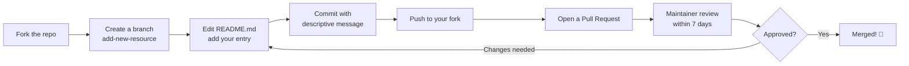

Welcome to **Awesome AI for Science** — the most comprehensive curated collection of AI tools, libraries, papers, datasets, and frameworks accelerating scientific discovery across all disciplines. This guide walks you through everything you need to start navigating, using, and contributing to this resource in under five minutes.


Sources: [README.md](/README.md#L1-L31), [assets/banner.jpg](/assets/banner.jpg)

## What This Repository Is

Awesome AI for Science is a **community-driven awesome list** — a single, meticulously organized `README.md` that catalogs 300+ resources spanning the full AI-for-science landscape. It is not a software package you install; it is a **discovery engine** that helps you find the right tool, paper, or framework for your research workflow. The repository is licensed under the permissive MIT License, and every contribution flows through a structured fork-edit-PR process described in [CONTRIBUTING.md](/CONTRIBUTING.md).

Sources: [README.md](/README.md#L1-L8), [LICENSE](/LICENSE#L1-L21), [CONTRIBUTING.md](/CONTRIBUTING.md#L1-L15)

## Repository Structure at a Glance

The project is intentionally minimal — a single-document architecture that prioritizes accessibility over complexity:

```
awesome-ai-for-science/
├── README.md          ← The entire curated collection (1004 lines)
├── CONTRIBUTING.md    ← Contribution guidelines & formatting rules
├── LICENSE            ← MIT License (Copyright 2024)
└── assets/
    └── banner.jpg     ← Project banner image
```

Every resource lives inside `README.md`. There are no submodules, no build steps, and no dependencies — just open the file and start exploring.

Sources: [README.md](/README.md#L1-L8), [CONTRIBUTING.md](/CONTRIBUTING.md#L1-L10), [LICENSE](/LICENSE#L1-L3)

## How the Collection Is Organized

The README follows a **domain-first taxonomy** — resources are grouped by scientific workflow and domain, not by technology. Understanding this hierarchy is the key to finding what you need quickly. The diagram below maps the top-level architecture:

```mermaid
graph TD
    A["Awesome AI for Science"] --> B["Research Workflow Tools"]
    A --> C["Autonomous Research Agents"]
    A --> D["Scientific Machine Learning"]
    A --> E["Domain-Specific Applications"]
    A --> F["Foundation Models & Infrastructure"]
    A --> G["Papers, Reviews & Education"]

    B --> B1["Literature & Knowledge"]
    B --> B2["Paper→Poster/Slides/Media"]
    B --> B3["Chart Understanding"]
    B --> B4["Paper-to-Code"]
    B --> B5["Document Parsing"]

    C --> C1["Autonomous Systems"]
    C --> C2["Domain Agents"]
    C --> C3["Evaluation & Benchmarks"]

    D --> D1["Physics-Informed NNs"]
    D --> D2["Neural Operators"]
    D --> D3["Neural Diff. Eqs."]

    E --> E1["Biology & Medicine"]
    E --> E2["Chemistry & Materials"]
    E --> E3["Physics & Astronomy"]
    E --> E4["Earth & Climate"]
    E --> E5["Agriculture & Social"]

    F --> F1["Foundation Models"]
    F --> F2["Computing Frameworks"]
    F --> F3["Datasets & Benchmarks"]

    G --> G1["Key Papers & Reviews"]
    G --> G2["Educational Resources"]
```



Each branch in the diagram corresponds to a major section in the README, and every entry within a section follows a consistent format: **`[Resource Name](URL) - Brief description`**. This uniformity makes scanning and comparing resources straightforward.

Sources: [README.md](/README.md#L33-L58)

## Three Ways to Use This Collection

Depending on your goal, you'll interact with the repository differently. The table below maps common use cases to the recommended approach:

| Your Goal | Recommended Approach | Where to Start |
|---|---|---|
| **Find a tool** for your research workflow | Browse the README's table of contents, jump to the relevant section, scan entries | [README.md](/README.md#L33-L58) Table of Contents |
| **Discover the landscape** of AI for Science | Read the README sequentially, paying attention to section headers and sub-categories | [Overview](1-overview) → Then this page |
| **Contribute** a resource you found or built | Follow the fork-edit-PR workflow in CONTRIBUTING.md | [CONTRIBUTING.md](/CONTRIBUTING.md#L16-L46) |

> [!TIP]
> Use GitHub's built-in search (`Ctrl+K` or `/` key) on the README page to jump directly to any section header or keyword — this is the fastest way to locate a specific resource in the 1004-line document.

Sources: [README.md](/README.md#L33-L58), [CONTRIBUTING.md](/CONTRIBUTING.md#L16-L46)

## Quick Navigation: Find Your Entry Point

The collection spans a vast range of disciplines and tools. The table below helps you identify which section aligns with your current work, and links to the dedicated deep-dive page for each topic:

| If You Work On... | README Section | Deep-Dive Page |
|---|---|---|
| Searching papers, managing citations, building knowledge graphs | 🧪 AI Tools for Research | [Literature & Knowledge Management](5-literature-and-knowledge-management) |
| Turning papers into posters, slides, or videos | 📄 Paper→Poster / Slides | [Paper-to-Poster, Slides & Media](6-paper-to-poster-slides-and-media) |
| Understanding or generating scientific charts | 📊 Chart Understanding & Generation | [Chart Understanding & Generation](7-chart-understanding-and-generation) |
| Reproducing paper results as runnable code | 🔄 Paper-to-Code & Reproducibility | [Paper-to-Code & Reproducibility](8-paper-to-code-and-reproducibility) |
| Parsing PDFs, extracting tables, OCR for science | 📋 Scientific Documentation & Parsing | [Scientific Document Parsing](9-scientific-document-parsing) |
| Building or using autonomous research agents | 🤖 Research Agents & Autonomous Workflows | [Autonomous Research Systems](10-autonomous-research-systems) |
| Solving PDEs with neural networks (PINNs, neural operators) | ⚗ Scientific Machine Learning | [Physics-Informed Neural Networks](13-physics-informed-neural-networks) |
| Protein folding, drug discovery, genomics | 🧬 Biology & Medicine | [Biology & Medicine](16-biology-and-medicine) |
| Molecular design, materials simulation | ⚛ Chemistry & Materials | [Chemistry & Materials](17-chemistry-and-materials) |
| Climate modeling, weather prediction | 🌍 Earth & Climate Science | [Earth & Climate Science](19-earth-and-climate-science) |

Sources: [README.md](/README.md#L33-L58)

## Contribute Your First Resource

This is a living document — its value grows with every contribution. The process is deliberately simple, and the [CONTRIBUTING.md](/CONTRIBUTING.md) provides both a quick path (for small additions) and a detailed path (for larger changes). Here's the complete workflow:



### Formatting Rules

Every entry must follow this exact pattern:

```markdown
- [Resource Name](URL) - Brief description of what it does and why it's useful
```

### Quality Checklist

Before submitting, verify your resource against the five criteria defined in [CONTRIBUTING.md](/CONTRIBUTING.md#L73-L79):

| Criterion | What It Means |
|---|---|
| **Relevance** | Directly related to AI applications in scientific research |
| **Quality** | Well-documented, actively maintained, or highly cited |
| **Accessibility** | Publicly available (open source, free, or with free tier) |
| **Uniqueness** | Not already listed in the repository |
| **Functionality** | Actually works and provides value to researchers |

> [!TIP]
> Descriptions should be 5–15 words, clear and objective — avoid marketing language. For open-source projects, link to the GitHub repository; for papers, link to the official publication (DOI preferred). Always use HTTPS.

Sources: [CONTRIBUTING.md](/CONTRIBUTING.md#L16-L46), [CONTRIBUTING.md](/CONTRIBUTING.md#L73-L113), [CONTRIBUTING.md](/CONTRIBUTING.md#L119-L148)

## What to Read Next

Now that you know how to navigate and contribute, dive into the specific areas that match your research interests. The recommended reading path follows the catalog's logical progression:

1. **Start broad** — [Overview](1-overview) for the full landscape of AI for Science
2. **Stay current** — [Latest Updates](3-latest-updates) to see what's new in the collection
3. **Go deep** — Pick the domain-specific page that matches your work from the Deep Dive section of the catalog
4. **Join the community** — [About Contributors](4-about-contributors) to learn who's building this resource

If you're a researcher looking for tools, begin with [Literature & Knowledge Management](5-literature-and-knowledge-management). If you're a developer building scientific AI systems, start with [Autonomous Research Systems](10-autonomous-research-systems) or [Computing Frameworks](22-computing-frameworks). If you're new to the field entirely, [Educational Resources & Communities](25-educational-resources-and-communities) provides the on-ramp you need.
