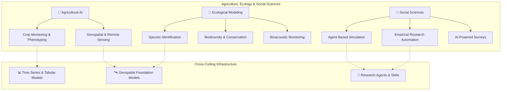

AI is transforming how we grow food, monitor ecosystems, and study human societies. This page maps the tools and frameworks from the Awesome AI for Science collection that sit at the intersection of machine learning and the life-sustaining sciences — from precision agriculture and biodiversity monitoring to large-scale social simulation. Whether you're a researcher building crop-yield models, a conservationist deploying camera-trap AI, or a social scientist simulating population dynamics, this guide will orient you to the right starting point.

Sources: [README.md](/README.md#L767-L789), [README.md](/README.md#L1-L8)

## Landscape Overview

The three domains covered here — agriculture, ecology, and social sciences — share a common structural pattern: they all involve **complex, open systems with spatial, temporal, and multi-agent dynamics**. AI enters these fields not as a replacement for domain expertise, but as a force multiplier for observation, modeling, and prediction at scales no human team can match alone.

The diagram above reveals the **two-tier architecture** of this domain: specialized tools at the top handle domain-specific tasks (plant phenotyping, bird call identification, social simulation), while cross-cutting infrastructure below — geospatial foundation models, research agents, and time-series models — provides the reusable backbone. Understanding this split is critical for beginners: you'll often start with a domain tool and quickly discover you need infrastructure from the lower tier.

Sources: [README.md](/README.md#L767-L789), [README.md](/README.md#L729-L766)

## 🌾 Agricultural AI

Agricultural AI focuses on **observing, measuring, and predicting crop and soil conditions** at scale — from individual leaf inspection to field-level satellite monitoring. The tools below represent the current state of the art in this space.

| Tool | Primary Function | Key Capability | Input Modalities |
|------|-----------------|----------------|------------------|
| **PlantNet** | Plant identification | AI + citizen science species recognition | Photos |
| **AgML** | Agricultural ML platform | Standardized datasets & benchmarks for ag-ML | Multi-modal |
| **FarmVibes.AI** | Geospatial ML for agriculture | Multi-modal fusion for crop & carbon estimation | Satellite, drone, weather, sensor |
| **PlantCV** | Plant phenotyping | High-throughput morphological trait extraction | RGB, hyperspectral, thermal |

**PlantCV** is particularly noteworthy for developers entering the field — it's a modular Python toolkit that lets you build image-analysis pipelines for extracting measurable traits (leaf area, color distribution, stress indicators) from plant imagery. Its workflow design follows a "recipe" pattern where you chain processing steps, making it approachable for those without deep learning expertise.

**FarmVibes.AI** from Microsoft represents the most ambitious platform in this group. It fuses satellite imagery (RGB, SAR, multispectral), drone data, weather feeds, and IoT sensor streams into a unified geospatial ML pipeline. This is where agriculture meets the cross-cutting geospatial infrastructure tier — FarmVibes integrates directly with remote sensing foundation models like [Prithvi-EO-2.0](https://github.com/NASA-IMPACT/Prithvi-EO-2.0) and [TorchGeo](https://github.com/microsoft/torchgeo) for feature extraction.

> [!TIP]
> When choosing an agricultural AI tool, match your data scale to the tool: PlantCV for lab/field-level images, AgML for benchmarking ML models, FarmVibes.AI for farm-to-region geospatial analysis. Starting with the wrong scale is the most common beginner mistake.

Sources: [README.md](/README.md#L769-L774)

## 🦋 Ecological Modeling

Ecological AI bridges **species-level observation** with **ecosystem-level understanding**. The tools here span from individual species identification to population dynamics and conservation planning.

### Species Identification & Biodiversity

**BioCLIP** and its successor **BioCLIP 2** are foundational vision models trained on the entire tree of life rather than a single taxonomic group. BioCLIP (CVPR 2024) was pretrained on diverse biological imagery across taxa for zero-shot species identification. BioCLIP 2 (NeurIPS 2025 Spotlight) extends this with the TreeOfLife-200M dataset, achieving extraordinary accuracy on habitat classification and trait prediction — even with narrow training objectives. For developers, these models provide a powerful starting point: instead of training your own species classifier from scratch, you can use BioCLIP's embeddings as a zero-shot or few-shot backbone.

**Microsoft Biodiversity** offers a different entry point — it's a research hub providing AI models, edge devices, and tools specifically for wildlife monitoring and conservation. Its flagship component, **MegaDetector**, handles camera-trap animal detection (the critical first step before species classification), while **SPARROW** focuses on species recognition. This is the practical choice for field conservation projects where you need an end-to-end pipeline from raw camera-trap images to species counts.

**BirdNET-Analyzer** exemplifies the **bioacoustic** approach to ecology — identifying species by sound rather than sight. It supports 6,000+ bird species globally through deep learning on audio recordings, with real-time analysis, batch processing, and API deployment capabilities. For acoustic ecology projects, this is the production-ready starting point.

| Tool | Approach | Taxonomic Scope | Key Output | Best For |
|------|----------|----------------|------------|----------|
| **BioCLIP / BioCLIP 2** | Vision (zero-shot) | Full tree of life | Species embeddings, trait prediction | Research, multi-taxa projects |
| **Microsoft Biodiversity** | Vision + edge deployment | Wildlife (camera traps) | Detection + species counts | Field conservation, monitoring |
| **BirdNET-Analyzer** | Bioacoustic | 6,000+ bird species | Species ID from audio | Acoustic surveys, long-term monitoring |
| **BioSimulators** | Simulation | Biological systems | Simulation outputs | Modeling ecosystem dynamics |
| **EcoNet** | Modeling + AI | Ecosystems | Conservation planning | Conservation decision support |

> [!TIP]
> BioCLIP provides embeddings (feature vectors), not end-to-end classification pipelines. You'll need to build a lightweight classifier on top of its embeddings for your specific downstream task — this is by design, and it's what makes the model so versatile across taxa.

Sources: [README.md](/README.md#L775-L782)

## 🧠 Social Sciences

AI in social sciences is experiencing a **paradigm shift** — from traditional statistical analysis of survey data to **agent-based simulation** powered by LLMs. The three tools in this collection represent the cutting edge of this transformation.

### Agent-Based Social Simulation

**AgentSociety** (Tsinghua FIB Lab, 984+ stars) is a modern LLM-native agent simulation platform for social science research. Unlike traditional agent-based models that use simple rule-based agents, AgentSociety creates intelligent agents powered by large language models that can reason, communicate, and make decisions in simulated environments. This enables researchers to study emergent social phenomena — opinion dynamics, market behavior, pandemic spread — with agents that exhibit far more realistic and varied behavior than rule-based systems.

### Empirical Research Automation

**Auto-Empirical-Research-Skills** (Stanford REAP & CoPaper.AI) provides a curated collection of **23,000+ agent skills** for empirical research across 8 social science disciplines. This is the largest skill library for social science AI agents, enabling reproducible research workflows from data collection and cleaning through statistical analysis to publication. For developers, this is a "batteries included" approach — you can assemble research pipelines by composing pre-built skills rather than writing everything from scratch.

### AI-Powered Surveys

**EDSL** (Expected Parrot, 460+ stars) takes a different approach: instead of simulating agents, it **simulates survey respondents**. You design surveys and experiments, and EDSL runs them with large numbers of AI agents and LLMs to generate synthetic response data. This is valuable for pilot-testing survey instruments, exploring hypotheses before costly human data collection, and augmenting small-sample studies with synthetic data.

| Tool | Paradigm | Scale | Key Use Case | Developer Entry Point |
|------|----------|-------|-------------|----------------------|
| **AgentSociety** | LLM-native agent simulation | Flexible agent populations | Social dynamics, emergent behavior | Python framework, Docker-based |
| **Auto-Empirical-Research-Skills** | Skill-based research automation | 23,000+ skills across 8 disciplines | Reproducible empirical research | Skill composition, agent-compatible |
| **EDSL** | AI-powered survey simulation | Large synthetic populations | Survey design, pilot testing | Python library, pip-installable |

Sources: [README.md](/README.md#L783-L789)

## Cross-Cutting Infrastructure

The tools above don't exist in isolation — they draw on infrastructure from other sections of the AI4S ecosystem. Understanding these connections is essential for building complete solutions.

### Geospatial Foundation Models

Agricultural and ecological AI heavily depend on **remote sensing foundation models** that provide pre-trained representations of satellite and aerial imagery. Key models include:

- **Prithvi-EO-2.0** (IBM & NASA) — Multi-temporal geospatial foundation model with 3D spatiotemporal patch embeddings, pretrained on Harmonized Landsat Sentinel-2 data
- **TorchGeo** (Microsoft) — PyTorch domain library with standardized datasets, samplers, and pretrained models for geospatial deep learning
- **Clay Foundation Model** — Open-source Masked Autoencoder ViT pretrained on multimodal satellite imagery (Sentinel-1/2, Landsat, NAIP, MODIS)
- **Satlas** (AllenAI) — Global geospatial foundation model for satellite imagery analysis, enabling large-scale mapping from Sentinel-2 data
- **segment-geospatial** — Python package for zero-shot object segmentation in satellite/aerial imagery using SAM

Sources: [README.md](/README.md#L757-L766)

### Research Agents & Time Series Models

For social science researchers, the **autonomous research agent ecosystem** (see [Autonomous Research Systems](10-autonomous-research-systems)) provides the agentic backbone for automated literature review, hypothesis generation, and experiment execution. Additionally, **time-series foundation models** like TimesFM (Google Research) and Chronos (Amazon Science) are directly applicable to agricultural yield forecasting, ecological population dynamics, and social trend analysis.

Sources: [README.md](/README.md#L792-L806)

## Getting Started: Recommended Path

For beginners entering this domain, the following progression builds competence incrementally:

1. **Start with observation tools** — Use [PlantCV](https://github.com/danforthcenter/plantcv) (agriculture) or [BirdNET-Analyzer](https://github.com/birdnet-team/BirdNET-Analyzer) (ecology) to understand how AI processes raw sensor data into structured information
2. **Add geospatial context** — Layer in [TorchGeo](https://github.com/microsoft/torchgeo) or [segment-geospatial](https://github.com/opengeos/segment-geospatial) to scale from field-level to landscape-level analysis
3. **Explore foundation models** — Integrate [BioCLIP](https://github.com/Imageomics/bioclip) for species-level vision tasks or [FarmVibes.AI](https://github.com/microsoft/farmvibes-ai) for multi-modal agricultural fusion
4. **Enter social simulation** — Try [EDSL](https://github.com/expectedparrot/edsl) for survey simulation, then progress to [AgentSociety](https://github.com/tsinghua-fib-lab/AgentSociety) for full agent-based social modeling

For deeper exploration of related domains, consult:
- **Geospatial & climate context**: [Earth & Climate Science](19-earth-and-climate-science)
- **Biological foundations**: [Biology & Medicine](16-biology-and-medicine)
- **Research automation**: [Domain-Specific Research Agents](11-domain-specific-research-agents)
- **Foundation models**: [Foundation Models for Science](21-foundation-models-for-science)
- **Datasets & benchmarks**: [Datasets & Benchmarks](23-datasets-and-benchmarks)
