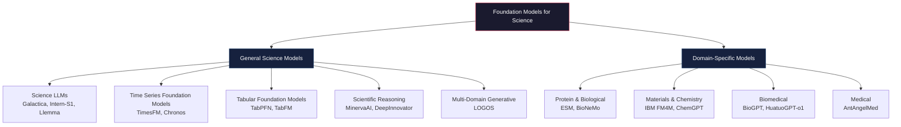
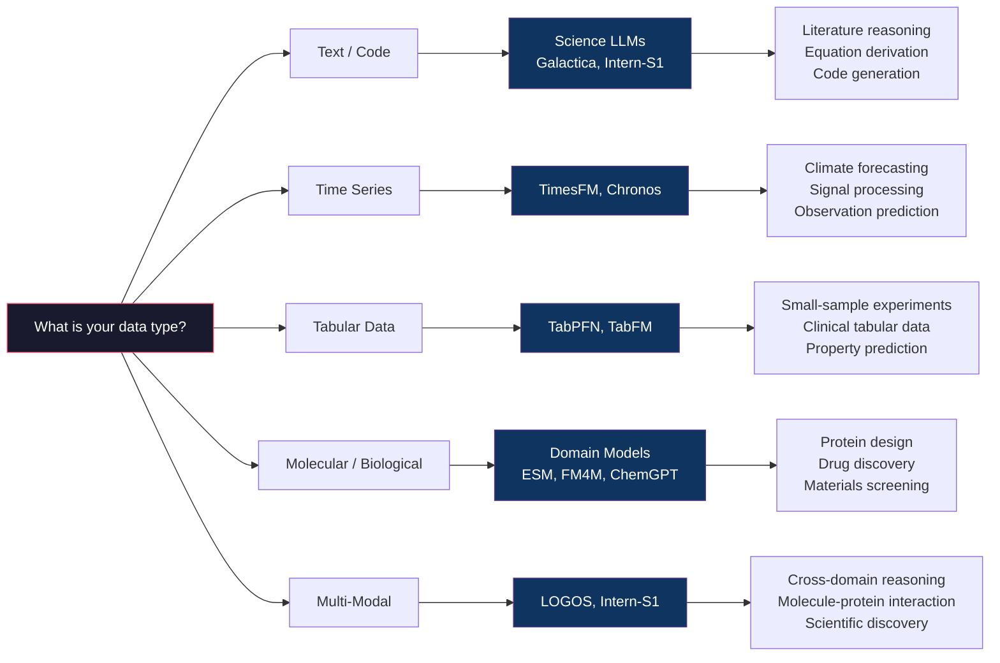

The emergence of **foundation models** — large-scale, pre-trained neural architectures capable of adapting to diverse downstream tasks — represents a paradigm shift in scientific computing. Unlike domain-specific models that solve a single problem, scientific foundation models learn transferable representations across data modalities, disciplines, and scales, enabling researchers to tackle previously intractable problems with a single model family. This page maps the landscape of these models, from general-purpose science LLMs to domain-adapted architectures, and provides the conceptual scaffolding needed to evaluate which model fits which research workflow.

Sources: [README.md](/README.md#L792-L816)

## The Architecture of Scientific Foundation Models

Scientific foundation models are not a monolithic category — they span a spectrum from **general-purpose science models** that encode broad scientific knowledge to **domain-specific models** that internalize the grammar of a single discipline (protein sequences, molecular graphs, genomic tokens). Understanding this spectrum is the key to selecting the right model for your research task.

The following diagram illustrates the architectural taxonomy and the relationship between model categories:

Sources: [README.md](/README.md#L792-L816)

## General Science Models

General science models are pre-trained on broad scientific corpora — papers, textbooks, code, and structured data — to encode cross-disciplinary knowledge. Their strength lies in **zero-shot and few-shot transfer** across scientific tasks without domain-specific fine-tuning.

| Model | Architecture | Key Capability | Scale | Open Source |
|-------|-------------|----------------|-------|-------------|
| **Galactica** | Transformer LLM | Scientific knowledge & reasoning | 125M–120B | ✅ |
| **Intern-S1** | 235B MoE LLM + 6B Vision | Multimodal scientific reasoning (chemistry, materials, life science, earth science) | 235B MoE | ✅ |
| **Llemma** | Transformer (7B/34B) | Mathematical reasoning & formal theorem proving in Lean | 7B/34B | ✅ |
| **TimesFM** | Decoder-only Transformer | Long-horizon time series forecasting (climate, biomedical, physical observations) | 200M | ✅ |
| **Chronos** | Tokenized Transformer | Zero-shot time series forecasting via continuous-to-discrete tokenization | 20M–710M | ✅ |
| **TabPFN** | Prior-Data Fitted Network | Single-forward-pass tabular classification & regression | 5M | ✅ |
| **TabFM** | Scikit-learn compatible | Zero-shot classification & regression on mixed-type tabular data | — | ✅ |
| **DeepInnovator** | Decoupled reward-comment RL | Scientific idea generation & cross-disciplinary hypothesis formation | — | ✅ |
| **LOGOS** | Unified scientific grammar | Multi-domain generative (proteins, antibodies, molecules, materials) | — | ✅ |
| **MinervaAI** | PaLM-based | Mathematical & scientific reasoning | 540B | ❌ |

Sources: [README.md](/README.md#L794-L806)

### Science LLMs: Language as the Substrate of Discovery

Models like **Galactica** and **Intern-S1** treat scientific text as a first-class modeling target. Galactica, developed by Meta AI, was among the first LLMs specifically trained on scientific literature, enabling it to cite, summarize, and reason over technical content. **Intern-S1** pushes this further by combining a 235B Mixture-of-Experts language backbone with a 6B vision encoder, continually pretrained on 5T tokens including 2.5T scientific-domain tokens — making it a true multimodal scientific foundation model that can process diagrams, equations, and text simultaneously.

**Llemma** takes a different path, focusing on the intersection of language and formal mathematics. Trained on Proof-Pile-2, it outperforms Minerva at equal scale on the MATH benchmark and can perform formal theorem proving in Lean without fine-tuning — a critical capability for researchers who need verifiable mathematical reasoning rather than plausible-sounding approximations.

Sources: [README.md](/README.md#L795-L807)

### Time Series & Tabular Foundation Models: Beyond Text

Not all scientific data is text. **TimesFM** (Google Research) and **Chronos** (Amazon Science) address the fundamental challenge of modeling temporal scientific data — climate variables, biomedical signals, and physical observations — using a shared pre-trained backbone. TimesFM uses a decoder-only Transformer with stacked patching for long-horizon forecasting, while Chronos innovates by tokenizing continuous time series into discrete bins, enabling zero-shot forecasting by treating time series prediction as a language modeling problem.

**TabPFN** and **TabFM** tackle the most ubiquitous scientific data format: tabular data. TabPFN achieves remarkable performance by predicting on unseen real-world tables in a single forward pass, without task-specific training — a paradigm shift for researchers working with small-sample experimental data. TabFM extends this with scikit-learn compatibility and in-context learning for mixed-type datasets.

> [!TIP]
> When choosing between time series foundation models, consider the data regime: TimesFM excels at long-horizon forecasting with rich historical context, while Chronos's tokenization approach is particularly effective for zero-shot transfer across heterogeneous scientific time series with limited domain overlap.

Sources: [README.md](/README.md#L798-L801)

### Multi-Domain Generative Models: The Unified Frontier

**LOGOS** represents the most ambitious category: a single generative model that encodes proteins, antibodies, small molecules, chemical reactions, and materials into a shared token space via a unified scientific grammar. This cross-domain representation enables researchers to reason about interactions between biological and chemical entities within a single model — for instance, predicting how a small molecule binds to a protein, or how a material's composition affects its catalytic properties — without switching between domain-specific tools.

**DeepInnovator** and the **AI Can Learn Scientific Taste** framework operate at a higher level of abstraction: they are not models that predict scientific outcomes, but models that generate and evaluate scientific ideas. DeepInnovator uses a decoupled reward-comment RL architecture to generate cross-disciplinary hypotheses, while the Scientific Taste framework trains a generative reward model to judge and propose research ideas with long-term impact — essentially learning the meta-skill of *taste* in scientific research.

Sources: [README.md](/README.md#L802-L804)

## Domain-Specific Models

Domain-specific foundation models internalize the structural grammar of a scientific discipline — the 20-letter alphabet of amino acids, the SMILES notation of molecules, or the clinical vocabulary of medicine. Their pre-training data is narrower but deeper, yielding representations that capture domain-specific invariances and symmetries.

| Model | Domain | Key Architecture | Key Capability |
|-------|--------|-------------------|----------------|
| **ESM** | Protein | Transformer (up to 98B) | Joint sequence-structure-function reasoning |
| **BioNeMo Framework** | Biological | Multi-model (ESM-2, Geneformer, MolMIM) | Scalable biological AI model training |
| **IBM FM4M** | Materials & Chemistry | Multi-modal (SMILES, SELFIES, 3D, electron density) | Unified representation learning for materials |
| **ChemGPT** | Chemistry | GPT (1.2B) | Chemical language modeling |
| **BioGPT** | Biomedical | GPT-2 | Biomedical text generation & knowledge mining |
| **HuatuoGPT-o1** | Medical | Long-chain-of-thought | Complex clinical reasoning & diagnostic inference |
| **AntAngelMed** | Medical | 103B MoE (1/32) | HealthBench-leading medical reasoning with 6.1B active params |

Sources: [README.md](/README.md#L808-L816)

### The ESM Ecosystem: Protein Language as a Foundation Model Paradigm

**ESM** (Evolutionary Scale Modeling) by Meta AI stands as perhaps the most impactful domain-specific scientific foundation model to date. The ESM family — culminating in the 98B-parameter **ESM3** — jointly reasons over protein sequence, structure, and function, and famously generated a novel fluorescent protein (esmGFP) with only 58% sequence identity to known GFPs. This demonstrated that a foundation model can make *genuine scientific discoveries* — not just interpolate within known data, but extrapolate to novel, functional entities.

The **BioNeMo Framework** by NVIDIA builds on this paradigm by packaging ESM-2, Geneformer, and MolMIM into a unified training and deployment platform, with recipes scaling from single-GPU to multi-node configurations. This is the infrastructure layer that makes domain-specific foundation models practically accessible to research teams.

Sources: [README.md](/README.md#L809-L810)

### Materials & Chemistry: Multi-Modal Representations

**IBM FM4M** (Foundation Models for Materials) takes a uniquely multi-modal approach, covering SMILES strings, SELFIES representations, molecular graphs, 3D atom positions, and electron density grids within a single toolkit. This matters because chemical and materials data is inherently multi-modal — a molecule's properties depend on its 2D topology, 3D conformation, and electronic structure simultaneously. A model that can only process one representation is fundamentally limited.

**ChemGPT** and **BioGPT** represent the simpler but still effective approach of adapting the GPT architecture to domain-specific corpora. ChemGPT is trained on chemical literature and SMILES, while BioGPT is trained on PubMed abstracts, enabling biomedical text generation and knowledge mining from the scientific literature.

Sources: [README.md](/README.md#L811-L813)

### Medical Foundation Models: Reasoning at Clinical Depth

The medical domain presents unique challenges: clinical reasoning requires multi-step inference over ambiguous evidence, and the cost of errors is exceptionally high. **HuatuoGPT-o1** extends the o1 long-chain-of-thought paradigm to biomedical question answering, enabling the model to reason through complex diagnostic scenarios step-by-step. **AntAngelMed** achieves HealthBench-leading performance among open-source models with only 6.1B active parameters out of 103B total, using a 1/32 Mixture-of-Experts architecture that dynamically routes clinical queries to specialized expert sub-networks.

> [!TIP]
> When evaluating medical foundation models, prioritize those with explicit reasoning chains (like HuatuoGPT-o1) over pure next-token predictors — the ability to inspect intermediate reasoning steps is essential for clinical trust and regulatory compliance, not just accuracy.

Sources: [README.md](/README.md#L814-L816)

## Model Selection Guide

Choosing the right foundation model for a scientific task requires matching the model's pre-training data, architecture, and modality to the specific research workflow. The following decision framework maps common scientific use cases to model categories:

Sources: [README.md](/README.md#L792-L816)

## Connecting to the Broader AI4Science Ecosystem

Foundation models are the engine, but they require infrastructure, data, and evaluation to produce scientific value. The following table maps the connections between this page and the broader ecosystem:

| If You Need... | Navigate To |
|----------------|-------------|
| Infrastructure to train and deploy these models | [Computing Frameworks](22-computing-frameworks) |
| Benchmarks to evaluate model performance | [Datasets & Benchmarks](23-datasets-and-benchmarks) |
| Domain-specific models for biology, chemistry, physics | [Biology & Medicine](16-biology-and-medicine), [Chemistry & Materials](17-chemistry-and-materials), [Physics & Astronomy](18-physics-and-astronomy) |
| Neural operators and PDE solvers that complement these models | [Neural Operators & Model Discovery](14-neural-operators-and-model-discovery) |
| Physics-informed architectures for constrained scientific problems | [Physics-Informed Neural Networks](13-physics-informed-neural-networks) |
| Autonomous agents that orchestrate these models for discovery | [Autonomous Research Systems](10-autonomous-research-systems) |
| Foundational papers on scientific foundation models | [Key Papers & Reviews](24-key-papers-and-reviews) |

Sources: [README.md](/README.md#L792-L816)

## Next Steps

The foundation models cataloged here are rapidly evolving — the field has moved from Galactica's 2022 text-only approach to LOGOS's 2026 multi-domain generative paradigm in just a few years. To continue your exploration:

1. **For practical deployment**: Start with [Computing Frameworks](22-computing-frameworks) to understand the infrastructure needed to run these models at scale
2. **For domain-specific depth**: Dive into [Biology & Medicine](16-biology-and-medicine) or [Chemistry & Materials](17-chemistry-and-materials) for the full catalog of domain-adapted models beyond the foundation model layer
3. **For evaluation rigor**: Consult [Datasets & Benchmarks](23-datasets-and-benchmarks) for standardized evaluation protocols
4. **For theoretical grounding**: Read the foundational papers in [Key Papers & Reviews](24-key-papers-and-reviews), particularly the 2022 survey "Foundation Models for Science" and the 2024 comprehensive survey of 260+ scientific LLMs
