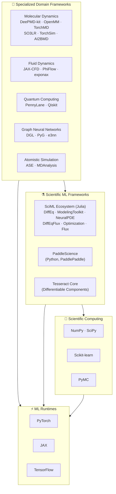

The computational backbone of AI-driven science spans a deep stack — from general-purpose tensor engines and numerical libraries to domain-specific simulation toolkits that embed physical laws into differentiable pipelines. This page maps that stack in full, organizing the frameworks that researchers actually reach for when they need to train models on physical systems, solve PDEs with neural surrogates, run molecular dynamics with learned potentials, or program quantum circuits. Understanding where each framework sits in the architecture — and what it assumes about your workload — is the first step toward building scientific ML systems that are both correct and fast.

## The Computing Framework Stack

The frameworks in this ecosystem layer into four distinct abstraction levels. At the base, general-purpose ML runtimes provide the tensor operations and autodiff primitives. Scientific computing libraries add the numerical methods — linear algebra, optimization, ODE solvers — that make scientific workloads tractable. The SciML layer fuses those two capabilities into unified frameworks where differential equations and neural networks compose natively. Finally, specialized frameworks encode domain-specific physics (molecular dynamics, fluid dynamics, quantum computing) as differentiable, composable modules.

The critical architectural insight is that **the SciML layer (L3) is the only level where differential equations and neural networks compose without impedance mismatch** — the Julia SciML ecosystem achieves this through a shared IR (ModelingToolkit.jl) and O(1) adjoint backpropagation (DiffEqFlux.jl). Python-based frameworks at L3 and L4 typically bridge the gap by wrapping numerical solvers inside autodiff frameworks, trading some composability for the broader PyTorch/JAX ecosystem.

Sources: [README.md](/README.md#L849-L891)

## ML Runtimes & Scientific Computing

The three ML runtimes — **PyTorch**, **JAX**, and **TensorFlow** — differ in how they handle the scientific computing workloads that underpin everything above them. PyTorch's eager-mode execution and dynamic computation graphs make it the dominant choice for research prototyping and the backbone of most domain frameworks listed here. JAX's functional transformations (`jit`, `grad`, `vmap`, `pmap`) and XLA compilation give it a decisive edge for high-throughput scientific simulation where vectorization over parameter ensembles matters. TensorFlow, while still widely deployed in production, sees less adoption in the cutting-edge scientific ML tools cataloged in this repository.

| Framework | Execution Model | Autodiff Strategy | Key SciML Strength | Ecosystem Reach |
|-----------|----------------|-------------------|-------------------|-----------------|
| **PyTorch** | Eager + `torch.compile` | Reverse-mode (AD) | Largest model zoo; domain frameworks (PyG, DGL, TorchMD) | 23.7K+ stars (PyG) |
| **JAX** | Functional + XLA | Forward & reverse; `grad`/`jacrev`/`jacfwd` | `vmap`/`pmap` for batched physics; JAX-CFD, JAX-MD | 19K+ stars |
| **TensorFlow** | Graph + Keras | Reverse-mode (GradientTape) | Production deployment; TPU support | Declining in SciML |

The scientific computing layer — **NumPy**, **SciPy**, and **Scikit-learn** — remains the lingua franca for data preprocessing, classical statistical analysis, and the numerical kernels that many ML frameworks wrap. **PyMC** extends this layer into probabilistic programming, enabling Bayesian inference workflows that are increasingly relevant for uncertainty quantification in scientific models.

> [!TIP]
> When choosing between PyTorch and JAX for a scientific ML project, the deciding factor is usually composability: if you need to compose multiple domain frameworks (PyG + TorchMD + e3nn), PyTorch's ecosystem wins. If you need to differentiate through entire simulation loops or batch over millions of parameter configurations, JAX's functional transforms are architecturally superior.

Sources: [README.md](/README.md#L851-L859), [README.md](/README.md#L878)

## Scientific Machine Learning Frameworks

The SciML ecosystem, built in Julia, represents the most architecturally coherent attempt to unify scientific computing with machine learning. Rather than wrapping numerical solvers inside an ML framework, the SciML stack treats differential equations as first-class citizens that compose with neural networks through a shared intermediate representation.

| Framework | Stars | Purpose | Key Differentiator |
|-----------|-------|---------|-------------------|
| **DifferentialEquations.jl** | 3.0K+ | High-performance ODE/SDE/DDE/PDE solving | Multi-language dispatch; 1000+ solver combinations |
| **ModelingToolkit.jl** | 1.5K+ | Acausal modeling & automatic parallelization | Symbolic-numeric IR for compositional modeling |
| **NeuralPDE.jl** | 1.1K+ | Physics-informed neural networks | Automatic PDE discretization from symbolic spec |
| **DiffEqFlux.jl** | 900+ | Neural ODEs with O(1) backprop | Adjoint method avoids storing intermediate states |
| **Optimization.jl** | 800+ | Unified optimization interface | 100+ optimizer wrappers; local/global/derivative-free |
| **SciMLBenchmarks.jl** | — | Benchmarking suite | Cross-language solver comparisons |
| **Flux.jl** | — | General ML in Julia | Native Julia; no Python dependency |

The critical technical advantage of **DiffEqFlux.jl** is its use of the **adjoint method for O(1) backpropagation** through ODE solvers. Instead of checkpointing every intermediate state of the solver (which scales with the number of time steps), the adjoint method solves a single backward ODE to compute gradients, making memory cost independent of trajectory length. This is the same principle behind `torchdiffeq` in Python, but the Julia implementation benefits from the language's multiple-dispatch system, which allows the same code to specialize across solver types without code duplication.

**PaddleScience** (Python, PaddlePaddle) provides an alternative SciML framework for researchers in the PaddlePaddle ecosystem, offering SDK-level support for AI-driven scientific computing applications including PINNs, neural operators, and inverse problems. **Tesseract Core** (Pasteur Labs, SciPy 2025 / JOSS) takes a different approach — packaging heterogeneous scientific tools into self-contained, portable, gradient-propagating components with auto-generated schemas, CLI, and API interfaces, enabling composable differentiable pipelines across language boundaries.

Sources: [README.md](/README.md#L861-L871)

## Specialized Domain Frameworks

### Molecular Dynamics & Atomistic Simulation

Molecular dynamics frameworks have undergone a paradigm shift with the introduction of machine-learned interatomic potentials (MLIPs). Traditional MD engines (OpenMM, ASE) compute forces from empirical force fields or quantum-mechanical methods; the new generation replaces those force calculations with neural network surrogates that achieve DFT-level accuracy at classical MD cost.

| Framework | Approach | Key Capability | Stars |
|-----------|----------|---------------|-------|
| **DeePMD-kit** | Deep learning potentials | DFT accuracy with classical MD efficiency; Gordon Bell Prize 2020 | 1.9K+ |
| **TorchMD** | End-to-end PyTorch MD | Differentiable simulation with neural network potentials | 707+ |
| **SO3LR** | Pretrained ML force field | SO3krates + universal pairwise; (bio)molecular simulations | — |
| **TorchSim** | PyTorch-native atomistic engine | Batched MD with auto GPU memory; MACE/Fairchem/SevenNet/ORB | — |
| **OpenMM** | Classical MD toolkit | High-performance molecular simulation; GPU-accelerated | — |
| **AI2BMD** | AI-powered ab initio | Quantum-mechanical accuracy for 10K+ atom proteins | — |
| **MDtrajNet** | Foundation model for MD | Generates trajectories bypassing force calculations; 100× speedup | — |
| **ASE** | Atomic Simulation Environment | Standardized interface for materials modeling codes | — |
| **MDAnalysis** | Trajectory analysis | Post-processing and analysis of MD trajectories | — |

> [!TIP]
> **TorchSim** is the architectural bellwether here**: it exemplifies the convergence of MD engines and ML frameworks by treating atomistic simulation as a native PyTorch workload with automatic GPU memory management and batched execution. If your workflow involves iterating between MLIP training and MD evaluation, TorchSim eliminates the serialization boundary between the two.

The **e3nn** library (Euclidean Neural Networks) provides the foundational building blocks for E(3)-equivariant deep learning — the geometric inductive bias that underpins NequIP, MACE, Allegro, and other state-of-the-art MLIPs. Equivariance to rotations, translations, and reflections is not just a nice-to-have; it is a physical constraint that dramatically reduces the data requirements for learning interatomic potentials (NequIP achieves DFT accuracy with up to 1000× less training data than invariant models).

Sources: [README.md](/README.md#L873-L884)

### Fluid Dynamics & Differentiable Physics

Differentiable physics simulation is the frontier where CFD meets deep learning. The key architectural pattern is replacing the forward solve-then-compare pipeline with an end-to-end differentiable simulation where the physics solver is part of the computation graph.

| Framework | Backend | Physics Domain | Differentiation Strategy |
|-----------|---------|---------------|------------------------|
| **JAX-CFD** | JAX | Navier-Stokes (turbulence, convection-diffusion) | JAX autodiff; automatic |
| **PhiFlow** | PyTorch / JAX / TensorFlow | General PDEs with built-in fluid simulation | Backend-native autodiff |
| **Newton** | NVIDIA Warp | Rigid/soft body, cloth, gradient-based optimization | Warp autodiff |
| **exponax** | JAX + Equinox | 46+ built-in PDEs; Fourier spectral methods | Full auto-differentiation |

**JAX-CFD** is notable for making Navier-Stokes simulations fully differentiable — you can compute gradients of any loss function with respect to initial conditions, boundary conditions, or physical parameters, enabling gradient-based optimization for inverse design and data assimilation. **PhiFlow** takes a backend-agnostic approach, supporting PyTorch, JAX, and TensorFlow, which makes it the most portable choice for teams with mixed infrastructure. **Newton** (Linux Foundation, initiated by Disney Research, DeepMind, and NVIDIA) targets the robotics and physical AI intersection, providing GPU-accelerated differentiable simulation of rigid/soft body dynamics on NVIDIA Warp.

Sources: [README.md](/README.md#L885-L886)

### Quantum Computing Frameworks

Quantum computing frameworks for science operate at the intersection of quantum circuit programming and classical ML. The two dominant frameworks serve complementary roles:

| Framework | Stars | Focus | Key SciML Capability |
|-----------|-------|-------|---------------------|
| **PennyLane** | 3K+ | Differentiable quantum programming | Hybrid quantum-classical ML; automatic differentiation through quantum circuits |
| **Qiskit** | 7.4K+ | Full-stack quantum computing | Quantum algorithm development; quantum chemistry & materials science |

**PennyLane**'s defining feature is its ability to compute gradients through quantum circuits natively — it treats quantum gates as differentiable operations in a computation graph, enabling hybrid quantum-classical optimization where classical neural networks and quantum circuits are trained jointly. **Qiskit** provides a broader SDK for quantum computing at the level of circuits, operators, and primitives, with particular strength in quantum chemistry applications (VQE, quantum phase estimation) and integration with IBM's quantum hardware.

Sources: [README.md](/README.md#L887-L888)

### Graph Neural Networks for Science

Graph neural networks are the structural backbone of molecular modeling, materials discovery, and scientific knowledge graph learning. The two dominant frameworks are:

| Framework | Stars | Backend | Key SciML Use Cases |
|-----------|-------|---------|-------------------|
| **PyTorch Geometric (PyG)** | 23.7K+ | PyTorch | Molecular modeling, materials discovery, protein interaction networks |
| **DGL** | 14K+ | PyTorch / TensorFlow / MXNet | Molecular modeling, materials discovery, scientific knowledge graphs |

PyG's dominance in the scientific ML community stems from its tight integration with the PyTorch ecosystem — it inherits PyTorch's optimization, distributed training, and model zoo, while adding message-passing primitives and graph-level batching that are essential for molecular and materials workloads. DGL's multi-backend support makes it the choice for teams that need framework-agnostic graph computation, though its scientific user base is smaller.

Sources: [README.md](/README.md#L889-L890)

## Framework Selection Guide

Choosing the right framework depends on where your workload falls on the spectrum from "general ML applied to scientific data" to "physics-native simulation with learned components." The following decision matrix maps common scientific ML workloads to their recommended frameworks:

| Your Workload | Primary Framework | Supporting Libraries | Why |
|--------------|-------------------|---------------------|-----|
| Training GNNs on molecular graphs | PyTorch + PyG | e3nn, DGL | Largest model zoo; PyG's message-passing primitives |
| Solving PDEs with neural surrogates | SciML (Julia) or JAX-CFD | NeuralPDE.jl, PhiFlow, exponax | Native differential equation composition |
| Learning interatomic potentials | DeePMD-kit or TorchSim | e3nn, MACE, ASE | MLIP-specific training loops; MD integration |
| Quantum-classical hybrid ML | PennyLane | Qiskit, PyTorch | Differentiable quantum circuits |
| Bayesian scientific inference | PyMC | NumPy, SciPy, JAX | Probabilistic programming with scientific priors |
| Large-scale weather/climate modeling | NVIDIA Earth-2, Aurora | JAX, PyTorch | See [Earth & Climate Science](19-earth-and-climate-science) |
| Medical image analysis pipelines | MONAI | PyTorch | See [Biology & Medicine](16-biology-and-medicine) |

Sources: [README.md](/README.md#L849-L891)

## Where to Go Next

The computing frameworks documented here are the infrastructure layer — they become powerful when combined with the domain-specific models and scientific workflows that sit above them. The natural reading progression depends on your scientific domain:

- **If you're building physics-informed models**: The frameworks here (NeuralPDE.jl, DeepXDE, PhiFlow) connect directly to [Physics-Informed Neural Networks](13-physics-informed-neural-networks) and [Neural Operators & Model Discovery](14-neural-operators-and-model-discovery), which document the specific architectures and training strategies these frameworks implement.
- **If you're working with molecular or materials data**: The specialized frameworks (DeePMD-kit, e3nn, TorchSim) are the computational engines behind the tools cataloged in [Chemistry & Materials](17-chemistry-and-materials).
- **If you need training data or benchmarks**: Every framework needs data — [Datasets & Benchmarks](23-datasets-and-benchmarks) catalogs the evaluation infrastructure that makes framework comparison meaningful.
- **If you want to understand the mathematical foundations**: [Neural Differential Equations](15-neural-differential-equations) covers the theory that underpins the SciML ecosystem and the adjoint methods that make DiffEqFlux.jl work.
