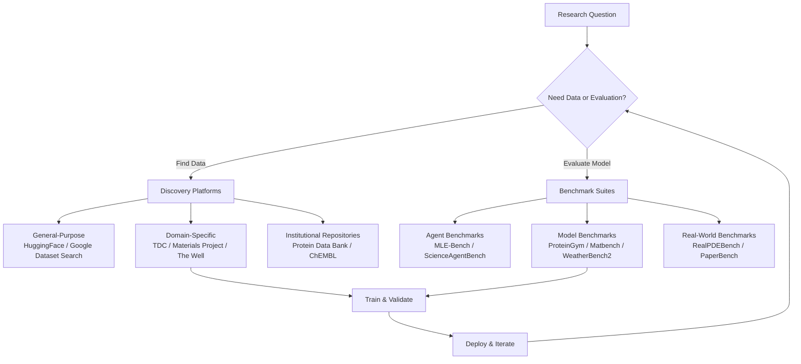

Data is the fuel; benchmarks are the compass. In AI for Science, datasets encode the physical world into machine-readable form, while benchmarks define what "good" means for models that must reason about molecules, proteins, climates, and equations. This page maps the landscape of scientific datasets and evaluation benchmarks cataloged in the Awesome AI for Science repository, helping you navigate from discovery to selection with clarity and confidence.

## Why Datasets & Benchmarks Matter

Every scientific AI model is only as trustworthy as the data it trains on and the benchmarks it is evaluated against. Unlike general-purpose machine learning—where ImageNet or GLUE serve as universal yardsticks—scientific AI demands **domain-grounded benchmarks** that respect physical laws, experimental reproducibility, and disciplinary nuance. A protein fitness predictor trained on biased mutagenesis data may fail on clinical variants; a weather model that scores well on RMSE may still produce physically implausible forecasts. Understanding the dataset landscape is therefore not a preparatory step—it is the core intellectual challenge of building reliable scientific AI.

Sources: [README.md](/README.md#L856-L886)

## The Datasets & Benchmarks Landscape

The resources in this repository span four distinct tiers, from general-purpose discovery platforms to domain-specific curated collections and rigorous evaluation benchmarks. The following diagram illustrates how these tiers relate to each other and to the broader AI4Science workflow:



Sources: [README.md](/README.md#L856-L886)

## General-Purpose Discovery Platforms

Before diving into domain-specific collections, every researcher should know the two universal entry points for finding scientific datasets:

| Platform | Strength | Best For |
|---|---|---|
| **[Hugging Face Datasets](https://huggingface.co/datasets)** | 100K+ datasets with programmatic access via `datasets` library | Quick prototyping, ML pipeline integration, reproducible data loading |
| **[Google Dataset Search](https://datasetsearch.research.google.com/)** | Search engine indexing datasets across repositories worldwide | Discovering niche datasets, cross-referencing data provenance |

Hugging Face Datasets is particularly valuable for beginners because it provides a **single Python API** to load, stream, and transform datasets without manual downloads. Google Dataset Search complements this by acting as a meta-search engine—it surfaces datasets hosted on institutional repositories, government portals, and scholarly archives that may not appear in ML-specific catalogs.

Sources: [README.md](/README.md#L858-L860)

## Domain-Specific Datasets

### Biology & Medicine

Biomedical datasets are the most densely represented category in this repository, reflecting the field's decades-long investment in structured data curation. The following table organizes the key resources by their primary function:

| Dataset | Scope | Key Features | Scale |
|---|---|---|---|
| **[TDC](https://github.com/mims-harvard/TDC)** | Drug discovery end-to-end | 66 AI-ready datasets, 22 tasks, 29 leaderboards | Covers target ID → ADMET → clinical outcomes |
| **[ProteinGym](https://github.com/OATML-Markslab/ProteinGym)** | Protein fitness prediction | 200+ deep mutational scanning assays | Standardized zero-shot & supervised evaluation |
| **[ProteinWorkshop](https://github.com/a-r-j/ProteinWorkshop)** | Protein representation learning | Unified benchmarking framework | Structure, fitness, property prediction tasks |
| **[Protein Data Bank](https://www.rcsb.org/)** | Protein 3D structures | Gold-standard experimental structures | 200K+ structures |
| **[ChEMBL](https://www.ebi.ac.uk/chembl/)** | Chemical bioactivity | Drug-like compound assays | 2M+ bioactivity records |
| **[Human Protein Atlas](https://www.proteinatlas.org/)** | Protein expression | Tissue-level expression profiles | 20K+ proteins across 44 tissues |
| **[Arc Virtual Cell Atlas](https://github.com/ArcInstitute/arc-virtual-cell-atlas)** | Single-cell perturbation | 602M+ single-cell profiles | Integrates Tahoe-100M + scBaseCount |
| **[Chinese Medical Dataset](https://github.com/Mengqi97/chinese-medical-dataset)** | Chinese medical NLP | Comprehensive collection for AI research | Multiple sub-datasets |

> [!TIP]
> The **Therapeutics Data Commons (TDC)** is the single most important starting point for anyone building AI models in drug discovery. Its `tdc` Python package provides a unified API across all 66 datasets with built-in data splitting, feature generation, and leaderboard submission—eliminating the engineering overhead that typically slows research iteration.

Sources: [README.md](/README.md#L862-L871)

### Chemistry & Materials

Materials science datasets bridge quantum chemistry and macroscopic properties, providing the training signal for models that predict everything from crystal stability to catalytic activity:

| Dataset | Scope | Key Features |
|---|---|---|
| **[Materials Project](https://next-gen.materialsproject.org/)** | Computational materials database | 150K+ computed materials with DFT properties |
| **[QM9](https://quantum-machine.org/datasets/)** | Small molecule quantum properties | 134K molecules with 12+ electronic properties |
| **[Open Catalyst Project](https://opencatalystproject.org/)** | Catalyst discovery | 1.3M+ DFT relaxations for adsorption modeling |

The **Materials Project** is the canonical reference for computational materials science—it provides not just raw data but a fully queryable API and provenance tracking for every calculation. **QM9** serves as the "MNIST of molecular ML": a small, clean dataset ideal for rapid prototyping and benchmarking. **Open Catalyst Project** pushes the frontier with its massive scale of DFT-relaxed surface-adsorbate configurations, enabling models that predict catalytic activity without expensive quantum calculations.

Sources: [README.md](/README.md#L873-L877)

### Physics

Physics datasets in this repository are characterized by their scale and fidelity to real-world phenomena:

| Dataset | Scope | Key Features |
|---|---|---|
| **[The Well](https://github.com/PolymathicAI/the_well)** | Multidisciplinary simulations | 15TB, 16 datasets, unified PyTorch dataloaders |
| **[RealPDEBench](https://github.com/AI4Science-WestlakeU/RealPDEBench)** | PDE solving with real-world data | 5 scenarios, 700+ trajectories, paired real + simulated |
| **[LIGO Open Science Center](https://gwosc.org/)** | Gravitational wave data | Raw and processed detector strain data |
| **[Particle Data Group](https://pdg.lbl.gov/)** | Particle physics constants | Authoritative compilation of measurements |
| **[OpenQuantumMaterials](https://www.quantum-materials.org/)** | Quantum materials | Curated DFT dataset for quantum materials |

**The Well** stands out as a landmark resource for training physics foundation models—it provides 15TB of high-fidelity simulation data across fluid dynamics, magnetohydrodynamics, astrophysics, and more, all with standardized PyTorch dataloaders. **RealPDEBench** is the first benchmark to pair real-world measurements with matched numerical simulations, addressing the critical gap between in-distribution synthetic benchmarks and out-of-distribution physical reality.

> [!TIP]
> When selecting a physics dataset, always check whether it includes **real-world validation data** alongside simulations. Models trained purely on simulation data often exhibit subtle distribution shifts that only manifest when deployed against physical measurements—a problem RealPDEBench was specifically designed to surface.

Sources: [README.md](/README.md#L879-L886)

## Benchmarks for Scientific AI Evaluation

Benchmarks in AI for Science serve a fundamentally different purpose than in general ML. They must evaluate not just predictive accuracy, but **physical consistency**, **experimental reproducibility**, and **domain-specific reasoning**. The benchmarks in this repository fall into three categories:

### Agent Evaluation Benchmarks

These benchmarks evaluate autonomous AI systems that perform end-to-end research tasks—writing code, running experiments, and producing scientific outputs:

| Benchmark | What It Evaluates | Key Metric |
|---|---|---|
| **[MLE-Bench](https://github.com/openai/mle-bench)** | ML engineering on 75 Kaggle competitions | Reproducible Docker-based grading |
| **[ScienceAgentBench](https://github.com/OSU-NLP-Group/ScienceAgentBench)** | 102 executable tasks from 44 papers | Containerized execution across 4 disciplines |
| **[PaperBench](https://github.com/openai/preparedened/tree/main/project/paperbench)** | Replicating 20 ICML 2024 papers from scratch | 8,316 gradable tasks with author rubrics |
| **[AIRS-Bench](https://github.com/facebookresearch/airs-bench)** | End-to-end autonomous research ability | 20 tasks from SOTA ML papers |
| **[SciCode](https://github.com/scicode-bench/SciCode)** | Scientific coding across 16 subdomains | 338 subproblems with gold solutions |
| **[NewtonBench](https://github.com/HKUST-KnowComp/NewtonBench)** | Rediscovering scientific laws | 324 tasks, memorization-resistant design |
| **[ResearchClawBench](https://github.com/InternScience/ResearchClawBench)** | Re-discovery to new-discovery | 40 real-science tasks across 10 disciplines |

### Domain Model Benchmarks

These evaluate the predictive and generative capabilities of models within specific scientific domains:

| Benchmark | Domain | Focus |
|---|---|---|
| **[ProteinGym](https://github.com/OATML-Markslab/ProteinGym)** | Protein science | Fitness prediction & variant effect |
| **[Matbench](https://github.com/materialsproject/matbench)** | Materials science | 13 property prediction tasks |
| **[WeatherBench2](https://github.com/google-research/weatherbench2)** | Weather/climate | Standardized ML forecasting evaluation |
| **[ClimateBench](https://github.com/duncanwp/ClimateBench)** | Climate science | ML climate model benchmarking |
| **[RealPDEBench](https://github.com/AI4Science-WestlakeU/RealPDEBench)** | PDE solving | Real-world vs. simulation gap |

### Real-World & Reproducibility Benchmarks

These push models beyond clean evaluation environments into the messy reality of scientific practice:

| Benchmark | What It Tests | Significance |
|---|---|---|
| **[PaperBench](https://github.com/openai/preparedened/tree/main/project/paperbench)** | Full paper replication from scratch | Author-co-developed grading rubrics |
| **[RealPDEBench](https://github.com/AI4Science-WestlakeU/RealPDEBench)** | Sim-to-real gap for PDE solvers | First paired real + simulated benchmark |
| **[SciTrust](https://impact.ornl.gov/en/publications/scitrust-evaluating-the-trustworthiness-of-large-language-models-)** | Trustworthiness of scientific LLMs | Truthfulness, hallucination, sycophancy |

Sources: [README.md](/README.md#L356-L385), [README.md](/README.md#L879-L886)

## Getting Started: A Practical Path

For beginner developers entering the AI4Science data landscape, the path from curiosity to contribution follows a clear progression:

**Step 1 — Start with a general-purpose platform.** Use [Hugging Face Datasets](https://huggingface.co/datasets) to explore what's available in your domain. Install the `datasets` library and load a small dataset in under five lines of code:

```python
from datasets import load_dataset
dataset = load_dataset("google-research-datasets/nq_open", split="train[:100]")
print(dataset[0])
```

**Step 2 — Move to domain-specific datasets.** Once you've identified your domain, use the curated collections above. For drug discovery, install `tdc` and load a benchmark dataset with built-in splits. For materials science, query the Materials Project API. For physics simulations, clone The Well and use its PyTorch dataloaders.

**Step 3 — Evaluate against standard benchmarks.** Before claiming a model improvement, validate it on the appropriate benchmark from the tables above. A new protein model should be evaluated on ProteinGym; a new weather model on WeatherBench2; a new research agent on MLE-Bench or ScienceAgentBench.

**Step 4 — Contribute back.** If you create a new dataset or benchmark, follow the repository's [Contributing Guidelines](CONTRIBUTING.md) to add it to the collection.

Sources: [README.md](/README.md#L856-L886), [CONTRIBUTING.md](/CONTRIBUTING.md)

## Where to Go Next

The datasets and benchmarks on this page are the foundation upon which all other AI4Science capabilities are built. Once you understand the data landscape, the natural next steps are:

- **Explore the models that consume this data** → [Foundation Models for Science](21-foundation-models-for-science)
- **Learn the frameworks that process it** → [Computing Frameworks](22-computing-frameworks)
- **See how agents use benchmarks to self-improve** → [Evaluation & Benchmarking](12-evaluation-and-benchmarking)
- **Understand the physics that constrains it all** → [Physics-Informed Neural Networks](13-physics-informed-neural-networks)
