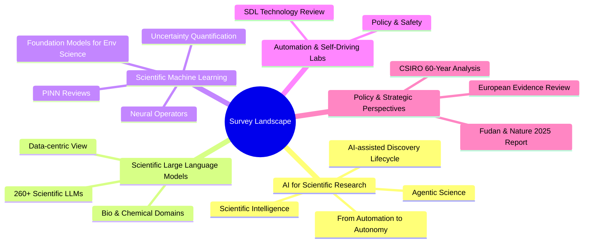
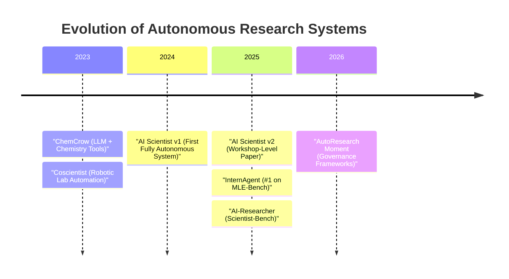
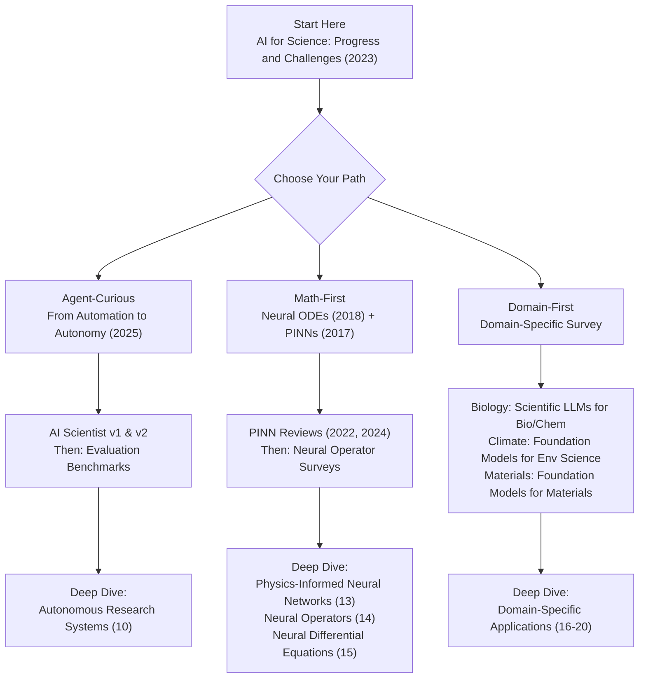

The AI for Science landscape is evolving at an extraordinary pace, with hundreds of papers published each year across domains as diverse as protein folding, climate modeling, and autonomous discovery. For a beginner developer entering this field, the sheer volume can be overwhelming. This page curates the **most influential and foundational papers, comprehensive surveys, and strategic reviews** that form the intellectual backbone of AI4Science — organized by theme so you can build understanding from first principles up to the cutting edge.

Sources: [README.md](/README.md#L383-L467)

## Why Read Papers in AI4Science?

Unlike traditional software engineering where documentation often suffices, AI4Science sits at the intersection of **domain expertise, mathematical rigor, and engineering practice**. Papers are the primary vehicle for communicating new methods, benchmarks, and discoveries. Understanding the key literature gives you three critical advantages: you learn *why* a technique works (not just *how* to call an API), you gain the vocabulary to collaborate with domain scientists, and you develop the taste to evaluate which tools and approaches are trustworthy for real research.

Sources: [README.md](/README.md#L383-L467)

## Foundational Papers — The Roots of AI4Science

Every field has its origin stories — papers that introduced paradigm-shifting ideas and became citation landmarks. These six works established the core intellectual threads that weave through the entire AI4Science ecosystem today.

| Paper | Year | Core Contribution | Why It Matters for Beginners |
|---|---|---|---|
| **Physics-Informed Neural Networks** | 2017 | Embeds physical laws (PDEs) directly into neural network loss functions | The starting point for understanding how physics constraints improve ML — read this before touching any PINN library |
| **Neural Ordinary Differential Equations** | 2018 | Reinterprets residual networks as ODE solvers, enabling continuous-depth models | Bridges deep learning and differential equations — foundational for all SciML frameworks |
| **Foundation Models for Science** | 2022 | Introduces large pre-trained models as general-purpose scientific tools | Explains why "one model, many tasks" is transforming every scientific domain |
| **AI for Science: Progress and Challenges** | 2023 | State-of-the-field assessment of AI's role across scientific disciplines | A panoramic view — helps you understand the full scope before diving into specifics |
| **Machine Learning for Scientometric Analysis** | 2021 | Comprehensive review of ML applied to science-of-science metrics | Shows how AI is used to study the scientific enterprise itself |
| **Scientific Discovery in the Age of AI** (Nature) | 2023 | Nature review on AI's transformative role in scientific discovery | Authoritative synthesis from the perspective of the scientific establishment |

> [!TIP]
> Start with the **Physics-Informed Neural Networks** and **Neural ODEs** papers if you come from a math/physics background, or the **AI for Science: Progress and Challenges** review if you prefer a broader overview first. These two paths converge naturally.

Sources: [README.md](/README.md#L385-L391)

## Comprehensive Surveys & Reviews (2024–2025)

The survey landscape has exploded in the past two years, reflecting the field's rapid maturation. Rather than reading every survey, use this taxonomy to find the ones most relevant to your interests.

Sources: [README.md](/README.md#L393-L431)

### AI for Scientific Research

These surveys map the full lifecycle of AI in research — from literature search and hypothesis generation through experimentation to peer review. They are your best starting point for understanding the "big picture" before diving into specific tools or methods.

| Survey | Date | Focus | Key Takeaway |
|---|---|---|---|
| A Survey on AI-assisted Scientific Discovery | 2025.02 | LLMs across the full research lifecycle | Most comprehensive overview of how LLMs assist from literature search to peer review |
| AI4Research: A Survey of AI for Scientific Research | 2025.07 | Systematic taxonomy of AI in research | Provides a clean classification framework for understanding the field |
| Artificial Intelligence for Science in Quantum, Atomistic, and Continuum Systems | 2023.07 | Unified survey across scientific scales | 63 contributors cover the full spectrum from quantum to continuum — the deepest technical survey |
| From Automation to Autonomy: A Survey on LLMs in Scientific Discovery | 2025.05 | Three-level taxonomy (Tool → Analyst → Scientist) | A powerful mental model: AI evolves from tool to analyst to autonomous scientist |
| From AI for Science to Agentic Science | 2025.08 | Agentic science across life sciences, chemistry, materials, physics | The most current survey on the shift toward autonomous research agents |
| Agentic AI for Scientific Discovery | 2025.03 | AI agents in science — progress, challenges, future | Comprehensive review of the agent paradigm in scientific discovery |
| Towards Scientific Intelligence | 2025.03 | LLM-based scientific agent systems | Focuses on the architecture and design of scientific AI agent systems |

Sources: [README.md](/README.md#L395-L402)

### Scientific Large Language Models

The explosion of domain-specific LLMs for science is one of the most significant trends in the field. These surveys catalog and compare hundreds of models.

| Survey | Date | Scope | Why Read It |
|---|---|---|---|
| A Comprehensive Survey of Scientific LLMs | 2024.06 | 260+ scientific LLMs across domains | The most exhaustive catalog — use it as a reference index |
| A Survey of Scientific LLMs: From Data Foundations to Agent Frontiers | 2025.08 | Data-centric view of scientific LLMs | Explains how training data shapes model capabilities — critical for understanding model limitations |
| Scientific LLMs: Biological & Chemical Domains | 2024.01 | Domain-specific scientific LLMs | Best entry point if you work in biochemistry or drug discovery |

Sources: [README.md](/README.md#L404-L407)

### Scientific Machine Learning

These reviews cover the mathematical and computational foundations — neural networks that respect physical laws, learn operators, and quantify uncertainty.

| Survey | Date | Focus Area |
|---|---|---|
| Scientific ML through Physics-Informed Neural Networks | 2022.01 | Comprehensive PINN review — where the field is and what's next |
| Physics-Informed Neural Networks and Extensions | 2024.08 | Recent PINN advances, variants, and new architectures |
| The Frontier of Simulation-Based Inference (PNAS 2020) | 2020 | Foundational SBI review by Cranmer et al. — likelihood-free Bayesian inference |
| From Theory to Application: Neural Operators | 2025.03 | Implementation-focused guide to DeepONet, FNO, PCANet |
| Architectures, Variants, and Performance of Neural Operators | 2025 | Systematic comparison of DeepONets, integral kernel operators, transformers |
| Foundation Models for Environmental Science | 2025.04 | Environmental applications of foundation models |
| Foundation Models in Bioinformatics | 2025 | Biological foundation models survey |
| Foundation Models for Materials Discovery (Nature) | 2025 | Perspective on materials AI |

> [!TIP]
> If you're building a PINN or neural operator project, read the **2022 PINN review** and the **2025 Neural Operators guide** together — they cover the theoretical foundations and practical implementation in complementary ways.

Sources: [README.md](/README.md#L409-L417)

### Uncertainty Quantification

Scientific predictions without uncertainty estimates are unreliable. These two reviews provide the essential framework for understanding and quantifying uncertainty in scientific ML models.

| Survey | Year | Venue | Key Contribution |
|---|---|---|---|
| UQ in Scientific ML: Methods, Metrics, and Comparisons | 2023 | J. Comput. Phys. | Comprehensive UQ framework for PINNs and neural operators |
| A Survey on UQ Methods for Deep Learning | 2023 | arXiv | Systematic taxonomy of UQ methods from uncertainty source perspective |

Sources: [README.md](/README.md#L419-L421)

### Automation & Self-Driving Laboratories

The convergence of AI, robotics, and laboratory automation is creating a new paradigm: self-driving laboratories that can run experiments autonomously. These reviews document the technology and its implications.

| Survey | Year | Venue | Focus |
|---|---|---|---|
| Self-Driving Laboratories for Chemistry and Materials Science | 2024 | Chem. Rev. | 100-page comprehensive review on SDL technology, applications, and infrastructure |
| Autonomous 'self-driving' laboratories | 2025 | Royal Soc. Open Sci. | Technology review with policy and safety considerations |

Sources: [README.md](/README.md#L423-L425)

### Policy & Strategic Perspectives

AI for Science is not just a technical endeavor — it has profound implications for how science is funded, governed, and communicated. These reports provide the institutional and strategic context.

| Report | Year | Source | Key Insight |
|---|---|---|---|
| Artificial Intelligence for Science | 2022 | CSIRO | Landmark report analyzing AI adoption across 98% of scientific fields over 60 years |
| AI for Science 2025 | 2025 | Fudan University & Nature | Comprehensive report on AI's transformative impact across 7 fields, 28 directions, 90+ challenges |
| AI in Science Evidence Review | 2024 | European Scientific Advice | Policy-focused evidence review on AI's impact in research |

Sources: [README.md](/README.md#L427-L430)

## AI Scientist & Autonomous Research — The Frontier (2024–2025)

The most dramatic development in AI4Science is the emergence of **autonomous research systems** — AI agents that can generate hypotheses, design experiments, write code, and even produce publication-quality manuscripts. These papers document the breakthroughs that are redefining what it means to "do science."

| Paper | Date | Breakthrough |
|---|---|---|
| **The AI Scientist** (SakanaAI) | 2024.08 | First fully autonomous research system: hypothesis → experiment → writing → review simulation |
| **The AI Scientist-v2** | 2025.04 | Enhanced with agentic tree search; first workshop-level accepted paper generated by AI |
| **AI-Researcher** | 2025.05 | Autonomous pipeline from literature to publication with Scientist-Bench evaluation |
| **InternAgent** | 2025.05 | Closed-loop multi-agent system achieving #1 on MLE-Bench |
| **Autonomous Scientific Discovery Through Hierarchical AI Scientist Systems** | 2025.07 | Self-evolving multi-agent research systems |
| **ChemCrow** | 2023.04 | LLM agents for chemistry research with tool integration |
| **Coscientist** | 2023 | Robotic lab automation — autonomous chemical experiment planning and execution |
| **The AutoResearch Moment** | 2026.03 | Position paper on claim governance for autonomous research — proposes research-director bundle |

Sources: [README.md](/README.md#L432-L441)

## Recent Advances & Domain Applications

These papers represent landmark results across specific scientific domains — from protein structure prediction to medical reasoning to Earth observation. They demonstrate how AI methods translate into concrete scientific impact.

| Paper | Domain | Year | Impact |
|---|---|---|---|
| AlphaFold: Protein Structure Prediction | Biology | 2021 | Solved the 50-year protein folding problem |
| AI for Materials Discovery | Materials | 2023 | Systematic review of AI-driven materials design |
| Large Language Models in Chemistry | Chemistry | 2024 | Comprehensive survey of LLMs for chemical research |
| Cell2Sentence (ICML 2024) | Biology | 2024 | Teaching LLMs the language of single-cell biology |
| Scaling LLMs for Single-Cell Analysis | Biology | 2025 | 27B parameter biological language models |
| Boltz-1 | Biology | 2024 | First open-source model at AlphaFold3-level accuracy |
| MOOSE (ACL 2024) | Cross-domain | 2024 | LLMs for automated hypothesis discovery — ICML Best Poster |
| Earth-Agent | Earth Science | 2025 | LLM agent framework for Earth Observation with 104 tools |
| MedAgents (ACL 2024) | Medicine | 2024 | Multi-disciplinary collaboration framework for medical reasoning |
| MedAgentGym | Medicine | 2025 | Specialized training environment for biomedical AI agents |
| Galactica | General Science | 2022 | Large language model for science by Meta |

Sources: [README.md](/README.md#L443-L459)

## Evaluation & Benchmarking Papers

How do we know if an AI system actually works for science? These papers introduce the benchmarks and evaluation frameworks that the community relies on to measure progress.

| Benchmark | Year | Venue | What It Measures |
|---|---|---|---|
| ScienceAgentBench | 2025 | ICLR | 102 executable tasks from 44 peer-reviewed papers across 4 disciplines |
| Scientist-Bench | 2025 | — | Comprehensive benchmark comparing LLM Agent research outcomes with human-quality work |
| SciTrust | 2024 | — | Trustworthiness of scientific LLMs (truthfulness, hallucination, sycophancy) |
| SciBench | 2023 | — | College-level scientific problem-solving abilities |
| ChartCoder Evaluation | 2025 | ACL | Chart-to-code generation benchmarks |

Sources: [README.md](/README.md#L461-L467)

## Curated Paper Collections & Repositories

Beyond the individual papers listed above, the community maintains several curated collections that serve as living indexes of the AI4Science literature. These are invaluable for staying current and discovering niche work.

| Collection | Scope | What You'll Find |
|---|---|---|
| [Awesome Scientific Language Models](https://github.com/yuzhimanhua/Awesome-Scientific-Language-Models) | 260+ scientific LLMs | Comprehensive catalog of scientific language models |
| [Awesome LLM Scientific Discovery](https://github.com/HKUST-KnowComp/Awesome-LLM-Scientific-Discovery) | LLM × Discovery | LLM papers focused on scientific discovery |
| [AI4Research Papers](https://github.com/du-nlp-lab/LLM4SR) | LLM for Research | Survey materials and paper collections for LLM-based scientific research |
| [PINN Papers](https://github.com/idrl-lab/PINNpapers) | PINN Research | Dedicated collection of physics-informed neural network papers |
| [SciML Papers](https://sciml.ai/papers/) | Scientific Computing + ML | Papers at the intersection of scientific computing and ML |
| [SBI Papers & Tools](https://simulation-based-inference.org/papers/) | Simulation-Based Inference | Community-maintained SBI research portal |
| [Awesome AI Scientist Papers](https://github.com/openags/Awesome-AI-Scientist-Papers) | Autonomous Science | Papers on autonomous AI scientist systems |
| [Awesome Agents for Science](https://github.com/OSU-NLP-Group/awesome-agents4science) | Scientific Agents | LLM agents across scientific domains |

Sources: [README.md](/README.md#L907-L915)

## Reading Path Recommendations

For beginner developers, the most effective approach is to build understanding in layers — start with broad surveys, then narrow into your domain of interest, and finally tackle the mathematical foundations.

**Recommended reading order for beginners:**

1. **[Overview](1-overview)** — Understand the project's scope and philosophy
2. **This page** — Read the foundational papers and 1–2 surveys matching your interests
3. **[Foundation Models for Science](21-foundation-models-for-science)** — Understand the models powering the field
4. **Choose your domain** — Explore [Biology & Medicine](16-biology-and-medicine), [Chemistry & Materials](17-chemistry-and-materials), [Physics & Astronomy](18-physics-and-astronomy), [Earth & Climate Science](19-earth-and-climate-science), or [Agriculture, Ecology & Social Sciences](20-agriculture-ecology-and-social-sciences)
5. **[Educational Resources & Communities](25-educational-resources-and-communities)** — Find courses, tutorials, and communities to deepen your knowledge
