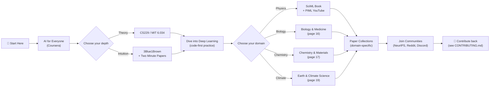

The gap between *knowing AI exists* and *using AI to accelerate your research* is bridged by two forces: **structured learning** and **vibrant community**. This page maps the educational materials, curated paper collections, video channels, conferences, and online communities cataloged in the Awesome AI for Science repository—giving you a clear launchpad regardless of whether you're writing your first neural network or looking for collaborators in computational physics. Every resource listed here is freely accessible or offers a free tier, ensuring that cost is never a barrier to entry.

Sources: [README.md](/README.md#L894-L943), [README.md](/README.md#L1-L8)

## The Learning & Community Landscape

Before diving into individual resources, it helps to see how the educational ecosystem is organized. The diagram below captures the four pillars of this page—**Courses**, **Open Materials**, **Paper Collections**, and **Communities**—and how they feed into each other. A beginner typically starts with courses and open materials, then uses paper collections to deepen domain expertise, and finally participates in communities to stay current and find collaborators.

```mermaid
flowchart TD
    A["🎓 Educational Resources & Communities"] --> B["Courses & Tutorials"]
    A --> C["Open Access Materials"]
    A --> D["Paper Collections & Repositories"]
    A --> E["YouTube Channels"]
    A --> F["Research Communities"]

    B --> B1["AI for Everyone<br/>(Coursera)"]
    B --> B2["CS229 Machine Learning<br/>(Stanford)"]
    B --> B3["MIT 6.034<br/>(MIT OCW)"]

    C --> C1["SciML Book<br/>(1.9k+ stars)"]
    C --> C2["Dive into Deep Learning"]
    C --> C3["Elements of Statistical Learning"]
    C --> C4["Neural Networks & Deep Learning"]

    D --> D1["Scientific Language Models<br/>(260+ models)"]
    D --> D2["LLM Scientific Discovery"]
    D --> D3["AI4Research Papers"]
    D --> D4["PINN Papers"]
    D --> D5["SBI Papers & Tools"]

    E --> E1["Two Minute Papers"]
    E --> E2["3Blue1Brown"]
    E --> E3["Steve Brunton"]
    E --> E4["AI Coffee Break"]

    F --> F1["Conferences<br/>(NeurIPS, ICML, AI4Science)"]
    F --> F2["Organizations<br/>(Allen AI, OpenAI, Partnership on AI)"]
    F --> F3["Online Communities<br/>(r/MachineLearning, Distill)"]

    B & C --> G["Foundation Knowledge"]
    D --> H["Domain Expertise"]
    E --> I["Intuition & Trends"]
    F --> J["Collaboration & Networking"]
    G & H & I & J --> K["🚀 Productive AI4Science Practice"]
```

Sources: [README.md](/README.md#L894-L943)

## Courses & Tutorials

If you're a beginner, **structured courses are your highest-ROI investment**—they provide curated sequences, exercises, and assessment that self-guided browsing cannot replicate. The repository catalogs three foundational courses that span the spectrum from AI literacy to rigorous ML engineering.

| Course | Provider | Focus | Best For | Time Commitment |
|---|---|---|---|---|
| **AI for Everyone** | Coursera | AI concepts, societal impact, business implications | Non-technical researchers who need AI literacy | ~4 weeks, 2–3 hrs/week |
| **CS229 Machine Learning** | Stanford | Supervised/unsupervised learning, theory, applications | Developers ready to build ML models from scratch | ~10 weeks, 10–15 hrs/week |
| **MIT 6.034 Artificial Intelligence** | MIT OCW | Search, constraints, neural nets, prob. inference | Learners who want broad AI fundamentals beyond just ML | ~1 semester, self-paced |

> [!TIP]
> Start with **AI for Everyone** if you can't explain what a neural network does in one sentence. Move to **CS229** when you're ready to implement gradient descent by hand. **MIT 6.034** is the underrated gem—its constraint satisfaction and search sections are directly applicable to scientific experiment design.

Sources: [README.md](/README.md#L896-L899)

## Open Access Educational Materials

Once you've built a foundation through courses, **open-access textbooks and interactive books** let you go deeper at your own pace—without purchasing anything. The repository highlights four standout resources, each with a distinct pedagogical approach.

| Resource | Format | Key Strength | Stars |
|---|---|---|---|
| **[SciML Book](https://github.com/SciML/SciMLBook)** | Interactive notebooks (Julia) | Bridges parallel computing + scientific ML; MIT course 18.337J/6.338J | 1.9k+ |
| **[Dive into Deep Learning](https://d2l.ai/)** | Interactive book (PyTorch/JAX/TensorFlow) | Code-first approach with runnable examples in every chapter | — |
| **[The Elements of Statistical Learning](https://hastie.su.stanford.edu/ElemStatLearn/)** | PDF textbook | The canonical reference for statistical learning theory; mathematically rigorous | — |
| **[Neural Networks and Deep Learning](http://neuralnetworksanddeeplearning.com/)** | Free online book | Intuitive, narrative-driven explanations of backpropagation and network architecture | — |

The **SciML Book** deserves special attention for AI4Science beginners—it directly covers the computational patterns (automatic differentiation, GPU acceleration, differential equation solving) that underpin every tool in [Computing Frameworks](22-computing-frameworks) and every model in [Physics-Informed Neural Networks](13-physics-informed-neural-networks). Meanwhile, **Dive into Deep Learning** is the most beginner-friendly entry point because every concept is accompanied by runnable code you can modify immediately.

Sources: [README.md](/README.md#L901-L905)

## Paper Collections & Repositories

Curated paper lists are the **maps of the research frontier**—they tell you what has been explored, what's trending, and where the gaps are. The repository catalogs seven specialized collections, each targeting a different slice of the AI4Science landscape.

| Collection | Scope | Number of Entries | Primary Value |
|---|---|---|---|
| **[Awesome Scientific Language Models](https://github.com/yuzhimanhua/Awesome-Scientific-Language-Models)** | LLMs for scientific domains | 260+ models | Discover which domain-specific LLMs already exist |
| **[Awesome LLM Scientific Discovery](https://github.com/HKUST-KnowComp/Awesome-LLM-Scientific-Discovery)** | LLMs applied to scientific discovery | — | Understand how LLMs are used in research workflows |
| **[AI4Research Papers](https://github.com/du-nlp-lab/LLM4SR)** | LLMs for scientific research | — | Survey of LLM-driven scientific reasoning |
| **[PINN Papers](https://github.com/idrl-lab/PINNpapers)** | Physics-informed neural networks | — | Deep dive into PINN research; see [Physics-Informed Neural Networks](13-physics-informed-neural-networks) |
| **[SciML Papers](https://sciml.ai/papers/)** | Scientific computing + ML | — | Intersection of numerical methods and ML |
| **[SBI Papers & Tools](https://simulation-based-inference.org/papers/)** | Simulation-based inference | — | Community-maintained portal with papers AND software |
| **[Awesome AI Scientist Papers](https://github.com/openags/Awesome-AI-Scientist-Papers)** | Autonomous AI scientist systems | — | Frontier of self-driving research; see [Autonomous Research Systems](10-autonomous-research-systems) |
| **[Awesome Agents for Science](https://github.com/OSU-NLP-Group/awesome-agents4science)** | LLM agents across scientific domains | — | Cross-domain agent architectures; see [Domain-Specific Research Agents](11-domain-specific-research-agents) |

> [!TIP]
> Don't try to read all papers at once. Pick **one collection** aligned with your current project, sort by citations or recency, and read the top 3 survey papers first. Surveys give you the conceptual skeleton before you dive into individual bones.

Sources: [README.md](/README.md#L907-L915)

## YouTube Channels

Video content is unmatched for **building intuition quickly**—watching a researcher walk through a derivation or explain a breakthrough paper in 15 minutes can compress hours of reading into a single "aha" moment. The repository catalogs six channels, each with a distinct teaching style.

| Channel | Style | Core Topics | When to Watch |
|---|---|---|---|
| **[Two Minute Papers](https://www.youtube.com/c/KárolyZsolnai)** | Fast-paced summaries | AI research breakthroughs | When you need a quick overview of a new paper |
| **[3Blue1Brown](https://www.youtube.com/c/3blue1brown)** | Visual, mathematical | Linear algebra, calculus, neural networks | When you need to *see* the math, not just read it |
| **[AI Coffee Break](https://www.youtube.com/c/AICoffeeBreak)** | Paper review walks | AI paper explanations | When you want someone to read a paper *with* you |
| **[Steve Brunton](https://www.youtube.com/c/Eigensteve)** | Lecture-style | Data-driven methods, control, dynamics | When you're ready for deep, structured lectures |
| **[Nathan Kutz](https://www.youtube.com/c/NathanKutz)** | Academic lecture | Applied mathematics, ML for physics | When you need the math behind physics-informed ML |
| **[Physics Informed Machine Learning](https://www.youtube.com/c/PIML)** | Tutorial-style | SciML tutorials, PINNs, neural operators | When you're implementing SciML and need hands-on guidance |

The **Steve Brunton** and **Nathan Kutz** channels are particularly valuable for AI4Science because they cover the applied mathematics that underpins the entire [Scientific Machine Learning](13-physics-informed-neural-networks) section of this catalog. The **PIML** channel is the most directly actionable—it pairs well with the [SciML Book](https://github.com/SciML/SciMLBook) and the [Computing Frameworks](22-computing-frameworks) page.

Sources: [README.md](/README.md#L917-L923)

## Research Communities

No amount of self-study replaces the **acceleration that comes from participating in a community**—you get feedback faster, discover opportunities sooner, and find collaborators you'd never meet otherwise. The repository catalogs communities across three tiers: conferences, organizations, and online forums.

### Conferences

| Conference | Focus | Why It Matters for AI4Science |
|---|---|---|
| **[NeurIPS](https://neurips.cc/)** | Machine learning (broad) | The premier ML venue; hosts AI4Science workshops and datasets tracks |
| **[ICML](https://icml.cc/)** | Machine learning (broad) | Top-tier ML conference with growing scientific applications track |
| **[AI for Science Workshop](https://ai4sciencecommunity.github.io/)** | AI4Science (specialized) | The most focused community for AI-driven scientific discovery |

### Organizations

| Organization | Role | Key Contribution |
|---|---|---|
| **[Allen Institute for AI](https://allenai.org/)** | Research institute | Semantic Scholar, S2ORC, SciSpacy, OLMO—foundational AI4Science infrastructure |
| **[Partnership on AI](https://partnershiponai.org/)** | Multi-stakeholder collaboration | AI governance and responsible research practices |
| **[OpenAI](https://openai.com/)** | Research & deployment | Frontier models that power many AI4Science tools |

### Online Communities

| Community | Format | What You'll Find |
|---|---|---|
| **[r/MachineLearning](https://reddit.com/r/MachineLearning)** | Reddit forum | Paper discussions, implementation questions, career advice |
| **[AI Alignment Forum](https://www.alignmentforum.org/)** | Discussion platform | AI safety research; relevant for responsible AI4Science |
| **[Distill](https://distill.pub/)** | Interactive journal | Visual explanations of ML concepts; exemplar for clear scientific communication |

Sources: [README.md](/README.md#L927-L943)

## Complementary Awesome Lists

The repository itself is part of a broader ecosystem of curated collections. These **sibling lists** fill gaps or go deeper into specific subdomains—think of them as expansion packs for your learning journey.

| List | Specialty | Relationship to This Catalog |
|---|---|---|
| **[awesome-ai4s](https://github.com/hyperai/awesome-ai4s)** | 200+ AI4Science papers with Chinese interpretations | Bilingual companion; ideal for Chinese-speaking researchers |
| **[Awesome Scientific ML](https://github.com/MartinuzziFrancesco/awesome-scientific-machine-learning)** | Physics-informed ML and SciML | Deeper on SciML; pairs with [Computing Frameworks](22-computing-frameworks) |
| **[Awesome Scientific Skills](https://github.com/InternScience/Awesome-Scientific-Skills)** | Agent skills for scientific research (493+ stars) | Skill-level resources; pairs with [Autonomous Research Systems](10-autonomous-research-systems) |
| **[Awesome LLM Agents Scientific Discovery](https://github.com/zhoujieli/Awesome-LLM-Agents-Scientific-Discovery)** | Biomedical AI agents | Domain-deep on bio; pairs with [Biology & Medicine](16-biology-and-medicine) |
| **[Awesome Foundation Models for Weather and Climate](https://github.com/shengchaochen82/Awesome-Foundation-Models-for-Weather-and-Climate)** | Weather/climate foundation models | Domain-deep on Earth science; pairs with [Earth & Climate Science](19-earth-and-climate-science) |

Sources: [README.md](/README.md#L946-L969)

## Recommended Learning Path

For beginners wondering where to start, here is a structured progression through the resources on this page and the broader catalog:

**Phase 1 — Foundation** (Weeks 1–4): Take **AI for Everyone** for AI literacy, then watch **3Blue1Brown** for mathematical intuition. This gives you the vocabulary to understand everything that follows.

**Phase 2 — Core Skills** (Weeks 5–12): Work through **CS229** or **MIT 6.034** for rigor, then practice with **Dive into Deep Learning**. Simultaneously, follow **Two Minute Papers** and **AI Coffee Break** to stay current.

**Phase 3 — Domain Specialization** (Weeks 13–20): Pick a domain from the catalog—[Biology & Medicine](16-biology-and-medicine), [Chemistry & Materials](17-chemistry-and-materials), [Physics & Astronomy](18-physics-and-astronomy), or [Earth & Climate Science](19-earth-and-climate-science)—and use the corresponding paper collections to go deep. The **SciML Book** and **PIML YouTube** are essential for physics-oriented paths.

**Phase 4 — Community Engagement** (Ongoing): Attend **NeurIPS** or the **AI for Science Workshop**, join **r/MachineLearning**, and consider contributing back to this repository following the guidelines in [CONTRIBUTING.md](/CONTRIBUTING.md).

Sources: [README.md](/README.md#L894-L943), [CONTRIBUTING.md](/CONTRIBUTING.md#L1-L7)

## Where to Go Next

Now that you've mapped the educational landscape, here are the logical next steps based on your learning goals:

- **Ready to build?** Start with [Computing Frameworks](22-computing-frameworks) to set up your scientific ML stack, then explore [Physics-Informed Neural Networks](13-physics-informed-neural-networks) for a hands-on entry point into SciML.
- **Want to understand the frontier?** Jump to [Key Papers & Reviews](24-key-papers-and-reviews) for the most influential publications, or explore [Autonomous Research Systems](10-autonomous-research-systems) to see where AI4Science is heading.
- **Looking for data?** Check [Datasets & Benchmarks](23-datasets-and-benchmarks) for the datasets you'll need to train and evaluate your models.
- **Just getting started?** Return to [Quick Start](2-quick-start) for a guided walkthrough of the entire catalog.
