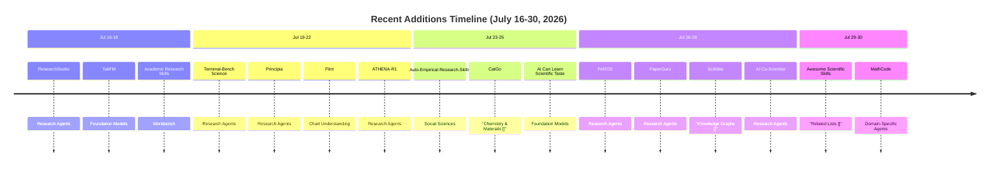

The [awesome-ai-for-science](https://github.com/ai4s-research/awesome-ai-for-science) repository has been on a tear. Between July 16 and July 30, 2026, the maintainer (ai-boost) landed 15 commits that added 14 new entries across nearly every section of the list -- from foundation models and research agents to domain-specific tools and scholarly knowledge graphs. A community contributor also merged a pull request via PR #83. This is not a quiet curation project; it is a living map of an accelerating field.

Below is a structured breakdown of what landed, why it matters, and what it signals about the direction of AI-for-Science.

---

## The Big Picture: Where the Additions Cluster

The 15 recent commits distribute across six distinct sections of the awesome-list. The heaviest concentration is in **Research Agents & Autonomous Workflows**, which received six new entries -- more than any other category combined.

| Section | New Entries | Signal |
|---|---|---|
| Research Agents & Autonomous Workflows | 6 | The autonomous research agent space is the fastest-moving frontier in AI4S right now |
| Foundation Models for Science | 3 | Scientific foundation models are maturing beyond general-purpose LLMs |
| Domain-Specific Applications (Chemistry, Medicine, Social Sciences) | 3 | Domain verticals are getting their own specialized tooling |
| Knowledge Extraction & Scholarly KGs | 1 | Knowledge infrastructure is becoming a first-class concern |
| Chart Understanding & Generation | 1 | Scientific visualization is getting the agent-native treatment |
| Related Awesome Lists | 1 | The broader ecosystem of curated lists is growing |

---

## The Headline Addition: Google DeepMind's AI Co-Scientist

The most significant entry in this batch is **AI Co-Scientist** from Google DeepMind, added to the [Research Agents & Autonomous Workflows section](https://github.com/ai4s-research/awesome-ai-for-science/commit/eeb8b0458f734a2f4cde90855eedcd916234b624). Published in *Nature* in May 2026, Co-Scientist is a multi-agent system built on Gemini that iteratively generates, debates, and evolves novel hypotheses for complex scientific problems.

What makes this stand out from the glut of "AI scientist" demos is the depth of real-world validation. As [Google DeepMind's blog post](https://deepmind.google/blog/co-scientist-a-multi-agent-ai-partner-to-accelerate-research) details, the system has been tested with collaborators at Stanford, MIT, Cambridge, and Calico Life Sciences. The results are concrete:

- **Drug repurposing for liver fibrosis**: Co-Scientist identified overlooked candidates, one of which blocked 91% of a scarring-linked response in lab tests, published in *Advanced Science*.
- **Antimicrobial resistance**: The system independently proposed that cf-PICIs interact with diverse phage tails to expand their host range -- a hypothesis that had been experimentally validated by collaborators at the Fleming Initiative *before* the AI generated it, providing a rare blind-validation test.
- **ALS research**: The system helped unite two labs (Ritu Raman's and Ryan Flynn's) around complementary approaches to ALS, sparking an actual collaboration.

The architecture is worth noting: a coalition of specialized agents (Generation, Reflection, Ranking, Evolution, Proximity, Meta-review) orchestrated by a supervisor agent, using an Elo-based "tournament of ideas" to rank hypotheses. This is not a single model generating text; it is a structured debate system that mirrors the scientific method itself.

The critical caveat, as DeepMind themselves emphasize: Co-Scientist is a **partner**, not a replacement for scientific expertise. The [Trusted Tester Program](https://research.google/blog/accelerating-scientific-breakthroughs-with-an-ai-co-scientist) is still rolling out, and the system's safety evaluations include CBRN domain assessments.

---

## Research Agents: The Fastest-Moving Category

Beyond Co-Scientist, five other entries joined the Research Agents section, each representing a different architectural bet on how autonomous research should work.

### ATHENA-R1: Reinforcement Learning Over a Biomedical Tool Universe

[ATHENA-R1](https://github.com/ai4s-research/awesome-ai-for-science/commit/66ab494c5fc0e7d074811afd9b4abb62fb32e4bd) from Harvard MIMS (Marinka Zitnik's lab) is an RL-trained agent for treatment reasoning that operates over 212 biomedical tools. As the [project page](https://athena.openscientist.ai) and [arXiv paper](https://arxiv.org/abs/2606.28692) detail, the results are striking:

- **94.7% accuracy** on open-ended drug reasoning (+17.8 pp over GPT-5)
- **82.9% on TreatmentPC** (+10.7 pp over GPT-5)
- Preferred over reference models by experts from 28 rare disease organizations across **all eight evaluation criteria**
- Adverse-event hypotheses tested in EHRs from **5.4 million patients**, with adjusted odds ratios of 1.48-1.84

The key architectural insight is **two-level self-learning**: multi-agent systems build the tools, tasks, and reasoning traces for SFT, then reinforcement learning with scientific feedback refines the policy. The backbone is a Qwen3-8B, which is notable -- a relatively small model outperforming frontier systems because it was trained on the right structured reasoning process.

### PaperGuru: Lifecycle-Aware Memory for Long-Horizon Research

[PaperGuru](https://github.com/ai4s-research/awesome-ai-for-science/commit/762864c467c0da22d43a7ed8d6c6640a57d00e4b) introduces the Lifecycle-Aware Memory (LAM) primitive, formalized with four axioms: versioned content, multi-hop relevance, bounded query cost, and provenance-grounded composition. As noted on the [PaperGuru website](https://paperguru.ai), it achieves:

- **66.05% on PaperBench** (beating the best published baseline by 30.21%)
- **94.66% on SurveyBench** (+14.06% over prior work)
- **10 peer-reviewed acceptances** at FSE 2026, ICML 2026, TOSEM, and others

This is a different kind of contribution than the "AI scientist" demos that generate papers but never get them accepted. PaperGuru is building infrastructure for the *memory* problem in long-horizon research agents -- how do you maintain context across months of iterative work?

### Principia: Principle-First Idea Discovery

[Principia](https://github.com/ai4s-research/awesome-ai-for-science/commit/5910b3b3666a9bcdf12dac438bb5afc83b626ce1), presented at ICML 2026, takes a "principle-first" approach to scientific idea discovery. It turns literature and research materials into traceable "Idea Cards" and validation-ready research packs. This is a structural contribution: rather than asking "can an AI generate a paper?", Principia asks "can an AI generate a *traceable* research idea that a human can validate?"

### FAROS: Blueprint-Driven AutoResearch Runtime

[FAROS](https://github.com/ai4s-research/awesome-ai-for-science/commit/0888b5b10ddab7f765779016554cd738b6cdbb13) (Foundation AutoResearch Operating System) from [OpenNSWM-Lab](https://github.com/OpenNSWM-Lab/FAROS) takes a different architectural approach. Instead of a single agent prompt stack, FAROS is a **runtime** built around Blueprints, Capabilities, Profiles, and Providers. The first runnable chain is `idea -> experiment -> paper -> review` with venue-aware LaTeX generation. The trade-off is clear: it is more structured and reproducible than ad-hoc agent chains, but the current release lacks DAG scheduling and a finished frontend console.

### ResearchStudio and Terminal-Bench Science

[ResearchStudio](https://github.com/ai4s-research/awesome-ai-for-science/commit/deccb64faea9a6613e31c226d84672cf47dd23e4) and [Terminal-Bench Science](https://github.com/ai4s-research/awesome-ai-for-science/commit/790478fb3c1611f42fcf7d91bf037f2614f47f91) round out the section. The latter is particularly interesting as a signal: the idea of "terminal-bench" science suggests a shift toward agents that can execute experiments in a real computational environment, not just plan them.

---

## Foundation Models: Learning Scientific Taste

Three new entries in the Foundation Models section, but the standout is **AI Can Learn Scientific Taste** from [OpenMOSS at Fudan University](https://tongjingqi.github.io/AI-Can-Learn-Scientific-Taste).

The [commit](https://github.com/ai4s-research/awesome-ai-for-science/commit/be91bc08adbdba38fc3529d9fd27ae581d252d1a) describes the framework: Reinforcement Learning from Community Feedback (RLCF) uses citation patterns as training signal to build a "Scientific Judge" model that predicts which paper in a pair will receive more citations, and a "Scientific Thinker" that generates research ideas rated higher in impact.

The numbers are compelling. The 30B Scientific Judge variant outperforms **GPT-5.4 Thinking** on in-domain scientific judgement (82.7% vs. 81.6% pairwise accuracy). The SciThinker-30B achieves a **54.2% average win rate** against GPT-5.2, GLM-5, and Gemini 3 Pro in ideation evaluation. All models and the [SciJudgeBench dataset](https://tongjingqi.github.io/AI-Can-Learn-Scientific-Taste) (720,341 field- and time-matched citation-based preference pairs from 2.1M arXiv papers) are openly released.

But here is the critical tension the paper itself acknowledges: **citations encode visibility and collaboration networks, not just quality.** If AI optimizes for what the community rewards, it risks reinforcing mainstream consensus over the unconventional ideas that drive breakthroughs. As one commenter noted, most scientific breakthroughs come from stubborn people going against the crowd. This is the alignment problem for scientific AI, and it has no easy answer.

The other two foundation model additions -- [TabFM](https://github.com/ai4s-research/awesome-ai-for-science/commit/dbfffc2a4d2f1306e7a1262b23fb51e1e41d4aec) and [LOGOS](https://github.com/ai4s-research/awesome-ai-for-science/commit/7a0a2bb3958a086fdcda964cb495911a84b61950) -- represent the continued push toward scientific foundation models that go beyond language and vision.

---

## Domain-Specific Tools: Where the Rubber Meets the Lab

### CatGo: An AI Workbench for Computational Materials Science

[CatGo](https://github.com/ai4s-research/awesome-ai-for-science/commit/75240ce3c858cb29cb07692d724e57ed21d7a798) from UCSD is one of the most practically grounded additions. As the [CatGo documentation](https://docs.catgo-ucsd.org) and [LinkedIn post](https://www.linkedin.com/posts/wanlu-li-9604561b4_github-hello-qmcatgo-lrg-ai-driven-workbench-activity-7461608367543836672-cKHB) describe, it is an AGPL-3.0-licensed, AI-agent-driven desktop workbench built on Tauri (Rust) + SvelteKit + FastAPI (Python) that:

- Pulls structures from OPTIMADE/PubChem, edits them in 3D, builds slabs/adsorption sites/nanotubes
- Generates VASP, QE, LAMMPS inputs and authors visual DAG workflows
- Drives DFT (VASP, ORCA, CP2K, QE), MD (LAMMPS), and ML potentials (MACE/CHGNet/M3GNet)
- Includes a built-in CatBot assistant plus MCP server for external agents (Claude Code, OpenAI Codex, Gemini)
- Integrates SSH/HPC with SLURM/PBS job submission and convergence monitoring

This is not a toy. It is a real tool aimed at computational materials scientists who currently chain together disconnected tools and hand-written input decks. The live web version at [app.catgo-ucsd.org](https://app.catgo-ucsd.org) requires zero installation.

### Medical SAM3: Universal Prompt-Driven Medical Image Segmentation

[Medical SAM3](https://github.com/ai4s-research/awesome-ai-for-science/commit/788adf7ad0e465ff82d6b5ac72f1129bbaa1398f) is a 2026 foundation model for universal prompt-driven medical image segmentation with 2D/3D support and released HuggingFace weights. It joins the growing collection of SAM-family models adapted for medical imaging.

### Auto-Empirical-Research-Skills: 23,000+ Agent Skills for Social Science

[Auto-Empirical-Research-Skills](https://github.com/ai4s-research/awesome-ai-for-science/commit/6a3e48def2398c35d9bb2405877be2dd5e958890) replaces a redirected link with the canonical repository (3K+ stars, 23,000+ agent skills for empirical social science research, from Stanford REAP & CoPaper.AI). This addition is notable for two reasons: it signals that the social sciences are getting serious AI-for-science tooling, and the sheer scale (23K+ skills) suggests a compositional approach to building research agents.

---

## Knowledge Infrastructure: SciAtlas

[SciAtlas](https://github.com/ai4s-research/awesome-ai-for-science/commit/26ac2efeb44c0464396c217ec623833c4f0679a0) from ZJU NLP is a large-scale scientific knowledge graph that integrates over **43M papers from 26 disciplines**, comprising **157M entities and 3B triplets**. As the [arXiv paper](https://arxiv.org/abs/2605.22878) describes, it provides a neuro-symbolic retrieval algorithm with tri-path collaborative recall and graph reranking, and a pip-installable client. The [GitHub repository](https://github.com/zjunlp/SciAtlas) has 137 stars.

This is infrastructure work. SciAtlas is not a demo; it is a "cognitive map" for AI agents navigating the scientific literature. The key insight is that current academic retrieval tools rely on superficial keyword matching or vector-space semantic retrieval, which lack the topological reasoning capabilities required to navigate complex logical connections. SciAtlas provides that topological substrate.

---

## Scientific Visualization: Microsoft Flint

[Flint](https://github.com/ai4s-research/awesome-ai-for-science/commit/43c134d355b21bb60f4ae2b575a4f4d1eb90e966) is Microsoft's visualization intermediate language for AI agents. As the [Flint documentation](https://microsoft.github.io/flint-chart) describes, it provides a structured language that AI agents can use to generate and reason about charts, rather than relying on raw code generation. This is a quiet but important addition: if AI agents are going to participate in scientific workflows, they need to be able to create and interpret visualizations in a way that is reproducible and inspectable.

---

## Community Contributions: The AutoResearch Moment

The only non-ai-boost commit in this batch is from community contributor ChaoYue0307, who added ["The AutoResearch Moment"](https://github.com/ai4s-research/awesome-ai-for-science/commit/e31769fa37ee9241c52e4d0b76afa9a32da7c163) via [PR #83](https://github.com/ai4s-research/awesome-ai-for-science/commit/93d8280c0f7aa265841fc6adf9cd8cef39c92404). This is a position paper by Chaoyue He et al. that uses Karpathy's [autoresearch](https://github.com/karpathy/autoresearch) project as a springboard to argue that the human role is shifting from **experimenter to research director**. The paper proposes a "research-director bundle" -- comprising an objective sheet, program boundaries, discovery trace, verification ledger, provenance bundle, and role map -- as a practical minimum artifact set for evaluating automated research.

This is a governance contribution, not a technical one. It asks: when agents cheaply generate and execute experimental branches, what is the unit of scientific accountability? The answer -- an "admissible claim" governed by a structured bundle of artifacts -- is a framework that the AI4S community will need to grapple with as autonomous research agents become more capable.

---

## What the Open Issues Reveal

The repository's open issues tell a story about the challenges of curating an awesome-list in a hype-driven field. The most prominent pattern is the **CAJAL spam**: five separate issues (#39, #41, #42, #46, #47, #48) all requesting the addition of CAJAL, a local scientific paper generator. The same proposer (Agnuxo1) also submitted issues for P2PCLAW MCP Server (#43) and BenchClaw (#44). None have been merged.

This is a cautionary tale. The CAJAL proposals are well-formatted and technically detailed, but the repeated submissions suggest a promoter rather than a community contributor. The maintainer's silence on these issues (all remain open since May 2026) is itself a signal: curation requires judgment, not just inclusion.

The [FunASR issue](https://github.com/ai4s-research/awesome-ai-for-science/issues/61) is more substantive. It proposes adding an open-source speech recognition toolkit with 17.8K+ GitHub stars for scientific applications involving audio data analysis. The issue includes a detailed license and capability clarification note, which is a good practice for a curated list.

The [closed Recapo.ai issue](https://github.com/ai4s-research/awesome-ai-for-science/issues/81) was rejected the same day it was opened. An AI video editing platform does not fit the scope of an AI-for-science list, and the maintainer's quick closure is a healthy sign of scope discipline.

---

## What This All Means

The trajectory of additions to awesome-ai-for-science over the past two weeks reveals three structural shifts in the AI4S landscape:

1. **The autonomous research agent is no longer a research question -- it is an engineering problem.** Six of the 15 additions are research agents or autonomous workflows. The debate has shifted from "can AI do science?" to "how should we architect the runtime, memory, and governance for autonomous research?"

2. **Scientific taste is becoming a trainable objective.** The OpenMOSS RLCF paper and the AI Co-Scientist's tournament of ideas both treat the *selection* of research directions as a learnable skill. This is upstream of the execution problem, and it is where the highest leverage lies.

3. **Domain-specific tooling is catching up to the hype.** CatGo for computational materials, Medical SAM3 for medical imaging, Auto-Empirical-Research-Skills for social sciences -- these are not general-purpose AI tools with a science label slapped on. They are built by domain experts for domain workflows, and they are being integrated into agent architectures.

The list is growing fast. The question for the maintainers -- and for the community -- is whether growth can be sustained without dilution. The CAJAL spam and the Recapo.ai rejection are early warning signs. Awesome-lists are only as valuable as the curation judgment behind them.