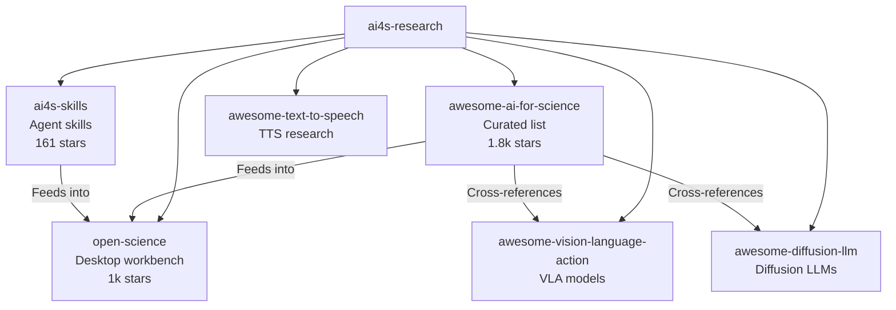
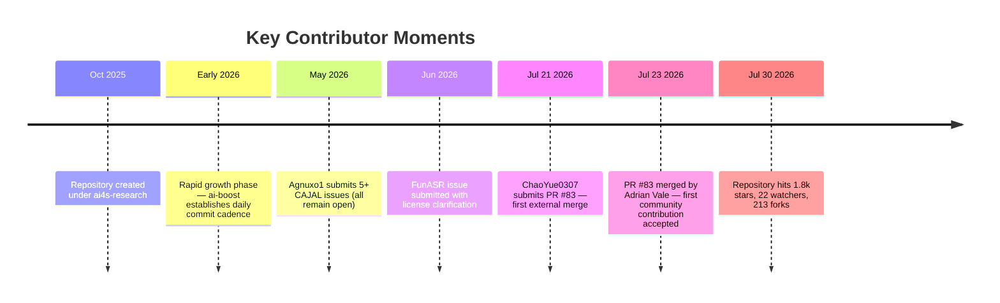

Behind every curated list worth its salt is a small, relentless group of people who sift through the noise so you don't have to. The [awesome-ai-for-science](https://github.com/ai4s-research/awesome-ai-for-science) repository is no different — it's grown to 1.8k stars and 213 forks in under a year, and the commit log tells a very specific story about who's doing the work and how they operate.

## The Core Team

### ai-boost (Adrian Vale) — The Curator-in-Chief

If you glance at the [activity feed](https://github.com/ai4s-research/awesome-ai-for-science/activity), one name dominates: **ai-boost**. Over the last 20 commits tracked in the repo, every single direct push came from this account. The cadence is almost mechanical — one commit per day, each surgically adding a single resource to a specific section:

| Date | Commit | Section |
|------|--------|---------|
| Jul 30 | [Add MathCode](https://github.com/ai4s-research/awesome-ai-for-science/commit/ca0a23dcfd1d47da0b643c5e6f6c3cb0f118c58d) | Domain-Specific Research Agents |
| Jul 29 | [Add Awesome Scientific Skills](https://github.com/ai4s-research/awesome-ai-for-science/commit/4da0e5391019ed964d91180308b64fbda3babc3d) | Related Awesome Lists |
| Jul 28 | [Add AI Co-Scientist](https://github.com/ai4s-research/awesome-ai-for-science/commit/eeb8b0458f734a2f4cde90855eedcd916234b624) | Research Agents & Autonomous Workflows |
| Jul 27 | [Add SciAtlas](https://github.com/ai4s-research/awesome-ai-for-science/commit/26ac2efeb44c0464396c217ec623833c4f0679a0) | Knowledge Extraction & Scholarly KGs |

This is not accidental. The commit message format — `✨ Add [X] to [Section]` — is a deliberate convention, and the one-resource-per-commit discipline makes the list's git history function as a verifiable changelog. It's a maintenance pattern that most awesome-list maintainers talk about but few actually execute.

ai-boost is also the public face of the broader [ai4s-research](https://github.com/ai4s-research) organization, which maintains a suite of six projects under the same "open-source infrastructure for AI for Science" umbrella. The organization's README states it plainly: **"Open by default, Agent-native, For scientists and builders."** Everything is MIT-licensed.

On X, ai-boost operates under the handle [@gpt_boost](https://x.com/gpt_boost), with the bio: *"Building AI4S infrastructure, open tools, agent skills, and technologies for scientific discovery."* The account joined in October 2017 and has been consistently active in 2026, posting about open-source AI tools, model releases, and the [Open Science Desktop](https://github.com/ai4s-research/open-science) project — the organization's other flagship product (1k stars, built on Tauri + MCP + agent skills).

The ai-boost account also appears to be associated with the name **Adrian Vale**, as seen in the [merge commit for PR #83](https://github.com/ai4s-research/awesome-ai-for-science/commit/93d8280c0f7aa265841fc6adf9cd8cef39c92404), where the merge author is listed as "Adrian Vale."

### ChaoYue0307 (Chaoyue He) — The Prolific Contributor

The most visible external contributor is **Chaoyue He** ([ChaoYue0307](https://github.com/ChaoYue0307)), an AI Research Scientist at [Nanyang Technological University](https://sg.linkedin.com/in/chaoyue-he-a4103558) (NTU) in Singapore. His contribution came through [PR #83](https://github.com/ai4s-research/awesome-ai-for-science/commit/93d8280c0f7aa265841fc6adf9cd8cef39c92404), which added "The AutoResearch Moment" paper to the AI Scientist & Autonomous Research section.

But Chaoyue is far more than a one-PR contributor. His GitHub profile reads like a curated map of the AI-for-science landscape itself:

| Project | Description |
|---------|-------------|
| [awesome-loop-engineering](https://github.com/ChaoYue0307/awesome-loop-engineering) | 797 resources, 22 operational patterns, 22 loop contracts for recurring AI-agent systems |
| [awesome-graph-engineering](https://github.com/ChaoYue0307/awesome-graph-engineering) | 477 curated resources, 9 design layers, 225 papers on graph-structured agent systems |
| [awesome-egocentric-atlas](https://github.com/ChaoYue0307/awesome-egocentric-atlas) | Datasets, benchmarks, models for egocentric AI and embodied intelligence |
| [ESGenius](https://github.com/ANGEL-NTU/ESGenius) | EMNLP 2025 Main Oral benchmark for LLM ESG knowledge |
| [PCA-OS](https://github.com/ChaoYue0307/PCA-OS-KDD26) | Planetary Climate Adaptation OS — KDD 2026 Blue Sky Ideas Track |

He also contributed to [walkinglabs/awesome-harness-engineering](https://github.com/walkinglabs/awesome-harness-engineering) (3.7k stars), another curated list in the AI agent ecosystem. His [personal site](https://chaoyue0307.github.io/) and X handle [@CYH37](https://x.com/CYH37) round out his presence.

What's notable about Chaoyue's contribution pattern is that he's not just a consumer of awesome-lists — he's a **builder of the ecosystem**. His own awesome-lists are among the most structurally ambitious in the space, with interactive atlases, structured datasets, and operational patterns that go beyond simple link collections. When he submits a PR to awesome-ai-for-science, it comes from someone who has thought deeply about how these resources should be organized.

## The Organization: ai4s-research

The [ai4s-research](https://github.com/ai4s-research) GitHub organization lists **3 people** and **7 repositories**. It's a small operation with an outsized footprint. The organization's project portfolio is internally consistent — every repo serves the same AI-for-science thesis:

The organization's email contact is **ai4sfoundation@gmail.com**, and the README explicitly states: *"Early-stage and growing. If you work on AI for Science, come build with us."*

The [CONTRIBUTING.md](https://github.com/ai4s-research/awesome-ai-for-science/blob/master/CONTRIBUTING.md) is unusually thorough for an awesome-list — it specifies formatting rules, quality standards, review criteria, and a 7–14 day review timeline. It also explicitly defines what **not** to include: purely commercial tools, broken links, small unmaintained personal repos, and off-topic resources.

## The Community: Who's Knocking on the Door

The open issues tell a revealing story about the community dynamics around this repository. The most striking pattern is the **CAJAL flood** — the same project (a local scientific paper generation LLM by user [Agnuxo1](https://github.com/Agnuxo1/CAJAL)) was submitted as **five separate issues** ([#39](https://github.com/ai4s-research/awesome-ai-for-science/issues/39), [#41](https://github.com/ai4s-research/awesome-ai-for-science/issues/41), [#42](https://github.com/ai4s-research/awesome-ai-for-science/issues/42), [#46](https://github.com/ai4s-research/awesome-ai-for-science/issues/46), [#47](https://github.com/ai4s-research/awesome-ai-for-science/issues/47), [#48](https://github.com/ai4s-research/awesome-ai-for-science/issues/48)) between May 6–9, 2026, each with incrementally different framing and suggested placement. This is a classic pattern in open-source curation: project founders trying to game the inclusion process by submitting multiple variations of the same request, hoping one sticks.

The [BenchClaw](https://github.com/ai4s-research/awesome-ai-for-science/issues/44) and [P2PCLAW MCP Server](https://github.com/ai4s-research/awesome-ai-for-science/issues/43) issues come from the same Agnuxo1 ecosystem, forming a self-referential network of projects that all cross-link to each other.

On the other end of the spectrum, the [FunASR issue](https://github.com/ai4s-research/awesome-ai-for-science/issues/61) is a model of how to submit a resource suggestion: it includes a clear description, specific scientific use cases, license clarification, and a genuine question about scope. The July 14 update note adding license and capability details shows the kind of self-correcting, evidence-based contribution that maintainers actually want to see.

The [Recapo.ai issue](https://github.com/ai4s-research/awesome-ai-for-science/issues/81) — the only recently closed issue — was rejected for being off-topic. An AI video editing platform that repurposes long-form videos into short-form clips doesn't qualify as "accelerating scientific discovery," and the maintainers closed it within minutes. That's the bar.

## Contributor Timeline

## What the Commit Pattern Tells Us

The most important thing to understand about this repository's contributor dynamics is that **it is overwhelmingly a single-maintainer project**. Looking at the [contributors graph](https://github.com/ai4s-research/awesome-ai-for-science/graphs/contributors), ai-boost's commit count dwarfs everyone else. The daily cadence of `✨ Add X to Y` commits — sometimes multiple per day, never skipping a day for weeks — suggests either extraordinary personal discipline or a semi-automated curation pipeline.

This is both a strength and a vulnerability. On the strength side, the single-maintainer model ensures **consistency** — every entry follows the same format, every section is organized the same way, and the quality bar doesn't fluctuate based on who's reviewing. The [CONTRIBUTING.md](https://github.com/ai4s-research/awesome-ai-for-science/blob/master/CONTRIBUTING.md) is clear about the standards, but the de facto enforcement comes from one person's judgment.

On the vulnerability side, the bus factor is real. The 11 open issues — some dating back to May 2026 — suggest a review bottleneck. The CAJAL spam is still sitting unanswered. The [Suppr Deep Research](https://github.com/ai4s-research/awesome-ai-for-science/issues/50) and [Agent2Research](https://github.com/ai4s-research/awesome-ai-for-science/issues/45) issues have had zero maintainer response. The CONTRIBUTING.md promises a 7-day initial review, but the backlog tells a different story.

## The Broader Context

The ai4s-research organization is not operating in a vacuum. It sits at the intersection of several communities:

- The [AI for Science workshop series](https://ai4sciencecommunity.github.io) (NeurIPS 2021 through ICML 2026) which has been building the academic foundation for this field
- The [AI4S workshop at SC26](https://ai4s.github.io) focused on HPC-scale scientific AI
- The broader "awesome-list" ecosystem, where curated lists like [awesome-harness-engineering](https://github.com/walkinglabs/awesome-harness-engineering) and Karpathy's [autoresearch](https://github.com/karpathy/autoresearch) are defining the vocabulary for autonomous scientific AI

The ai4s-research team is building something more ambitious than a list — they're building **infrastructure**. The awesome-list is the on-ramp; [open-science](https://github.com/ai4s-research/open-science) is the destination; and [ai4s-skills](https://github.com/ai4s-research/ai4s-skills) is the connective tissue. It's a coherent vision, and the contributors — however few — are aligned on it.

## How to Contribute

If you want to join the contributor ranks, the [CONTRIBUTING.md](https://github.com/ai4s-research/awesome-ai-for-science/blob/master/CONTRIBUTING.md) is genuinely worth reading. The key rules:

1. **One resource per PR** — matching the maintainer's own commit discipline
2. **Follow the format**: `- [Resource Name](URL) - Brief description (5-15 words)`
3. **Place it correctly** — alphabetical order within the appropriate section
4. **Don't self-promote** — the CAJAL flood is a cautionary tale
5. **Be patient** — the review timeline is longer than the docs claim

The most successful contribution so far came from Chaoyue He, who submitted a well-scoped PR with a single, clearly relevant resource. That's the template. Follow it.