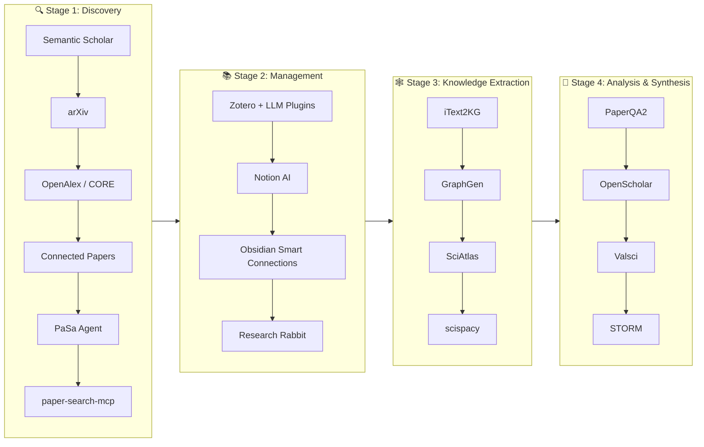

The scientific literature landscape is vast and growing at an accelerating pace — millions of new papers are published each year, and researchers must find, filter, organize, and synthesize knowledge from this flood of information. **Literature & Knowledge Management** is the foundational layer of any AI-assisted research workflow: it encompasses the tools that help you discover relevant papers, search across scholarly databases, manage your personal library, build knowledge graphs from extracted insights, and perform retrieval-augmented analysis over your corpus. This page walks you through the full ecosystem — from search and discovery to structured knowledge representation — as curated in the awesome-ai-for-science repository.

Sources: [README.md](/README.md#L1-L10)

## Architecture Overview

The literature and knowledge management ecosystem can be understood as a **four-stage pipeline**: you start by *discovering* papers through search engines and agents, then *manage* them within your personal library and note-taking tools, then *extract* structured knowledge from the text using NLP and knowledge graph construction, and finally *analyze* and *synthesize* the accumulated knowledge through RAG and reasoning systems. Each stage feeds into the next, creating a compounding knowledge advantage.

Sources: [README.md](/README.md#L54-L60), [README.md](/README.md#L213-L237), [README.md](/README.md#L175-L181)

## Stage 1: Literature Discovery & Search

Finding the right papers is the first and most critical step. Traditional keyword search is being augmented — and in some cases replaced — by AI-powered semantic search, citation-graph navigation, and autonomous search agents. The tools below represent the current state of the art, ranging from established academic search engines to cutting-edge LLM-powered agents.

| Tool | Type | Key Strength | Access |
|------|------|-------------|--------|
| **Semantic Scholar** | AI-powered search engine | Semantic understanding of paper content, not just keywords | Free web |
| **arXiv** | Open-access preprint repository | Largest open-access corpus for physics, math, CS, and more | Free |
| **OpenAlex** | Open scholarly catalog | Open metadata for 250M+ works, programmatic API | Free API |
| **CORE** | OA paper aggregator | Aggregates open-access papers from thousands of providers | Free |
| **Connected Papers** | Citation-graph explorer | Visual graph showing how papers relate through citations and semantic similarity | Free web |
| **PaSa** | Autonomous search agent | LLM-powered agent that autonomously searches, reads, and selects references | Open source |
| **paper-search-mcp** | MCP server & CLI | Unified, deduplicated search across 7+ sources (arXiv, PubMed, Semantic Scholar, etc.) | Open source |

> [!TIP]
> For beginners, start with **Semantic Scholar** for everyday paper discovery and **Connected Papers** when you need to understand the intellectual lineage of a specific paper. Then graduate to **PaSa** or **paper-search-mcp** when you need to automate systematic literature searches across multiple databases.

**Semantic Scholar** (by Allen AI) is the backbone of many downstream tools in this ecosystem — it provides an API that powers literature search in agents like PaSa and research workbenches like ScholarAIO. Its key differentiator is **semantic understanding**: rather than matching keywords, it understands the meaning of your query and returns papers that are conceptually relevant, even if they don't share your exact search terms.

**Connected Papers** takes a graph-based approach: given a seed paper, it generates a visual graph of related papers connected through citation networks and semantic similarity. This is invaluable for **literature mapping** — understanding the landscape of a research area, finding seminal works you might have missed, and identifying clusters of related research.

**PaSa** (by ByteDance) represents the next generation of literature search: it is an **autonomous paper search agent** powered by large language models. Given a complex scholarly query, PaSa autonomously invokes search tools, reads full papers, and selects the most relevant references — delivering comprehensive results that would take a human researcher hours to compile. It has attracted 1.5K+ GitHub stars and is licensed under Apache 2.0.

**paper-search-mcp** is an MCP (Model Context Protocol) server that provides a unified interface for searching and downloading academic papers from **seven open sources** — arXiv, PubMed, bioRxiv, Semantic Scholar, OpenAlex, CORE, and Europe PMC. It deduplicates results across sources and returns LLM-friendly structured output, making it ideal for integration into AI agent workflows.

Sources: [README.md](/README.md#L54-L60)

## Stage 2: Literature Management & Organization

Once you've discovered papers, you need to organize them, annotate them, and connect them to your existing knowledge base. The modern literature management stack combines traditional reference managers (like Zotero) with AI-powered plugins that add conversational Q&A, summarization, and intelligent linking.

### Zotero + AI Plugins

Zotero remains the most popular open-source reference manager, and a rich ecosystem of AI plugins has emerged around it. These plugins transform Zotero from a simple PDF organizer into a **conversational research assistant**:

| Plugin | Key Capability | Model Support |
|--------|---------------|---------------|
| **llm-for-zotero** | Agent Mode with deep PDF parsing, Q&A, summarization, figure inspection | OpenAI-compatible, Claude Code, WebChat, Codex |
| **PapersGPT for Zotero** | Multi-PDF conversation, retrieval, and citation | Commercial + local (Ollama), MCP support |
| **Zotero-GPT** | Classic document Q&A and summarization within Zotero | GPT-based |
| **Better BibTeX** | Enhanced citation key management and LaTeX integration | N/A (utility plugin) |

**llm-for-zotero** stands out as the most feature-rich option: it integrates MinerU PDF parsing for deep document understanding, supports multi-model backends (so you can use Claude, GPT, or local models), and offers an Agent Mode that can autonomously reason over your library. This makes it particularly powerful for researchers who need to synthesize findings across dozens of papers.

### Knowledge Note-Taking & Discovery

Beyond reference managers, a new generation of AI-powered note-taking and discovery tools helps researchers build and navigate their personal knowledge graphs:

- **Notion AI** — AI-powered research note-taking and knowledge management within the popular Notion workspace. Best for teams that already use Notion for project management.
- **Obsidian Smart Connections** — AI-powered note linking and research graph navigation for Obsidian. This plugin automatically discovers semantic connections between your notes, turning your vault into a navigable knowledge graph.
- **Research Rabbit** — AI-powered literature discovery and research network mapping. It visualizes author networks and citation patterns, helping you discover new research through the "who-cites-whom" graph.

Sources: [README.md](/README.md#L213-L231)

## Stage 3: Knowledge Extraction & Scholarly Knowledge Graphs

Raw text is not enough — to truly leverage the scientific literature, you need to extract structured knowledge and organize it into **knowledge graphs** (KGs). A scholarly knowledge graph connects papers, authors, institutions, venues, keywords, citations, and research topics into a machine-readable network that enables reasoning, discovery, and question answering at scale.

### Knowledge Graph Construction Tools

| Tool | Function | Output Format |
|------|----------|---------------|
| **iText2KG** | Incremental KG construction from text using LLMs | Neo4j visualization |
| **GraphGen** | KG-guided synthetic data generation for LLM fine-tuning | Training data |
| **KoPA** | Structure-aware prefix adaptation for integrating LLMs with KGs | Model adaptation |
| **SciAtlas** | Large-scale scholarly KG with pip-installable client | Four-level research taxonomy |
| **scispacy** | Full spaCy pipeline for scientific/biomedical NLP | NER, abbreviation resolution, UMLS linking |

**iText2KG** takes an incremental approach: it uses LLMs to extract entities and relationships from text, then incrementally builds a knowledge graph that can be visualized in Neo4j. This is particularly useful for researchers who want to build a custom KG from a specific set of papers or a research domain.

**SciAtlas** is the most comprehensive scholarly KG resource in this collection: it provides a large-scale knowledge graph connecting papers, authors, institutions, venues, keywords, citations, and a four-level research taxonomy across medicine, social sciences, and more. It also ships a pip-installable client, making it accessible programmatically.

**scispacy** (by Allen AI) is the NLP backbone for many knowledge extraction workflows: it provides a full spaCy pipeline with models trained on scientific and biomedical text, enabling named entity recognition, abbreviation resolution, and UMLS linking. With 1.9K+ GitHub stars and an Apache 2.0 license, it is the go-to tool for scientific text processing.

### Knowledge Graph Resources

For researchers who want to dive deeper into the intersection of LLMs and knowledge graphs, the **Awesome-LLM-KG** collection provides a comprehensive curated list of papers on unifying LLMs and knowledge graphs — covering both how LLMs can enhance KGs and how KGs can ground LLM reasoning.

Sources: [README.md](/README.md#L224-L237)

## Stage 4: Scientific Literature RAG & Analysis

The final stage brings everything together: **Retrieval-Augmented Generation (RAG)** systems that can answer complex questions over your entire literature corpus, with proper citation support and evidence synthesis. These tools are the closest thing to having an AI research collaborator that has read every paper in your library.

| Tool | Key Feature | Citation Support | Notable Result |
|------|------------|-----------------|----------------|
| **PaperQA2** | High-accuracy RAG for scientific PDFs | ✅ With citation grounding | Agentic RAG with contradiction detection |
| **OpenScholar** | Literature synthesis from 45M papers | ✅ Human-expert-level accuracy | Outperforms GPT-4o by 5% on ScholarQABench (Nature 2026) |
| **Valsci** | Scientific claim verification | ✅ Bibliometric scoring | Self-hostable, large-batch validation |
| **STORM** | Wikipedia-like article synthesis | ✅ Citation-grounded reports | Multi-perspective question asking with Co-STORM extension |
| **paper-reviewer** | Generate comprehensive reviews | ✅ From arXiv papers | Convert to blog posts |

**PaperQA2** is the tool of choice for researchers who need **high-accuracy, citation-grounded answers** from their PDF collections. It implements agentic RAG — meaning the system doesn't just retrieve and generate, but actively decides which documents to read, which passages to focus on, and when to search for more information. A unique feature is its **contradiction detection**: it can identify when different papers make conflicting claims, which is invaluable for systematic reviews.

**OpenScholar** (from UW & Allen AI, published in Nature 2026) represents the state of the art in literature synthesis: it retrieves from a corpus of 45M papers and synthesizes answers with human-expert-level citation accuracy. It outperforms GPT-4o by 5% on the ScholarQABench benchmark, making it the most accurate literature QA system currently available.

**STORM** (from Stanford OVAL) takes a different approach: instead of answering a single question, it synthesizes **Wikipedia-like long-form research articles** from scratch. It does this through multi-perspective question asking — first generating diverse questions about a topic, then retrieving and synthesizing answers for each, and finally composing a coherent, citation-grounded report. The Co-STORM extension enables collaborative human-LLM knowledge curation.

> [!TIP]
> For a beginner setting up their first literature analysis pipeline: start with **PaperQA2** for question-answering over your own PDFs, and use **OpenScholar** when you need to synthesize findings across a broad topic area. Use **STORM** when you need to produce a comprehensive survey article on a new research topic.

Sources: [README.md](/README.md#L175-L181)

## Choosing Your Workflow: A Decision Guide

Different research scenarios call for different tool combinations. Here is a practical decision framework:

| Research Scenario | Recommended Workflow | Why |
|-------------------|---------------------|-----|
| **Quick paper lookup** | Semantic Scholar → arXiv | Fastest path from query to paper |
| **Exploring a new field** | Connected Papers → Research Rabbit → STORM | Map the field visually, then synthesize a survey |
| **Systematic literature review** | paper-search-mcp → Zotero + llm-for-zotero → PaperQA2 | Automated search, organized library, rigorous Q&A |
| **Building a domain knowledge graph** | scispacy → iText2KG → SciAtlas | Extract entities, build graph, contextualize with taxonomy |
| **Verifying scientific claims** | Valsci → OpenScholar | Bibliometric scoring + broad literature synthesis |
| **Daily research assistant** | Zotero + PapersGPT → Obsidian Smart Connections | Manage papers, annotate, and auto-link notes |

Sources: [README.md](/README.md#L54-L60), [README.md](/README.md#L213-L231), [README.md](/README.md#L175-L181), [README.md](/README.md#L224-L237)

## Where to Go Next

Literature & Knowledge Management is the foundation, but it connects naturally to several adjacent workflows in the AI-for-Science ecosystem:

- **[Scientific Document Parsing](9-scientific-document-parsing)** — The tools that convert raw PDFs into structured, machine-readable text are the essential preprocessing step for any literature RAG pipeline. If you need to understand how PaperQA2 or OpenScholar ingest papers, start here.
- **[Paper-to-Poster, Slides & Media](6-paper-to-poster-slides-and-media)** — Once you've found and synthesized the literature, you'll need to present it. This page covers AI-powered tools for turning papers into posters, slides, and videos.
- **[Autonomous Research Systems](10-autonomous-research-systems)** — Many of the autonomous research agents (like AI-Scientist, EvoMaster) use literature search as a core capability. Understanding this page will help you understand how those agents discover and use prior work.
- **[Foundation Models for Science](21-foundation-models-for-science)** — The models powering Semantic Scholar, scispacy, and PaperQA2 are all specialized scientific language models. This page covers the foundation model landscape.
