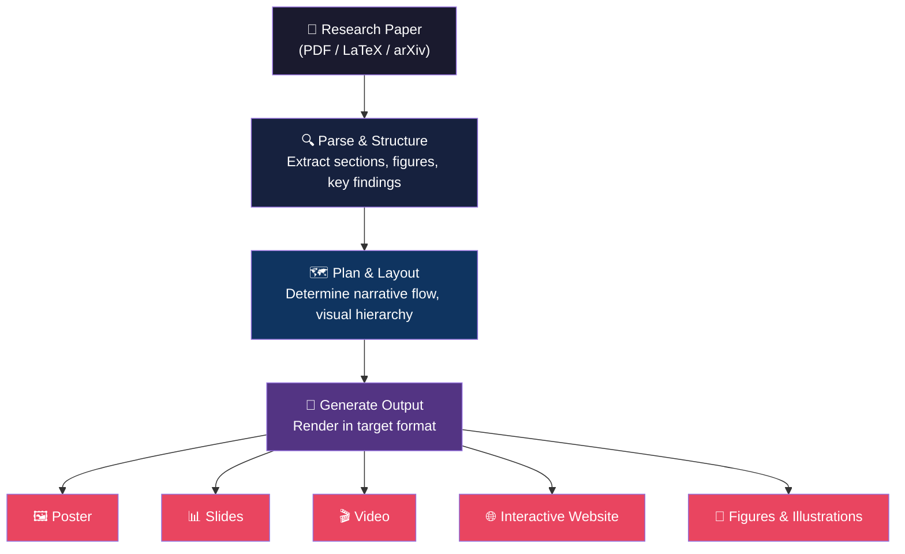

Transforming a dense research paper into a compelling poster, presentation, or video is one of the most time-consuming steps in the academic workflow. This page maps the growing ecosystem of AI tools that automate the **paper-to-visual-media** pipeline — from generating editable conference posters and slide decks, to producing research videos and publication-ready illustrations. Whether you are preparing for a conference talk, designing a graphical abstract, or making your paper accessible to a broader audience, the tools here handle the heavy lifting so you can focus on the science.

Sources: [README.md](/README.md#L93-L120), [README.md](/README.md#L1-L8)

## How the Pipeline Works

The paper-to-media transformation follows a consistent architectural pattern: **parse** the source document into structured content, **plan** the layout and narrative flow for the target medium, and **generate** the final output in an editable format. The diagram below shows how the tools in this ecosystem relate to each other across the five output categories.

Most tools implement a variation of this **Parse → Plan → Generate** pipeline. Multi-agent systems like Paper2Poster make this explicit by assigning each stage to a dedicated agent (Parser, Planner, Painter), while single-agent tools merge planning and generation into one LLM call. The key insight for beginners: **the quality of the parsed content determines the quality of the output** — tools that perform deeper structural understanding of the paper consistently produce better results.

Sources: [README.md](/README.md#L93-L120)

## Poster Generation

Conference posters distill a paper's core contribution into a single visual surface. The AI tools below automate layout planning, content selection, and typography — producing editable `.pptx` files you can fine-tune before printing.

| Tool | Input | Output | Architecture | Key Strength |
|------|-------|--------|-------------|-------------|
| [Paper2Poster](https://github.com/Paper2Poster/Paper2Poster) | `paper.pdf` | `poster.pptx` | Multi-agent (Parser-Planner-Painter) | 87% fewer tokens than GPT-4o, editable output |
| [mPLUG-PaperOwl](https://github.com/X-PLUG/mPLUG-DocOwl) | Scientific PDF | Visual diagrams & charts | Multimodal LLM | Deep chart/diagram understanding and generation |

**Paper2Poster** is the standout tool here. Its **Parser-Planner-Painter** architecture is the clearest implementation of the Parse → Plan → Generate pattern: the Parser agent extracts structured content from the PDF, the Planner agent determines spatial layout and content hierarchy, and the Painter agent renders the final `.pptx` file. Because it uses multi-agent decomposition, it achieves strong results with dramatically fewer tokens than monolithic approaches — making it both cost-effective and faster to iterate. The output is an editable PowerPoint file, so you retain full control over the final poster.

**mPLUG-PaperOwl** takes a different approach, focusing on the **visual understanding** side of the pipeline. Rather than generating a full poster layout, it excels at interpreting and generating the scientific charts and diagrams that populate posters. Think of it as a specialized component for the visual elements within a poster, rather than a full poster-creation system.

> [!TIP]
> When choosing a poster tool, always prefer outputs in editable formats (`.pptx`, `.svg`) over static images (`.png`, `.jpg`). Conference posters almost always require manual adjustments — the AI-generated version is your starting point, not your final product.

Sources: [README.md](/README.md#L95-L98)

## Slides & Presentation Generation

Generating presentation slides from a paper is the most mature category in this ecosystem, with seven tools offering different trade-offs between automation depth, output format, and customization control.

| Tool | Input | Output Format | Approach | Notable Feature |
|------|-------|--------------|----------|----------------|
| [Auto-Slides](https://auto-slides.github.io/) | Academic paper | Presentation slides | Multi-agent | Interactive refinement loop |
| [PPTAgent](https://github.com/icip-cas/PPTAgent) | Document | Slides | Agent-based | PPTEval benchmark (EMNLP 2025) |
| [paper2slides](https://github.com/takashiishida/paper2slides) | arXiv paper | Beamer slides | LLM-based | LaTeX Beamer output for academic talks |
| [PaperToSlides](https://github.com/jxtse/PaperToSlides) | PDF | Presentation slides | AI-powered | Direct PDF-to-slides conversion |
| [pdf2slides](https://github.com/ha0ranyu/pdf2slides) | PDF | Editable slides | Programmatic | 3 lines of code to convert |
| [SlideDeck AI](https://github.com/barun-saha/slide-deck-ai) | Document or topic | PowerPoint | Co-creation | Generative AI co-creation workflow |
| [AI Multi-Agent Presentation Builder](https://github.com/Azure-Samples/ai-multi-agent-presentation-builder) | Content | PPT | Azure Semantic Kernel | Reference architecture for multi-agent PPT |

### Choosing the Right Slides Tool

The tools fall into three tiers based on how much control you want:

**Tier 1 — Full Automation (quick results, less control):** `pdf2slides` is the simplest entry point — three lines of code convert any PDF into editable slides. It is ideal when you need a rough draft in minutes. `PaperToSlides` offers similar one-shot PDF-to-slides conversion with a slightly more polished output.

**Tier 2 — Guided Co-Creation (balanced):** `SlideDeck AI` and `Auto-Slides` position themselves as co-creation partners. You provide the source material and iterate on the output through conversational refinement. This is the sweet spot for most researchers — you get AI acceleration while retaining narrative control over the final presentation.

**Tier 3 — Academic Precision (maximum control):** `paper2slides` generates **LaTeX Beamer** output, which is the gold standard for academic presentations. If your conference requires Beamer slides or you are already in the LaTeX ecosystem, this tool preserves mathematical typesetting and academic formatting. `PPTAgent` brings the added rigor of the **PPTEval** benchmark — the first multi-dimensional evaluation framework for slide quality — giving you measurable confidence in the output.

> [!TIP]
> For conference talks, start with `paper2slides` (Beamer) if you need LaTeX-native output, or `Auto-Slides` if you prefer a PowerPoint workflow with interactive refinement. Avoid generating slides and then manually converting formats — pick the tool that outputs your target format directly.

Sources: [README.md](/README.md#L99-L107)

## Video & Media Generation

Research videos are increasingly required for conference submissions, supplementary materials, and science communication. Two tools share the `Paper2Video` name but serve different purposes:

| Tool | Purpose | Output | Venue |
|------|---------|--------|-------|
| [Paper2Video (ShowLab)](https://github.com/showlab/Paper2Video) | Benchmark for automatic video generation from papers | Research video | NeurIPS 2025 |
| [paper2video (mett29)](https://github.com/mett29/paper2video) | Transform arXiv papers into YouTube-ready videos | Presentation video | Community tool |

**Paper2Video (ShowLab)** is the **first benchmark** for evaluating automatic video generation from scientific papers. It is a research contribution rather than a production tool — it defines the evaluation framework and baselines for the community. If you are building or evaluating paper-to-video systems, this is your reference point.

**paper2video (mett29)** is a practical tool for researchers who want to create engaging video content from their arXiv papers — suitable for YouTube, conference presentations, or social media. It focuses on the **production pipeline** rather than evaluation.

Sources: [README.md](/README.md#L108-L111)

## Website & Interactive Content Generation

Beyond static media, some tools transform papers into interactive digital experiences that let readers explore your research at their own pace.

| Tool | Input | Output | Philosophy |
|------|-------|--------|-----------|
| [Paper2All](https://github.com/YuhangChen1/Paper2All) | Research paper | Interactive websites, posters, multimedia | "Let's Make Your Paper Alive!" |

**Paper2All** is the sole tool in this category, and it represents a philosophy shift: instead of generating a single static artifact, it produces an **interactive website** that can host multiple media types — posters, multimedia presentations, and navigable content. This is particularly valuable for papers with interactive visualizations, datasets, or supplementary materials that lose their expressiveness when flattened into a PDF. The "Let's Make Your Paper Alive!" framing captures the goal: making research accessible and explorable beyond the constraints of traditional publication formats.

Sources: [README.md](/README.md#L112-L113)

## Figure & Illustration Generation

High-quality figures are the visual backbone of any paper, poster, or slide deck. This category addresses the generation of **publication-ready illustrations** from research content.

| Tool | Input | Output | Technique | Notable |
|------|-------|--------|-----------|---------|
| [PaperBanana](https://github.com/dwzhu-pku/PaperBanana) | Research paper | Publication-ready figures | VLMs + diffusion models with iterative refinement | 6.2K+ stars, PKU & Google Research |

**PaperBanana** combines **Vision-Language Models (VLMs)** for content understanding with **diffusion models** for visual generation, and adds an **iterative refinement loop** to progressively improve figure quality. This two-stage approach — understand first, then generate, then refine — mirrors the Parse → Plan → Generate pipeline but specialized for individual figures rather than full documents. With 6.2K+ stars and backing from PKU and Google Research, it is the most mature tool for automated academic illustration generation. The iterative refinement is the key differentiator: rather than producing a single-shot output, PaperBanana evaluates its own generation and improves it through multiple rounds, significantly boosting visual quality.

Sources: [README.md](/README.md#L115-L117)

## Tool Comparison at a Glance

The table below provides a side-by-side comparison across all five output categories, helping you quickly identify the right tool for your specific need.

| Category | Tools | Output Format | Best For | Maturity |
|----------|-------|--------------|----------|----------|
| **Poster** | Paper2Poster, mPLUG-PaperOwl | `.pptx`, diagrams | Conference posters | ★★★☆ |
| **Slides** | Auto-Slides, PPTAgent, paper2slides, PaperToSlides, pdf2slides, SlideDeck AI, AI Multi-Agent Builder | `.pptx`, Beamer `.tex` | Academic talks, lab meetings | ★★★★★ |
| **Video** | Paper2Video (ShowLab), paper2video (mett29) | Video files | Science communication, supplementary | ★★☆☆ |
| **Website** | Paper2All | Interactive HTML | Explorable research, supplementary | ★★☆☆ |
| **Figures** | PaperBanana | Publication-ready images | Paper figures, graphical abstracts | ★★★★ |

The slides category is the most mature with seven tools and established evaluation benchmarks (PPTEval). Poster and figure generation are rapidly maturing, with Paper2Poster and PaperBanana leading respectively. Video and website generation are emerging categories — the tools exist but the space is still defining best practices and evaluation standards.

Sources: [README.md](/README.md#L93-L120)

## Where to Go Next

The paper-to-media pipeline does not exist in isolation — it connects to several other stages of the research workflow. Depending on your current needs, these related pages will help you go deeper:

- **Need to understand or generate charts from your paper?** The tools on this page handle layout and media generation, but for chart-specific understanding and code generation, see [Chart Understanding & Generation](7-chart-understanding-and-generation).
- **Need to parse your paper first?** Many tools in this page assume structured input. If your PDF needs OCR or layout extraction before conversion, start with [Scientific Document Parsing](9-scientific-document-parsing).
- **Want to reproduce the paper's code?** If you are preparing a presentation about implementation details, [Paper-to-Code & Reproducibility](8-paper-to-code-and-reproducibility) covers automated code generation from papers.
- **Managing references for your presentation?** [Literature & Knowledge Management](5-literature-and-knowledge-management) covers citation management and literature search tools.
