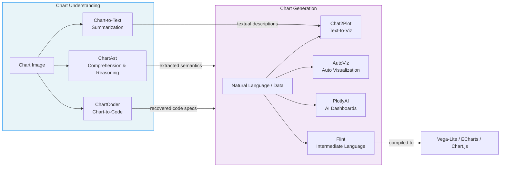
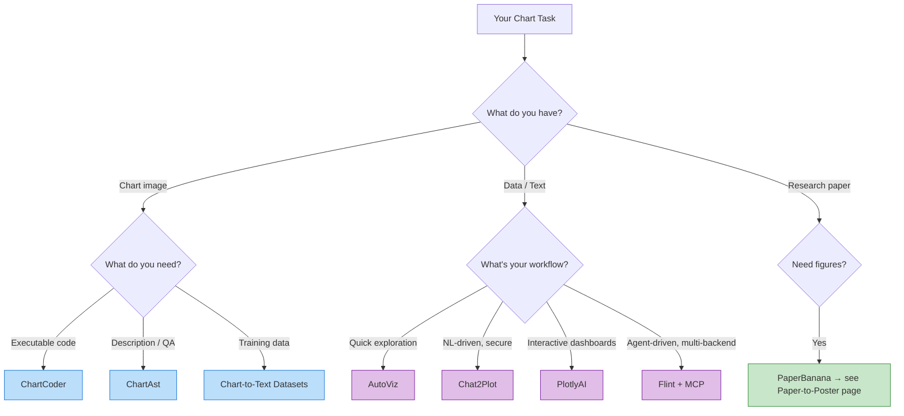

Charts are the visual language of science — they compress complex data into interpretable patterns, encode relationships across dimensions, and serve as the primary evidence substrate in scientific publications. This page surveys the AI-powered tools and models that bridge the gap between **visual chart perception** and **programmable chart creation**, covering two complementary directions: extracting structured understanding from existing charts, and generating reproducible, publication-quality visualizations from data or natural language.

## The Two-Way Street: Understanding ↔ Generation

The chart intelligence landscape organizes around a fundamental duality — **chart-to-code** (understanding an existing chart and reconstructing its programmatic specification) and **code-to-chart** (generating visualizations from data, text, or specifications). These two directions are converging: multimodal LLMs that understand chart semantics can also generate them, and visualization tools that produce charts are increasingly ingesting natural language inputs.

This convergence is particularly significant for scientific reproducibility: when a researcher can feed a published chart image into a model and recover its underlying code, the barrier to reproducing and extending published results drops dramatically.

Sources: [README.md](/README.md#L123-L136)

## Chart-to-Code & Reproducibility

The chart-to-code pipeline addresses a critical pain point in scientific workflows: published charts are typically raster images or vector PDFs that cannot be programmatically modified, re-analyzed, or re-styled. Recovering the code that generated a chart unlocks editing, data extraction, and reproducibility.

### ChartCoder — Multimodal LLM for Chart-to-Code Generation

**ChartCoder** (ACL 2025) is a multimodal large language model specifically trained for chart-to-code generation — the task of taking a chart image as input and producing executable visualization code (e.g., Python/Matplotlib, Vega-Lite) as output. Its key achievement is that a **7B-parameter model outperforms larger open-source multimodal LLMs** on chart-to-code benchmarks, demonstrating that domain-specific training and architecture choices matter more than raw parameter count for this task. This makes it particularly practical for deployment in resource-constrained research environments.

Sources: [README.md](/README.md#L126-L126)

### ChartAssistant / ChartAst — Universal Chart Comprehension

**ChartAssistant** (also known as **ChartAst**, ACL 2024) from OpenGVLab takes a broader approach: rather than focusing solely on code generation, it targets **universal chart comprehension and reasoning**. This includes chart description, question answering, and fact-checking against chart content. The model is designed to understand the semantic content of charts — what the data means, not just what the visual elements look like — enabling downstream tasks like automated chart fact-checking and data extraction from figures in scientific papers.

Sources: [README.md](/README.md#L127-L127)

### Chart-to-Text Datasets — Training Chart Description

The **Chart-to-Text** dataset collection provides large-scale chart summarization datasets for training chart description capabilities. These datasets are essential infrastructure: they provide the ground-truth pairs (chart image → natural language description) that enable training and evaluating models for chart understanding. Without high-quality datasets, even the best model architectures cannot learn effective chart-to-text mappings. This resource underpins the training of both ChartCoder and ChartAst, as well as general-purpose multimodal models.

Sources: [README.md](/README.md#L128-L128)

### Comparison: Chart Understanding Models

| Tool | Primary Task | Key Strength | Venue | Model Size |
|------|-------------|--------------|-------|------------|
| **ChartCoder** | Chart → Code | 7B model beats larger MLLMs | ACL 2025 | 7B |
| **ChartAst** | Chart → Understanding | Universal comprehension & reasoning | ACL 2024 | Varies |
| **Chart-to-Text** | Dataset provider | Large-scale training data | — | N/A |

> [!TIP]
> When choosing a chart understanding tool, match the task to the model: ChartCoder for code recovery and reproducibility workflows, ChartAst for semantic extraction and QA, and Chart-to-Text datasets if you're training your own model.

Sources: [README.md](/README.md#L125-L129)

## Scientific Visualization Tools

While chart understanding focuses on extracting information from existing visuals, the generation side addresses a different problem: **how to create publication-quality, reproducible charts with minimal friction**. The tools in this section span the spectrum from natural-language-driven specification to fully automated visualization pipelines.

### Chat2Plot — Secure Text-to-Visualization

**Chat2Plot** generates visualizations from natural language descriptions through a **standardized chart specification** intermediate representation. This design choice is architecturally significant: rather than directly generating code from text (which can introduce security risks from arbitrary code execution), Chat2Plot first translates the user's intent into a declarative chart specification, then renders it. This separation provides a security boundary — the specification language is constrained and cannot express arbitrary computation — while still giving users the flexibility of natural language input.

Sources: [README.md](/README.md#L131-L131)

### AutoViz — Automated Visualization with Minimal Code

**AutoViz** takes a data-first approach: given a dataset, it automatically selects appropriate visualization types, handles formatting and styling, and produces polished charts with minimal user code. This is particularly valuable for exploratory data analysis in scientific workflows, where researchers often need to quickly visualize distributions, correlations, and trends without investing time in manual chart configuration. AutoViz's automation reduces the friction between "I have data" and "I can see the patterns."

Sources: [README.md](/README.md#L132-L132)

### PlotlyAI — AI-Powered Dashboards

**PlotlyAI** extends the well-established Plotly ecosystem with AI-powered visualization and dashboard creation. Its integration with the Plotly library means generated charts inherit Plotly's interactivity, theming, and export capabilities. For researchers who already use Plotly in their workflows, PlotlyAI provides a natural on-ramp to AI-assisted visualization without leaving the familiar ecosystem.

Sources: [README.md](/README.md#L133-L133)

### Flint (Microsoft) — Visualization Intermediate Language

**Flint** from Microsoft Research introduces a particularly innovative architecture: a **visualization intermediate language** that decouples chart specification from rendering. The same Flint specification can be compiled to **30+ chart types** across multiple rendering backends (Vega-Lite, ECharts, Chart.js). This design has several important implications:

- **Human-editable specs**: Flint specifications are simple, declarative, and readable — researchers can review and modify them before rendering.
- **AI-agent compatibility**: Flint ships an **MCP server**, making it directly usable by AI agents that can generate and refine chart specifications through tool calls.
- **Cross-platform rendering**: A single specification can produce charts in different ecosystems, useful for publications (Vega-Lite for web), presentations (ECharts for interactive), and print (Chart.js for static).

> [!TIP]
> Flint's MCP server integration makes it the strongest choice for agentic workflows where an AI agent autonomously generates visualizations. If you're building a research agent that needs chart creation capability, Flint's standardized spec + MCP interface is the most architecturally clean option.

Sources: [README.md](/README.md#L134-L134)

### Comparison: Visualization Generation Tools

| Tool | Input Method | Output Format | Security Model | Agent Integration |
|------|-------------|---------------|----------------|-------------------|
| **Chat2Plot** | Natural language | Standardized chart spec | Constrained spec (no code execution) | Indirect |
| **AutoViz** | Dataset + minimal code | Auto-selected chart types | Code-based (Python) | Low |
| **PlotlyAI** | Natural language | Interactive Plotly charts | Plotly sandbox | Moderate |
| **Flint** | Declarative spec / NL | 30+ chart types (Vega-Lite, ECharts, Chart.js) | Spec-language boundary | **MCP server** |

Sources: [README.md](/README.md#L130-L134)

## Cross-Cutting Connections

Chart understanding and generation tools do not exist in isolation — they connect to several adjacent capabilities in the AI-for-science ecosystem:

- **[Paper-to-Poster, Slides & Media](6-paper-to-poster-slides-and-media)**: Tools like **mPLUG-PaperOwl** (a multimodal LLM for scientific charts and diagrams understanding/generation) and **PaperBanana** (automated academic illustration generation) bridge chart intelligence with the broader pipeline of converting research papers into visual communication artifacts. The Paper→Poster section explicitly references this page for chart-specific tools.

- **[Scientific Document Parsing](9-scientific-document-parsing)**: Document parsing tools like **PDFFigures2** extract figures and tables from scholarly PDFs, producing the chart images that understanding models then process. The parsing layer is the upstream feeder for chart understanding workflows.

- **[Literature & Knowledge Management](5-literature-and-knowledge-management)**: Tools like **PandasAI** and **DeepAnalyze** (the first agentic LLM for autonomous data science with end-to-end pipeline from data to analyst-grade reports) combine data analysis with chart generation, sitting at the intersection of data understanding and visualization.

Sources: [README.md](/README.md#L93-L119), [README.md](/README.md#L74-L78)

## Practical Selection Guide

When selecting a chart understanding or generation tool, the decision hinges on your primary workflow:

Sources: [README.md](/README.md#L123-L136)

## Next Steps

- **Extracting figures from papers first?** Start with [Scientific Document Parsing](9-scientific-document-parsing) to learn about tools like PDFFigures2 that extract chart images from PDFs before feeding them to understanding models.
- **Building complete research presentations?** See [Paper-to-Poster, Slides & Media](6-paper-to-poster-slides-and-media) for the full pipeline from paper to visual communication artifacts.
- **Automating data analysis pipelines?** Explore [Literature & Knowledge Management](5-literature-and-knowledge-management) for tools like PandasAI and DeepAnalyze that combine data analysis with chart generation.
- **Reproducing paper results from charts?** Continue to [Paper-to-Code & Reproducibility](8-paper-to-code-and-reproducibility) for the broader ecosystem of automated code generation from research papers.
