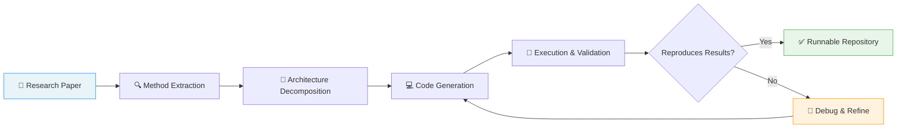
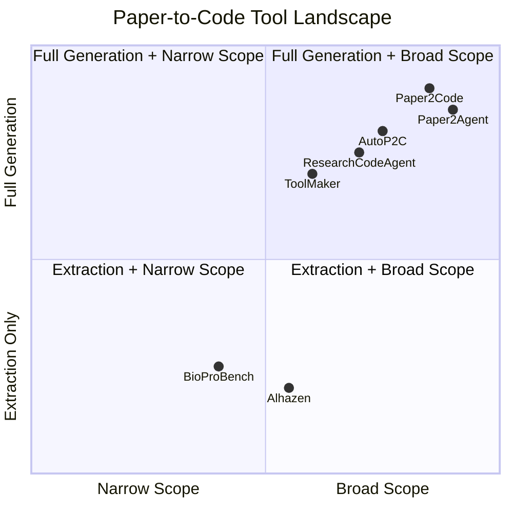

The gap between reading a research paper and running its code is one of the most persistent bottlenecks in scientific computing. A method described in elegant mathematical notation may require weeks of engineering to translate into a working implementation — and even then, subtle discrepancies between the paper's claims and the actual code can render results irreproducible. This page surveys the emerging ecosystem of AI-powered tools that **automate the translation of scientific papers into executable code** and **strengthen experimental reproducibility**, turning the paper-to-pipeline journey from a manual craft into a systematic engineering process.

Sources: [README.md](/README.md#L138-L150)

## The Paper-to-Code Pipeline

At its core, the paper-to-code problem is a **multi-step translation challenge**: extract the methodology from natural language and mathematical notation, decompose it into implementable modules, generate syntactically correct and semantically faithful code, and validate that the output reproduces the paper's reported results. The tools in this ecosystem target different stages of this pipeline, from full end-to-end automation to specialized protocol extraction.

The pipeline above illustrates the canonical workflow. In practice, the most mature tools (Paper2Code, AutoP2C) aim to collapse the entire chain into a single automated pass, while others (ToolMaker, Alhazen) focus on extracting specific artifacts — callable tools or experimental protocols — from the paper's content.

Sources: [README.md](/README.md#L138-L150)

## Automated Code Generation

The automated code generation category represents the most ambitious goal in this space: given a research paper as input, produce a **runnable code repository** as output. The five tools in this category differ in their architectural strategies and output granularity.

| Tool | Approach | Output Format | Key Differentiator | Stars / Year |
|------|----------|---------------|-------------------|--------------|
| **Paper2Code** | End-to-end generation | Full runnable repository | Direct paper → implementation pipeline | 4.5K+ ⭐, 2025 |
| **Paper2Agent** | Multi-agent system | Interactive AI agents + MCP server | Generates deployable agents, not just code | 2.2K+ ⭐, 2025 |
| **AutoP2C** | LLM agent framework | Runnable repository | Agent-driven repo generation from papers | 2025 |
| **ResearchCodeAgent** | Multi-agent system | Codified research methodology | Focuses on methodology codification | 2025 |
| **ToolMaker** | Paper-to-tool conversion | Callable agent tools | Turns paper-code into reusable API tools | 2025 |

Sources: [README.md](/README.md#L140-L145)

### Paper2Code: The Reference Implementation

**Paper2Code** stands as the most starred project in this category, providing a direct pipeline from machine learning research papers into runnable implementations. Its significance lies in treating the paper-to-code problem as a first-class engineering challenge rather than an ad-hoc translation task. The system parses the paper's methodology section, identifies the computational graph implied by the algorithm description, and generates a structured codebase with proper module separation, configuration files, and training scripts.

Sources: [README.md](/README.md#L141-L141)

### Paper2Agent: Beyond Code to Deployable Agents

**Paper2Agent** takes a fundamentally different approach by not just generating code but producing **interactive AI agents** complete with MCP (Model Context Protocol) server generation. This means the output isn't merely a static codebase — it's a deployable service that other agents and tools can interact with. The system also auto-detects tutorials and extracts benchmarks from the paper, making it particularly suited for papers that describe agent-based or tool-using systems.

Sources: [README.md](/README.md#L142-L142)

### AutoP2C and ResearchCodeAgent: Agent-Driven Codification

**AutoP2C** and **ResearchCodeAgent** both employ multi-agent architectures but target slightly different aspects of the problem. AutoP2C focuses on generating **complete runnable repositories** — the full project structure with proper dependency management, not just isolated function implementations. ResearchCodeAgent emphasizes the **codification of research methodologies** themselves, which is subtly different: it aims to capture the experimental methodology as executable code, making the research process itself reproducible rather than just the final algorithm.

> [!TIP]
> When choosing between these tools, consider the output you need: Paper2Code for a standard ML codebase, Paper2Agent if you need a deployable agent service, and ResearchCodeAgent if your goal is to codify the full experimental methodology including data processing and evaluation pipelines.

Sources: [README.md](/README.md#L143-L144)

### ToolMaker: From Paper to Reusable API

**ToolMaker** occupies a unique niche: rather than generating a standalone codebase, it converts papers that include code into **callable agent tools**. This is particularly valuable in the context of autonomous research agents (see [Autonomous Research Systems](10-autonomous-research-systems)), where a tool created from a paper can be invoked by other agents as part of a larger workflow. ToolMaker essentially bridges the gap between static paper artifacts and the dynamic tool ecosystem that modern AI agents require.

Sources: [README.md](/README.md#L145-L145)

## Experiment Automation

While code generation handles the *algorithmic* content of a paper, **experiment automation** addresses the *procedural* content — the step-by-step protocols, experimental configurations, and metadata that determine whether a result can be independently verified. This category is especially critical in domains like biology, where experimental protocols are complex and error-prone.

| Tool | Domain | Function | Output |
|------|--------|----------|--------|
| **BioProBench** | Biology | Benchmark for LLM procedural understanding | Evaluation metrics on biological protocols |
| **Alhazen** | Cross-domain | Extract experimental metadata & protocols | Structured protocol information from documents |

Sources: [README.md](/README.md#L147-L149)

### BioProBench: Evaluating Protocol Understanding

**BioProBench** is a comprehensive benchmark designed to evaluate how well LLMs understand and can execute biological protocols. It tests the model's ability to parse procedural text — the kind of step-by-step instructions found in methods sections — and correctly reason about the sequence, dependencies, and expected outcomes of experimental steps. This benchmark is essential for the paper-to-code ecosystem because it provides a **ground truth for measuring progress**: without standardized evaluation, it's impossible to know whether an automated system truly understands the experiment or merely paraphrases it.

Sources: [README.md](/README.md#L148-L148)

### Alhazen: Protocol Extraction from Scientific Documents

**Alhazen**, developed by the Chan Zuckerberg Initiative, focuses on **extracting experimental metadata and protocol information** from scientific documents. Named after the pioneering medieval scientist, it addresses a practical bottleneck: much of the information needed to reproduce an experiment is buried in supplementary materials, figure captions, or inconsistently formatted methods sections. Alhazen parses these heterogeneous sources and produces structured protocol representations that can be directly consumed by automated systems.

> [!TIP]
> Alhazen's output is particularly valuable as a preprocessing step for the code generation tools above. Extracting structured protocol information first, then feeding it to Paper2Code or AutoP2C, can significantly improve the quality of the generated code by ensuring the experimental setup is correctly captured before code synthesis begins.

Sources: [README.md](/README.md#L149-L149)

## Architectural Comparison: How the Tools Fit Together

The tools in this ecosystem can be positioned along two axes: the **depth of automation** (from extraction to full generation) and the **scope of output** (from protocol metadata to deployable services). Understanding this landscape helps in selecting the right tool for a given reproducibility challenge.

The quadrant chart reveals a clear pattern: the code generation tools (Paper2Code, Paper2Agent, AutoP2C) cluster in the upper-right, offering both broad scope and deep automation, while the experiment automation tools (BioProBench, Alhazen) occupy the lower portion, focusing on extraction and evaluation rather than generation. This is by design — the extraction tools provide the **structured inputs** that the generation tools need to produce high-quality outputs.

Sources: [README.md](/README.md#L138-L150)

## The Reproducibility Challenge in Context

The paper-to-code problem is not merely a software engineering challenge — it sits at the intersection of **scientific document understanding** (see [Scientific Document Parsing](9-scientific-document-parsing)) and **autonomous research execution** (see [Autonomous Research Systems](10-autonomous-research-systems)). A complete reproducibility pipeline would typically involve:

1. **Document parsing** — extracting structured content from the paper's PDF (handled by tools like MinerU, Docling, or Nougat from the [Scientific Document Parsing](9-scientific-document-parsing) page)
2. **Method extraction and code generation** — the tools on this page
3. **Experiment execution and validation** — running the generated code and comparing results against the paper's reported metrics

The tools cataloged here primarily address step 2, but their effectiveness depends critically on the quality of step 1 and feeds directly into step 3. This is why the broader ecosystem — including evaluation benchmarks like PaperBench and MLE-Bench documented in [Evaluation & Benchmarking](12-evaluation-and-benchmarking) — is essential for measuring whether paper-to-code systems actually achieve their stated goal of reproducibility.

Sources: [README.md](/README.md#L138-L150)

## Recommended Reading Path

For developers looking to implement paper-to-code workflows, the following progression through the catalog is recommended:

- **Start here** → Understand the tools on this page for code generation and experiment automation
- **Next** → [Scientific Document Parsing](9-scientific-document-parsing) — Learn how to extract the structured inputs that code generation tools consume
- **Then** → [Chart Understanding & Generation](7-chart-understanding-and-generation) — Understand how generated code can reproduce the paper's visualizations
- **Advanced** → [Autonomous Research Systems](10-autonomous-research-systems) — See how paper-to-code tools integrate into fully autonomous research pipelines
- **Evaluation** → [Evaluation & Benchmarking](12-evaluation-and-benchmarking) — Measure whether your reproducibility pipeline actually works
