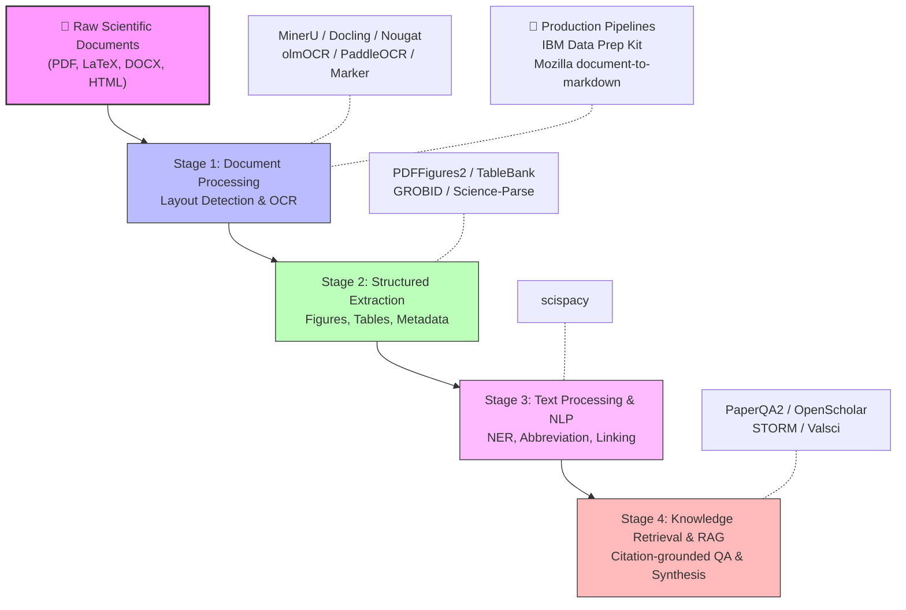
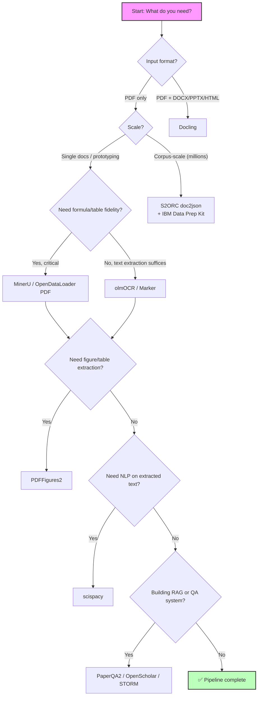

Scientific document parsing sits at the critical junction between raw scholarly artifacts—PDFs, LaTeX sources, and born-digital documents—and the structured, machine-readable data that downstream AI systems consume. This page catalogs the tools and frameworks that transform unstructured scientific literature into LLM-ready Markdown, JSON, or structured metadata, covering the full pipeline from raw PDF ingestion through figure extraction, text processing, and retrieval-augmented analysis. Whether you are building a literature mining pipeline, training a domain-specific language model, or constructing a RAG system over scientific papers, the resources below provide the foundational parsing infrastructure.

Sources: [README.md](/README.md#L153-L187)

## The Parsing Pipeline: From PDF to Knowledge

Scientific document parsing is not a single operation but a multi-stage pipeline where each stage addresses a distinct challenge. The diagram below illustrates how these stages compose, and where each tool category in this catalog fits.

The pipeline is inherently sequential: you cannot reliably extract figures from a document whose layout you have not parsed, and you cannot build a citation-grounded RAG system without first converting the source material into structured text. The tools in this catalog span all four stages, with the heaviest concentration in Stage 1—the hardest and most actively evolving problem in the field.

Sources: [README.md](/README.md#L153-L187)

## High-Performance Document Processing

This is the core of the parsing stack: tools that ingest raw scientific documents and produce structured output. The category has evolved rapidly from traditional OCR pipelines to neural multimodal models that understand document layout, reading order, and mathematical notation simultaneously. The following table compares the primary tools across the dimensions most relevant to developers building scientific pipelines.

| Tool | Source Format | Output Format | Key Strength | Origin |
|---|---|---|---|---|
| **MinerU** | PDF | Markdown, JSON | 1.2B-parameter model outperforming GPT-4o on document parsing | OpenDataLab |
| **MinerU-Diffusion** | PDF | Text | Block-level parallel diffusion decoding (vs. autoregressive) | OpenDataLab (ECCV 2026) |
| **OpenDataLoader PDF** | PDF | Markdown, JSON, HTML, Tagged PDF | #1 overall on extraction benchmarks | OpenDataLoader |
| **PDF-Extract-Kit** | PDF | Structured | Comprehensive layout detection + formula recognition + OCR | OpenDataLab |
| **Docling** | PDF, DOCX, PPTX, HTML, Images | Markdown, JSON | Multi-format input with layout reconstruction | IBM (AAAI 2025) |
| **Nougat** | PDF | Markdown | Mathematical formula support via neural optical understanding | Meta AI |
| **olmOCR** | PDF | LLM-ready text | Optimized for scientific literature linearization | AllenAI |
| **PaddleOCR 3.0** | Images, PDF | Structured | 80+ languages, PP-StructureV3, 13% accuracy gain | Baidu |
| **Unstructured** | Multi-format | Structured | Production-grade ETL with open-source API | Unstructured-IO |
| **Marker** | PDF | Markdown, JSON, HTML | Specialized for tables, formulas, code blocks | Datalab |
| **S2ORC doc2json** | PDF, LaTeX, JATS | Standardized JSON | Large-scale processing of millions of papers | AllenAI |
| **GROBID** | PDF | Structured metadata | Scholarly metadata extraction via ML | kermitt2 |
| **Science-Parse** | PDF | Structured fields | Title/author/sections/references extraction | AllenAI |

> [!TIP]
> When choosing a document processing tool, prioritize **input format coverage** first. If your corpus includes DOCX, PPTX, or HTML alongside PDFs, Docling is the only tool in this list that natively handles all five major formats. If you are working exclusively with PDFs and need state-of-the-art accuracy, MinerU and OpenDataLoader PDF currently lead the benchmarks.

> [!TIP]
> For pipelines that must process millions of papers, S2ORC doc2json and GROBID are the battle-tested choices—both AllenAI and the GROBID community have run them at corpus scale. MinerU and Docling are newer but offer higher per-document accuracy at the cost of heavier compute.

The most significant architectural shift in this space is the move from **autoregressive OCR** (token-by-token decoding) to **diffusion-based decoding**. MinerU-Diffusion exemplifies this: by replacing sequential token generation with block-level parallel diffusion, it achieves high-accuracy text recognition while reducing inference latency—a critical advantage when processing scientific PDFs at scale. Similarly, Nougat pioneered the application of transformer-based vision models to academic document understanding, treating the PDF page as an image and learning to transcribe it end-to-end, including mathematical notation that traditional OCR pipelines systematically mangle.

Sources: [README.md](/README.md#L155-L168)

## Production Pipelines & Data Preparation

Moving from single-document parsing to corpus-scale ingestion requires infrastructure that handles batching, optimization, and format conversion. Two tools in this catalog address this gap directly:

- **IBM Data Prep Kit: PDF→Parquet** provides a large-scale scientific document ingestion pipeline with optimization configurations for converting PDFs into Parquet format—a columnar storage format ideal for downstream analytics and ML training. This is the tool to reach for when you need to ingest thousands or millions of PDFs into a data lake.
- **Mozilla document-to-markdown** wraps Docling's parsing engine with a user-friendly UI and CLI, designed for rapid prototyping. It is not a production-scale pipeline but rather a developer on-ramp: paste a PDF, get Markdown, validate the output, then scale up with Docling or IBM Data Prep Kit.

The distinction matters: **IBM Data Prep Kit** is a batch-processing engine, while **Mozilla document-to-markdown** is a developer experience layer. They serve different points in the same workflow—prototype locally with Mozilla, then deploy at scale with IBM.

Sources: [README.md](/README.md#L170-L172)

## Figure & Table Extraction

Scientific papers communicate their most important findings through figures and tables, yet these are the elements most likely to be mangled or lost during naive PDF-to-text conversion. Dedicated extraction tools address this:

- **PDFFigures2** (AllenAI) extracts figures, tables, captions, and section titles from scholarly PDFs. It is the extraction engine behind many of AllenAI's corpus-scale projects and remains the standard reference implementation for figure extraction.
- **TableBank** provides a large-scale table detection and recognition dataset along with pre-trained models. It is less a tool and more a benchmark resource—use it to train or evaluate your own table extraction models, or to understand the state of the art in table recognition.

The relationship between these tools and the document processors above is complementary: MinerU and Docling handle figure and table extraction as part of their end-to-end pipelines, but PDFFigures2 and TableBank offer finer-grained control and evaluation capabilities when you need to optimize extraction quality for specific document types.

Sources: [README.md](/README.md#L174-L176)

## Scientific Text Processing & NLP

Once documents are parsed into structured text, the next challenge is **scientific language understanding**—extracting entities, resolving abbreviations, and linking terms to controlled vocabularies. This is where **scispacy** (AllenAI) operates:

- **scispacy** provides a full spaCy pipeline and models for scientific and biomedical documents, enabling named entity recognition (NER), abbreviation resolution, and UMLS linking for scientific literature mining. With 1.9K+ GitHub stars and an Apache 2.0 license, it is the de facto standard for scientific NLP preprocessing in Python.

scispacy fills a critical gap that general-purpose NLP tools cannot: scientific text contains domain-specific abbreviations, chemical nomenclature, gene symbols, and taxonomic names that standard spaCy models misclassify or ignore entirely. The UMLS linking capability—mapping recognized entities to the Unified Medical Language System—makes scispacy particularly valuable for biomedical literature mining pipelines.

Sources: [README.md](/README.md#L178-L179)

## Scientific Literature RAG & Analysis

The final stage of the parsing pipeline is **retrieval-augmented generation and analysis**—using the structured output of earlier stages to build systems that can answer questions, verify claims, and synthesize new knowledge from the scientific literature. This category represents the highest-value application of the entire parsing stack:

| Tool | Core Function | Distinctive Capability |
|---|---|---|
| **PaperQA2** | High-accuracy RAG for scientific PDFs | Agentic RAG with citation support and contradiction detection |
| **OpenScholar** | Literature synthesis from 45M papers | Human-expert-level citation accuracy; outperforms GPT-4o by 5% on ScholarQABench (Nature 2026) |
| **Valsci** | Scientific claim verification | Self-hostable; combines Semantic Scholar retrieval + bibliometric scoring + LLM evidence synthesis |
| **paper-reviewer** | Paper review generation | Generates comprehensive reviews from arXiv papers; converts to blog posts |
| **STORM** | Long-form research article synthesis | Multi-perspective question asking + web retrieval + citation-grounded generation; Co-STORM for collaborative human-LLM curation |

The key differentiator among these tools is **grounding strategy**. PaperQA2 and OpenScholar both ground their outputs in retrieved evidence, but OpenScholar operates at a fundamentally different scale—accessing 45M papers and achieving citation accuracy that matches human experts. Valsci takes a different approach entirely, focusing on **verification** rather than generation: it validates claims against the literature, making it invaluable for fact-checking and literature review workflows. STORM is unique in its iterative, multi-perspective approach—it does not simply retrieve and generate but actively asks questions from multiple angles before synthesizing, producing Wikipedia-quality articles with full citation trails.

Sources: [README.md](/README.md#L181-L186)

## Choosing the Right Tool: A Decision Framework

The following decision flowchart maps common developer scenarios to the appropriate tool category:

Sources: [README.md](/README.md#L153-L187)

## Where to Go Next

Scientific document parsing is a foundational capability that enables many downstream workflows. Depending on your goals, the following pages in this catalog provide the natural next steps:

- **[Chart Understanding & Generation](7-chart-understanding-and-generation)** — If your parsing pipeline extracts figures but you need to understand or reproduce the charts within them, this page catalogs chart-to-code and visualization tools.
- **[Paper-to-Code & Reproducibility](8-paper-to-code-and-reproducibility)** — If you want to go beyond parsing and automatically generate runnable code from parsed papers, this page covers automated code generation from research papers.
- **[Literature & Knowledge Management](5-literature-and-knowledge-management)** — If you are building a literature search pipeline that feeds into the parsing tools documented here, this page covers academic search engines and knowledge management platforms.
- **[Foundation Models for Science](21-foundation-models-for-science)** — If you are training domain-specific models on the structured output of your parsing pipeline, this page catalogs scientific foundation models.
- **[Datasets & Benchmarks](23-datasets-and-benchmarks)** — If you need evaluation datasets to benchmark your parsing quality, this page provides the benchmarking resources.
