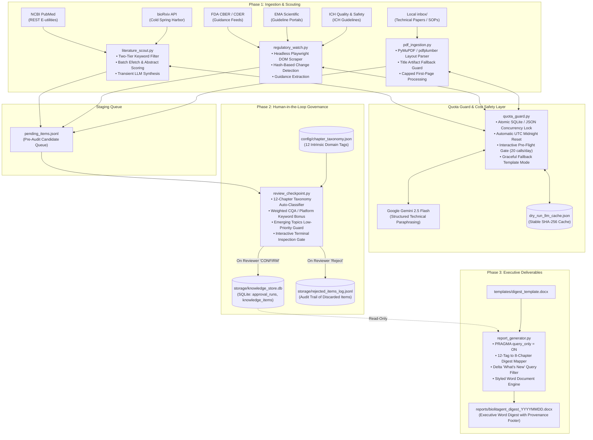

# BioLitAgent

**Autonomous Bioprocess Literature Mining, Regulatory Surveillance, and Translational CMC Intelligence Platform**

[](https://www.python.org/downloads/)
[](https://opensource.org/licenses/MIT)
[]()
[]()

BioLitAgent is an enterprise-grade multi-agent platform designed for translational bioprocess scientists, protein engineers, and regulatory CMC leads. It continuously monitors, extracts, classifies, and synthesizes technical literature, global regulatory guidances (FDA, EMA, ICH), and proprietary research documents into client-ready executive digests and cGMP-compliant operational artifacts.

---

## The Translational Bioprocess Development Bridge
### *Aligning Autonomous AI with Translational Science (Stanford Sarafan ChEM-H / MITI)*

Translating fundamental biomedical discoveries from academic laboratories into scalable, clinical-grade therapeutics requires bridging the gap between exploratory molecular biology and rigorous Chemistry, Manufacturing, and Controls (CMC) requirements. BioLitAgent is purpose-built to accelerate this translational continuum:

```
┌────────────────────────────────────────────────────────────────────────────────────────┐
│                        TRANSLATIONAL BIOPROCESS CONTINUUM                              │
├──────────────────────────────┬─────────────────────────────┬───────────────────────────┤
│    Exploratory Biology       │    Process Development      │    Clinical Translation   │
│  (Target ID & Expression)    │ (Scale-Up & Yield Bottlenecks)│   (IND & cGMP Production) │
├──────────────────────────────┼─────────────────────────────┼───────────────────────────┤
│ • Automated Literature       │ • Structural & Pathway      │ • Automated Artifact      │
│   Mining: optimal induction    Tooling: AlphaFold pLDDT    │   Generation: IND Module  │
│   temps, fusion tags,        │   aggregates, STRING PPI    │   3.2.S sections, CQA/CPP │
│   chaperone co-expression,   │   chaperones, PyMOL contact │   matrices, cGMP SOP      │
│   in vitro refolding recipes │   analysis, solubility engineering│ outlines & regulatory summaries│
└──────────────────────────────┴─────────────────────────────┴───────────────────────────┘
```

### 1. Literature Mining for Upstream Expression & Refolding Optimization
* **Challenge:** Novel, difficult-to-express modalities (e.g., asymmetric bispecific antibodies, engineered microbial therapeutics, non-canonical fusion enzymes) frequently encounter severe expression arrest, low titers, inclusion body formation, or proteolytic clipping.
* **Agent Solution:** BioLitAgent's `literature_scout` agent executes multi-pass, rate-limited queries against PubMed and preprint repositories with a domain-tuned, two-tier relevance filter. It extracts empirical operational parameters:
  * Optimal induction temperatures ($16^\circ\text{C} - 30^\circ\text{C}$) and IPTG/inducer concentrations.
  * Solubilizing fusion tags (SUMO, MBP, GST, Thioredoxin) and protease cleavage protocols.
  * Redox shuffling agents (GSH/GSSG ratios, L-arginine) and chaperone co-expression platforms for refolding insoluble inclusion bodies.

### 2. Structural & Pathway Tooling for Yield and Stability Bottlenecks
* **Challenge:** Downstream purification yields and drug substance shelf-lives are compromised by conformational instability, hydrophobic surface patches, and aberrant post-translational modifications.
* **Agent Solution:** Integration with biophysical, structural, and pathway tools:
  * **AlphaFold Structural Confidence (pLDDT & PAE):** Pinpoints disordered loops, flexible linkers, and low-confidence domains prone to proteolytic degradation or aggregation.
  * **STRING & Reactome Pathway Profiling:** Evaluates host cell metabolic load, unfolded protein response (UPR) activation, and chaperone networks to optimize host cell engineering (CHO, HEK293, *E. coli*).
  * **PyMOL & Surface Electrostatics:** Identifies aggregation hotspots for rational surface-entropy reduction and disulfide bond stabilization without compromising binding affinity.

### 3. Artifact Generation for CMC Dossiers & IND Applications
* **Challenge:** Preparing regulatory filings (FDA IND, EMA CTA) and pilot facility tech-transfer packages requires converting unstructured bench data into highly structured, audit-proof technical documentation.
* **Agent Solution:** BioLitAgent automatically drafts regulatory-ready artifacts compliant with **ICH Q8(R2)** (Pharmaceutical Development), **ICH Q9** (Quality Risk Management), and **ICH Q11** (Drug Substance Development):
  * **Critical Quality Attribute (CQA) Matrices:** Quantitative tracking of Fc N-glycan microheterogeneity (afucosylation, galactosylation), charge variants (icIEF), high-molecular-weight species (HMWS via SEC-MALS), and host cell residual proteins/DNA.
  * **Critical Process Parameter (CPP) & Design Space Boundaries:** Defining proven acceptable ranges (PAR) and normal operating ranges (NOR) for continuous perfusion bioreactors and periodic counter-current chromatography (PCC).
  * **Standard Operating Procedure (SOP) Templates:** Automated drafting of cleanroom-ready procedures for process analytical technology (PAT) feedback, capacitance biomass control, and viral clearance filters.

---

## System Architecture & End-to-End Orchestration

BioLitAgent operates under an Antigravity-orchestrated 4-phase pipeline balancing autonomous multi-agent execution with strict human-in-the-loop (HITL) quality control:



---

## 12-Chapter Taxonomy & Domain Mapping

BioLitAgent organizes bioprocess intelligence into an intrinsic 12-tag domain taxonomy that maps directly to the 8 standard chapters of pharmaceutical executive digests:

| Chapter Tag ID | Domain Scope | Primary Keywords & Scoring Weight | Digest Chapter Mapping |
|:---|:---|:---|:---|
| `regulatory_cmc` | FDA, EMA, ICH guidances, pharmacopeia, BLA/IND filings | cGMP, CMC, critical quality attribute, comparability, 21 CFR 211 | Chapter 1: Regulatory & Quality Guidelines |
| `gmp_manufacturing` | Pilot facilities, cleanrooms, single-use systems, contamination | single-use, sterile filtration, isolator, bioburden, cleanroom | Chapter 2: Quality & Facilities Management |
| `upstream_process` | Perfusion bioreactors, cell density, feeding strategies, cell lines | perfusion, fed-batch, bioreactor, VCD, CHO cells, CSPR, recombinant subunit vaccine | Chapter 3: Process Development (Upstream) |
| `downstream_process` | Chromatography, filtration, viral clearance, crystallization | Protein A, PCC, continuous capture chromatography, breakthrough curve, TFF | Chapter 3: Process Development (Downstream) |
| `analytical_characterization` | Mass spectrometry, glycoprofiling, charge variants, SEC-MALS | Fc glycan, intact mass, peptide mapping, icIEF, CQA pairing bonus | Chapter 4: Analytical Characterization |
| `formulation_stability` | Lyophilization, aggregation, polysorbate, excipient screening | polysorbate 20/80, aggregation, freeze-thaw, liquid formulation | Chapter 4: Analytical Characterization |
| `hybrid_modeling` | Digital twins, mechanistic ODEs, AI/ML optimization, PAT | process control, AI/ML, intelligent manufacturing, hybrid framework, PAT | Chapter 5: Digital Bioprocess & Modeling |
| `host_expression` | CHO-K1, HEK293, *E. coli*, Pichia, synthetic promoters | CHO, HEK293, codon optimization, signal peptide, gene copy | Chapter 6: Expression Systems & Cell Lines |
| `microbiome_platform_science` | Live biotherapeutics, engineered probiotics, synbio platforms | synthetic biology, engineered bacterial therapeutic, microbial therapeutics, gut microbiome (qualifier) | Chapter 7: Microbiome & Platform Science |
| `emerging_topics` | mRNA-LNP, cell/gene therapy, viral vectors, bispecifics | mRNA, LNP, CAR-T, CRISPR, bispecific, novel modality (last resort) | Chapter 8: Emerging Topics & Modalities |
| `equipment_hardware` | Single-use bags, sensors, skids, pumps, automation | peristaltic pump, mass flow controller, skid, single-use bioreactor | Chapter 2: Quality & Facilities Management |
| `capa_rca` | Out-of-specification, deviation investigation, root cause | CAPA, root cause analysis, deviation, out of specification | Chapter 2: Quality & Facilities Management |

---

## Interactive Visual Documentation & Widgets

### Interactive System Topology Dashboard
An interactive Tailwind CSS visual widget is included in [`docs/topology_architecture_widget.html`](file:///c:/Users/Ali/Documents/Antigravity/BioLitAgent/biolitagent/docs/topology_architecture_widget.html). It provides an interactive inspection surface for:
* Layer filtering (Phase 1 Ingestion, Phase 2 Human Review, Phase 3 Deliverables Engine).
* Detailed component metadata, security boundaries, and protocol specifications.
* Visual verification of data flow from external APIs through staging queues to SQLite storage.

> **How to view:** Open `biolitagent/docs/topology_architecture_widget.html` in any modern web browser or embed within markdown-compatible IDE viewers.

### Real-Time Terminal Audit Log Showcase
Below is a verified capture of BioLitAgent's two-tier relevance filter and human-in-the-loop review checkpoint:

```text
====================================================================================
  Literature Scout Query Summary:
    * Upstream Perfusion & Cell Culture          [OK          ] (3 pass / 2 filtered / 5 total | Top anchors: cho (3), perfusion (3), bioreactor (3))
    * Continuous Downstream Processing           [OK          ] (3 pass / 1 filtered / 4 total | Top anchors: continuous capture chromatography (3), breakthrough curve (2))
    * Analytical Glycan & CQA Profiling          [OK          ] (3 pass / 0 filtered / 3 total | Top anchors: fc glycan (3), critical quality attribute (3))
------------------------------------------------------------------------------------
  Synthesis Allocation: LLM calls used 12/12, fallback-template items 0
====================================================================================

====================================================================================
  BIO-LIT-AGENT REVIEW CHECKPOINT — Human-in-the-Loop Approval Gate
====================================================================================
  Pending items loaded: 12
  Database: storage/knowledge_store.db (28 approved items committed to date)

  [1/12] ID: lit-39182310
  Title: Glycan pairing in therapeutic IgG orchestrates Fcγ receptor engagement...
  Agency: PubMed | Date: 2026-08-14
  Auto-Suggested Chapter: [4] analytical_characterization (Score: 8 pts; CQA pairing active)
  Action [ENTER to accept, 1-12 to reassign, 'r' to reject, 's' to skip]: <ENTER>
  -> Staged: analytical_characterization
  ...
  Type CONFIRM to commit 12 approved items to knowledge_store.db: CONFIRM
  [COMMITTED] 12 records successfully written to knowledge_store.db (Run ID: run-20260929-1100).
```

---

## cGMP & CMC Artifact Templates

BioLitAgent includes production-grade regulatory and operational sample artifacts demonstrating direct applicability to pilot-plant operations and IND filings:

1. **[CMC Technical Compliance Summary](file:///c:/Users/Ali/Documents/Antigravity/BioLitAgent/biolitagent/examples/cmc_compliance_summary_sample.md)** (`examples/cmc_compliance_summary_sample.md`)
   * Complete ICH Q8/Q11 compliant summary for continuous perfusion and 3-column periodic counter-current chromatography (PCC).
   * Module 3.2.S.2.2 process descriptions, CQA specification tables, viral clearance safety margins ($> 4.5 \log_{10}$), and eCTD cross-reference index.
2. **[Standard Operating Procedure (SOP-BPR-402)](file:///c:/Users/Ali/Documents/Antigravity/BioLitAgent/biolitagent/examples/sop_perfusion_bioreactor_control.md)** (`examples/sop_perfusion_bioreactor_control.md`)
   * Cleanroom operational protocol for 50 L single-use bioreactors with ATF hollow-fiber retention.
   * Automated Aber capacitance biomass bleeding, cell-specific perfusion rate (CSPR) calculations, inline Raman spectroscopy PAT loops, and deviation/OOS protocols.

---

## Quickstart & Installation

### 1. Prerequisites
* Python 3.10+
* Free NCBI Account & API Key (for high-throughput PubMed E-utilities access: 10 req/s)
* Google Gemini API Key (for LLM technical synthesis and PDF extraction)

### 2. Setup Environment
```bash
# Clone the repository
git clone https://github.com/your-org/biolitagent.git
cd biolitagent

# Create and activate virtual environment
python -m venv .venv
source .venv/bin/activate  # On Windows: .venv\Scripts\activate

# Install dependencies
pip install -r requirements.txt
```

### 3. Configure Credentials
Copy `.env.example` to `.env` and fill in your keys (never commit `.env`):
```bash
cp .env.example .env
```
```env
NCBI_EMAIL=your.email@stanford.edu
NCBI_API_KEY=your_ncbi_api_key_here
GOOGLE_API_KEY=your_gemini_api_key_here
BIOLITAGENT_REVIEWER=Senior_Bioprocess_Scientist
```

### 4. Running the Platform

#### A. Full Orchestrated Pipeline (Phases 1–4)
```bash
python run_all.py
```
* Runs Phase 1 ingestion agents in parallel with async isolation.
* Halts at Phase 2 for interactive terminal review and taxonomy confirmation.
* Executes Phase 3 read-only SQLite digest generation into `reports/`.
* Displays Phase 4 transparency audit summary.

#### B. Dry-Run & Filter-Only Literature Scouting (0 Quota Spent)
```bash
python agents/literature_scout.py --filter-only --limit 5
```
* Evaluates all configured queries against PubMed.
* Applies two-tier relevance filtering and anchor keyword matching.
* Outputs `storage/filter_preview.jsonl` with full scoring explanations without consuming LLM API calls.

#### C. Standalone Human Review Checkpoint
```bash
python agents/review_checkpoint.py
```

#### D. Standalone Word Digest Generator
```bash
python agents/report_generator.py
```

---

## Verification & Test Suite

The codebase includes comprehensive unit tests verifying quota guards, two-tier relevance regex scoring, CQA pairing bonuses, PDF metadata extraction, and cross-query deduplication:

```bash
# Run the complete test suite
python -m unittest discover tests -v
```
```text
Ran 45 tests in 0.344s
OK
```

---

## Project Layout

```text
BioLitAgent/
├── biolitagent/
│   ├── agents/
│   │   ├── literature_scout.py    # PubMed / bioRxiv harvester with 2-tier relevance filter
│   │   ├── regulatory_watch.py    # Playwright DOM scraper for FDA, EMA, ICH guidances
│   │   ├── pdf_ingestion.py       # Local PDF extractor with typesetting title fallback guard
│   │   ├── review_checkpoint.py   # Human-in-the-loop terminal gate with 12-tag classifier
│   │   ├── report_generator.py    # Read-only SQLite query engine generating styled Word docs
│   │   ├── quota_guard.py         # Concurrency-safe atomic token guard & midnight UTC reset
│   │   └── run_all.py             # Master orchestrator coordinating Phases 1–4
│   ├── config/
│   │   ├── chapter_taxonomy.json  # 12 domain tags, keyword weights, and digest chapter map
│   │   ├── queries.json           # PubMed queries and threshold score settings
│   │   └── regulatory_sources.json# Monitored URLs (FDA, EMA, ICH) and selectors
│   ├── docs/
│   │   ├── system_topology_architecture.md  # Detailed architecture & sequence specifications
│   │   └── topology_architecture_widget.html # Interactive visual dashboard widget
│   ├── examples/
│   │   ├── cmc_compliance_summary_sample.md # Sample ICH Q8/Q11 continuous bioprocess CMC summary
│   │   └── sop_perfusion_bioreactor_control.md # Sample cGMP perfusion SOP (ATF platform)
│   ├── inbox/                     # Local PDF drop folder (git-ignored)
│   ├── reports/                   # Client-ready Word digests (.docx)
│   ├── storage/                   # SQLite database (knowledge_store.db) and runtime queues
│   ├── templates/
│   │   └── digest_template.docx   # Corporate Word styling template with XML placeholders
│   ├── .env.example               # Sanitized credential template
│   └── README.md
├── tests/
│   ├── test_quota_guard.py        # Concurrency, pre-flight gate, and daily reset tests
│   ├── test_relevance.py          # Relevance scoring, cross-query dedupe, and PDF title tests
│   ├── test_report_footer.py      # Word document provenance footer tests
│   └── test_review_provenance.py  # SQLite transaction, schema, and audit trail tests
├── examples/                      # Root mirror of regulatory & operational artifacts
├── docs/                          # Root mirror of topology architecture and interactive widgets
├── .env.example                   # Root sanitized environment template
├── .gitignore                     # Git ignore rules protecting runtime data and secrets
└── README.md                      # Primary repository entrypoint
```

---

## Authors & Provenance

* **Project:** BioLitAgent
* **Core Focus:** Translational Bioprocess Development, Continuous Biomanufacturing & Regulatory Intelligence
* **Architecture:** Antigravity Agentic Framework
* **Target Alignment:** Senior Bioprocess Development Scientist — Stanford University (Sarafan ChEM-H / MITI)
