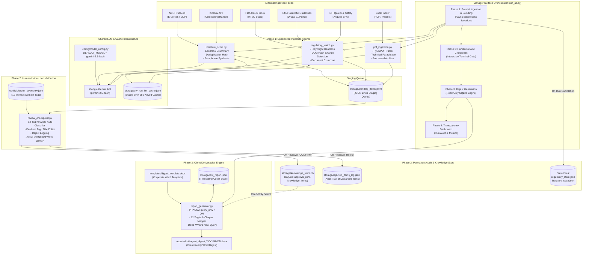
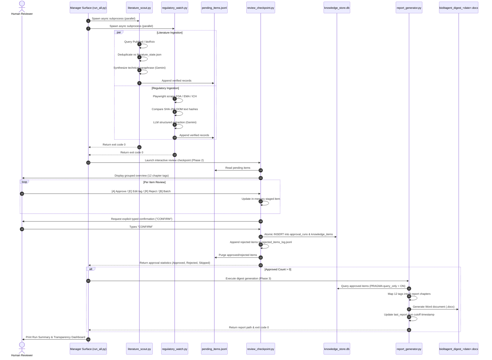

# BioLitAgent: System Topology & Architecture Specification

## 1. High-Level System Architecture

BioLitAgent is an autonomous multi-agent monitoring, human-in-the-loop validation, and report synthesis platform designed for biopharmaceutical bioprocess and protein production intelligence.

---

## 2. End-to-End Pipeline Execution Sequence

---

## 3. Layered Architectural Decomposition

### Layer 1: Ingestion & Surface Intelligence
1. **`agents/literature_scout.py`**:
   - Interfaces: NCBI E-utilities (Esearch, Esummary) via HTTP REST with fallback to MCP server protocol (`mcp_config.json`). BioRxiv REST API.
   - Resilience: Exponential backoff retry loop (`2s`, `4s`, `8s`) for HTTP 429 and 503 errors.
   - Deduplication: Maintains `storage/literature_state.json` containing previously harvested PMIDs and DOIs.
   - Paraphrasing: Generates original, concise 2–3 sentence technical syntheses using `DEFAULT_MODEL` with strict constraints prohibiting verbatim text.
2. **`agents/regulatory_watch.py`**:
   - Interfaces: FDA CBER, EMA, and ICH regulatory index pages.
   - SPA Rendering: Headless Chromium via Playwright for JavaScript SPAs (ICH Angular portal); high-throughput HTTPX for static Drupal/HTML pages (FDA, EMA).
   - Change Detection: SHA-256 text normalization hashing against `storage/regulatory_state.json`.
   - Structured Output: Uses `gemini-2.5-flash` with strict JSON schema definition (`title`, `publication_date`, `url`, `description`, `url_unknown`, `date_unknown`).
3. **`agents/pdf_ingestion.py`**:
   - Interfaces: Local filesystem inbox (`inbox/*.pdf`).
   - Parsing: PyMuPDF / pdfplumber text extraction.
   - Lifecycle: Extracted files are safely archived to `inbox/processed/`.

---

### Layer 2: LLM Engine & Quota Preservation
- **Central Model Configuration (`config/model_config.py`)**:
  - `DEFAULT_MODEL = "gemini-2.5-flash"`.
  - Single source of truth imported by all agents to ensure predictable rate-limits and uniform schema capabilities.
- **Dry-Run Cache (`storage/dry_run_llm_cache.json`)**:
  - Stable SHA-256 keys derived from page content hashes or `query_id:title:source_text`.
  - When `--dry-run` is active, checks cache before invoking external APIs.
  - Zero API calls consumed on repeated validation runs.

---

### Layer 3: Taxonomy & Human-in-the-Loop Gate
- **12-Tag Bioprocess Taxonomy (`config/chapter_taxonomy.json`)**:
  1. `host_expression`
  2. `upstream_process`
  3. `downstream_process`
  4. `analytical_characterization`
  5. `qbd_control_strategy`
  6. `hybrid_modeling`
  7. `gmp_manufacturing`
  8. `facility_aseptic`
  9. `regulatory_cmc`
  10. `microbiome_platform_science`
  11. `capa_rca`
  12. `emerging_topics`
- **Review Checkpoint (`agents/review_checkpoint.py`)**:
  - Keyword classification matches items against taxonomy definitions.
  - Interactive CLI allows reviewers to edit title, description, reviewer notes, and chapter tags before approving.
  - **Irreversible Write Gate**: Disk operations require typing the exact word `CONFIRM`.

---

### Layer 4: Storage & Reporting Engine
- **Permanent Knowledge Store (`storage/knowledge_store.db`)**:
  - `approval_runs`: Audit history tracking session start/finish, duration, items approved, rejected, and skipped.
  - `knowledge_items`: Append-only table (`store_id`, `pending_id` UNIQUE, `run_id`, `source_type`, `chapter_tag`, `title`, `description`, `metadata_json`, `reviewer_note`, `reviewed_at`, `reviewer_action`).
- **Word Report Synthesis (`agents/report_generator.py`)**:
  - SQLite opened in strict read-only mode (`PRAGMA query_only = ON`).
  - Chapter aggregation:
    - **Chapter 1**: Executive Summary — What's New (Time-filtered delta since `storage/last_report.json`).
    - **Chapter 2**: Host, Plasmid & Expression System Development (`host_expression`).
    - **Chapter 3**: Process Development — Upstream & Downstream (`upstream_process`, `downstream_process`).
    - **Chapter 4**: Characterization, QbD & Control Strategy (`analytical_characterization`, `qbd_control_strategy`).
    - **Chapter 5**: Digital Process Tools & Hybrid Modeling (`hybrid_modeling`).
    - **Chapter 6**: GMP, Facility & Quality Systems (`gmp_manufacturing`, `facility_aseptic`).
    - **Chapter 7**: Regulatory, CMC & Platform Science (`regulatory_cmc`, `microbiome_platform_science`).
    - **Chapter 8**: CAPA, Root Cause Analysis & Emerging Topics (`capa_rca`, `emerging_topics`).
  - Output: Formatted `.docx` document based on `templates/digest_template.docx`.
