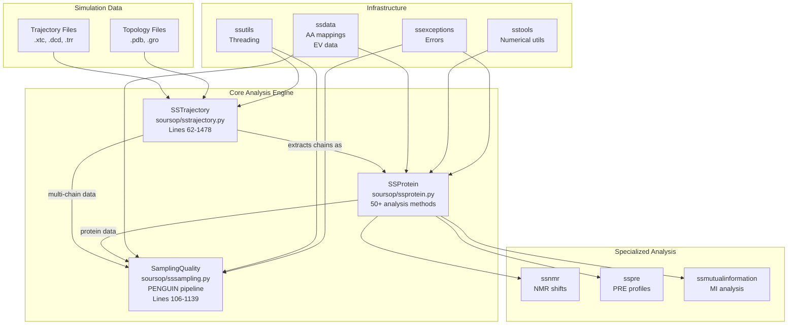
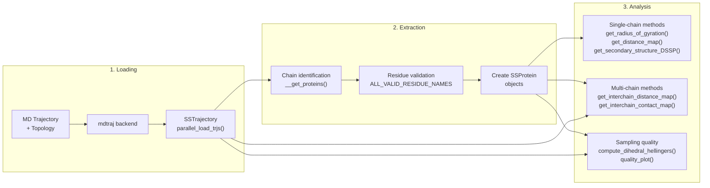
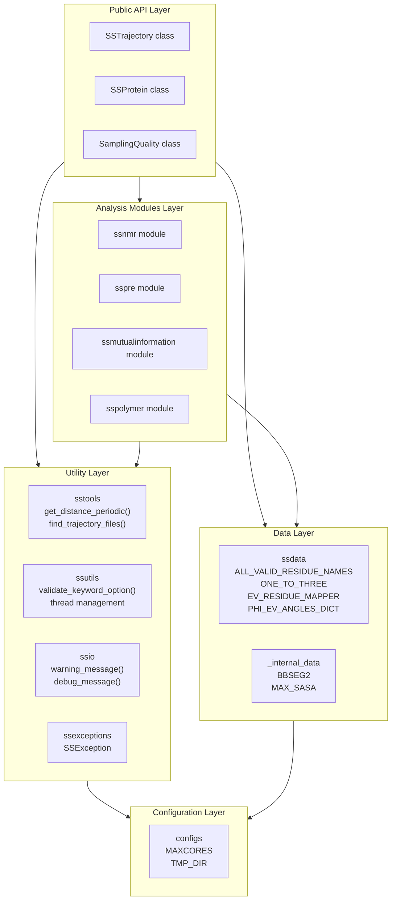

# Overview

Relevant source files

The following files were used as context for generating this wiki page:

- [README.md](README.md)
- [docs/index.rst](docs/index.rst)
- [docs/modules/sssampling.rst](docs/modules/sssampling.rst)
- [soursop/sssampling.py](soursop/sssampling.py)
- [soursop/sstrajectory.py](soursop/sstrajectory.py)
- [soursop/tests/test_sssampling.py](soursop/tests/test_sssampling.py)

## Purpose and Scope

SOURSOP (**S**imulation analysis **O**f **U**nfolded **R**egion**S** **O**f **P**roteins) is a Python package for analyzing all-atom and coarse-grained molecular dynamics simulations of intrinsically disordered proteins (IDPs) and unfolded proteins. Built on top of [mdtraj](http://mdtraj.org/), SOURSOP provides specialized analysis routines that characterize ensembles of disordered proteins through the lens of polymer physics.

This documentation covers the entire SOURSOP system, including:
- Core trajectory loading and analysis classes
- Specialized analysis modules for NMR, PRE, and polymer physics
- The PENGUIN pipeline for assessing conformational sampling quality
- Utility infrastructure and plugin extensibility

For installation instructions, see [Getting Started](#2). For detailed API documentation of individual modules, see the corresponding sections: [SSTrajectory](#3), [SSProtein](#4), [SamplingQuality](#5).

**Sources:** [README.md:1-26](), [docs/index.rst:1-18]()

---

## System Components

SOURSOP is organized around three primary classes that form the core analysis engine:

| Component | Class | Primary Purpose | Key Methods |
|-----------|-------|-----------------|-------------|
| **Trajectory Loading** | `SSTrajectory` | Load simulation trajectories, extract protein chains, multi-chain analysis | `__init__()`, parallel loading, interchain distance/contact maps |
| **Single-Protein Analysis** | `SSProtein` | Analyze individual protein chains with 50+ methods | Rg, end-to-end distance, DSSP, SASA, distance maps, angles |
| **Sampling Quality** | `SamplingQuality` | Assess conformational sampling via PENGUIN methodology | Hellinger distance, dihedral analysis, quality plots |

These core classes are supported by specialized analysis modules and utility infrastructure:

**Specialized Analysis Modules:**
- `ssnmr` - NMR chemical shift prediction with pH/temperature corrections
- `sspre` - Paramagnetic relaxation enhancement (PRE) profile calculation
- `ssmutualinformation` - Mutual information for statistical correlation analysis
- `sspolymer` - Polymer-specific calculations (overlap concentration, scaling)

**Utility Infrastructure:**
- `ssdata` - Amino acid mappings, residue validation, excluded volume data
- `sstools` - Numerical utilities, file discovery, periodic boundary handling
- `ssutils` - Thread control, keyword validation, performance optimization
- `ssio` - User messaging and warnings
- `ssexceptions` - Custom exception handling

**Sources:** [soursop/sstrajectory.py:62-239](), [soursop/sssampling.py:106-234](), [README.md:6-8]()

---

## Core Architecture

The following diagram shows how the three primary classes interact and depend on the supporting infrastructure:

**Sources:** [soursop/sstrajectory.py:62-239](), [soursop/sssampling.py:106-234]()

---

## Data Flow and Analysis Pipeline

SOURSOP processes simulation data through a three-stage pipeline:

**Stage 1 - Loading:** Trajectory files are read using mdtraj's I/O capabilities. The `SSTrajectory` class wraps mdtraj and provides parallel loading via `parallel_load_trjs()` for improved performance with multiple trajectory files.

**Stage 2 - Extraction:** Protein chains are automatically identified by iterating through topology chains and checking residue names against `ALL_VALID_RESIDUE_NAMES` (defined in [soursop/ssdata.py]()). Each chain is extracted as an independent `SSProtein` object stored in `SSTrajectory.proteinTrajectoryList`.

**Stage 3 - Analysis:** Users can perform single-chain analysis (via `SSProtein` methods), multi-chain analysis (via `SSTrajectory` methods), or sampling quality assessment (via `SamplingQuality` class with PENGUIN methodology).

**Sources:** [soursop/sstrajectory.py:62-660](), [soursop/sssampling.py:106-234](), [soursop/ssdata.py]()

---

## Key Capabilities by Analysis Type

SOURSOP provides over 50 analysis methods organized by category:

### Structural Properties
- **Global metrics:** Radius of gyration, end-to-end distance, asphericity, hydrodynamic radius
- **Distance analysis:** Inter-residue distance maps, CA-CA distances, center-of-mass distances
- **Molecular shape:** Polymer scaling exponents, molecular volume calculations

### Secondary Structure
- **Assignment methods:** DSSP (8-state classification), BBSEG (4-state coil-library method)
- **Per-residue fractional helicity:** Time-averaged helical content

### Contact Analysis
- **Contact maps:** Multiple modes (atom, CA, closest, closest-heavy, sidechain, sidechain-heavy)
- **Q-values:** Native contact calculations relative to reference structures
- **Inter-chain contacts:** Cross-chain contact frequency matrices

### Surface Accessibility
- **SASA calculations:** Solvent-accessible surface area using Shrake-Rupley algorithm
- **Regional SASA:** Per-residue, per-region, or full-protein surface area

### Conformational Dynamics
- **Dihedral angles:** Backbone (phi, psi, omega) and sidechain (chi1-chi5) angles
- **Angle distributions:** Statistical analysis of conformational sampling
- **D-vector calculations:** Orientational correlation functions

### Sampling Quality (PENGUIN)
- **Distribution comparison:** Hellinger distance between simulated and reference distributions
- **Dihedral analysis:** 1D and 2D phi/psi angle distribution comparisons
- **Reference models:** Excluded volume (EV) polymer model or custom reference ensembles

**Sources:** [soursop/ssprotein.py](), [soursop/sssampling.py:106-1139]()

---

## Module Organization

The codebase is organized into functional layers:

**File Structure:**

| Module | File Path | Primary Contents |
|--------|-----------|------------------|
| Core Classes | `soursop/sstrajectory.py` | `SSTrajectory`, `parallel_load_trjs()` |
| | `soursop/ssprotein.py` | `SSProtein` (2000+ lines, 50+ methods) |
| | `soursop/sssampling.py` | `SamplingQuality`, `PrecomputedDihedralInterface` |
| Specialized | `soursop/ssnmr.py` | NMR chemical shift prediction |
| | `soursop/sspre.py` | `SSPRE` class for PRE calculations |
| | `soursop/ssmutualinformation.py` | Mutual information functions |
| | `soursop/sspolymer.py` | Polymer physics utilities |
| Data | `soursop/ssdata.py` | Amino acid data, EV angle distributions |
| | `soursop/_internal_data.py` | BBSEG parameters, SASA values |
| Utilities | `soursop/sstools.py` | Numerical and file utilities |
| | `soursop/ssutils.py` | Threading, validation |
| | `soursop/ssio.py` | Messaging functions |
| | `soursop/ssexceptions.py` | Custom exceptions |
| | `soursop/configs.py` | Global configuration |

**Sources:** [soursop/sstrajectory.py:1-30](), [soursop/sssampling.py:1-34](), [soursop/ssdata.py]()

---

## Extension System

SOURSOP supports custom analysis plugins located in `soursop/plugins/`. Plugins can access core `SSProtein` and `SSTrajectory` objects to perform domain-specific analyses. For details on creating plugins, see [Plugin Extension System](#8).

**Sources:** [README.md:52-54]()

---

## Dependencies and Backend

SOURSOP builds on the following core dependencies:

| Package | Version Requirement | Purpose |
|---------|---------------------|---------|
| mdtraj | 1.9.5-1.9.7 | Trajectory I/O and topology handling |
| numpy | ≥1.20.0 | Numerical computing |
| scipy | ≥1.5.0 | Scientific algorithms (Hellinger distance, etc.) |
| pandas | ≥0.23.0 | Data structure management |
| matplotlib | — | Visualization (quality plots) |

The mdtraj backend handles trajectory reading for all common formats (.xtc, .dcd, .trr, .nc) and provides the underlying topology representation. SOURSOP wraps mdtraj objects with higher-level abstractions (`SSTrajectory`, `SSProtein`) that provide IDP-specific analysis methods while maintaining full access to the underlying mdtraj functionality via the `.traj` attribute.

**Sources:** [README.md:7](), [docs/index.rst:15](), [soursop/sstrajectory.py:14]()

---

## Version History

SOURSOP was formerly known as CAMPARITraj (through version 0.1.9). The rename occurred in July 2021 to decouple the package from CAMPARI and emphasize its general applicability to IDP simulations from any source. The current stable release is 0.2.6 (November 2024), which includes:

- Explicit support for single-chain one-bead-per-residue trajectory loading (~30x speedup)
- Official inclusion of the `SamplingQuality` class and PENGUIN methodology
- Migration to `pyproject.toml` for modern packaging
- Support for NH3 and FOR residue types

**Breaking change note:** The transition from CAMPARITraj to SOURSOP (version 0.2.0) introduced API changes that are not backwards compatible. For migration guidance, see [Breaking Changes and Migration](#10.1).

**Sources:** [README.md:33-80](), [docs/index.rst:33-65]()

---