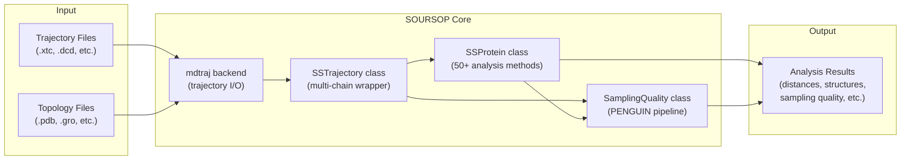
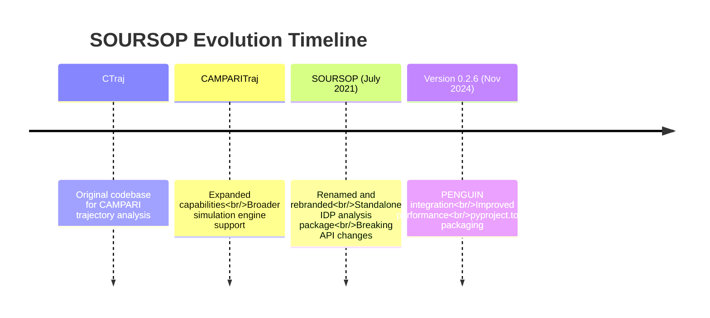

# What is SOURSOP?

<details>
<summary>Relevant source files</summary>

The following files were used as context for generating this wiki page:

- [README.md](README.md)
- [docs/index.rst](docs/index.rst)
- [docs/modules/sssampling.rst](docs/modules/sssampling.rst)

</details>


**Purpose and Scope**: This page introduces SOURSOP, explaining its focus on analyzing simulations of intrinsically disordered proteins (IDPs), its evolution from CAMPARITraj, and its core capabilities. For detailed system architecture and component interactions, see [System Architecture](#1.2). For installation and first steps, see [Getting Started](#2).

## Overview

**SOURSOP** (**S**imulation analysis **O**f **U**nfolded **R**egion**S** **O**f **P**roteins) is a Python package for analyzing molecular dynamics trajectories of intrinsically disordered and unfolded proteins. Built on top of `mdtraj` for trajectory I/O, SOURSOP provides analysis routines specifically designed for characterizing disordered protein ensembles through the lens of polymer physics.



**Diagram: SOURSOP Data Flow from Input Files to Analysis Results**

SOURSOP is maintained by the Holehouse Lab and was developed by Jared Lalmansingh and Alex Holehouse. The current stable release is version 0.2.6 (November 2024).

**Sources**: [README.md:1-11](), [docs/index.rst:6-16]()

## Evolution from CAMPARITraj

SOURSOP was renamed from **CAMPARITraj** in July 2021, which itself evolved from **CTraj**. The rename served two purposes:

1. **Decoupling from CAMPARI**: While originally built for analyzing CAMPARI simulations, SOURSOP has evolved into a standalone package that works with trajectories from any simulation engine (GROMACS, NAMD, OpenMM, etc.). The rename avoids implying that CAMPARI cannot perform its own analyses or that this package only works with CAMPARI trajectories.

2. **Laboratory naming tradition**: Following the Pappu lab tradition of naming software after beverages (CAMPARI, ABSINTH, CIDER, LASSI), SOURSOP continues this theme with a Caribbean twist.



**Diagram: Evolution of SOURSOP from CTraj through CAMPARITraj**

**Note**: The transition from CAMPARITraj to SOURSOP introduced breaking API changes. For migration guidance, see [Breaking Changes and Migration](#10.1).

**Sources**: [README.md:66-73](), [docs/index.rst:11]()

## Analysis Focus: Intrinsically Disordered Proteins

Intrinsically disordered proteins (IDPs) and intrinsically disordered regions (IDRs) lack stable three-dimensional structures and instead exist as dynamic conformational ensembles. Analyzing these systems requires specialized tools that differ fundamentally from folded protein analysis:

| **Folded Protein Analysis** | **Disordered Protein Analysis (SOURSOP)** |
|------------------------------|-------------------------------------------|
| Single native structure | Ensemble of conformations |
| RMSD to crystal structure | Polymer scaling exponents |
| Active site geometry | End-to-end distance distributions |
| Secondary structure content | Dihedral angle distributions |
| Binding pocket characterization | Radius of gyration fluctuations |
| | Conformational sampling quality |
| | Inter-residue contact probability |

SOURSOP provides analysis routines that are specifically relevant for IDPs but may not be useful for folded proteins. These include:

- **Polymer physics metrics**: Radius of gyration, end-to-end distance, polymer scaling analysis
- **Conformational heterogeneity**: Distance map distributions, internal scaling profiles
- **Sampling quality assessment**: PENGUIN pipeline for evaluating simulation convergence
- **Ensemble properties**: Time-averaged structural properties across disordered ensembles

**Sources**: [docs/index.rst:11-16]()

## Core Components and Capabilities

SOURSOP's functionality is organized around three primary classes and several specialized modules:

```mermaid
graph TB
    subgraph "Core Analysis Classes"
        SST["SSTrajectory<br/>(sstrajectory.py)"]
        SSP["SSProtein<br/>(ssprotein.py)"]
        SampQual["SamplingQuality<br/>(sssampling.py)"]
    end
    
    subgraph "Trajectory Loading"
        ParLoad["parallel_load_trjs()<br/>Concurrent loading"]
        ResCheck["Residue validation<br/>ssdata.ALL_VALID_RESIDUE_NAMES"]
        ChainExt["Chain extraction<br/>get_multiple_protein_objs()"]
    end
    
    subgraph "Single-Chain Analysis (50+ methods)"
        Distance["Distance calculations<br/>get_distance_map()<br/>get_inter_residue_distances()"]
        Global["Global properties<br/>get_radius_of_gyration()<br/>get_end_to_end()"]
        SecStruct["Secondary structure<br/>get_secondary_structure_DSSP()<br/>get_secondary_structure_BBSEG()"]
        Contacts["Contact maps<br/>get_contact_map()"]
        SASA["Surface accessibility<br/>get_SASA()"]
        Angles["Dihedral angles<br/>get_all_BBSEG_angles()"]
    end
    
    subgraph "Multi-Chain Analysis"
        InterDist["Interchain distances<br/>get_interchain_distance_map()"]
        InterCont["Interchain contacts<br/>get_interchain_contact_map()"]
    end
    
    subgraph "Sampling Quality (PENGUIN)"
        DihedPDF["Dihedral PDFs<br/>compute_pdf()"]
        Hellinger["Hellinger distance<br/>compute_dihedral_hellingers()"]
        FracHel["Fractional helicity<br/>compute_frac_helicity()"]
        QPlot["Quality visualization<br/>quality_plot()"]
    end
    
    subgraph "Specialized Modules"
        NMR["ssnmr<br/>Chemical shift prediction"]
        PRE["sspre<br/>PRE profile calculation"]
        MI["ssmutualinformation<br/>Statistical correlation"]
        Polymer["sspolymer<br/>Overlap concentration"]
    end
    
    SST --> ParLoad
    SST --> ResCheck
    SST --> ChainExt
    ChainExt --> SSP
    
    SSP --> Distance
    SSP --> Global
    SSP --> SecStruct
    SSP --> Contacts
    SSP --> SASA
    SSP --> Angles
    
    SST --> InterDist
    SST --> InterCont
    
    SSP --> SampQual
    SampQual --> DihedPDF
    SampQual --> Hellinger
    SampQual --> FracHel
    SampQual --> QPlot
    
    SSP --> NMR
    SSP --> PRE
    SSP --> MI
    SSP --> Polymer
```



**Diagram: SOURSOP Component Architecture Mapping Natural Language to Code Entities**

### SSTrajectory: Trajectory Loading and Multi-Chain Analysis

The `SSTrajectory` class [soursop/sstrajectory.py]() provides:
- **Parallel trajectory loading** via `parallel_load_trjs()` for improved performance (30x speedup for coarse-grained systems in v0.2.6)
- **Multi-chain system handling** with automatic chain extraction
- **Residue validation** against `ALL_VALID_RESIDUE_NAMES` from [soursop/ssdata.py]()
- **Interchain analysis methods** such as `get_interchain_distance_map()` and `get_interchain_contact_map()`

See [SSTrajectory: Loading and Multi-Chain Analysis](#3) for complete documentation.

### SSProtein: Single Protein Analysis

The `SSProtein` class [soursop/ssprotein.py]() is the primary analysis workhorse with 50+ methods organized into categories:

| **Category** | **Example Methods** | **Purpose** |
|--------------|---------------------|-------------|
| Distance calculations | `get_distance_map()`<br/>`get_inter_residue_distances()` | Compute spatial relationships between residues |
| Global properties | `get_radius_of_gyration()`<br/>`get_end_to_end()`<br/>`get_asphericity()` | Characterize overall chain dimensions |
| Secondary structure | `get_secondary_structure_DSSP()`<br/>`get_secondary_structure_BBSEG()` | Assign and analyze structural elements |
| Contact analysis | `get_contact_map()`<br/>`get_local_to_global_correlation()` | Identify residue-residue contacts |
| Surface properties | `get_SASA()`<br/>`get_regional_SASA()` | Solvent accessibility calculations |
| Angles and dynamics | `get_all_BBSEG_angles()`<br/>`get_phi_psi_angles()` | Dihedral angle analysis |

See [SSProtein: Single Protein Analysis](#4) for complete method documentation.

### SamplingQuality: PENGUIN Pipeline

The `SamplingQuality` class [soursop/sssampling.py]() implements **PENGUIN** (**P**ipeline for **E**valuating co**N**formational hetero**G**eneity in **U**nstructured prote**IN**s), which assesses whether simulations have adequately sampled the conformational space:

- `compute_pdf()`: Compute probability density functions for dihedral angles
- `compute_dihedral_hellingers()`: Calculate Hellinger distances between distributions
- `compute_frac_helicity()`: Measure fractional helicity across trajectories
- `quality_plot()`: Generate visualization of sampling quality metrics

PENGUIN compares simulation dihedral distributions against reference excluded volume (EV) models stored in [soursop/ssdata.py]() via the `PrecomputedDihedralInterface` class.

See [SamplingQuality: PENGUIN Pipeline](#5) for detailed methodology.

### Specialized Analysis Modules

SOURSOP includes domain-specific modules:

- **`ssnmr`** [soursop/ssnmr.py](): NMR random coil chemical shift prediction with pH and temperature corrections
- **`sspre`** [soursop/sspre.py](): Paramagnetic relaxation enhancement (PRE) profile calculations via the `SSPRE` class
- **`ssmutualinformation`** [soursop/ssmutualinformation.py](): Statistical correlation analysis between residue pairs
- **`sspolymer`** [soursop/sspolymer.py](): Polymer-specific calculations including overlap concentration

See [Specialized Analysis Modules](#6) for complete documentation.

**Sources**: [README.md:7-8](), [docs/index.rst:11-16](), [docs/modules/sssampling.rst:5-6]()

## Supported Simulation Engines and File Formats

SOURSOP uses `mdtraj` as its trajectory I/O backend, which supports multiple file formats:

| **Format** | **Extension** | **Typical Source** |
|------------|---------------|-------------------|
| XTC | `.xtc` | GROMACS |
| DCD | `.dcd` | CHARMM, NAMD, OpenMM |
| TRR | `.trr` | GROMACS |
| HDF5 | `.h5` | MDTraj native |
| NetCDF | `.nc` | AMBER |
| PDB | `.pdb` | Universal topology |
| GRO | `.gro` | GROMACS topology |

SOURSOP has been tested with trajectories from:
- **CAMPARI** (coarse-grained and all-atom)
- **GROMACS** (all-atom and coarse-grained)
- **NAMD** (all-atom)
- **OpenMM** (all-atom)
- Other engines producing standard trajectory formats

**Sources**: [docs/index.rst:15-16]()

## Key Features and Improvements

Recent major updates include:

| **Version** | **Key Features** |
|-------------|------------------|
| **0.2.6** (Nov 2024) | - Official PENGUIN integration<br/>- 30x faster single-chain coarse-grained loading<br/>- `pyproject.toml` packaging<br/>- NH3 and FOR residue support |
| **0.2.5** (Feb 2024) | - Removed inconsistent PBC flags for intramolecular analysis<br/>- Added `return_instantaneous_maps` for conformer-specific distance maps |
| **0.2.1** (Jul 2022) | - Standardized COM distances to Angstroms (breaking change) |
| **0.1.9** (Apr 2022) | - Extensive documentation expansion |

**Sources**: [README.md:34-77](), [docs/index.rst:33-66]()

## Installation and Next Steps

SOURSOP is available via PyPI:

```bash
pip install soursop
```

For detailed installation instructions including conda environment setup, see [Installation](#2.1). For your first analysis, see [Quick Start](#2.3).

**Sources**: [README.md:1-12](), [docs/index.rst:1-32]()

---