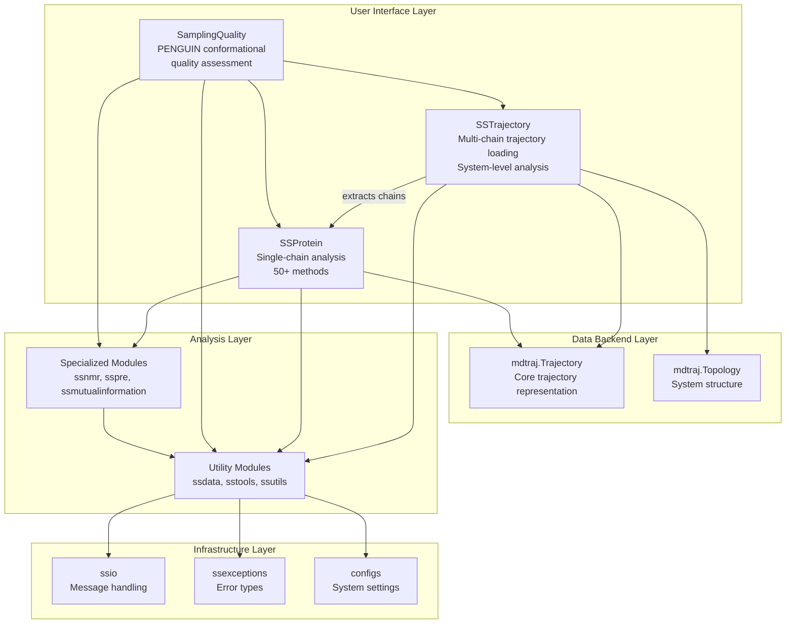
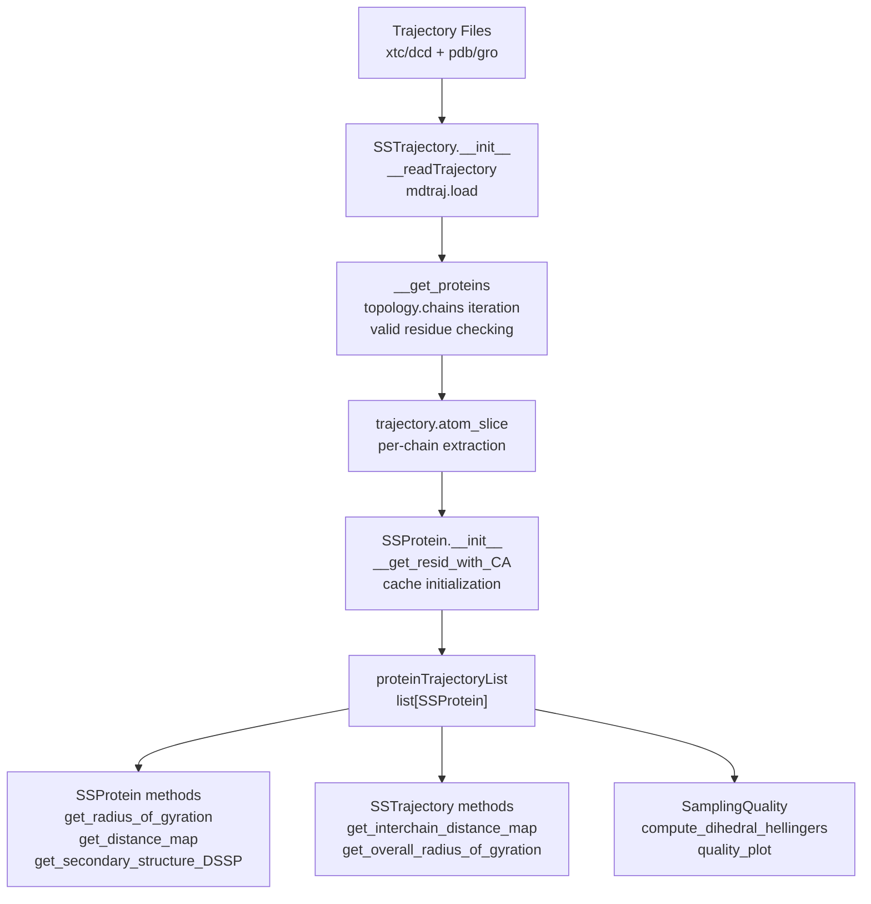
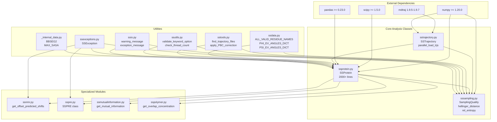
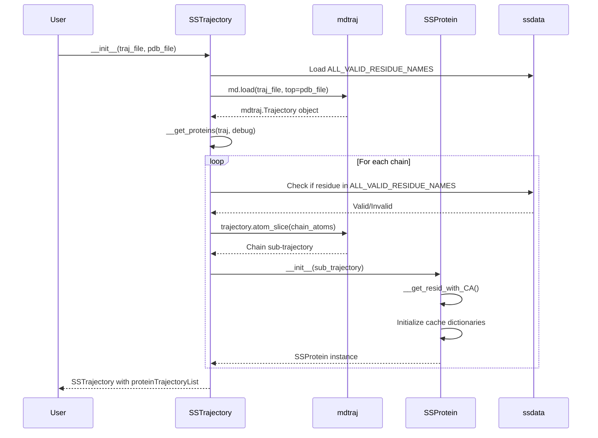
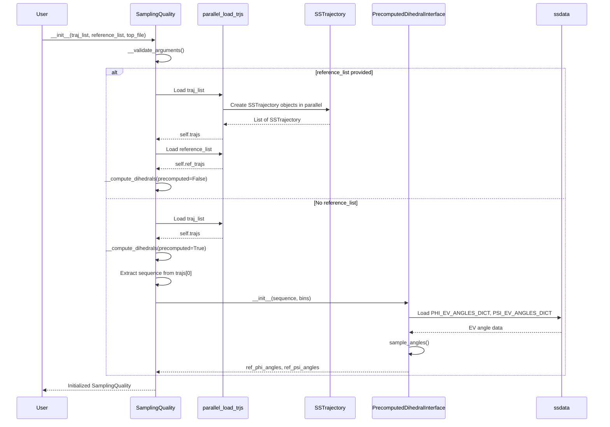

# System Architecture

<details>
<summary>Relevant source files</summary>

The following files were used as context for generating this wiki page:

- [README.md](README.md)
- [docs/index.rst](docs/index.rst)
- [docs/modules/sssampling.rst](docs/modules/sssampling.rst)
- [soursop/ssprotein.py](soursop/ssprotein.py)
- [soursop/sssampling.py](soursop/sssampling.py)
- [soursop/sstrajectory.py](soursop/sstrajectory.py)
- [soursop/tests/test_sssampling.py](soursop/tests/test_sssampling.py)

</details>


## Purpose and Scope

This document describes the overall system architecture of SOURSOP, including the design philosophy, core components, and how they interact. It covers the three primary classes (`SSTrajectory`, `SSProtein`, `SamplingQuality`), the data flow pipeline, supporting utilities, and the layered module structure.

For detailed API documentation of individual classes, see:
- [SSTrajectory: Loading and Multi-Chain Analysis](#3)
- [SSProtein: Single Protein Analysis](#4)
- [SamplingQuality: PENGUIN Pipeline](#5)

For information about extending SOURSOP, see [Plugin Extension System](#8).

## Core Architecture Overview

SOURSOP is built as a three-layer system with a clear separation of concerns:



**Sources:** [soursop/sstrajectory.py:62-661](), [soursop/ssprotein.py:41-2506](), [soursop/sssampling.py:106-1200]()

## Core Classes

### SSTrajectory: Multi-Chain Trajectory Loading

`SSTrajectory` is the entry point for loading simulation data. It wraps `mdtraj.Trajectory` and provides protein-specific functionality.

| Property | Type | Description |
|----------|------|-------------|
| `traj` | `mdtraj.Trajectory` | Underlying trajectory object |
| `proteinTrajectoryList` | `list[SSProtein]` | List of extracted protein chains |
| `n_frames` | `int` | Number of trajectory frames |
| `n_proteins` | `int` | Number of protein chains detected |
| `unitcell` | `np.ndarray` | Unit cell dimensions (Angstroms) |

**Key Initialization Parameters:**
- `trajectory_filename`: Path to trajectory file (`.xtc`, `.dcd`)
- `pdb_filename`: Topology file (`.pdb`, `.gro`)
- `protein_grouping`: Manual residue grouping (optional)
- `explicit_residue_checking`: Validate each residue individually

**Automatic Protein Extraction:**
The class automatically identifies protein chains by scanning the topology for valid residue names defined in `ALL_VALID_RESIDUE_NAMES` from `ssdata`. Chain extraction occurs in `__get_proteins()` [soursop/sstrajectory.py:439-559](), which cycles through each chain and creates `SSProtein` objects via atom slicing.

**Sources:** [soursop/sstrajectory.py:62-243](), [soursop/ssdata.py:1-50]()

### SSProtein: Single Protein Analysis

`SSProtein` represents a single protein chain and provides over 50 analysis methods. Each method operates on the chain's trajectory frames.

| Property | Type | Description |
|----------|------|-------------|
| `traj` | `mdtraj.Trajectory` | Single-chain trajectory |
| `topology` | `mdtraj.Topology` | Chain topology |
| `n_frames` | `int` | Number of frames |
| `n_residues` | `int` | Number of residues (including caps) |
| `resid_with_CA` | `list[int]` | Residues with CA atoms |
| `ncap` | `bool` | N-terminal cap present |
| `ccap` | `bool` | C-terminal cap present |

**Caching and Performance:**
The class implements aggressive memoization through private dictionaries (`__CA_residue_atom`, `__residue_atom_table`, `__SASA_saved`, `__all_angles`) to avoid expensive topology lookups. The `__residue_atom_lookup()` method [soursop/ssprotein.py:684-749]() converts O(n) topology selections to O(1) dictionary lookups after first access.

**Coarse-Grained Optimization:**
For one-bead-per-residue systems, `__check_cg_onebead()` [soursop/ssprotein.py:531-547]() detects this and triggers fast initialization via `__initialize_cg_atoms()` [soursop/ssprotein.py:665-679](), providing ~30x speedup.

**Sources:** [soursop/ssprotein.py:41-218](), [soursop/ssprotein.py:531-679]()

### SamplingQuality: PENGUIN Pipeline

`SamplingQuality` implements the PENGUIN (Pipeline for Evaluating coNformational heteroGeneity in Unstructured proteINs) methodology for assessing conformational sampling quality.

| Attribute | Type | Description |
|-----------|------|-------------|
| `trajs` | `list[SSTrajectory]` | Simulated trajectories |
| `ref_trajs` | `list[SSTrajectory]` | Reference trajectories (or None) |
| `psi_angles` | `np.ndarray` | Psi dihedral angles |
| `phi_angles` | `np.ndarray` | Phi dihedral angles |
| `method` | `str` | `"1D angle distributions"` or `"2D angle distributions"` |
| `bwidth` | `float` | Histogram bin width (radians) |

**Parallel Loading:**
Trajectories are loaded in parallel using `parallel_load_trjs()` [soursop/sstrajectory.py:1382-1413]() unless `force_sequential=True`. The `n_cpus` parameter controls parallelization.

**Reference Models:**
When `reference_list=None`, precomputed excluded volume (EV) dihedral distributions are loaded via `PrecomputedDihedralInterface` [soursop/sssampling.py:1203-1339](). These EV angle distributions are stored in `PHI_EV_ANGLES_DICT` and `PSI_EV_ANGLES_DICT` from `ssdata`.

**Sources:** [soursop/sssampling.py:106-234](), [soursop/ssdata.py:300-450]()

## Data Flow Pipeline



**Loading Phase** [soursop/sstrajectory.py:283-364](): `mdtraj.load()` reads trajectory and topology files. Optional `pdblead=True` prepends the PDB structure as the first frame.

**Parsing Phase** [soursop/sstrajectory.py:439-559](): For each chain in `topology.chains`, the first residue name is checked against `ALL_VALID_RESIDUE_NAMES`. If `explicit_residue_checking=True`, every residue is validated individually [soursop/sstrajectory.py:498-511]().

**Extraction Phase**: `trajectory.atom_slice()` creates per-chain sub-trajectories. Each is wrapped in an `SSProtein` object which initializes CA atom lookup via `__get_resid_with_CA()` [soursop/ssprotein.py:613-663]().

**Analysis Phase**: Users access methods on `SSProtein` objects for single-chain analysis or `SSTrajectory` methods for multi-chain analysis.

**Sources:** [soursop/sstrajectory.py:67-243](), [soursop/sstrajectory.py:439-559](), [soursop/ssprotein.py:59-171]()

## Supporting Modules

### Data and Constants (ssdata)

Provides amino acid mappings, residue validation lists, and precomputed reference data.

| Symbol | Type | Purpose |
|--------|------|---------|
| `ALL_VALID_RESIDUE_NAMES` | `list[str]` | Residues recognized as protein |
| `THREE_TO_ONE` | `dict` | 3-letter to 1-letter AA codes |
| `ONE_TO_THREE` | `dict` | 1-letter to 3-letter AA codes |
| `PHI_EV_ANGLES_DICT` | `dict` | Precomputed phi angles for EV model |
| `PSI_EV_ANGLES_DICT` | `dict` | Precomputed psi angles for EV model |
| `EV_RESIDUE_MAPPER` | `dict` | Maps residues to EV parameters |

**Sources:** [soursop/ssdata.py:1-450]()

### Numerical Utilities (sstools)

Helper functions for numerical operations and file discovery.

| Function | Purpose |
|----------|---------|
| `find_trajectory_files()` | Discover trajectory/topology pairs in directories |
| `apply_PBC_correction()` | Periodic boundary condition correction |
| `angle_mean()` | Circular mean for angular data |
| `angle_std()` | Circular standard deviation |

**Sources:** [soursop/sstools.py:1-300]()

### Thread Control (ssutils)

Functions for parallel execution and keyword validation.

| Function | Purpose |
|----------|---------|
| `validate_keyword_option()` | Validate keyword arguments against allowed values |
| `check_thread_count()` | Ensure thread count is reasonable |
| `get_cores()` | Determine available CPU cores |

Used extensively in `SamplingQuality.__validate_arguments()` [soursop/sssampling.py:235-253]() to ensure valid parameters.

**Sources:** [soursop/ssutils.py:1-150]()

### Error Handling

| Module | Components | Purpose |
|--------|-----------|---------|
| `ssexceptions` | `SSException` class | Custom exception type |
| `ssio` | `warning_message()`, `exception_message()`, `debug_message()` | Formatted user messages |

**Sources:** [soursop/ssexceptions.py:1-50](), [soursop/ssio.py:1-100]()

## Module Dependency Architecture



**Dependency Notes:**

1. **External Layer**: Core scientific Python libraries (mdtraj, numpy, scipy, pandas) provide trajectory I/O and numerical computation.

2. **Core Layer**: The three main classes have minimal inter-dependencies. `SSTrajectory` creates `SSProtein` objects. `SamplingQuality` consumes both but doesn't inherit from either.

3. **Utilities Layer**: All core and specialized modules depend on utilities for validation (`ssutils`), data lookups (`ssdata`), and error handling (`ssexceptions`, `ssio`).

4. **Lazy Loading**: `SSTrajectory` uses the `@lazy_loading_single_protein_trajectory` decorator [soursop/sstrajectory.py:34-58]() to defer full protein trajectory construction until needed by methods like `get_overall_radius_of_gyration()` [soursop/sstrajectory.py:665-689]().

**Sources:** [soursop/sstrajectory.py:1-30](), [soursop/ssprotein.py:1-30](), [soursop/sssampling.py:1-34]()

## Initialization and Object Lifecycle

### SSTrajectory Initialization Sequence



**Key Steps:**

1. **File Loading** [soursop/sstrajectory.py:283-364](): `mdtraj.load()` creates the base trajectory object.

2. **Residue Validation** [soursop/sstrajectory.py:481-493](): Each chain's first residue is checked against `ALL_VALID_RESIDUE_NAMES` (or all residues if `explicit_residue_checking=True`).

3. **Atom Slicing** [soursop/sstrajectory.py:534-544](): Valid chains are extracted via `trajectory.atom_slice()`.

4. **SSProtein Creation** [soursop/ssprotein.py:59-171](): Each chain becomes an `SSProtein`. The expensive `__get_resid_with_CA()` operation identifies CA atoms.

5. **Storage**: `SSProtein` objects are stored in `proteinTrajectoryList` [soursop/sstrajectory.py:553]().

**Sources:** [soursop/sstrajectory.py:67-243](), [soursop/sstrajectory.py:439-559](), [soursop/ssprotein.py:59-171]()

### SamplingQuality Initialization Sequence



**Sources:** [soursop/sssampling.py:106-234](), [soursop/sssampling.py:1203-1339](), [soursop/sstrajectory.py:1382-1413]()

## Extension Mechanisms

### Plugin System

SOURSOP supports custom analysis plugins in `soursop/plugins/` directory. Plugins can access core `SSProtein` and `SSTrajectory` objects.

**Example Structure:**
```
soursop/
└── plugins/
    ├── __init__.py
    └── sparrow_plugin.py
```

Plugins can define standalone functions or classes that operate on `SSProtein` objects. See [Plugin Extension System](#8) for details.

**Sources:** [soursop/plugins/sparrow_plugin.py:1-100]()

### Custom SSProtein Methods

Users can extend `SSProtein` by accessing the underlying `traj` and `topology` attributes, which are standard `mdtraj` objects. Custom analyses can leverage the caching infrastructure by using `__residue_atom_lookup()` patterns.

**Sources:** [soursop/ssprotein.py:684-749]()

## Performance Considerations

### Caching Strategy

`SSProtein` caches expensive operations in private dictionaries:

- `__CA_residue_atom`: CA atom indices per residue
- `__residue_atom_table`: General atom lookups per residue
- `__residue_COM`: Center-of-mass calculations
- `__SASA_saved`: Solvent-accessible surface area
- `__all_angles`: Dihedral angle calculations

Cache can be manually cleared with `reset_cache()` [soursop/ssprotein.py:176-218]().

**Sources:** [soursop/ssprotein.py:136-147]()

### Coarse-Grained Optimization

For one-bead-per-residue systems, `__check_cg_onebead()` [soursop/ssprotein.py:531-547]() detects when `n_atoms == n_residues`. This triggers `__initialize_cg_atoms()` [soursop/ssprotein.py:665-679]() which pre-populates `__residue_atom_table` for all residues in a single pass, achieving ~30x initialization speedup.

**Sources:** [soursop/ssprotein.py:149-153](), [soursop/ssprotein.py:531-679]()

### Parallel Loading

`parallel_load_trjs()` [soursop/sstrajectory.py:1382-1413]() uses Python's `multiprocessing.Pool` to load multiple trajectories concurrently. The `n_procs` parameter controls parallelization (defaults to `os.cpu_count()`).

**Sources:** [soursop/sstrajectory.py:1382-1413]()

---