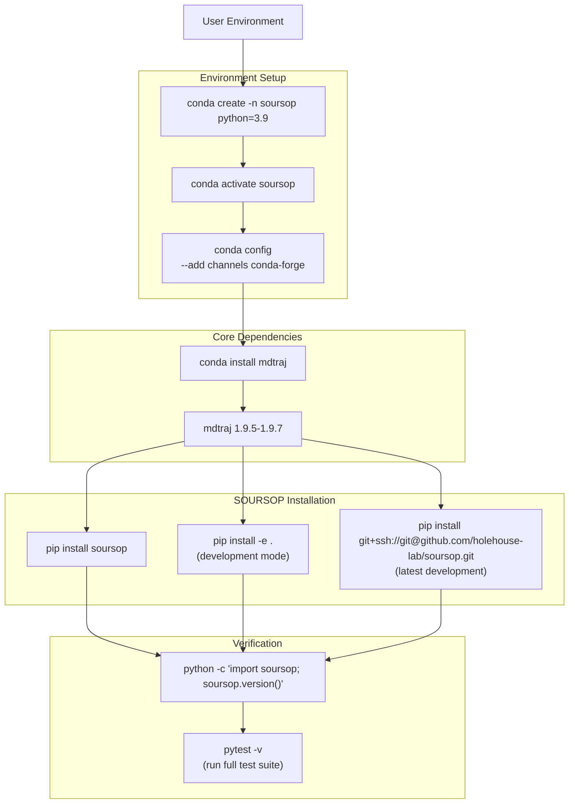
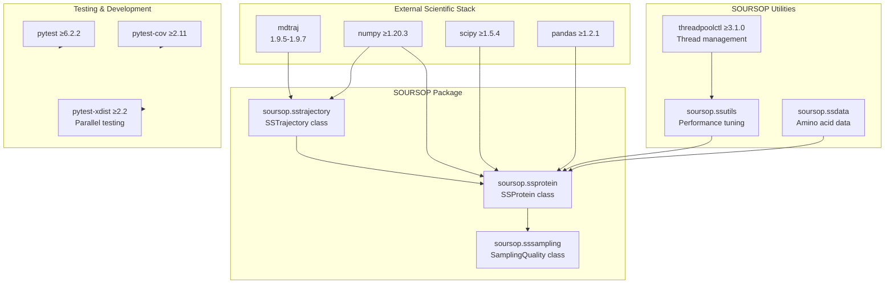
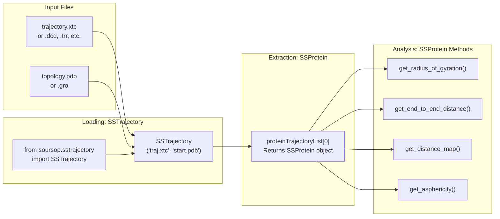

# Getting Started

<details>
<summary>Relevant source files</summary>

The following files were used as context for generating this wiki page:

- [.gitattributes](.gitattributes)
- [anaconda_requirements.txt](anaconda_requirements.txt)
- [docs/modules/ssnmr.rst](docs/modules/ssnmr.rst)
- [docs/modules/ssprotein.rst](docs/modules/ssprotein.rst)
- [docs/usage/installation.rst](docs/usage/installation.rst)
- [docs/usage/overview.rst](docs/usage/overview.rst)
- [requirements.txt](requirements.txt)

</details>


This section provides a practical guide to installing SOURSOP, understanding its dependencies, and running your first analysis. The goal is to get you from zero to analyzing disordered protein trajectories as quickly as possible.

For detailed installation procedures, see [Installation](#2.1). For comprehensive dependency information, see [Dependencies](#2.2). For more extensive usage examples, see [Quick Start](#2.3).

## Overview of SOURSOP Setup

SOURSOP is a Python package built on top of `mdtraj` for analyzing molecular dynamics trajectories of intrinsically disordered proteins. The installation process involves three main steps: setting up a compatible Python environment, installing the core trajectory I/O dependency (`mdtraj`), and installing SOURSOP itself via `pip`.



**Installation Workflow with Actual Commands**

Sources: [docs/usage/installation.rst:1-66](), [requirements.txt:1-14](), [anaconda_requirements.txt:1-16]()

## Dependency Landscape

SOURSOP has a clear dependency hierarchy. The core trajectory reading is handled by `mdtraj`, which itself depends on fundamental scientific computing libraries. Understanding this structure helps when troubleshooting installation issues.

| Dependency | Version Requirement | Purpose | Installation Method |
|------------|---------------------|---------|---------------------|
| `mdtraj` | 1.9.5 (pip) or 1.9.7 (conda) | Trajectory I/O and molecular topology | `conda install mdtraj` |
| `numpy` | ≥1.20.3 (pip) or latest (conda) | Numerical array operations | Installed with `mdtraj` |
| `scipy` | ≥1.5.4 (pip) or latest (conda) | Scientific algorithms | Installed with `mdtraj` |
| `pandas` | ≥1.2.1 (pip) or latest (conda) | Data structures | Installed with `mdtraj` |
| `threadpoolctl` | ≥3.1.0 | Thread pool management | Auto-installed with SOURSOP |
| `pytest` | ≥6.2.2 | Testing framework | Optional (for verification) |

**Pip vs. Conda Dependencies**: The `mdtraj` version differs between installation methods. Conda installs version 1.9.7, while pip installs 1.9.5. This is by design and both versions are fully supported. Conda environments generally provide better dependency resolution for scientific computing packages.

Sources: [requirements.txt:1-14](), [anaconda_requirements.txt:1-16](), [docs/usage/installation.rst:89-106]()



**Dependency Graph with Package Names and Version Requirements**

Sources: [requirements.txt:1-14](), [anaconda_requirements.txt:1-16](), [docs/usage/installation.rst:89-106]()

## Recommended Installation Path

The recommended approach is to use `conda` to manage the Python environment and scientific computing dependencies, followed by `pip` to install SOURSOP. This approach provides the best compatibility and dependency resolution.

**Step-by-Step Installation:**

```bash
# 1. Create isolated conda environment
conda create -n soursop python=3.9

# 2. Activate the environment
conda activate soursop

# 3. Configure conda-forge channel (for mdtraj)
conda config --add channels conda-forge
conda config --set channel_priority strict

# 4. Install mdtraj via conda
conda install mdtraj

# 5. Install SOURSOP via pip
pip install soursop

# 6. Verify installation
python -c "import soursop; soursop.version()"
```

The verification command should print the installed version number without errors.

Sources: [docs/usage/installation.rst:7-36]()

## Alternative Installation Methods

### Development Installation

For contributors or users who want to modify SOURSOP's code:

```bash
# Clone the repository
git clone git@github.com:holehouse-lab/soursop.git
cd soursop

# Install in editable mode (requires mdtraj already installed)
pip install -e .
```

The `-e` flag creates a live link to the source code, so any modifications are immediately reflected when importing `soursop`.

### Latest Development Version

To install the current development branch without cloning:

```bash
pip install git+ssh://git@github.com/holehouselab/soursop.git
```

This assumes `mdtraj` is already installed in your environment.

Sources: [docs/usage/installation.rst:40-66]()

## Minimal Working Example

Once installed, the basic workflow involves three core classes from SOURSOP:



**Basic Analysis Workflow Using Core SOURSOP Classes**

Sources: [docs/usage/overview.rst:1-38](), [docs/modules/ssprotein.rst:9-23]()

**Example Code:**

```python
from soursop.sstrajectory import SSTrajectory
import numpy as np

# Load trajectory (SSTrajectory class)
TrajOb = SSTrajectory('traj.xtc', 'start.pdb')

# Extract first protein chain (returns SSProtein object)
ProtObj = TrajOb.proteinTrajectoryList[0]

# Compute ensemble properties using SSProtein methods
mean_rg = np.mean(ProtObj.get_radius_of_gyration())
mean_e2e = np.mean(ProtObj.get_end_to_end_distance())
asph = ProtObj.get_asphericity()
distance_map = ProtObj.get_distance_map()

print(f"Mean Rg: {mean_rg:.2f} nm")
print(f"Mean end-to-end: {mean_e2e:.2f} nm")
```

This example demonstrates the three-step workflow:
1. **Load** trajectory data into an `SSTrajectory` object
2. **Extract** individual protein chains as `SSProtein` objects via the `proteinTrajectoryList` attribute
3. **Analyze** using the 50+ methods available in the `SSProtein` class

Sources: [docs/usage/overview.rst:6-34](), [docs/modules/ssprotein.rst:9-23]()

## Verification and Testing

To ensure SOURSOP is correctly installed, you can run the complete test suite. This requires `pytest` to be installed:

```bash
# Install pytest if not already present
pip install pytest

# Navigate to the SOURSOP tests directory
cd soursop/tests

# Run all tests (this may take several minutes)
pytest -v
```

The test suite validates trajectory loading, analysis methods, numerical accuracy, and cross-platform compatibility. All tests should pass for a correct installation.

For more information on the testing infrastructure, see [Testing Infrastructure](#9.2).

Sources: [docs/usage/installation.rst:69-87](), [requirements.txt:2-5]()

## Next Steps

After installation:

- For detailed information on loading trajectories and multi-chain analysis, see [SSTrajectory: Loading and Multi-Chain Analysis](#3)
- For comprehensive documentation of single-protein analysis methods, see [SSProtein: Single Protein Analysis](#4)
- For quick examples of common analysis tasks, see [Quick Start](#2.3)
- For assessment of conformational sampling quality, see [SamplingQuality: PENGUIN Pipeline](#5)

## Common Installation Issues

### Issue: `mdtraj` Not Found

**Symptom:** `ModuleNotFoundError: No module named 'mdtraj'`

**Solution:** Install `mdtraj` via conda before installing SOURSOP:
```bash
conda install -c conda-forge mdtraj
```

### Issue: Version Conflicts

**Symptom:** Dependency version warnings or import errors

**Solution:** Create a fresh conda environment and follow the recommended installation path. Conda's dependency resolver handles version compatibility better than pip alone.

### Issue: Import Test Fails

**Symptom:** `python -c "import soursop"` raises errors

**Solution:** Verify that `mdtraj` and all dependencies are properly installed:
```bash
python -c "import mdtraj; print(mdtraj.version.version)"
python -c "import numpy; print(numpy.__version__)"
```

For additional troubleshooting, consult [Installation](#2.1) for platform-specific guidance.

Sources: [docs/usage/installation.rst:1-107](), [requirements.txt:1-14](), [anaconda_requirements.txt:1-16]()

---