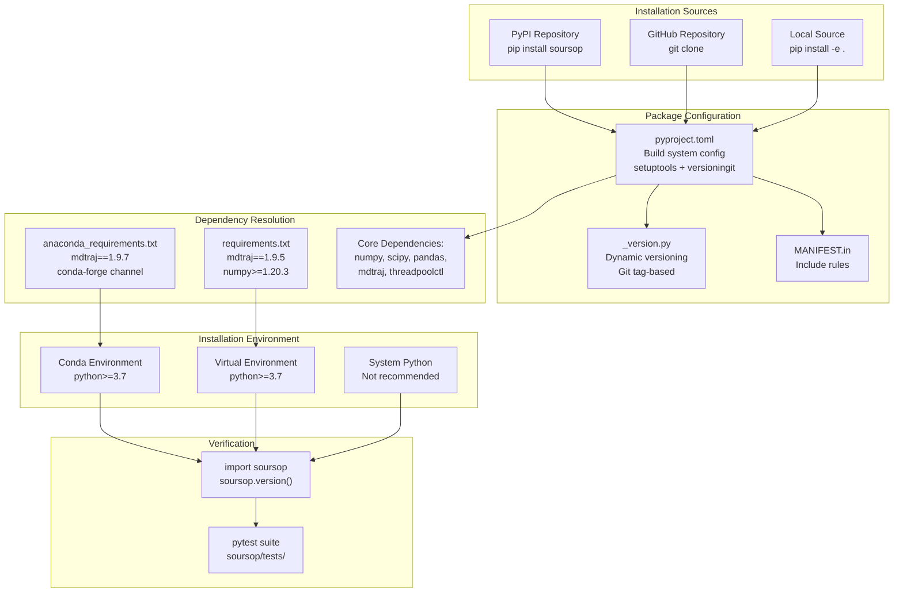
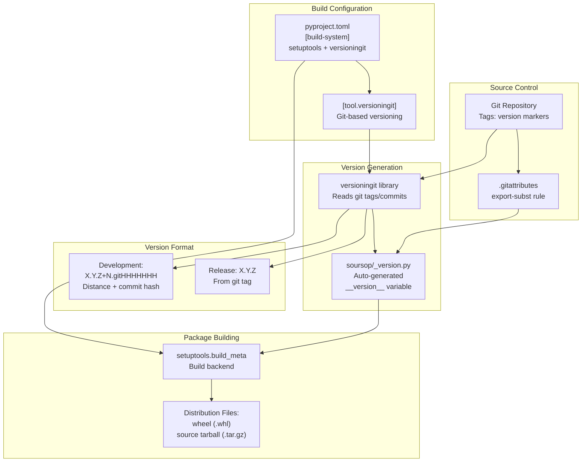

# Installation

<details>
<summary>Relevant source files</summary>

The following files were used as context for generating this wiki page:

- [.gitattributes](.gitattributes)
- [.readthedocs.yml](.readthedocs.yml)
- [anaconda_requirements.txt](anaconda_requirements.txt)
- [devtools/conda-envs/test_env_nomdtraj.yaml](devtools/conda-envs/test_env_nomdtraj.yaml)
- [docs/conf.py](docs/conf.py)
- [docs/modules/ssnmr.rst](docs/modules/ssnmr.rst)
- [docs/modules/ssprotein.rst](docs/modules/ssprotein.rst)
- [docs/requirements.txt](docs/requirements.txt)
- [docs/usage/installation.rst](docs/usage/installation.rst)
- [docs/usage/overview.rst](docs/usage/overview.rst)
- [pyproject.toml](pyproject.toml)
- [requirements.txt](requirements.txt)

</details>


This page provides detailed instructions for installing SOURSOP on your system. It covers the recommended conda-based installation, alternative installation methods, verification procedures, and troubleshooting common issues.

For information about specific dependency version requirements and optional dependencies, see [Dependencies](#2.2). For your first analysis after installation, see [Quick Start](#2.3).

---

## Installation Methods Overview

SOURSOP can be installed through three primary methods, each suited to different use cases:

| Installation Method | Use Case | Prerequisites | Stability |
|-------------------|----------|---------------|-----------|
| **Conda + pip** | Production use, analysis workflows | conda/miniconda installed | Recommended |
| **pip only** | Existing Python environments | mdtraj pre-installed | Supported |
| **Source (development)** | Contributing to SOURSOP, testing unreleased features | git, mdtraj, development tools | For developers |

Sources: [docs/usage/installation.rst:1-107](), [pyproject.toml:1-68]()

---

## Installation Architecture

The following diagram shows how different installation methods interact with the packaging system and dependency management:



Sources: [pyproject.toml:1-68](), [requirements.txt:1-14](), [anaconda_requirements.txt:1-16](), [docs/usage/installation.rst:1-107]()

---

## Method 1: Conda-Based Installation (Recommended)

This is the recommended installation method as it provides the most reliable dependency management, particularly for `mdtraj`, which has compiled components.

### Step 1: Create Conda Environment

```bash
# Create new environment with Python 3.9
conda create -n soursop python=3.9

# Activate the environment
conda activate soursop
```

The environment name (`soursop` in this example) can be customized to any valid identifier.

### Step 2: Configure Conda Channels

```bash
# Add conda-forge as a channel (if not already configured)
conda config --add channels conda-forge

# Set strict channel priority for dependency resolution
conda config --set channel_priority strict
```

This configuration ensures `mdtraj` and its dependencies are installed from `conda-forge`, which provides pre-built binaries for all supported platforms.

### Step 3: Install MDTraj

```bash
conda install mdtraj
```

This installs `mdtraj` version 1.9.7 along with its dependencies: `numpy`, `scipy`, and `pandas`. The conda installation handles platform-specific binary compilation.

### Step 4: Install SOURSOP via pip

```bash
pip install soursop
```

This installs SOURSOP and any remaining dependencies not provided by conda.

### Step 5: Verify Installation

```bash
python -c "import soursop; soursop.version()"
```

Expected output displays the installed version number. If this command completes without errors, SOURSOP is correctly installed.

Sources: [docs/usage/installation.rst:8-38](), [anaconda_requirements.txt:1-16]()

---

## Method 2: Pip-Only Installation

This method is suitable when you already have an environment with `mdtraj` installed or prefer not to use conda.

### Prerequisites

Ensure `mdtraj` is installed in your Python environment. Without `mdtraj`, SOURSOP cannot function as it provides the underlying trajectory reading capabilities.

### Installation Command

```bash
pip install soursop
```

This installs SOURSOP and all dependencies defined in [pyproject.toml:21-30]():
- `numpy>=1.20.0`
- `scipy>=1.5.0`
- `cython`
- `mdtraj>=1.9.5`
- `pandas>=0.23.0`
- `threadpoolctl>=2.2.0`
- `natsort`
- `matplotlib`

### Verification

```bash
python -c "import soursop; soursop.version()"
```

Sources: [pyproject.toml:18-30](), [docs/usage/installation.rst:38-48]()

---

## Method 3: Development Installation from Source

This method is intended for developers contributing to SOURSOP or users who need unreleased features.

### Clone Repository

```bash
git clone git@github.com:holehouse-lab/soursop.git
cd soursop
```

### Install in Editable Mode

```bash
pip install -e .
```

The `-e` flag creates an editable installation where changes to source files are immediately reflected in the installed package without reinstallation.

### Alternative: Install Development Version Directly

To install the latest development version without cloning:

```bash
pip install git+ssh://git@github.com/holehouselab/soursop.git
```

This requires `mdtraj` to be pre-installed in the environment.

Sources: [docs/usage/installation.rst:49-66]()

---

## Build System and Versioning

The following diagram illustrates how SOURSOP's build system generates version information and packages the distribution:



The build system uses `versioningit` [pyproject.toml:52-68]() to dynamically generate version strings from git repository state. The `.gitattributes` file [.gitattributes:1]() ensures `soursop/_version.py` is properly substituted during `git archive` operations.

Version format patterns:
- **Release builds**: `X.Y.Z` (from git tag)
- **Development builds**: `X.Y.Z+N.gitHHHHHHH` (base version + commit distance + hash)
- **Dirty working tree**: `X.Y.Z+N.gitHHHHHHH.dirty` (uncommitted changes present)

Sources: [pyproject.toml:52-68](), [.gitattributes:1]()

---

## Verification and Testing

### Basic Import Verification

```bash
# Verify SOURSOP imports successfully
python -c "import soursop"

# Display version information
python -c "import soursop; soursop.version()"
```

### Full Test Suite Execution

SOURSOP includes a comprehensive test suite using `pytest`. To run tests:

```bash
# Install pytest if not present
pip install pytest

# Navigate to tests directory
cd soursop/tests

# Run all tests with verbose output
pytest -v
```

The test suite includes unit tests, integration tests, and regression tests covering all major functionality. Full test execution may take several minutes depending on system performance.

### Parallel Test Execution

For faster test execution on multi-core systems:

```bash
# Install pytest-xdist plugin
pip install pytest-xdist

# Run tests in parallel
pytest -n auto
```

Sources: [docs/usage/installation.rst:69-86](), [requirements.txt:2-5]()

---

## Dependency Management Across Installation Methods

The following table shows how dependencies are specified across different configuration files:

| Dependency | pyproject.toml | requirements.txt | anaconda_requirements.txt | Purpose |
|-----------|---------------|------------------|--------------------------|---------|
| `mdtraj` | `>=1.9.5` | `==1.9.5` | `==1.9.7` | Trajectory I/O and molecular structures |
| `numpy` | `>=1.20.0` | `>=1.20.3` | (latest) | Numerical arrays and operations |
| `scipy` | `>=1.5.0` | `>=1.5.4` | (latest) | Scientific computing algorithms |
| `pandas` | `>=0.23.0` | `>=1.2.1` | (latest) | Data structures (required by mdtraj) |
| `threadpoolctl` | `>=2.2.0` | `>=3.1.0` | (latest) | Thread pool management |
| `natsort` | required | not listed | (latest) | Natural sorting utilities |
| `matplotlib` | required | not listed | (latest) | Plotting capabilities |
| `cython` | required | not listed | not listed | Python extension compilation |
| `pytest` | optional | `>=6.2.2` | (latest) | Test framework |
| `pytest-cov` | not listed | `>=2.11` | (latest) | Coverage reporting |
| `pytest-xdist` | not listed | `>=2.2` | (latest) | Parallel test execution |
| `pytest-forked` | not listed | `>=1.3` | (latest) | Test isolation |

**Key observations:**
- `pyproject.toml` [pyproject.toml:21-30]() defines the canonical dependency specification for the package
- `requirements.txt` [requirements.txt:1-14]() pins specific versions for reproducible pip-based installations
- `anaconda_requirements.txt` [anaconda_requirements.txt:1-16]() lists conda package names (versions managed by conda)
- `mdtraj` version differs between pip (1.9.5) and conda (1.9.7) installations

Sources: [pyproject.toml:21-30](), [requirements.txt:1-14](), [anaconda_requirements.txt:1-16]()

---

## Documentation Build Requirements

If building documentation locally, additional dependencies are required as specified in [docs/requirements.txt:1-4]():

```bash
pip install sphinx_rtd_theme numpy scipy versioningit
```

The documentation build system is configured in [docs/conf.py:1-191]() and uses:
- **Sphinx**: Documentation generation framework
- **sphinx_rtd_theme**: Read the Docs theme
- **autodoc**: Automatic API documentation from docstrings
- **napoleon**: Google/NumPy docstring style support
- **versioningit**: Version string generation

The Read the Docs build configuration [.readthedocs.yml:1-18]() specifies Python 3.9 on Ubuntu 22.04 for building documentation.

Sources: [docs/requirements.txt:1-4](), [docs/conf.py:1-191](), [.readthedocs.yml:1-18]()

---

## Platform Support and Python Versions

SOURSOP supports the following configurations:

### Python Versions
- **Minimum**: Python 3.7 [pyproject.toml:18]()
- **Tested**: Python 3.7, 3.8, 3.9 (via CI/CD matrix)
- **Recommended**: Python 3.9 [docs/usage/installation.rst:18]()

### Operating Systems
Continuous integration testing covers:
- Ubuntu Linux
- macOS
- Windows

All platforms are tested with the same dependency versions to ensure consistent behavior.

### Architecture Requirements
SOURSOP requires a 64-bit Python installation due to `mdtraj` and `numpy` dependencies that use compiled extensions optimized for 64-bit architectures.

Sources: [pyproject.toml:18](), [docs/usage/installation.rst:18]()

---

## Troubleshooting Common Installation Issues

### Issue: `mdtraj` Import Fails

**Symptom**: `ImportError: No module named 'mdtraj'` after installing SOURSOP

**Solution**: Install `mdtraj` separately before SOURSOP:
```bash
# Conda method (recommended)
conda install mdtraj

# Or pip method
pip install mdtraj>=1.9.5
```

### Issue: Version Command Returns "1+unknown"

**Symptom**: `soursop.version()` displays `1+unknown` instead of a proper version number

**Cause**: Package installed from a non-git source without version metadata

**Solution**: This is expected for installations from source without git metadata. The package is functional but lacks version tracking.

### Issue: Import Errors for Scientific Computing Libraries

**Symptom**: `ImportError` for `numpy`, `scipy`, or `pandas`

**Cause**: Missing dependencies not automatically installed by pip in some environments

**Solution**:
```bash
pip install numpy>=1.20.0 scipy>=1.5.0 pandas>=0.23.0
```

Or use the conda-based installation method which handles all scientific computing dependencies.

### Issue: `pytest` Not Found During Verification

**Symptom**: `pytest: command not found` when running tests

**Solution**: Install pytest:
```bash
pip install pytest pytest-cov pytest-xdist pytest-forked
```

Sources: [docs/usage/installation.rst:89-107](), [requirements.txt:1-14]()

---

## Next Steps

After successful installation:

1. **Review dependencies**: See [Dependencies](#2.2) for detailed information about version requirements and optional packages
2. **Start analyzing**: Follow the [Quick Start](#2.3) guide for your first SOURSOP analysis
3. **Explore core classes**: Learn about `SSTrajectory` and `SSProtein` in [System Architecture](#1.2)

---