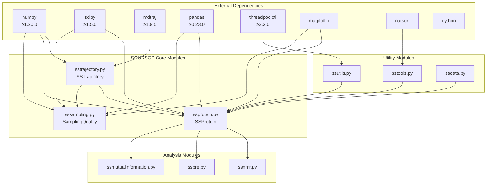
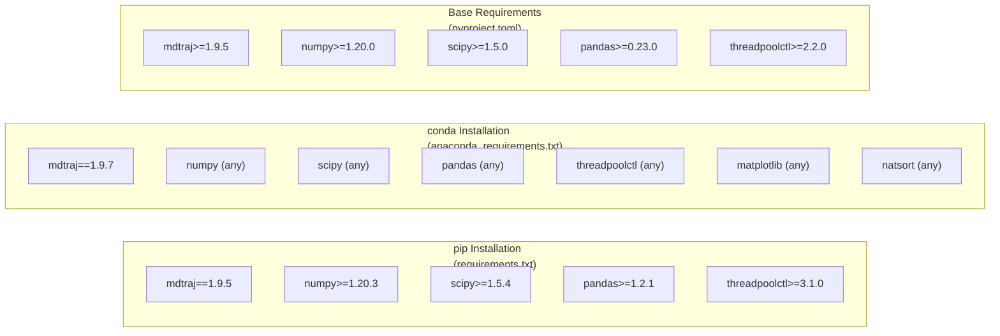
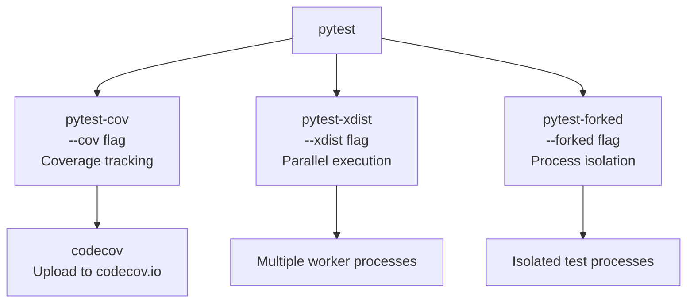
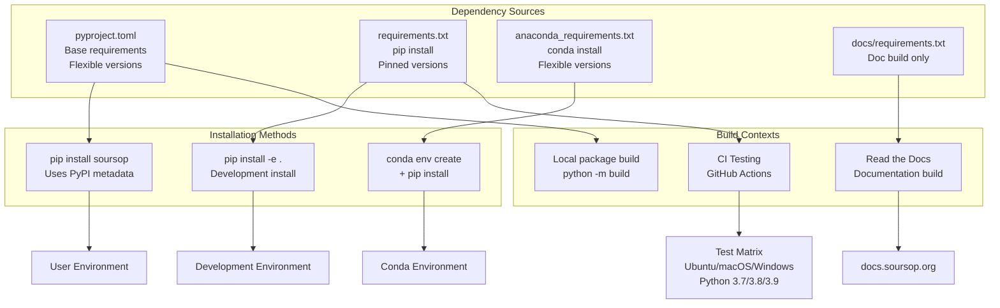
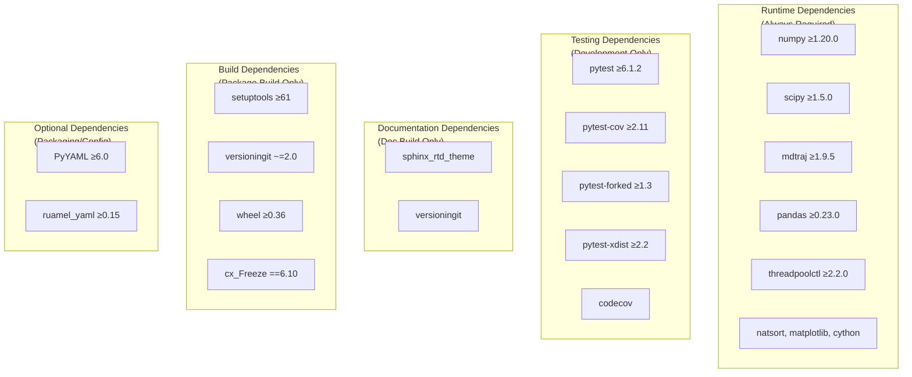

# Dependencies

<details>
<summary>Relevant source files</summary>

The following files were used as context for generating this wiki page:

- [.gitattributes](.gitattributes)
- [.readthedocs.yml](.readthedocs.yml)
- [anaconda_requirements.txt](anaconda_requirements.txt)
- [devtools/conda-envs/test_env_nomdtraj.yaml](devtools/conda-envs/test_env_nomdtraj.yaml)
- [docs/conf.py](docs/conf.py)
- [docs/requirements.txt](docs/requirements.txt)
- [pyproject.toml](pyproject.toml)
- [requirements.txt](requirements.txt)

</details>


This page documents all dependencies required to install and use SOURSOP, including core runtime dependencies, testing dependencies, and documentation build requirements. Version constraints and differences between pip and conda installation methods are detailed.

For installation instructions using these dependencies, see [Installation](#2.1). For information about the development environment setup, see [Testing Infrastructure](#9.2).

---

## Core Runtime Dependencies

SOURSOP requires several scientific computing libraries for trajectory analysis and numerical operations. The primary dependency specification is defined in `pyproject.toml`, which lists the minimum required versions for core functionality.

### Required Packages

| Package | Minimum Version | Purpose |
|---------|----------------|---------|
| `numpy` | ≥1.20.0 | Numerical array operations and linear algebra |
| `scipy` | ≥1.5.0 | Scientific algorithms, optimization, and statistics |
| `mdtraj` | ≥1.9.5 | Trajectory file I/O and molecular topology handling |
| `pandas` | ≥0.23.0 | Data structure management for analysis results |
| `cython` | (any) | C extension compilation support |
| `threadpoolctl` | ≥2.2.0 | Thread pool management for parallel operations |
| `natsort` | (any) | Natural sorting of trajectory file names |
| `matplotlib` | (any) | Plotting and visualization capabilities |

Sources: [pyproject.toml:21-30]()

### Dependency Architecture

The following diagram shows how SOURSOP's core modules depend on external packages:



Sources: [pyproject.toml:21-30](), [docs/conf.py:52]()

---

## Version Requirements: pip vs. conda

SOURSOP provides two different dependency specifications depending on the installation method. The pip installation uses stricter version pinning, while conda allows more flexibility.

### pip Installation (requirements.txt)

The pip requirements file specifies exact or minimum versions for reproducible environments:

| Package | Version Specification | Notes |
|---------|----------------------|-------|
| `mdtraj` | `==1.9.5` | Exact version pinned |
| `numpy` | `>=1.20.3` | Minimum version |
| `scipy` | `>=1.5.4` | Minimum version |
| `pandas` | `>=1.2.1` | Minimum version |
| `threadpoolctl` | `>=3.1.0` | Higher minimum than pyproject.toml |
| `PyYAML` | `>=6.0` | Configuration file parsing |
| `ruamel_yaml` | `>=0.15` | Alternative YAML parser |
| `wheel` | `>=0.36` | Package building |
| `cx_Freeze` | `==6.10` | Binary distribution creation |

Sources: [requirements.txt:1-14]()

### conda Installation (anaconda_requirements.txt)

The conda requirements file uses a different `mdtraj` version and omits specific version constraints for most packages:

| Package | Version Specification | Difference from pip |
|---------|----------------------|---------------------|
| `mdtraj` | `==1.9.7` | **Newer version** (1.9.7 vs 1.9.5) |
| `numpy` | (no constraint) | Conda manages version |
| `scipy` | (no constraint) | Conda manages version |
| `pandas` | (no constraint) | Conda manages version |
| `matplotlib` | (no constraint) | **Only in conda requirements** |
| `natsort` | (no constraint) | **Only in conda requirements** |

Sources: [anaconda_requirements.txt:1-16]()

### Version Constraint Comparison



Sources: [requirements.txt:1-14](), [anaconda_requirements.txt:1-16](), [pyproject.toml:21-30]()

### mdtraj Version Differences

The most significant version difference is `mdtraj`:
- **pip**: `mdtraj==1.9.5` (exact pin in requirements.txt)
- **conda**: `mdtraj==1.9.7` (exact pin in anaconda_requirements.txt)
- **base**: `mdtraj>=1.9.5` (minimum in pyproject.toml)

Both versions 1.9.5-1.9.7 are supported. The conda environment uses the newer version, which may include bug fixes. SOURSOP is designed to work with any `mdtraj` version ≥1.9.5.

Sources: [requirements.txt:6](), [anaconda_requirements.txt:6](), [pyproject.toml:25]()

---

## Testing Dependencies

SOURSOP includes comprehensive testing infrastructure using pytest. Testing dependencies are specified separately from runtime dependencies.

### Required Test Packages

| Package | Version | Purpose |
|---------|---------|---------|
| `pytest` | ≥6.1.2 or ≥6.2.2 | Test framework |
| `pytest-cov` | ≥2.11 | Code coverage measurement |
| `pytest-forked` | ≥1.3 | Fork execution for test isolation |
| `pytest-xdist` | ≥2.2 | Parallel test execution |
| `codecov` | (any) | Coverage reporting to codecov.io |

The testing dependencies are defined in multiple locations:
- [pyproject.toml:32-35]() - Minimal test dependencies (`pytest` only)
- [requirements.txt:2-5]() - Full test suite dependencies
- [devtools/conda-envs/test_env_nomdtraj.yaml:9-14]() - Test environment without mdtraj

Sources: [pyproject.toml:32-35](), [requirements.txt:2-5](), [devtools/conda-envs/test_env_nomdtraj.yaml:9-14]()

### Test Execution Modes



Sources: [requirements.txt:2-5]()

---

## Documentation Build Dependencies

Building SOURSOP's documentation requires additional dependencies beyond the runtime requirements.

### Documentation Packages

| Package | Purpose |
|---------|---------|
| `sphinx_rtd_theme` | Read the Docs HTML theme |
| `numpy` | NumPy docstring format support |
| `scipy` | SciPy docstring format support |
| `versioningit` | Dynamic version extraction from git tags |

Sources: [docs/requirements.txt:1-4]()

### Documentation Build Configuration

The documentation build process is configured in two locations:

**Read the Docs Configuration** ([.readthedocs.yml:1-18]()):
- Python version: 3.9
- Operating system: Ubuntu 22.04
- Requirements file: `docs/requirements.txt`
- Sphinx configuration: `docs/conf.py`

**Sphinx Configuration** ([docs/conf.py:1-191]()):
- Extensions: `autodoc`, `napoleon`, `mathjax`, `viewcode`
- Theme: `sphinx_rtd_theme`
- Mock imports for packages not needed during doc build

Sources: [.readthedocs.yml:1-18](), [docs/conf.py:1-191]()

### Mock Imports for Documentation

To avoid installing heavyweight dependencies during documentation builds, Sphinx mocks certain imports. These packages are not required for generating API documentation:

```python
autodoc_mock_imports = ["mdtraj", "threadpoolctl", "natsort", "matplotlib", "pandas"]
```

This allows documentation to build without `mdtraj` (which has C dependencies) or plotting libraries, reducing build time and complexity.

Sources: [docs/conf.py:52]()

---

## Dependency Resolution Flow

The following diagram shows how different dependency files are used in various contexts:



Sources: [pyproject.toml:1-68](), [requirements.txt:1-14](), [anaconda_requirements.txt:1-16](), [docs/requirements.txt:1-4](), [.readthedocs.yml:1-18]()

---

## Python Version Requirements

SOURSOP requires Python 3.7 or newer:

```python
requires-python = ">=3.7"
```

The continuous integration pipeline tests across multiple Python versions:
- Python 3.7
- Python 3.8
- Python 3.9

Documentation builds use Python 3.9 specifically ([.readthedocs.yml:14]()).

Sources: [pyproject.toml:18](), [.readthedocs.yml:14]()

---

## Build System Dependencies

For building SOURSOP from source or creating distributions, additional dependencies are required at build time:

| Package | Version | Purpose |
|---------|---------|---------|
| `setuptools` | ≥61 | Modern build backend |
| `versioningit` | ~=2.0 | Git-based version management |
| `numpy` | (any) | Required during build |
| `wheel` | ≥0.36 | Wheel package format |
| `cx_Freeze` | ==6.10 | Binary executable creation |

The build system is configured in `pyproject.toml`:

```toml
[build-system]
requires = ["setuptools>=61", "versioningit~=2.0", "numpy"]
build-backend = "setuptools.build_meta"
```

Sources: [pyproject.toml:1-5](), [requirements.txt:1](), [requirements.txt:8]()

### Version Management with versioningit

SOURSOP uses `versioningit` for dynamic versioning from git tags. The version string is automatically generated and written to `soursop/_version.py` during package builds:

```toml
[tool.versioningit.write]
file = "soursop/_version.py"
```

This file is generated during builds via git export substitution configured in `.gitattributes`:

```
soursop/_version.py export-subst
```

Sources: [pyproject.toml:67-68](), [.gitattributes:1]()

---

## Additional Dependencies for Packaging

The `requirements.txt` file includes dependencies for building redistributable packages:

- **PyYAML** (≥6.0) and **ruamel_yaml** (≥0.15): YAML configuration file parsing
- **cx_Freeze** (==6.10): Creating standalone executables

These are not required for normal SOURSOP usage but are needed for creating frozen binaries or parsing YAML-based configuration.

Sources: [requirements.txt:9-11]()

---

## Summary: Dependency Categories



Sources: [pyproject.toml:1-68](), [requirements.txt:1-14](), [anaconda_requirements.txt:1-16](), [docs/requirements.txt:1-4]()

---

## Dependency Installation Commands

For quick reference, here are the installation commands for each dependency set:

**Runtime dependencies (via pip):**
```bash
pip install numpy scipy mdtraj pandas threadpoolctl natsort matplotlib cython
```

**Runtime dependencies (via conda):**
```bash
conda install numpy scipy pandas threadpoolctl natsort matplotlib cython
conda install -c conda-forge mdtraj
```

**Testing dependencies:**
```bash
pip install pytest pytest-cov pytest-forked pytest-xdist codecov
```

**Documentation dependencies:**
```bash
pip install sphinx_rtd_theme versioningit
```

For complete installation instructions including environment setup, see [Installation](#2.1).

---