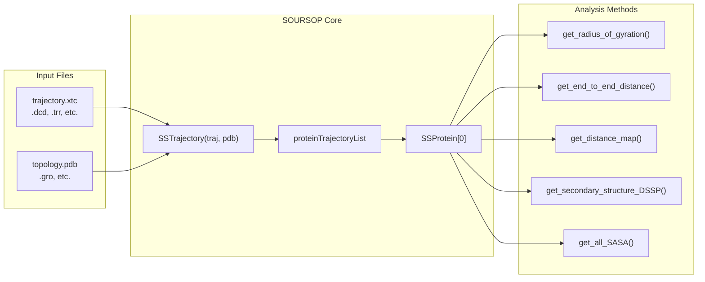
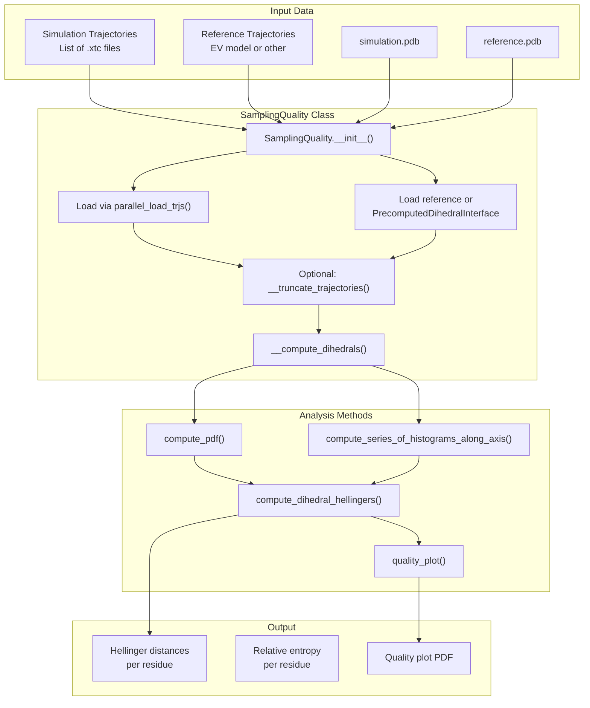

# Quick Start

<details>
<summary>Relevant source files</summary>

The following files were used as context for generating this wiki page:

- [docs/modules/ssnmr.rst](docs/modules/ssnmr.rst)
- [docs/modules/ssprotein.rst](docs/modules/ssprotein.rst)
- [docs/usage/installation.rst](docs/usage/installation.rst)
- [docs/usage/overview.rst](docs/usage/overview.rst)
- [soursop/sssampling.py](soursop/sssampling.py)
- [soursop/sstrajectory.py](soursop/sstrajectory.py)
- [soursop/tests/test_sssampling.py](soursop/tests/test_sssampling.py)

</details>


## Purpose and Scope

This page provides minimal working examples to help you start analyzing molecular dynamics trajectories with SOURSOP. It demonstrates the core workflow: loading trajectory files, extracting protein data, and performing basic structural analyses.

For detailed installation instructions, see [Installation](#2.1). For information on dependencies and version requirements, see [Dependencies](#2.2). For comprehensive documentation of analysis methods, see [SSProtein: Single Protein Analysis](#4) and [SamplingQuality: PENGUIN Pipeline](#5).

---

## Minimal Example: Loading and Analyzing a Trajectory

The most basic SOURSOP workflow involves three steps: loading a trajectory, extracting a protein object, and computing properties.

```python
# Import the trajectory loading class
from soursop.sstrajectory import SSTrajectory
import numpy as np

# Step 1: Load trajectory and topology files
traj = SSTrajectory('trajectory.xtc', 'topology.pdb')

# Step 2: Extract the first protein chain
protein = traj.proteinTrajectoryList[0]

# Step 3: Compute structural properties
rg = protein.get_radius_of_gyration()           # Per-frame Rg (Angstroms)
e2e = protein.get_end_to_end_distance()         # Per-frame end-to-end distance
asph = protein.get_asphericity()                 # Per-frame asphericity

# Calculate ensemble averages
mean_rg = np.mean(rg)
std_rg = np.std(rg)

print(f"Radius of gyration: {mean_rg:.2f} ± {std_rg:.2f} Å")
print(f"Number of frames: {traj.n_frames}")
print(f"Number of proteins: {traj.n_proteins}")
```

**Sources:** [soursop/sstrajectory.py:67-194](), [soursop/ssprotein.py](), [docs/usage/overview.rst:1-38]()

---

## Understanding the Data Flow

The following diagram illustrates how trajectory files are loaded and parsed into analyzable protein objects:



**Sources:** [soursop/sstrajectory.py:67-194](), [soursop/sstrajectory.py:439-559]()

---

## Common Analysis Workflows

The table below summarizes frequently used analysis methods available through the `SSProtein` class:

| Analysis Category | Method Name | Returns | Units |
|------------------|-------------|---------|-------|
| **Global Structure** | `get_radius_of_gyration()` | Per-frame Rg | Å |
| | `get_end_to_end_distance()` | Per-frame E2E distance | Å |
| | `get_asphericity()` | Per-frame asphericity | Dimensionless |
| | `get_hydrodynamic_radius()` | Per-frame Rh | Å |
| **Distance Analysis** | `get_distance_map()` | Mean/std distance matrix | Å |
| | `get_inter_residue_COM_distance(i, j)` | Per-frame distance | Å |
| | `calculate_all_CA_distances()` | CA-CA distance matrix | Å |
| **Secondary Structure** | `get_secondary_structure_DSSP()` | DSSP assignments + helicity | Per residue |
| | `get_secondary_structure_BBSEG()` | BBSEG assignments | Per residue |
| **Contact Analysis** | `get_contact_map()` | Contact probability matrix | Dimensionless |
| | `get_Q(reference_frame)` | Q-value vs reference | Dimensionless |
| **Surface Properties** | `get_all_SASA()` | Solvent accessible surface area | Ų |
| | `get_regional_SASA(start, end)` | Regional SASA | Ų |
| **Angles** | `get_angles('phi')` | Phi dihedral angles | Degrees |
| | `get_angles('psi')` | Psi dihedral angles | Degrees |

**Sources:** [docs/modules/ssprotein.rst:1-89](), [soursop/ssprotein.py]()

---

## Single Protein Analysis Examples

### Example 1: Computing Distance Maps

Distance maps reveal the spatial organization of residues in a protein ensemble.

```python
from soursop.sstrajectory import SSTrajectory

# Load trajectory
traj = SSTrajectory('simulation.xtc', 'start.pdb')
protein = traj.proteinTrajectoryList[0]

# Compute distance map (mean and standard deviation)
mean_map, std_map = protein.get_distance_map()

# mean_map[i,j] = average distance between residues i and j
# std_map[i,j] = standard deviation of that distance

print(f"Distance map shape: {mean_map.shape}")
print(f"Distance between residues 10 and 50: {mean_map[10, 50]:.2f} Å")
```

**Sources:** [soursop/ssprotein.py](), [docs/modules/ssprotein.rst:54-58]()

### Example 2: Secondary Structure Analysis

```python
from soursop.sstrajectory import SSTrajectory
import numpy as np

traj = SSTrajectory('trajectory.dcd', 'topology.pdb')
protein = traj.proteinTrajectoryList[0]

# Get secondary structure using DSSP algorithm
dssp_assignments, per_residue_helicity = protein.get_secondary_structure_DSSP()

# dssp_assignments: per-frame character array ('H', 'E', 'C', etc.)
# per_residue_helicity: fraction of frames each residue is helical

mean_helicity = np.mean(per_residue_helicity)
print(f"Average helicity: {mean_helicity:.2%}")
print(f"Residues with >50% helicity: {np.sum(per_residue_helicity > 0.5)}")
```

**Sources:** [soursop/ssprotein.py](), [docs/modules/ssprotein.rst:67-68]()

### Example 3: Dihedral Angle Analysis

```python
from soursop.sstrajectory import SSTrajectory

traj = SSTrajectory('traj.xtc', 'start.pdb')
protein = traj.proteinTrajectoryList[0]

# Extract backbone dihedral angles
residue_indices, phi_angles = protein.get_angles('phi')
_, psi_angles = protein.get_angles('psi')

# phi_angles.shape = (n_residues, n_frames)
# Values in degrees

print(f"Phi angles shape: {phi_angles.shape}")
print(f"Mean phi angle for residue 20: {phi_angles[20].mean():.1f}°")
```

**Sources:** [soursop/ssprotein.py](), [docs/modules/ssprotein.rst:66]()

---

## Multi-Chain System Analysis

For simulations with multiple protein chains, `SSTrajectory` automatically identifies and separates each chain.

```python
from soursop.sstrajectory import SSTrajectory

# Load multi-chain trajectory
traj = SSTrajectory('multichain.xtc', 'multichain.pdb')

print(f"Number of protein chains detected: {traj.n_proteins}")

# Access individual chains
protein_1 = traj.proteinTrajectoryList[0]
protein_2 = traj.proteinTrajectoryList[1]

# Compute interchain distance map
mean_dist, std_dist = traj.get_interchain_distance_map(
    proteinID1=0,
    proteinID2=1,
    mode='CA'  # Use alpha-carbon atoms
)

# mean_dist[i,j] = average distance between residue i of chain 0
#                  and residue j of chain 1

print(f"Interchain distance map shape: {mean_dist.shape}")
```

**Sources:** [soursop/sstrajectory.py:748-814](), [soursop/sstrajectory.py:226-231]()

---

## Sampling Quality Assessment (PENGUIN)

The `SamplingQuality` class implements the PENGUIN methodology to assess whether simulations have adequately sampled conformational space by comparing dihedral angle distributions against a reference model.

```python
from soursop.sssampling import SamplingQuality
from soursop.sstools import find_trajectory_files

# Locate trajectory files in directories
sim_trajs, sim_tops = find_trajectory_files('simulation_dir/', num_trajs=3)
ref_trajs, ref_tops = find_trajectory_files('reference_model_dir/', num_trajs=3)

# Initialize sampling quality assessment
quality = SamplingQuality(
    traj_list=sim_trajs,
    reference_list=ref_trajs,
    top_file=sim_tops,
    ref_top=ref_tops,
    method='2D angle distributions',  # or '1D angle distributions'
    bwidth=0.2618,  # 15 degrees in radians
    proteinID=0
)

# Compute Hellinger distances between distributions
hellinger_distances = quality.compute_dihedral_hellingers()
# Returns per-residue distances; low values indicate good sampling

# Generate quality assessment plot
quality.quality_plot(
    dihedral='2D',
    save_dir='output/',
    figname='sampling_quality.pdf'
)

print(f"Mean Hellinger distance: {hellinger_distances.mean():.3f}")
```

The following diagram shows the sampling quality assessment workflow:



**Sources:** [soursop/sssampling.py:106-234](), [soursop/sssampling.py:481-521](), [soursop/sssampling.py:846-986](), [soursop/tests/test_sssampling.py:31-102]()

### Using Precomputed Reference Models

If no reference trajectories are provided, SOURSOP uses precomputed excluded volume (EV) reference data:

```python
from soursop.sssampling import SamplingQuality

# Assess against precomputed EV model
quality = SamplingQuality(
    traj_list=['sim1.xtc', 'sim2.xtc', 'sim3.xtc'],
    reference_list=None,  # Use precomputed reference
    top_file='topology.pdb',
    method='2D angle distributions',
    proteinID=0
)

# The PrecomputedDihedralInterface is automatically initialized
# based on the sequence from your topology file

hellinger_distances = quality.compute_dihedral_hellingers()
```

**Sources:** [soursop/sssampling.py:202-233](), [soursop/ssdata.py]()

---

## Next Steps

Now that you understand the basic SOURSOP workflow, explore the following documentation for more advanced usage:

- **[SSTrajectory: Loading and Multi-Chain Analysis](#3)** - Detailed trajectory loading options, parallel loading, and system-level analysis
- **[SSProtein: Single Protein Analysis](#4)** - Comprehensive documentation of 50+ analysis methods
- **[SamplingQuality: PENGUIN Pipeline](#5)** - Advanced conformational sampling assessment
- **[Specialized Analysis Modules](#6)** - NMR chemical shifts, PRE profiles, mutual information
- **[Plugin Extension System](#8)** - Create custom analysis plugins

For performance optimization tips, see [Performance Optimization](#10.3).

**Sources:** [docs/usage/overview.rst:1-38](), [docs/usage/installation.rst:1-107]()

---