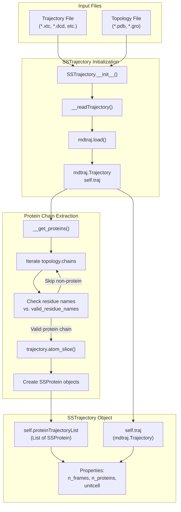
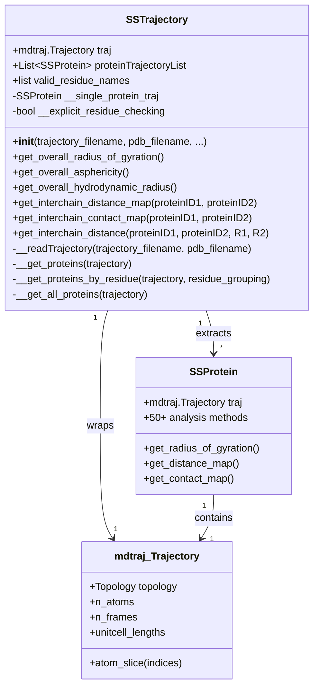
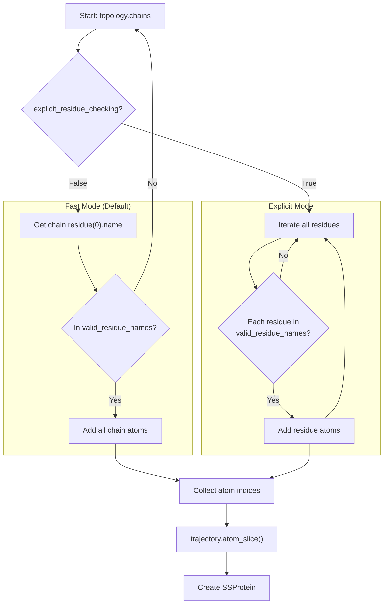
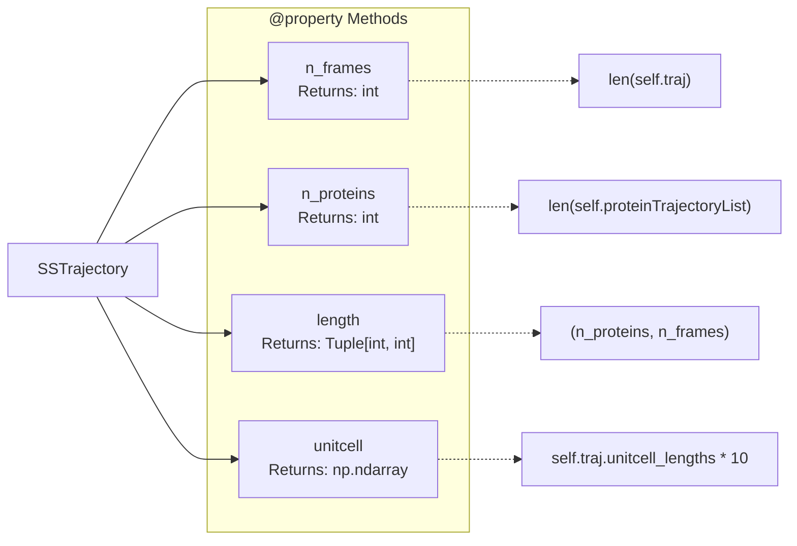
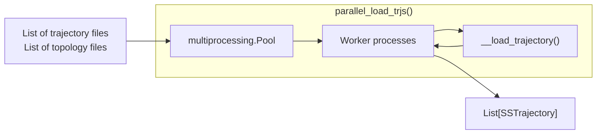
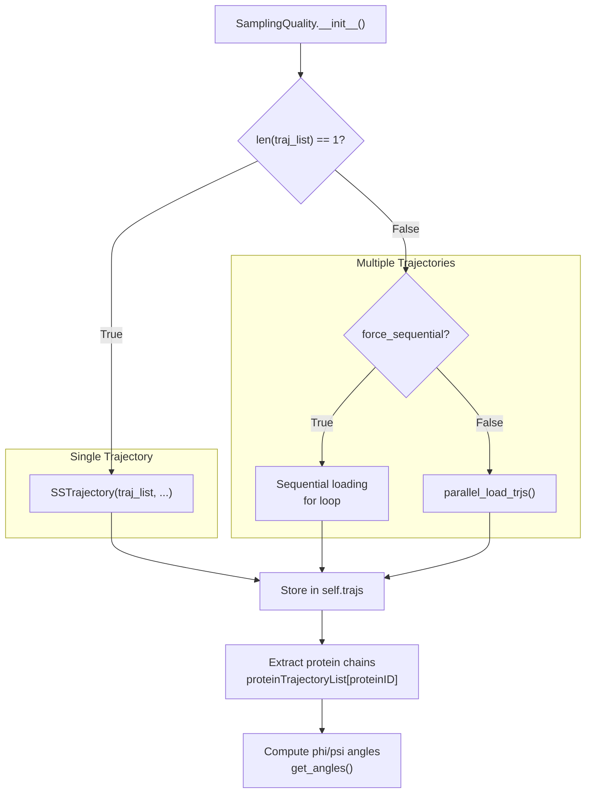

# SSTrajectory: Loading and Multi-Chain Analysis

<details>
<summary>Relevant source files</summary>

The following files were used as context for generating this wiki page:

- [docs/modules/sstrajectory.rst](docs/modules/sstrajectory.rst)
- [soursop/sssampling.py](soursop/sssampling.py)
- [soursop/sstrajectory.py](soursop/sstrajectory.py)
- [soursop/tests/test_sssampling.py](soursop/tests/test_sssampling.py)

</details>


## Purpose and Scope

This page documents the `SSTrajectory` class, which serves as the primary entry point for loading molecular dynamics trajectories in SOURSOP. The class handles trajectory file parsing, automatic protein chain extraction, and provides system-level analysis methods for multi-chain systems. 

For detailed information on trajectory loading options and file format support, see [Loading Trajectories](#3.1). For single-protein analysis methods, see [SSProtein: Single Protein Analysis](#4). For sampling quality assessment using trajectories, see [SamplingQuality: PENGUIN Pipeline](#5).

---

## Overview

The `SSTrajectory` class is defined in [soursop/sstrajectory.py:62-1147]() and provides a wrapper around `mdtraj.Trajectory` objects with automatic protein extraction capabilities. Upon initialization, `SSTrajectory` identifies protein chains in the system and creates individual `SSProtein` objects for each chain, enabling both single-chain and multi-chain analysis workflows.

**Key Capabilities:**
- Loading trajectory files in multiple formats (XTC, DCD, etc.) via mdtraj backend
- Automatic identification and extraction of protein chains from complex systems
- Parallel trajectory loading for performance with multiple trajectory files
- Multi-chain distance and contact analysis
- System-level structural properties across all protein chains

---

## Trajectory Loading and Protein Extraction Pipeline

The following diagram illustrates the complete data flow from raw trajectory files to analyzable `SSProtein` objects:



**Sources:** [soursop/sstrajectory.py:67-236](), [soursop/sstrajectory.py:283-364](), [soursop/sstrajectory.py:439-559]()

---

## Core Architecture

### Class Structure and Key Components



**Sources:** [soursop/sstrajectory.py:62-277](), [soursop/ssprotein.py:1-100]()

---

## Initialization Methods

`SSTrajectory` supports two initialization modes:

### Mode 1: Reading from Disk

```python
from soursop.sstrajectory import SSTrajectory

# Basic usage
traj = SSTrajectory('trajectory.xtc', pdb_filename='topology.pdb')

# With parallel loading for multiple files
from soursop.sstrajectory import parallel_load_trjs
traj_list = parallel_load_trjs(['traj1.xtc', 'traj2.xtc'], 
                                'topology.pdb', 
                                n_procs=4)
```

### Mode 2: From Existing mdtraj.Trajectory

```python
import mdtraj as md

# Load with mdtraj
mdtraj_obj = md.load('trajectory.xtc', top='topology.pdb')

# Create SSTrajectory from existing trajectory
traj = SSTrajectory(TRJ=mdtraj_obj)
```

**Sources:** [soursop/sstrajectory.py:67-236](), [soursop/sstrajectory.py:1173-1215]()

---

## Protein Chain Identification

The chain identification system determines which atoms belong to protein chains:



**Valid Residue Names:**
The system recognizes standard amino acids plus modified residues and caps. Default list includes: `ALA`, `CYS`, `ASP`, `GLU`, `PHE`, `GLY`, `HIS`, `ILE`, `LEU`, `LYS`, `MET`, `ASN`, `PRO`, `GLN`, `ARG`, `SER`, `THR`, `VAL`, `TRP`, `TYR`, plus variants like `HIE`, `HID`, `HIP`, `ASH`, and terminal caps `ACE`, `NME`, `FOR`, `NH2`.

The `extra_valid_residue_names` parameter allows custom residue names to be recognized.

**Sources:** [soursop/sstrajectory.py:196-208](), [soursop/sstrajectory.py:439-559](), [soursop/ssdata.py:40-60]()

---

## Key Class Variables and Properties

### Primary Class Variables

| Variable | Type | Description |
|----------|------|-------------|
| `traj` | `mdtraj.Trajectory` | The complete system trajectory with all atoms |
| `proteinTrajectoryList` | `List[SSProtein]` | List of extracted protein chains, each as an `SSProtein` object |
| `valid_residue_names` | `List[str]` | Residue names recognized as protein residues |

**Sources:** [soursop/sstrajectory.py:106-115](), [soursop/sstrajectory.py:196-232]()

### Properties



**Sources:** [soursop/sstrajectory.py:247-277]()

---

## Multi-Chain Analysis Functions

`SSTrajectory` provides specialized methods for analyzing interactions between protein chains:

### Interchain Distance Analysis

| Method | Purpose | Key Parameters |
|--------|---------|----------------|
| `get_interchain_distance_map()` | Mean and std deviation distances between all residue pairs in two chains | `proteinID1`, `proteinID2`, `mode='CA'`, `periodic=False` |
| `get_interchain_distance()` | Per-frame distance between specific residues in two chains | `proteinID1`, `proteinID2`, `R1`, `R2`, `A1='CA'`, `A2='CA'`, `mode='atom'` |
| `get_interchain_contact_map()` | Contact fractions between residue pairs across chains | `proteinID1`, `proteinID2`, `threshold=5.0`, `mode='atom'` |

**Distance Modes:**
- `atom`: Specific atom pair (e.g., CA-CA)
- `ca`: Alpha carbon distance
- `closest`: Closest atom approach between residues
- `closest-heavy`: Closest heavy atom approach
- `sidechain`: Closest sidechain atom
- `sidechain-heavy`: Closest heavy sidechain atom

**Sources:** [soursop/sstrajectory.py:748-857](), [soursop/sstrajectory.py:863-982](), [soursop/sstrajectory.py:988-1147]()

### Overall System Properties

For multi-chain systems, these methods compute properties across all proteins combined:

| Method | Returns | Use Case |
|--------|---------|----------|
| `get_overall_radius_of_gyration()` | `np.ndarray` | Per-frame Rg treating all chains as one system |
| `get_overall_asphericity()` | `np.ndarray` | Per-frame asphericity of complete system |
| `get_overall_hydrodynamic_radius()` | `np.ndarray` | Per-frame hydrodynamic radius of system |

These methods use the `@lazy_loading_single_protein_trajectory` decorator pattern to create a unified trajectory only when needed.

**Sources:** [soursop/sstrajectory.py:665-743](), [soursop/sstrajectory.py:34-58](), [soursop/sstrajectory.py:370-434]()

---

## Parallel Loading Interface

The `parallel_load_trjs()` function enables efficient loading of multiple trajectory files:



**Function Signature:**
```python
parallel_load_trjs(trj_filenames, top_filenames, n_procs=None, **kwargs)
```

**Parameters:**
- `trj_filenames`: List of trajectory file paths
- `top_filenames`: Topology file path(s) - single string or list
- `n_procs`: Number of parallel processes (default: all available CPUs)
- `**kwargs`: Additional arguments passed to `SSTrajectory.__init__()`

**Sources:** [soursop/sstrajectory.py:1173-1215](), [soursop/sstrajectory.py:1149-1172]()

---

## Integration with SamplingQuality

The `SamplingQuality` class uses `SSTrajectory` for loading trajectories in the PENGUIN pipeline:



**Sources:** [soursop/sssampling.py:255-310](), [soursop/sssampling.py:380-432]()

---

## Manual Protein Grouping

For cases where automatic chain detection is insufficient (e.g., CAMPARI simulations with >26 chains), the `protein_grouping` parameter enables manual specification:

```python
# Define protein groups by residue indices
protein_grouping = [
    [0, 1, 2, 3, 4],      # First protein: residues 0-4
    [5, 6, 7, 8, 9],      # Second protein: residues 5-9
    [10, 11, 12, 13, 14]  # Third protein: residues 10-14
]

traj = SSTrajectory('trajectory.xtc', 
                    pdb_filename='topology.pdb',
                    protein_grouping=protein_grouping)
```

This invokes `__get_proteins_by_residue()` instead of `__get_proteins()`.

**Sources:** [soursop/sstrajectory.py:228-231](), [soursop/sstrajectory.py:567-659]()

---

## Error Handling and Validation

Common error scenarios and their handling:

| Issue | Exception | Resolution |
|-------|-----------|------------|
| Missing input files | `SSException` | Both trajectory and topology files required |
| Invalid protein indices | `SSException` | Verify `proteinID` is within `0...n_proteins-1` |
| Residue not found | `SSException` | Check residue indexing matches topology |
| Unit cell issues | Warning message | Old CAMPARI trajectories may need reconstruction |
| First resid != 0 | `SSException` | Requires mdtraj 1.9.5+ for proper atom slicing |

**Sources:** [soursop/sstrajectory.py:210-223](), [soursop/sstrajectory.py:332-363](), [soursop/sstrajectory.py:1087-1110]()

---

## Performance Considerations

### Lazy Loading Pattern

The `__single_protein_traj` object is created only when needed for overall system properties, using the `@lazy_loading_single_protein_trajectory` decorator:

```python
@lazy_loading_single_protein_trajectory
def get_overall_radius_of_gyration(self):
    return self.__single_protein_traj.get_radius_of_gyration()
```

This avoids the computational cost of creating a unified trajectory unless explicitly required.

**Sources:** [soursop/sstrajectory.py:34-58](), [soursop/sstrajectory.py:233-235](), [soursop/sstrajectory.py:665-689]()

### Parallel Loading

For multiple trajectories, `parallel_load_trjs()` uses Python's multiprocessing to load files concurrently, significantly reducing I/O time for large datasets.

**Sources:** [soursop/sstrajectory.py:1173-1215]()

---

## Summary

The `SSTrajectory` class serves as the foundation of SOURSOP's analysis pipeline:

1. **Wraps mdtraj:** Leverages mdtraj's robust trajectory parsing while adding protein-specific functionality
2. **Automatic extraction:** Identifies and separates protein chains without manual intervention
3. **Dual interface:** Supports both single-chain analysis (via `SSProtein` objects) and multi-chain analysis (via `SSTrajectory` methods)
4. **Performance optimized:** Parallel loading and lazy evaluation minimize computational overhead
5. **Flexible input:** Handles multiple trajectory formats, custom residue definitions, and manual grouping

For detailed usage examples and method signatures, see:
- Loading options and file formats: [Loading Trajectories](#3.1)
- Properties and basic operations: [Properties and Basic Operations](#3.2)
- Multi-chain specific methods: [Multi-Chain Analysis Methods](#3.3)
- Single-protein analysis: [SSProtein: Single Protein Analysis](#4)

---