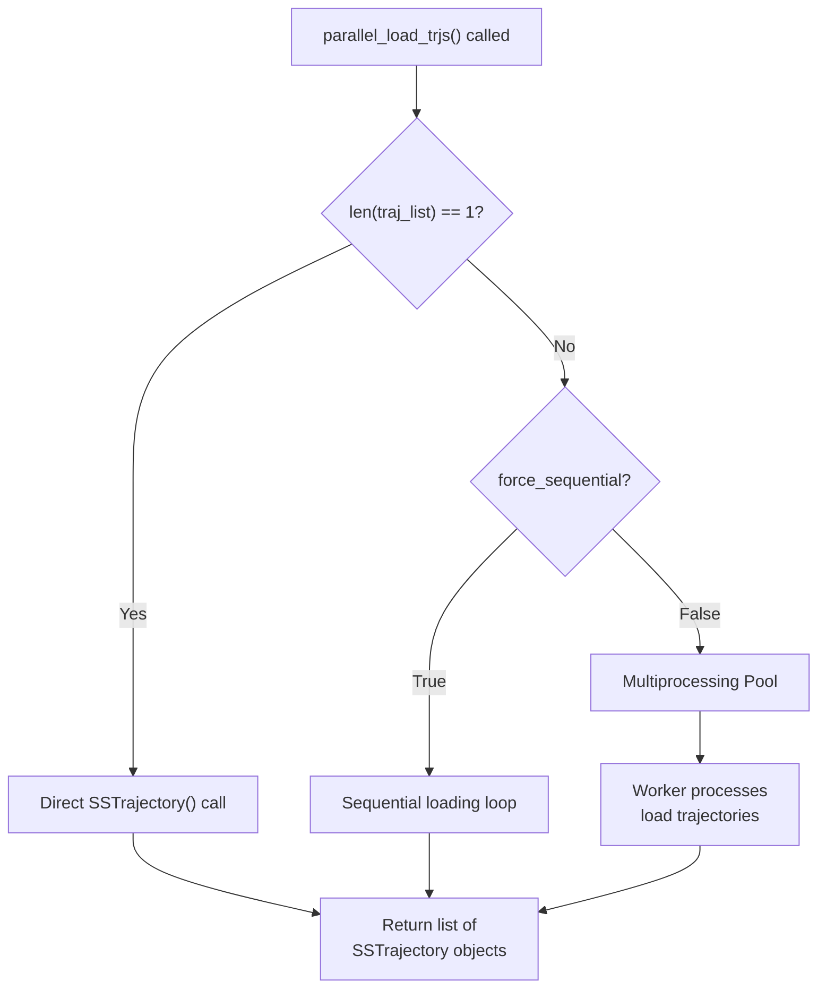
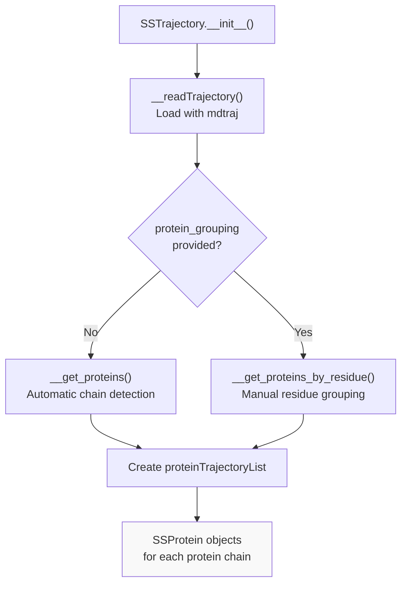
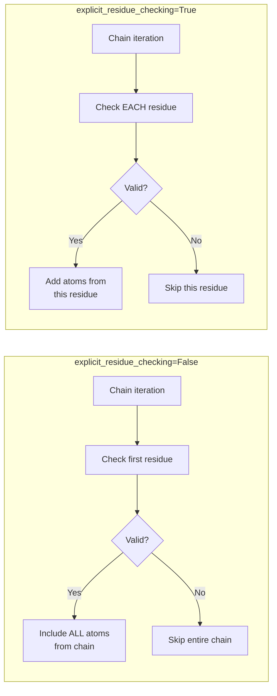
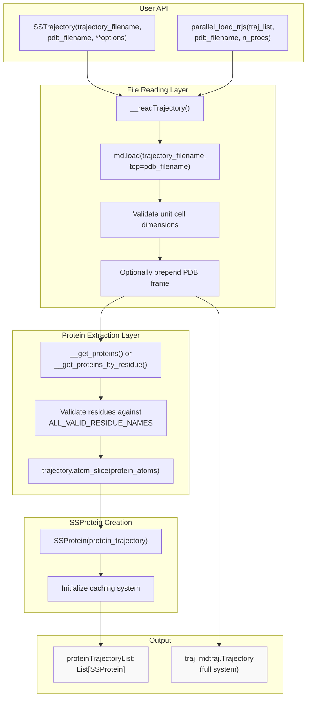
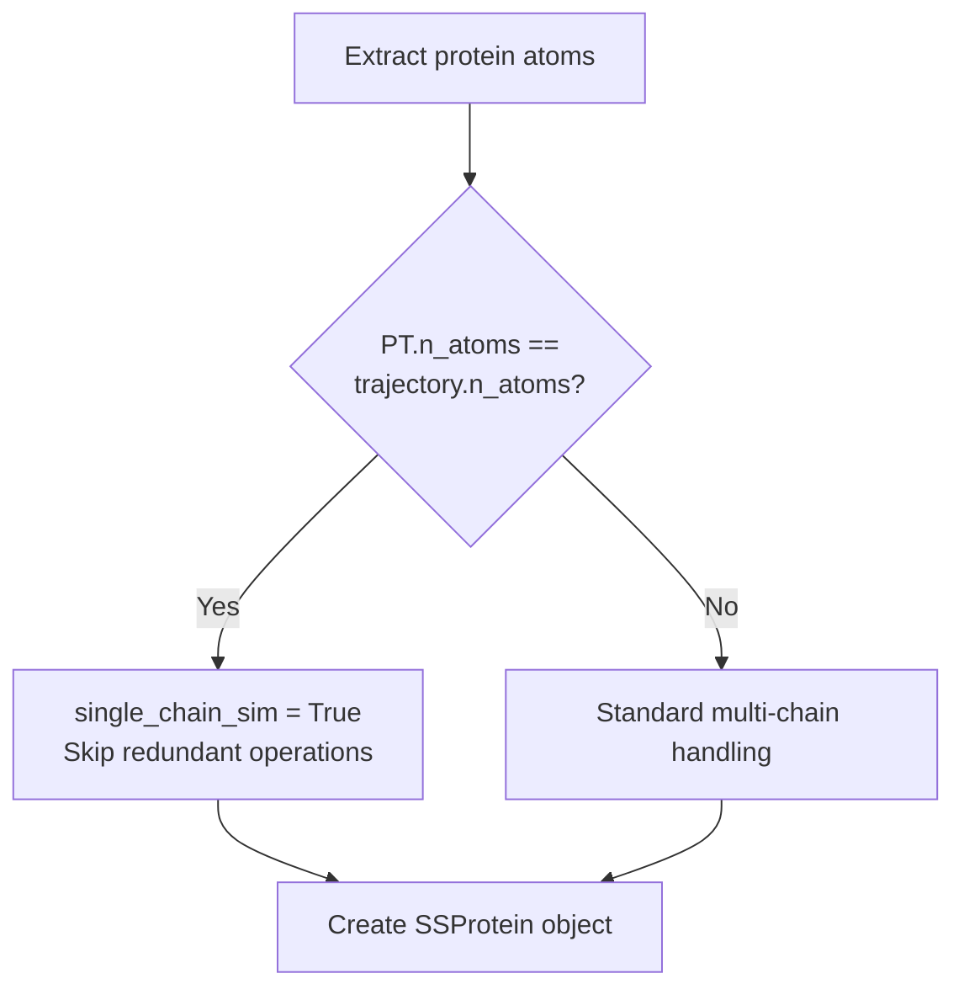

# Loading Trajectories

<details>
<summary>Relevant source files</summary>

The following files were used as context for generating this wiki page:

- [README.md](README.md)
- [docs/index.rst](docs/index.rst)
- [docs/modules/sssampling.rst](docs/modules/sssampling.rst)
- [soursop/sssampling.py](soursop/sssampling.py)
- [soursop/sstrajectory.py](soursop/sstrajectory.py)
- [soursop/tests/test_sssampling.py](soursop/tests/test_sssampling.py)

</details>


This page describes how trajectories are loaded in SOURSOP through the `SSTrajectory` class. It covers file format support, parallel loading capabilities, protein extraction mechanisms, and residue validation options. For information about analyzing loaded trajectories, see [Properties and Basic Operations](#3.2). For multi-chain analysis methods, see [Multi-Chain Analysis Methods](#3.3).

## Overview

SOURSOP uses the `SSTrajectory` class as the entry point for working with simulation trajectories. Loading is built on top of mdtraj's trajectory reading infrastructure, with additional functionality for automatically extracting protein chains, validating residues, and enabling parallel loading of multiple trajectory files.

There are two primary ways to create an `SSTrajectory` object:

1. **Loading from disk**: Provide trajectory and topology file paths
2. **From existing trajectory**: Pass a pre-loaded mdtraj trajectory object

Sources: [soursop/sstrajectory.py:67-194](), [soursop/sstrajectory.py:283-364]()

## File Format Support

### Supported Formats

SOURSOP leverages mdtraj's file reading capabilities, supporting all trajectory formats that mdtraj can read, including:

| Format | Extension | Typical Use |
|--------|-----------|-------------|
| XTC | `.xtc` | GROMACS compressed trajectory |
| DCD | `.dcd` | CHARMM/NAMD trajectory |
| TRR | `.trr` | GROMACS full-precision trajectory |
| NetCDF | `.nc`, `.ncdf` | AMBER trajectory |
| HDF5 | `.h5`, `.hdf5` | Generic HDF5 format |

### Topology Files

Topology files define the system structure and must be provided when loading trajectory files. Supported topology formats include:

| Format | Extension | Notes |
|--------|-----------|-------|
| PDB | `.pdb` | Most common, includes connectivity |
| GRO | `.gro` | GROMACS format, no chain information by default |
| PRMTOP | `.prmtop` | AMBER topology |
| PSF | `.psf` | CHARMM topology |

Sources: [soursop/sstrajectory.py:283-364](), [README.md:1-84]()

## Basic Loading

### Loading from Files

The simplest way to load a trajectory is to provide the trajectory file and topology file paths:

```python
from soursop.sstrajectory import SSTrajectory

# Load a single trajectory file
traj = SSTrajectory('trajectory.xtc', 'topology.pdb')

# Access basic properties
print(f"Number of frames: {traj.n_frames}")
print(f"Number of proteins: {traj.n_proteins}")
```

### Loading from Existing mdtraj Trajectory

To avoid I/O overhead when working with modified trajectories, you can pass an existing mdtraj trajectory object:

```python
import mdtraj as md
from soursop.sstrajectory import SSTrajectory

# Load with mdtraj first
mdtraj_obj = md.load('trajectory.xtc', top='topology.pdb')

# Slice or modify the trajectory
subset = mdtraj_obj[::10]  # Every 10th frame

# Create SSTrajectory from the modified trajectory
traj = SSTrajectory(TRJ=subset)
```

Sources: [soursop/sstrajectory.py:67-194](), [soursop/sstrajectory.py:209-223]()

## Parallel Loading

### Using parallel_load_trjs

When working with multiple trajectory files (e.g., simulation replicates), SOURSOP provides parallel loading capabilities through the `parallel_load_trjs` function. This significantly reduces loading time by distributing file I/O across multiple CPU cores:

```python
from soursop.sstrajectory import parallel_load_trjs

# List of trajectory files
traj_list = ['rep1.xtc', 'rep2.xtc', 'rep3.xtc']
top_file = 'topology.pdb'

# Load in parallel using all available cores
trajs = parallel_load_trjs(traj_list, top_file)

# Load with specific number of cores
trajs = parallel_load_trjs(traj_list, top_file, n_procs=4)
```

### Sequential vs Parallel Loading

The `SamplingQuality` class demonstrates both approaches:

| Loading Mode | When Used | Performance |
|--------------|-----------|-------------|
| Parallel | Multiple trajectory files (default) | ~N×speedup with N cores |
| Sequential | Single file or `force_sequential=True` | Standard I/O speed |
| Direct | Single file only | No multiprocessing overhead |



**Parallel Loading Flow**: The system checks trajectory count and sequential flag before deciding whether to use multiprocessing.

Sources: [soursop/sssampling.py:255-310](), [soursop/sstrajectory.py:31-32]()

## Protein Extraction and Chain Identification

### Automatic Protein Detection

SOURSOP automatically identifies and extracts protein chains from the full system trajectory. This happens during `SSTrajectory` initialization:



**Protein Extraction Pipeline**: Trajectories are read, then proteins are extracted either automatically or manually.

### Residue Validation

SOURSOP identifies proteins by checking residue names against a validated list. The default list includes:

```
Standard amino acids: ALA, CYS, ASP, GLU, PHE, GLY, HIS, ILE, LEU, LYS, 
                      MET, ASN, PRO, GLN, ARG, SER, THR, VAL, TRP, TYR

Protonation variants: ASH, GLH, HID, HIE, HIP, LYD

Non-canonical: AIB, ABA, NVA, NLE, ORN, DAB

PTMs: PTR, TPO, SEP, KAC, KM1, KM2, KM3

Terminal caps: ACE, NME, FOR, NH2
```

This list is defined in `soursop/ssdata` as `ALL_VALID_RESIDUE_NAMES`.

Sources: [soursop/sstrajectory.py:439-559](), [soursop/ssdata.py](), [soursop/sstrajectory.py:196-207]()

## Advanced Loading Options

### Explicit Residue Checking

By default, SOURSOP assumes that if the first residue in a chain is valid, all residues in that chain are valid. This is efficient but can cause issues with solvated systems where solvent molecules share the same chain ID:

```python
# Default behavior - checks only first residue per chain
traj = SSTrajectory('trajectory.xtc', 'topology.pdb')

# Explicit checking - validates EVERY residue
traj = SSTrajectory('trajectory.xtc', 'topology.pdb', 
                    explicit_residue_checking=True)
```

**When to use `explicit_residue_checking=True`:**
- Loading `.gro` files without explicit chain assignments
- Systems with mixed protein/solvent in single chains
- Any topology lacking proper chain separation



**Residue Checking Modes**: Default mode checks only first residue; explicit mode validates each residue individually.

Sources: [soursop/sstrajectory.py:166-177](), [soursop/sstrajectory.py:404-429](), [soursop/sstrajectory.py:481-510]()

### Extra Valid Residue Names

To analyze polymer simulations or systems with non-standard residue names:

```python
# Add custom residue names to validation list
traj = SSTrajectory('trajectory.xtc', 'topology.pdb',
                    extra_valid_residue_names=['XXX', 'YYY', 'ZZZ'])
```

This extends the default `ALL_VALID_RESIDUE_NAMES` list without modifying the core validation data.

Sources: [soursop/sstrajectory.py:148-164](), [soursop/sstrajectory.py:203-207]()

### PDB Lead Frame

To include the topology file as the first frame of the trajectory:

```python
traj = SSTrajectory('trajectory.xtc', 'topology.pdb', pdblead=True)
```

This is useful when:
- The PDB structure is a reference conformation
- Computing RMSD or Q-values relative to the initial structure
- The trajectory file does not include frame zero

Sources: [soursop/sstrajectory.py:138-142](), [soursop/sstrajectory.py:345-362]()

### Manual Protein Grouping

For systems where automatic chain detection fails (e.g., CAMPARI simulations with >26 chains where multiple proteins share chain ID 'Z'):

```python
# Define protein groups by residue indices (0-indexed)
protein_groups = [
    [0, 1, 2, 3, 4],      # Protein 1: residues 0-4
    [5, 6, 7, 8, 9],      # Protein 2: residues 5-9
    [10, 11, 12, 13, 14]  # Protein 3: residues 10-14
]

traj = SSTrajectory('trajectory.xtc', 'topology.pdb',
                    protein_grouping=protein_groups)
```

Sources: [soursop/sstrajectory.py:134-136](), [soursop/sstrajectory.py:567-659]()

## Unit Cell Handling

SOURSOP performs basic validation of unit cell dimensions during trajectory loading. Issues can arise with:

1. **Zero unit cell dimensions**: Common in older CAMPARI FRC simulations
2. **Mismatched dimensions**: When PDB and trajectory files have different unit cells
3. **Missing unit cell data**: Trajectories without CRYSTAL records

Warnings are printed by default when issues are detected, but can be suppressed:

```python
# Suppress unit cell warnings
traj = SSTrajectory('trajectory.xtc', 'topology.pdb', 
                    print_warnings=False)
```

Sources: [soursop/sstrajectory.py:179-183](), [soursop/sstrajectory.py:332-362]()

## Internal Loading Architecture



**Internal Loading Architecture**: Shows the complete flow from user API through file reading, protein extraction, and SSProtein creation.

Sources: [soursop/sstrajectory.py:67-194](), [soursop/sstrajectory.py:283-364](), [soursop/sstrajectory.py:439-559]()

## Key Class Variables After Loading

After successful loading, the `SSTrajectory` object contains:

| Variable | Type | Description |
|----------|------|-------------|
| `traj` | `mdtraj.Trajectory` | Full system trajectory (all atoms) |
| `proteinTrajectoryList` | `List[SSProtein]` | List of protein chain objects |
| `n_frames` | `int` (property) | Number of frames in trajectory |
| `n_proteins` | `int` (property) | Number of protein chains found |
| `unitcell` | `np.ndarray` (property) | Unit cell dimensions in Angstroms |
| `valid_residue_names` | `List[str]` | Extended list of valid residues |

Sources: [soursop/sstrajectory.py:106-277]()

## Performance Considerations

### Single-Chain Optimization

SOURSOP includes an optimization for single-protein, single-chain simulations (e.g., coarse-grained models). When the extracted protein trajectory contains the same number of atoms as the full system, expensive internal operations are bypassed:



**Single-Chain Detection**: Optimization path for single-protein systems.

This optimization provides ~30× speedup for coarse-grained trajectory loading.

Sources: [soursop/sstrajectory.py:544-548](), [README.md:34-40]()

### Lazy Loading for Overall Properties

For multi-chain systems, computing overall system properties (e.g., overall radius of gyration) requires a combined protein trajectory. This is lazy-loaded only when needed:

```python
# This creates a combined protein trajectory on first call
rg = traj.get_overall_radius_of_gyration()

# Subsequent calls reuse the cached trajectory
asp = traj.get_overall_asphericity()
```

Sources: [soursop/sstrajectory.py:34-58](), [soursop/sstrajectory.py:233-235](), [soursop/sstrajectory.py:665-689]()

## Common Loading Patterns

### Loading Trajectory Replicates for Analysis

```python
from soursop.sstrajectory import parallel_load_trjs

# Find trajectory files
traj_files = ['sim_rep1.xtc', 'sim_rep2.xtc', 'sim_rep3.xtc']
topology = 'system.pdb'

# Load all replicates in parallel
trajs = parallel_load_trjs(traj_files, topology, n_procs=3)

# Access individual proteins from each replicate
for i, traj in enumerate(trajs):
    protein = traj.proteinTrajectoryList[0]
    print(f"Replicate {i}: {protein.n_residues} residues")
```

### Loading with Stride for Memory Efficiency

```python
import mdtraj as md
from soursop.sstrajectory import SSTrajectory

# Load every 10th frame to reduce memory usage
traj_subset = md.load('large_trajectory.xtc', top='topology.pdb', stride=10)
traj = SSTrajectory(TRJ=traj_subset)
```

### Loading Solvated Systems

```python
# For .gro files with mixed protein/solvent chains
traj = SSTrajectory('system.gro', 'system.gro',
                    explicit_residue_checking=True)
```

Sources: [soursop/sssampling.py:255-310](), [docs/index.rst:1-70]()

---